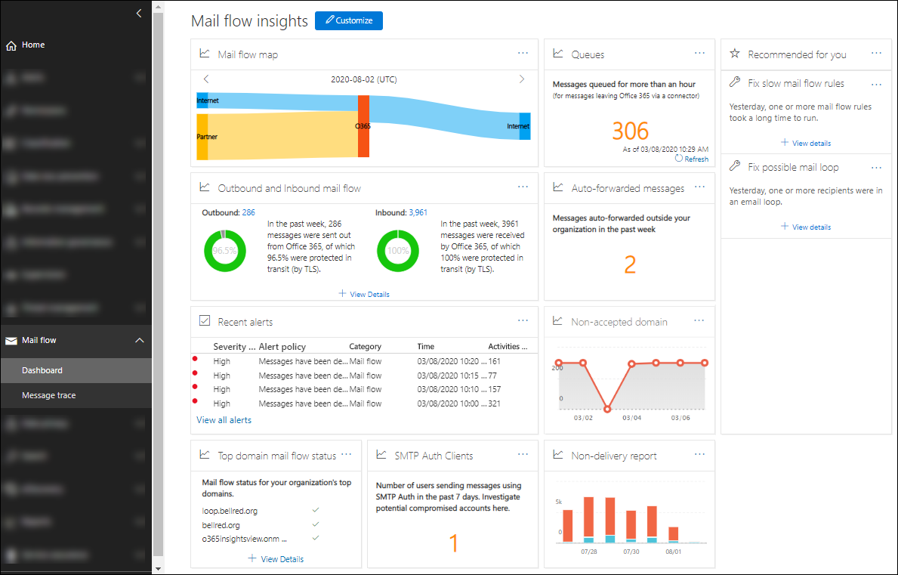

# 安全性與合規性中心內的郵件流程深入解析

系統管理員可以使用安全性 & 合規性中心內的郵件流程儀表板來探索趨勢、深入資訊，並採取行動來修正組織中與郵件流程相關的問題。

可用的真知灼見包括：

- [自動轉寄的郵件洞察力](mfi-auto-forwarded-messages-report.md)

- [修正可能的郵件迴圈真知灼見](mfi-mail-loop-insight.md)1

- [修正郵件流程規則真知灼見](mfi-slow-mail-flow-rules-insight.md)1的速度

- [郵件流程地圖](mfi-mail-flow-map-report.md)

- [轉寄的新網域電子郵件洞察力](mfi-new-domains-being-forwarded-email.md)2

- [新使用者轉寄電子郵件真知灼見](mfi-new-users-forwarding-email.md)2

- [非公認的網域報告](mfi-non-accepted-domain-report.md)

- [未傳遞回報](mfi-non-delivery-report.md)

- [輸出和輸入郵件流程洞察力](mfi-outbound-and-inbound-mail-flow.md)

- [佇列洞察力](mfi-queue-alerts-and-queues.md)

- [SMTP 驗證用戶端的洞察力和報告](mfi-smtp-auth-clients-report.md)

- [上層網域郵件流程狀態深入解析](mfi-domain-mail-flow-status-insight.md)

1當偵測到問題之後，就會在 [郵件流程] 儀表板的 [**建議**] 區域中顯示此真知灼見。 否則，您將看不到它。

2郵件流程儀表板上不會顯示這種觀點，但在偵測到問題之後，會在 [轉寄[報告](view-mail-flow-reports.md#forwarding-report)] 頁面上顯示。 否則，您將看不到它。

## 查看郵件流程儀表板所需的許可權

郵件流程儀表板可用於下列路由群組的成員：

- 安全性 & 規範中心內的**組織管理** (全域管理員) 。

- Azure AD 中的**[Exchange 系統管理員](https://docs.microsoft.com/azure/active-directory/users-groups-roles/directory-assign-admin-roles#exchange-administrator)**。

- 郵件流程 Security & 合規性中心內的**系統管理員**：如果此角色群組的成員不是全域系統管理員或 Exchange 系統管理員角色群組的成員，請注意下列問題和需求：

  - 使用者必須直接登入安全性 & 合規性中心 <https://protection.office.com> 。
  - 使用者只具有郵件流程儀表板的唯讀許可權。
  - 使用者將無法存取 Microsoft 365 系統管理中心。

如需安全性 & 規範中心中許可權的詳細資訊，請參閱[安全性 & 規範中心中的許可權](permissions-in-the-security-and-compliance-center.md)，並[授與使用者對安全性 & 規範中心的存取權](grant-access-to-the-security-and-compliance-center.md)。

## 哪裡可以找到郵件流程儀表板

開啟安全性 & 合規性中心 <https://protection.office.com> ，展開 [**郵件流程**]，然後選取 [**儀表板**]。

若要直接移至 [郵件流程] 儀表板，請開啟] <https://protection.office.com/mailflow/dashboard> 。
