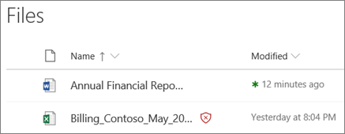

# 適用於 SharePoint、OneDrive 和 Microsoft Teams 的安全附件Safe Attachments for SharePoint, OneDrive, and Microsoft Teams

[!INCLUDE [Microsoft 365 Defender rebranding](../includes/microsoft-defender-for-office.md)]

**適用於****Applies to**
- [適用於 Office 365 的 Microsoft Defender 方案 1 和方案 2Microsoft Defender for Office 365 plan 1 and plan 2](defender-for-office-365.md)
- [Microsoft 365 DefenderMicrosoft 365 Defender](../defender/microsoft-365-defender.md)

在[Microsoft Defender for Office 365](whats-new-in-defender-for-office-365.md)中 SharePoint、OneDrive 和 Microsoft Teams 的安全附件，針對[在 Microsoft 365 中常見的病毒偵測引擎](virus-detection-in-spo.md)，在上載時已掃描的檔案，提供其他層級的保護。Safe Attachments for SharePoint, OneDrive, and Microsoft Teams in [Microsoft Defender for Office 365](whats-new-in-defender-for-office-365.md) provides an additional layer of protection for files that have already been scanned at upload time by the [common virus detection engine in Microsoft 365](virus-detection-in-spo.md). SharePoint、OneDrive 及 Microsoft Teams 的安全附件，可協助偵測並封鎖在小組網站和文件庫中識別為惡意的現有檔案。Safe Attachments for SharePoint, OneDrive, and Microsoft Teams helps detect and block existing files that are identified as malicious in team sites and document libraries.

預設不會啟用 SharePoint、OneDrive 及 Microsoft Teams 的安全附件。Safe Attachments for SharePoint, OneDrive, and Microsoft Teams is not enabled by default. 若要將其開啟，請參閱[開啟安全附件以取得 SharePoint、OneDrive 及 Microsoft Teams](turn-on-mdo-for-spo-odb-and-teams.md)。To turn it on, see [Turn on Safe Attachments for SharePoint, OneDrive, and Microsoft Teams](turn-on-mdo-for-spo-odb-and-teams.md).

## SharePoint、OneDrive 及 Microsoft Teams 的安全附件的運作方式How Safe Attachments for SharePoint, OneDrive, and Microsoft Teams works

啟用 SharePoint、OneDrive 和 Microsoft Teams 的安全附件，並將檔案識別為惡意時，會使用與檔案存放區的直接整合，鎖定檔案。When Safe Attachments for SharePoint, OneDrive, and Microsoft Teams is enabled and identifies a file as malicious, the file is locked using direct integration with the file stores. 下列影像顯示文件庫中偵測到的惡意檔案範例。The following image shows an example of a malicious file detected in a library.

雖然封鎖的檔案仍然會列在文件庫和 web、行動裝置或桌面應用程式中，但無法開啟、複製、移動或共用檔案。Although the blocked file is still listed in the document library and in web, mobile, or desktop applications, people can't open, copy, move, or share the file. 但可刪除封鎖的檔案。But they can delete the blocked file.

以下是在行動裝置上封鎖的檔案外觀的範例：Here's an example of what a blocked file looks like on a mobile device:

根據預設，使用者可以下載封鎖的檔案。By default, people can download a blocked file. 以下是在行動裝置上下載封鎖的檔案的外觀：Here's what downloading a blocked file looks like on a mobile device:

SharePoint線上系統管理員可以防止使用者下載惡意檔案。SharePoint Online admins can prevent people from downloading malicious files. 如需相關指示，請參閱[使用 SharePoint 線上 PowerShell 以避免使用者下載惡意](turn-on-mdo-for-spo-odb-and-teams.md#step-2-recommended-use-sharepoint-online-powershell-to-prevent-users-from-downloading-malicious-files)檔案。For instructions, see [Use SharePoint Online PowerShell to prevent users from downloading malicious files](turn-on-mdo-for-spo-odb-and-teams.md#step-2-recommended-use-sharepoint-online-powershell-to-prevent-users-from-downloading-malicious-files).

若要深入了解當檔案被偵測為惡意檔案時的使用者體驗，請參閱[在 SharePoint Online、OneDrive 或 Microsoft Teams 中找到惡意檔案時該怎麼做](https://support.microsoft.com/office/01e902ad-a903-4e0f-b093-1e1ac0c37ad2)。To learn more about the user experience when a file has been detected as malicious, see [What to do when a malicious file is found in SharePoint Online, OneDrive, or Microsoft Teams](https://support.microsoft.com/office/01e902ad-a903-4e0f-b093-1e1ac0c37ad2).

## 查看 SharePoint、OneDrive 及 Microsoft Teams 的安全附件所偵測到之惡意檔案的相關資訊。View information about malicious files detected by Safe Attachments for SharePoint, OneDrive, and Microsoft Teams

SharePoint、OneDrive 及 Microsoft Teams 的安全附件所識別為惡意的檔案，會顯示[Microsoft Defender for Office 365](view-reports-for-mdo.md)及[Explorer (和即時偵測) ](threat-explorer.md)中的報告。Files that are identified as malicious by Safe Attachments for SharePoint, OneDrive, and Microsoft Teams will show up in [reports for Microsoft Defender for Office 365](view-reports-for-mdo.md) and in [Explorer (and real-time detections)](threat-explorer.md).

從2018年5月的 SharePoint、OneDrive 及 Microsoft Teams 的安全附件，將檔案識別為惡意檔時，也會在隔離區中使用該檔案。As of May 2018, when a file is identified as malicious by Safe Attachments for SharePoint, OneDrive, and Microsoft Teams, the file is also available in quarantine. 如需詳細資訊，請參閱[使用 Microsoft 365 defender 入口網站管理 Office 365 的 defender 中的隔離](manage-quarantined-messages-and-files.md#use-the-microsoft-365-defender-portal-to-manage-quarantined-files-in-defender-for-office-365)檔案。For more information, see [Use the Microsoft 365 Defender portal to manage quarantined files in Defender for Office 365](manage-quarantined-messages-and-files.md#use-the-microsoft-365-defender-portal-to-manage-quarantined-files-in-defender-for-office-365).

## 請記住下列重點Keep these points in mind

- Office 365 的 Defender 不會掃描 SharePoint Online、商務用 OneDrive 或 Microsoft Teams 中的每一個檔案。Defender for Office 365 will not scan every single file in SharePoint Online, OneDrive for Business, or Microsoft Teams. 這是原本設計的做法。This is by design. 檔會以非同步方式掃描。Files are scanned asynchronously. 此程式會使用共用和來賓活動事件，以及智慧試探法和威脅信號，識別惡意檔案。The process uses sharing and guest activity events along with smart heuristics and threat signals to identify malicious files.

- 請確認您的 SharePoint 網站已設定為使用[新式體驗](/sharepoint/guide-to-sharepoint-modern-experience)。Make sure your SharePoint sites are configured to use the [Modern experience](/sharepoint/guide-to-sharepoint-modern-experience). Office 365 防護的 Defender 會套用是否使用新式經驗或傳統模式;不過，只有在新式的體驗中，才可使用已封鎖檔案的視覺指示器。Defender for Office 365 protection applies whether the Modern experience or the Classic view is used; however, visual indicators that a file is blocked are available only in the Modern experience.

- SharePoint、OneDrive 和 Microsoft Teams 的安全附件是組織整體威脅防護策略的一部分，其中包括 Exchange Online Protection (EOP) 中的反垃圾郵件和反惡意程式碼保護，以及 Office 365 的 Microsoft Defender 中的安全連結和安全附件。Safe Attachments for SharePoint, OneDrive, and Microsoft Teams is part of your organization's overall threat protection strategy, which includes anti-spam and anti-malware protection in Exchange Online Protection (EOP), as well as Safe Links and Safe Attachments in Microsoft Defender for Office 365. 若要深入了解，請參閱[防範 Office 365 中的威脅](protect-against-threats.md)。To learn more, see [Protect against threats in Office 365](protect-against-threats.md).
