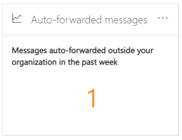

# 在安全性 & 規範中心內，自動轉寄的郵件會深入瞭解

在 Security & 合規性中心的[郵件流程儀表板](mail-flow-insights-v2.md)中，可洞察的**自動轉寄郵件**會顯示自動從您的組織轉送到外部網域中收件者之郵件的相關資訊。

## 自動轉寄的郵件詳細資料

當您按一下小工具中的郵件數目時，會出現一個彈出窗格，顯示自動轉寄郵件的詳細資訊：

- 透過**轉送方法自動轉寄的郵件**：

  - **依郵件流程規則**
  - **依收件匣規則**
  - **透過 SMTP 轉送**
  - 有關詳細資訊，請查看 [轉接報告](view-mail-flow-reports.md#forwarding-report) 的連結。

- **依網域和使用者自動轉寄郵件**：

  - **前5個網域會轉寄至**
  - **新的網域 (上周) **
  - **前5個轉接使用者**
  - **新使用者 (上周) **
  - 有關詳細資訊，請查看「轉寄 [修改」報告](mfi-new-users-forwarding-email.md#forwarding-modifications-report) 的連結。

## 深入資訊

這兩種洞察力是根據報表資料產生的：

- [新增使用者轉送電子郵件](mfi-new-users-forwarding-email.md)
- [轉寄電子郵件的新網域](mfi-new-domains-being-forwarded-email.md)

## 另請參閱

如需郵件流程儀表板中其他真知灼見的詳細資訊，請參閱 [Security & 合規性中心中的郵件流程洞察力](mail-flow-insights-v2.md)。
