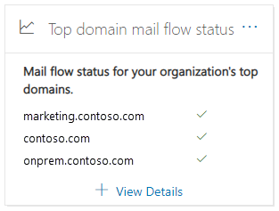

# 安全性 & 規範中心內的最上層網域郵件流程狀態洞察力Top domain mail flow status insight in the Security & Compliance Center

[!INCLUDE [Microsoft 365 Defender rebranding](../includes/microsoft-defender-for-office.md)]

**適用於****Applies to**
- [Exchange Online ProtectionExchange Online Protection](exchange-online-protection-overview.md)
- [適用於 Office 365 的 Microsoft Defender 方案 1 和方案 2Microsoft Defender for Office 365 plan 1 and plan 2](office-365-atp.md)
- [Microsoft 365 DefenderMicrosoft 365 Defender](../mtp/microsoft-threat-protection.md)

[安全性 & 合規性中心](https://protection.office.com)內的 [郵件流程儀表板](mail-flow-insights-v2.md)中的 **最上層網域郵件流程狀態**，可讓您在組織中取得目前的郵件流程狀態。The **Top domain mail flow status** insight in the [Mail flow dashboard](mail-flow-insights-v2.md) in the [Security & Compliance Center](https://protection.office.com) gives you the current mail flow status for your organization.

這種洞察力可協助您識別及疑難排解出現 ***郵件流程*** 問題的網域。This insight helps you identify and troubleshoot domains that are experiencing ***mail flow*** issues. 例如，網域無法接收外部電子郵件，因為網域已到期或網域的 MX 記錄不正確。For example, the domain is unable to receive external email because the domain has expired or the domain has an incorrect MX record.

當您按一下小工具中的 [ **查看詳細資料** ] 時，會出現一個 **網域狀態** 快顯視窗，顯示每個網域狀態的詳細資訊：When you click **View details** in the widget, a **Domain status** flyout appears that shows you more details for the status of each domain:

- **網域****Domain**
- **先前的 MX 記錄****Previous MX record**
- **目前的 MX 記錄****Current MX record**
- **電子郵件接收狀態****Email receiving status**
- **網域狀態**：綠色核取記號表示在您按下該小工具時 (的目前 MX 記錄，) 符合我們記錄的值，而且該網域已于過去的兩個小時內收到電子郵件。**Domain status**: A green check mark indicates the current MX record (at the time you clicked on the widget) matches the value we have on record, and the domain has received email during the past two hours.

  紅色 X 表示 MX 記錄已變更，而且在過去6個小時內，該網域未收到任何電子郵件。A red X indicates the MX record has been changed, and the domain has received no email during the past 6 hours. 這可能表示您的網域已到期，或 MX 記錄的更新錯誤。This likely indicates that your domain has expired, or that the MX record has been incorrectly updated. 請洽詢網域註冊機構或 DNS 主機服務，以查看網域是否已過期，或網域的 MX 記錄是否不正確。Check with your domain registrar or DNS hosting service to see if the domain has expired, or if the domain's MX record is incorrect.

您可以按一下 [ **View more** ]，以查看更多網域的相同資訊。You can click **View more** to see the same information for more domains.

## 請參閱See also

如需郵件流程儀表板中其他真知灼見的詳細資訊，請參閱 [Security & 合規性中心中的郵件流程洞察力](mail-flow-insights-v2.md)。For information about other insights in the Mail flow dashboard, see [Mail flow insights in the Security & Compliance Center](mail-flow-insights-v2.md).
