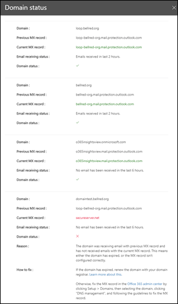

# 上層網域郵件流程狀態深入解析

**最上層的網域郵件流程狀態**真知灼見可讓您在郵件流程方面，為您組織的網域提供目前的狀態。 這種洞察力可協助您識別及疑難排解發生***郵件流程影響***問題的網域（例如，無法接收外部電子郵件），尤其是網域到期或具有不正確 MX 記錄的網域。

當您按一下真知灼見中的 [**查看詳細資料**] 時，會出現一個快顯視窗，顯示每個網域狀態的詳細資訊。

網域的綠色核取記號表示目前的 MX 記錄（當您流覽至 [郵件流程深入儀表板]）與我們記錄的值相符，而且該網域已于過去兩小時內收到電子郵件。

網域的紅色 x 表示 MX 記錄已變更，而且在過去6小時內，該網域未收到任何電子郵件。 這可能表示您的網域已到期，或 MX 記錄的更新錯誤。 請洽詢網域註冊機構或 DNS 主機服務，以查看網域是否已過期，或網域的 MX 記錄是否不正確。

## 相關主題

如需郵件流量儀表板中其他郵件流程深入解析之詳細資訊，請參閱[安全性與合規性中心中郵件流程深入解析](mail-flow-insights-v2.md)。
