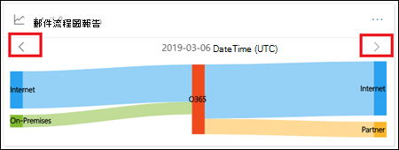

# 郵件流程圖報告Mail flow map report

這份報告提供郵件流程如何透過您的組織的洞察力。This report gives insights as to how mail flows through your organization. 您可以使用此資訊來瞭解模式、識別異常，並在發生問題時修正問題。You can use this information to learn patterns, identify anomalies, and fix issues as they arise.

## 郵件流程地圖小工具Mail flow map widget

根據預設，郵件流程地圖會顯示前一天的高層郵件流程模式。By default, the mail flow map shows the high level mail flow pattern from the previous day. 您可以在不同的天使用左和右箭號。You can use the left and right arrows for different days. 在報告中的每個區域上放入滑鼠游標，就會顯示您的組織的郵件數量，如下圖所示：Hovering your mouse cursor over each area in the report will show the volume of mail to and from your organization as shown in the following diagram:

## 概觀Overview

按一下 [**郵件流程地圖**] 小工具，將會帶您前往**郵件流程地圖**報告。Clicking on the **Mail flow map** widget will take you to the **Mail flow map** report. 您可以在這裡看到更細微的報表層級，您可以按一下 [查看詳細資料] 表格以查看詳細資料。Here you can see more granular level of report, you can click View details table to see detailed data. 您也可以按一下 [要求報告]，下載詳細報告。You can also download the detailed report by clicking Request report.

## 詳細資料Details

預設會將 [**顯示資料**] 設定為「價值**一覽**」。By default, **Show data for** is set to the value **Overview**. 當您按一下下拉式清單並選取 [**詳細資料**] 時，view 會切換至網域層級詳細資料。When you click on the drop down and select **Detail**, the view switches to the domain level detail.

![選取 [在郵件流程地圖報告中顯示一覽視圖中的資料] 的 [詳細資料]](../../media/mail-flow-map-select-detail.png)

隨即會列出頁首寄件者和收件者網域，其餘部分將會放入**其他**人，如下圖所示：The top sender and recipient domains are listed, and the rest will be put in **Others** as shown in the following diagrams:

## 相關的洞察力Related insights

相關的洞察力會顯示在郵件流程地圖底下（例如，寄件者網域真知灼見或郵件迴圈真知灼見）。Related insights are shown beneath the Mail flow map if they're available (for example, the Sender domain insight or the Mail loop insight).

## 另請參閱See also

如需郵件流量儀表板中其他郵件流程深入解析之詳細資訊，請參閱[安全性與合規性中心中郵件流程深入解析](mail-flow-insights-v2.md)。For more information about other mail flow insights in the mail flow dashboard, see [Mail flow insights in the Security & Compliance Center](mail-flow-insights-v2.md).
