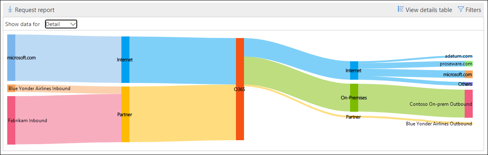
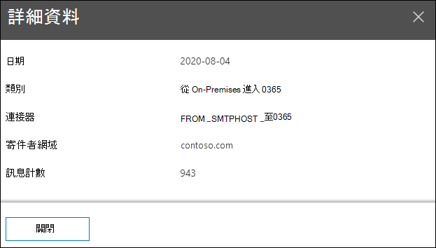

# 安全性 & 規範中心內的郵件流程地圖Mail flow map in the Security & Compliance Center

安全性 & 合規性中心的[郵件流程儀表板](mail-flow-insights-v2.md)中的**郵件流程地圖**，可提供郵件透過您的組織流動的洞察力。The **Mail flow map** in the [Mail flow dashboard](mail-flow-insights-v2.md) in the Security & Compliance Center gives insight as to how mail flows through your organization. 您可以使用此資訊來瞭解模式、識別異常，並在發生問題時修正問題。You can use this information to learn patterns, identify anomalies, and fix issues as they occur.

根據預設，構件會顯示上一天的郵件流程模式，稱為「 *Sankey*圖表」圖表。By default, the widget shows the mail flow pattern from the previous day in a chart known as a *Sankey* diagram. 您可以使用向左箭號及向右箭號向右箭號   來顯示不同天的資訊。You can use the left arrow  and right arrow  to show information from different days. 每個不同的色彩都代表不同輸入或輸出連接器上的郵件流程 (或不使用連接器) 。Each different color represents mail flow over a different inbound or outbound connector (or without using connectors). 如果您將游標懸停在特定色彩上，就會針對該類型的連接器顯示郵件數目。If you hover over a specific color, the number of messages is displayed for that type of connector.

## 郵件流程地圖的報表檢視Report view for the Mail flow map

按一下 [**郵件流程地圖**] 小工具，將會帶您前往**郵件流程地圖**報告。Clicking on the **Mail flow map** widget will take you to the **Mail flow map** report.

報表檢視提供下列圖表：The following charts are available in the report view:

- **顯示資料：概述**：這基本上是更大的小工具視圖。**Show data for: Overview**: This is basically a larger view of the widget. 如果您將游標懸停在特定色彩上，就會針對該類型的連接器顯示郵件數目。If you hover over a specific color, the number of messages is displayed for that type of connector.

  

- **顯示資料：詳細資料**：此視圖顯示連接器和目的地網域的詳細資料。**Show data for: Detail**: This view shows details about the connectors and destination domains. 會列出上方寄件者和收件者網域，其餘部分則放入**其他**人。The top sender and recipient domains are listed, and the rest are put in **Others**. 如果您將游標懸停在特定的色彩及區段上，就會顯示訊息的數目。If you hover over a specific color and section, the number of messages is displayed.

  

如果您按一下報表檢視中的 [**篩選器**]，您可以指定具有**開始日期**和**結束日期**的日期範圍。If you click **Filters** in a report view, you can specify a date range with **Start date** and **End date**.

若要將特定日期範圍的報告傳送至一或多個收件者，請按一下 [**要求下載**]。To email the report for a specific date range to one or more recipients, click **Request download**.

相關的洞察力會顯示在郵件流程地圖底下（如果有的話） (例如，[修正可能的郵件迴圈洞察力](mfi-mail-loop-insight.md)) 。Related insights are shown beneath the Mail flow map if they're available (for example, the [Fix possible mail loop insight](mfi-mail-loop-insight.md)).

## 郵件流程地圖的詳細資料表格視圖Details table view for the Mail flow map

如果您按一下報表檢視中的 [**查看詳細資料] 表格**，會顯示下列資訊：If you click **View details table** in a report view, the following information is shown:

- **Date****Date**
- **類別****Category**
- **連接器/協力廠商服務提供者****Connector / Third-party service provider**
- **寄件者/收件者網域****Sender/Recipient domain**
- **訊息計數****Message count**

如果您按一下 [詳細資料] 表格視圖中的 [**篩選**]，您可以指定具有**開始日期**和**結束日期**的日期範圍。If you click **Filters** in a details table view, you can specify a date range with **Start date** and **End date**.

如果您選取某列，則會在浮出控制項中顯示類似的詳細資料：If you select a row, similar details are shown in a flyout:

若要將特定日期範圍的報告傳送至一或多個收件者，請按一下 [**要求下載**]。To email the report for a specific date range to one or more recipients, click **Request download**.

若要回到 [報告] 視圖，請按一下 [**查看報告**]。To go back to the reports view, click **View report**.

## 請參閱See also

如需郵件流程儀表板中其他真知灼見的詳細資訊，請參閱[Security & 合規性中心中的郵件流程洞察力](mail-flow-insights-v2.md)。For information about other insights in the Mail flow dashboard, see [Mail flow insights in the Security & Compliance Center](mail-flow-insights-v2.md).
