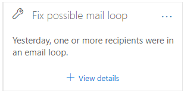

# 修正安全性 & 規範中心內可能的郵件迴圈洞察力Fix possible mail loop insight in the Security & Compliance Center

[!INCLUDE [Microsoft 365 Defender rebranding](../includes/microsoft-defender-for-office.md)]

郵件迴圈不正確，原因如下：Mail loops are bad because:

- 它們會浪費系統資源。They waste system resources.
- 它們會消耗您組織的郵件磁片區配額。They consume your organization's mail volume quota.
- 它們會傳送令人困惑的未傳遞回報 (也稱為 NDRs 或退回郵件) 給原始郵件寄件者。They send confusing non-delivery reports (also known as NDRs or bounce messages) to the original message senders.

在您的組織中偵測到郵件迴圈時，在 [安全性 & 合規性中心](https://protection.office.com)的 [[郵件流程儀表板](mail-flow-insights-v2.md)] 中，**建議** 的郵件流程儀表板區域會通知您，以 **修正可能的郵件迴圈**。The **Fix possible mail loop** insight in the **Recommended for you** area of the [Mail flow dashboard](mail-flow-insights-v2.md) in the [Security & Compliance Center](https://protection.office.com) notifies you when a mail loop is detected in your organization.

這種洞察力只會在偵測到條件之後才會出現 (如果您沒有任何郵件迴圈，您就不會看到) 的洞察力。This insight appears only after the condition is detected (if you don't have any mail loops, you won't see the insight).

當您按一下小工具上的 [ **查看詳細資料** ] 時，會出現一個快顯視窗，包含詳細資訊：When you click **View details** on the widget, a flyout appears with more information:

- **網域****Domain**
- **郵件數目**：您可以按一下 [ **View sample messages** ]，以查看受環路影響之郵件範例的 [郵件追蹤](message-trace-scc.md) 結果。**Number of messages**: You can click **View sample messages** to see the [message trace](message-trace-scc.md) results for a sample of the messages that were affected by the loop.
- **網欄位型別**"，例如「授權」或「非授權」。**Domain type**" For example, Authoritative or Non-authoritative.
- **MX 記錄**：主機 (的 **郵件伺服器**) 和網域的 MX 記錄 **優先順序** 值。**MX record**: The host (**Mail server**) and **Priority** values of the MX record for the domain.
- **迴圈原因** 和 **解決方法**：我們會找出最常見的郵件迴圈案例，並提供建議的動作來修正此迴圈。**Loop reason** and **How to fix**: We'll identify the most common mail loop scenarios and provide recommended actions to fix the loop.

![在 [修正可能的郵件迴圈真知灼見] 上按一下 [查看詳細資料] 後出現的詳細資料浮出](../../media/mfi-fix-possible-mail-loop-details.png)

## 請參閱See also

如需郵件流程儀表板中其他真知灼見的詳細資訊，請參閱 [Security & 合規性中心中的郵件流程洞察力](mail-flow-insights-v2.md)。For information about other insights in the Mail flow dashboard, see [Mail flow insights in the Security & Compliance Center](mail-flow-insights-v2.md).
