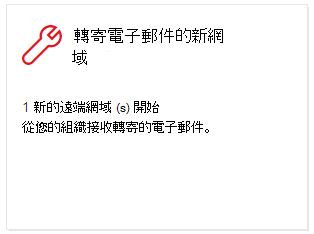

# 在安全性 & 規範中心轉寄電子郵件的新網域New domains being forwarded email insight in the Security & Compliance Center

[!INCLUDE [Microsoft 365 Defender rebranding](../includes/microsoft-defender-for-office.md)]

**適用於****Applies to**
- [Exchange Online ProtectionExchange Online Protection](exchange-online-protection-overview.md)
- [適用於 Office 365 的 Microsoft Defender 方案 1 和方案 2Microsoft Defender for Office 365 plan 1 and plan 2](defender-for-office-365.md)
- [Microsoft 365 DefenderMicrosoft 365 Defender](../defender/microsoft-365-defender.md)

將電子郵件轉寄給特定網域中的外部收件者，有一些有效的商業原因。There are valid business reasons to forward email messages to external recipients in specific domains. 不過，當組織中的使用者突然開始將郵件轉送至一個網域，而您的組織中沒有任何人曾經轉送郵件給 (新網域) 時，這是可疑的。However, it's suspicious when users in your organization suddenly start forwarding messages to a domain where no one in your organization has ever forwarded messages to (a new domain).

這種情況可能表示使用者帳戶遭到破壞。This condition might indicate that the user accounts are compromised. 如果您懷疑帳戶已遭破壞，請參閱 [回應遭到破壞的電子郵件帳戶](responding-to-a-compromised-email-account.md)。If you suspect the accounts have been compromised, see [Responding to a compromised email account](responding-to-a-compromised-email-account.md).

當您組織中的使用者將郵件轉寄給新網域時，在 [安全性 & 合規性中心](https://protection.office.com)**轉寄的新網域** 會通知您。The **New domains being forwarded email** insight in the [Security & Compliance Center](https://protection.office.com) notifies you when users in your organization are forwarding messages to new domains.

這種洞察力只會在偵測到問題時出現，而且會出現在 [ [轉接回報報告](view-mail-flow-reports.md#forwarding-report) ] 頁面上。This insight appears only when the issue is detected, and it appears on the [Forwarding report](view-mail-flow-reports.md#forwarding-report) page.

當您按一下該小工具時，會出現一個快顯視窗，您可以在其中找到有關轉寄郵件的詳細資訊，包括回 [轉送報告](view-mail-flow-reports.md#forwarding-report)的連結。When you click on the widget, a flyout appears where you can find more details about the forwarded messages, including a link back to the [Forwarding report](view-mail-flow-reports.md#forwarding-report).

您也可以在 [ (**報表** 儀表板] 或 [) ] 的 [**熱門洞察力 & 建議**] 區域中按一下 [**全部查看**] 之後，取得此詳細資料頁面 \>  <https://protection.office.com/insightdashboard> 。You can also get to this details page when you select the insight after you click **View all** in the **Top insights & recommendations** area on (**Reports** \> **Dashboard** or <https://protection.office.com/insightdashboard>).

若要防止自動將郵件轉送到外部網域，請設定部分或所有外部網域的遠端網域。To prevent automatic message forwarding to external domains, configure a remote domain for some or all external domains. 如需詳細資訊，請參閱[管理 Exchange Online 中的遠端網域](/Exchange/mail-flow-best-practices/remote-domains/manage-remote-domains)。For more information, see [Manage remote domains in Exchange Online](/Exchange/mail-flow-best-practices/remote-domains/manage-remote-domains).

## 相關主題Related topics

如需郵件流程儀表板中其他真知灼見的詳細資訊，請參閱 [Security & 合規性中心中的郵件流程洞察力](mail-flow-insights-v2.md)。For information about other insights in the Mail flow dashboard, see [Mail flow insights in the Security & Compliance Center](mail-flow-insights-v2.md).