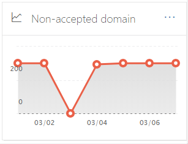

# 安全性 & 規範中心內的非公認網域報告

[!INCLUDE [Microsoft 365 Defender rebranding](../includes/microsoft-defender-for-office.md)]

**適用於**
- [Exchange Online Protection](exchange-online-protection-overview.md)
- [適用於 Office 365 的 Microsoft Defender 方案 1 和方案 2](defender-for-office-365.md)
- [Microsoft 365 Defender](../defender/microsoft-365-defender.md)

在 [Security & 合規性中心](https://protection.office.com)的 [郵件流程儀表板](mail-flow-insights-v2.md)中，**未接受的網域** 報告會顯示來自內部部署電子郵件組織之郵件的相關資訊，而寄件者的網域並未設定為您 Microsoft 365 組織中的公認網域。

如果我們有資料證明這些郵件的目的是惡意的，Microsoft 365 可能會調解這些郵件。 因此，請務必瞭解所發生的情況，並修正問題。

## 不接受之網域報告的報表檢視

按一下 [ **非公認的網域** ] 小工具上的圖表，將會帶您前往 **非公認的網域** 報告。

依預設，會顯示所有受影響連接器的活動。 如果您按一下 [ **顯示資料**]，您可以從下拉式清單中選取特定的連接器。

如果您將滑鼠停留在圖表中的資料點 (day) 上，您會看到連接器的郵件總數。

## 非公認網域報告的詳細資料表格視圖

如果您按一下報表檢視中的 [ **查看詳細資料] 表格** ，會顯示下列資訊：

- **Date**
- **輸入連接器名稱**
- **寄件者網域**
- **訊息計數**
- **範例郵件**：郵件 IDs 受影響郵件的範例。

如果您按一下 [詳細資料] 表格視圖中的 [ **篩選** ]，您可以指定具有 **開始日期** 和 **結束日期** 的日期範圍。

若要將特定日期範圍的報告傳送至一或多個收件者，請按一下 [ **要求下載**]。

當您選取表格中的一列時，會出現一個快顯視窗，其中包含下列資訊：

- **Date**
- **輸入連接器名稱**
- **寄件者網域**
- **訊息計數**
- **範例郵件**：您可以按一下 [ **View sample messages** ]，以查看受影響郵件之範例的 [郵件追蹤](message-trace-scc.md) 結果。

![在 [非公認的網域] 報告中，選取 [詳細資料表格] 視圖中的列之後的詳細資料彈出列表](../../media/mfi-non-accepted-domain-report-details-flyout.png)

若要回到 [報告] 視圖，請按一下 [ **查看報告**]。

## 相關主題

如需郵件流程儀表板中其他真知灼見的詳細資訊，請參閱 [Security & 合規性中心中的郵件流程洞察力](mail-flow-insights-v2.md)。
