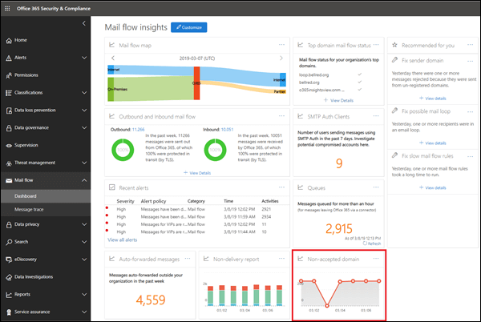

# 非公認的網域報告Non-accepted domain report

與**寄件者網域**洞察力類似的是，**不接受的網域**真知灼見會識別內部部署電子郵件組織中的郵件，但是寄件者的網域並未設定為您組織中公認的網域。Similar to the **Sender domain** insight, the **Non-accepted domain** insight identifies messages from your on-premises email organization, but the sender's domain isn't configured as an accepted domain in your organization.

如果我們有資料證明這些郵件的目的是惡意的，Microsoft 365 可能會節流這些郵件。Microsoft 365 might throttle these messages if we have data to prove that the intent of these messages is malicious. 因此，請務必瞭解所發生的情況，並修正問題。Therefore, it's important for you to understand what's happening and to fix the issue.

當您按一下小工具時，您會看到完整的報告。When you click on the widget, you're taken to the full report. 在完整報告中，您可以按一下 [**查看詳細資料**] 以查看表格中的資訊，如下圖所示：In the full report, where you can click **View details** to view the information in a table as shown in the following diagram:

當您選取表格中的一列時，會顯示一個快顯視窗的詳細資料。When you select a row in the table, a flyout will show you more details. 您可以按一下 [ **view sample messages** ] 以查看部分識別的郵件。You can click **view sample messages** to see some of the identified messages.

![在 [不接受的網域報告] 的 [詳細資料] 表格中選取一列](../../media/non-accepted-domain-report-select-row-in-table.png)

## 另請參閱See also

如需郵件流量儀表板中其他郵件流程深入解析之詳細資訊，請參閱[安全性與合規性中心中郵件流程深入解析](mail-flow-insights-v2.md)。For more information about other mail flow insights in the mail flow dashboard, see [Mail flow insights in the Security & Compliance Center](mail-flow-insights-v2.md).
