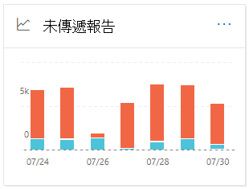

# 安全性 & 規範中心內的未傳遞回報Non-delivery report in the Security & Compliance Center

[!INCLUDE [Microsoft 365 Defender rebranding](../includes/microsoft-defender-for-office.md)]

**適用對象****Applies to**
- [Exchange Online ProtectionExchange Online Protection](https://go.microsoft.com/fwlink/?linkid=2148611)
- [Microsoft Defender for Office 365 方案1和方案2Microsoft Defender for Office 365 plan 1 and plan 2](https://go.microsoft.com/fwlink/?linkid=2148715)
- [Microsoft 365 DefenderMicrosoft 365 Defender](https://go.microsoft.com/fwlink/?linkid=2118804)

在 [Security & 合規性中心](https://protection.office.com)的 [郵件流程儀表板](mail-flow-insights-v2.md)中，**未傳遞** 回報會顯示未傳遞回報中最常遇到的錯誤碼 (也稱為 NDRs 或退回的郵件) 針對您組織中的使用者。The **Non-delivery report** in the [Mail flow dashboard](mail-flow-insights-v2.md) in the [Security & Compliance Center](https://protection.office.com) shows the most-encountered error codes in non-delivery reports (also known as NDRs or bounce messages) for users in your organization. 此報告顯示 NDRs 的詳細資料，以便您能夠疑難排解電子郵件傳遞問題。This report shows the details of NDRs so you can troubleshoot email delivery problems.

## 未傳遞回報的報表檢視Report view for the Non-delivery report

按一下 [ **未傳遞** 回報] 小工具時，將會帶您前往 **未傳遞** 回報的報告。Clicking on the **Non-delivery report** widget will take you to the **Non-delivery report**.

依預設，會顯示所有錯誤碼的活動。By default, the activity for all error codes is shown. 如果您按一下 [ **顯示資料**]，您可以從下拉式清單中選取特定的錯誤碼。If you click **Show data for**, you can select a specific error code from the dropdown.

如果您將滑鼠停留在特定色彩上 (錯誤碼) 在圖表中的某一天，您就會看到錯誤的郵件總數。If you hover over a specific color (error code) on a specific day in the chart, you'll see the total number of messages for the error.

## 未傳遞回報的詳細資料表格視圖Details table view for the Non-delivery report

如果您按一下報表檢視中的 [ **查看詳細資料] 表格** ，會顯示下列資訊：If you click **View details table** in a report view, the following information is shown:

- **Date****Date**
- **未傳遞回報碼****Non-delivery report code**
- **Count****Count**
- **範例郵件**：郵件 IDs 受影響郵件的範例。**Sample messages**: The message IDs of a sample of affected messages.

如果您按一下 [詳細資料] 表格視圖中的 [ **篩選** ]，您可以指定具有 **開始日期** 和 **結束日期** 的日期範圍。If you click **Filters** in a details table view, you can specify a date range with **Start date** and **End date**.

若要將特定日期範圍的報告傳送至一或多個收件者，請按一下 [ **要求下載**]。To email the report for a specific date range to one or more recipients, click **Request download**.

當您選取表格中的一列時，會出現一個快顯視窗，其中包含下列資訊：When you select a row in the table, a flyout appears with the following information:

- **Date****Date**
- **未傳遞回報碼**：您可以按一下連結，以尋找特定錯誤碼的原因和解決方案的詳細資訊。**Non-delivery report code**: You can click on the link to find for more information about the causes and solutions for the specific error code.
- **Count****Count**
- **範例郵件**：您可以按一下 [ **View sample messages** ]，以查看受影響郵件之範例的 [郵件追蹤](message-trace-scc.md) 結果。**Sample messages**: You can click **View sample messages** to see the [message trace](message-trace-scc.md) results for a sample of the affected messages.

![在未傳遞回報中，選取 [詳細資料表格] 視圖中的列之後的詳細資料浮出控制項](../../media/mfi-non-delivery-report-details-flyout.png)

## 相關主題Related topics

如需郵件流程儀表板中其他真知灼見的詳細資訊，請參閱 [Security & 合規性中心中的郵件流程洞察力](mail-flow-insights-v2.md)。For information about other insights in the Mail flow dashboard, see [Mail flow insights in the Security & Compliance Center](mail-flow-insights-v2.md).
