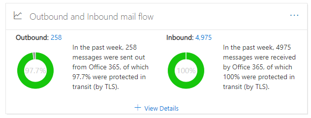

# 安全性 & 規範中心內的輸出和輸入郵件流程洞察力

[!INCLUDE [Microsoft 365 Defender rebranding](../includes/microsoft-defender-for-office.md)]

[安全性 & 合規性中心](https://protection.office.com)內的 [郵件流程儀表板](mail-flow-insights-v2.md)中的 **輸出和輸入郵件流程** 洞察力，結合了 [連接器報告](view-mail-flow-reports.md#connector-report)中的資訊和舊的 **TLS 總覽報告** 中的一個位置。

在您的組織中傳遞郵件時，構件會顯示用來進行連線的 TLS 加密。 與其他電子郵件服務建立的連線，若兩端都提供 TLS，則會由 TLS 進行加密。 小工具會提供上一週的郵件流程快照。

小工具中的資訊與 Microsoft 365 中的連接器和 TLS 郵件保護有關。 如需相關資訊，請參閱這些主題：

- [使用連接器設定郵件流程](https://docs.microsoft.com/exchange/mail-flow-best-practices/use-connectors-to-configure-mail-flow/use-connectors-to-configure-mail-flow)
- [Exchange Online 如何使用 TLS 來保護電子郵件連線](https://docs.microsoft.com/microsoft-365/compliance/exchange-online-uses-tls-to-secure-email-connections)
- [Microsoft 365 中有關加密的技術參考詳細資料](https://docs.microsoft.com/microsoft-365/compliance/technical-reference-details-about-encryption)

## 傳輸中郵件保護 (使用 TLS)

當您按一下小工具上的 [ **查看詳細資料** ] 時， **在傳輸中 (TLS)** 浮出的郵件會向您顯示進入及離開組織之訊息的 TLS 保護。

![在您按一下輸出和輸入的電子郵件小工具上的 [查看詳細資料] 之後， (以 TLS) 浮出的方式保護的郵件](../../media/mfi-outbound-and-inbound-mail-flow-report-details.png)

目前，TLS 1.2 是 Microsoft 365 提供的最安全 TLS 版本。 通常，您必須知道用於合規性稽核的 TLS 加密為何。 您可能與來源和目的地電子郵件伺服器都沒有直接關係 (您沒有，Microsoft 也沒有)，因此您沒有許多選項可改善那些伺服器使用的 TLS 加密。

不過，您可以使用 [連接器](https://docs.microsoft.com/exchange/mail-flow-best-practices/use-connectors-to-configure-mail-flow/use-connectors-to-configure-mail-flow) ，以確保您的電子郵件伺服器和 Microsoft 365 之間傳送的郵件可使用的最佳 TLS 保護。 在 Microsoft 365 和您自己的電子郵件伺服器之間或屬於合作夥伴的伺服器之間的郵件流程，通常比一般郵件更為重要且敏感，所以您會想要對這些郵件套用額外的安全性和 vigilance。

您可以升級或修正您自己的電子郵件伺服器，以改善正在使用的 TLS 加密，或連絡合作夥伴來執行此相同動作。 **連接器報告** 會顯示使用 Microsoft 365 連接器之郵件的郵件流程數量和 TLS 加密。

您可以按一下 [ **連接器報告** ] 連結，以移至 [連接器報告](view-mail-flow-reports.md#connector-report)。 如果偵測到相關聯的條件， **連接器報告** 頁面上可能會提供下列深入瞭解：

- **輸入的協力廠商連接器查看大量 TLS 1.0 郵件流程**
- **輸入 OnPremises 連接器查看大量 TLS 1.0 郵件流程**

針對 TLS 1.0 連線，您實際上需要將您的電子郵件伺服器或夥伴的伺服器升級或修復，以避免 Microsoft 365 中的 TLS 1.0 支援最後已被取代的任何問題。

## 另請參閱

如需郵件流程儀表板中其他真知灼見的詳細資訊，請參閱 [Security & 合規性中心中的郵件流程洞察力](mail-flow-insights-v2.md)。
