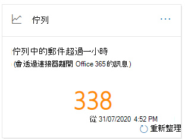

# 在安全性 & 規範中心內佇列的洞察力Queues insight in the Security & Compliance Center

當郵件無法使用連接器從您的組織傳送至您的內部部署或夥伴電子郵件伺服器時，郵件會在 Microsoft 365 中佇列。When messages can't be sent from your organization to your on-premises or partner email servers using connectors, the messages are queued in Microsoft 365. 導致此狀況的常見範例如下：Common examples that cause this condition are:

- 連接器設定不正確。The connector is incorrectly configured.
- 您的內部部署環境中已有網路或防火牆變更。There have been networking or firewall changes in your on-premises environment.

Microsoft 365 會繼續重新嘗試傳遞24小時。Microsoft 365 will continue to retry to delivery for 24 hours. 24小時後，郵件會到期，並且會傳回未傳遞回報中的寄件者 (也稱為 NDRs 或退回的郵件) 。After 24 hours, the messages will expire and will be returned to the senders in non-delivery reports (also known as a NDRs or bounce messages).

如果佇列中的電子郵件磁片區超過預先定義的臨界值 (預設值為200郵件) 中，則可在下列位置取得此資訊：If the queued email volume exceeds the pre-defined threshold (the default value is 200 messages), the information is available in the following locations:

- 在安全性 & 合規性中心的[郵件流程儀表板](mail-flow-insights-v2.md)中，**佇列**的洞察力。The **Queues** insight in the [Mail flow dashboard](mail-flow-insights-v2.md) in the Security & Compliance Center. 如需詳細資訊，請參閱本主題中的[郵件流程儀表板區段中的佇列洞察力](#queues-insight-in-the-mail-flow-dashboard)。For more information, see the [Queues insight in the Mail flow dashboard](#queues-insight-in-the-mail-flow-dashboard) section in this topic.
  
- 警示會**顯示在 [** [安全性 & 規範中心](https://protection.office.com)] 中的 [提醒] 儀表板 (**警示** \> **儀表板**] 或 [ <https://protection.office.com/alertsdashboard>) ]。An alert is displayed in **Recent alerts** the Alerts dashboard in the [Security & Compliance Center](https://protection.office.com) (**Alerts** \> **Dashboard** or <https://protection.office.com/alertsdashboard>).

  

- 系統管理員會根據名為**Messages**的預設警示原則設定，收到電子郵件通知。Admins will receive an email notification based on the configuration of the default alert policy named **Messages have been delayed**. 若要設定此警示的通知設定，請參閱下一節。To configure the notification settings for this alert, see the next section.

  如需警示原則的詳細資訊，請參閱[安全性 & 合規性中心中的警示原則](../../compliance/alert-policies.md)。For more information about alert policies, see [Alert policies in the Security & Compliance Center](../../compliance/alert-policies.md).

## 自訂佇列警示Customize queue alerts

1. 在 [[安全性 & 規範中心](https://protection.office.com)] 中，移至 [**警示** \> **警示原則**] 或 [開啟] <https://protection.office.com/alertpolicies> 。In the [Security & Compliance Center](https://protection.office.com), go to **Alerts** \> **Alert policies** or open <https://protection.office.com/alertpolicies>.

2. 在 [**警示原則**] 頁面上，尋找並選取名為 Messages 的原則已**延遲**。On the **Alert policies** page, find and select the policy named **Messages have been delayed**.

3. 在**郵件中已延遲**開啟的浮出的浮出狀態，您可以開啟或關閉提醒並設定通知設定。In the **Message have been delayed** flyout that opens, you can turn the alert on or off and configure the notification settings.

   

   - **狀態**：您可以開啟或關閉提醒。**Status**: You can toggle the alert on or off.

   - **電子郵件**收件者和**每日通知限制**：按一下 [**編輯**] 以設定下列設定：**Email recipients** and **Daily notification limit**: Click **Edit** to configure the following settings:

4. 若要設定通知設定，請按一下 [**編輯**]。To configure the notification settings, click **Edit**. 在出現的 [**編輯原則**] 飛入中，設定下列設定：In the **Edit policy** flyout that appears, configure the following settings:

   - **傳送電子郵件通知**：預設值為 on。**Send email notifications**: The default value is on.
   - **電子郵件**收件者：預設值為**TenantAdmins**。**Email recipients**: The default value is **TenantAdmins**.
   - **每日通知限制**：預設值為**無限制**。**Daily notification limit**: The default value is **No limit**.
   - **臨界**值：預設值為200。**Threshold**: The default value is 200.

   

5. 完成後，按一下 [**儲存**並**關閉**]。When you're finished, click **Save** and **Close**.

## 在郵件流程儀表板中佇列洞察力Queues insight in the Mail flow dashboard

即使已排入佇列的郵件磁片區未超出臨界值並產生警示，您仍然可以使用[郵件流程儀表板](mail-flow-insights-v2.md)中的**佇列**洞察力，以查看佇列中超過一小時的郵件，並在佇列郵件數目變得太大之前採取動作。Even if the queued message volume hasn't exceeded the threshold and generated an alert, you can still use the **Queues** insight in the [Mail flow dashboard](mail-flow-insights-v2.md) to see messages that have been queued for more than one hour, and take action before the number of queued messages becomes too large.

如果您按一下小工具上的郵件數目，則會出現佇列彈出的**郵件**，並顯示下列資訊：If you click the number of messages on the widget, a **Messages queued** flyout appears with the following information:

- **佇列中郵件的數目****Number of queued messages**
- **連接器名稱**：按一下連接器名稱可管理 Exchange 系統管理中心中的連接器 (EAC) 。**Connector name**: Click on the connector name to manage the connector in the Exchange admin center (EAC).
- **佇列開始時間****Queue started time**
- **已超過最舊的郵件****Oldest messages expired**
- **目的地伺服器****Destination server**
- **最後一個 IP 位址****Last IP address**
- **上一個錯誤****Last error**
- **如何修正**：共有問題和解決方案可供使用。**How to fix**: Common issues and solutions are available. 如果 [**立即修復它**] 連結可用，請按一下它以修正此問題。If is a **Fix it now** link is available, click it to fix the problem. 否則，請按一下任何可用的連結，以取得有關錯誤及可能解決方案的詳細資訊。Otherwise, click on any available links for more information about the error and possible solutions.

在**郵件**的詳細資料中，按一下 [**查看佇列**] 後，就會顯示相同的飛入通知。The same flyout is displayed after you click **View queue** in the details of a **Messages have been delayed** alert.

## 請參閱See also

如需郵件流程儀表板中其他真知灼見的詳細資訊，請參閱[Security & 合規性中心中的郵件流程洞察力](mail-flow-insights-v2.md)。For information about other insights in the Mail flow dashboard, see [Mail flow insights in the Security & Compliance Center](mail-flow-insights-v2.md).
