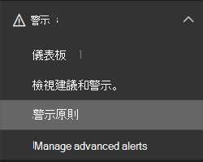
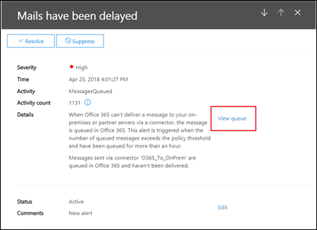

# 佇列警示和佇列

## 佇列警示

當郵件無法使用連接器從您的組織傳送至您的內部部署或夥伴電子郵件伺服器時，郵件會在 Office 365 中排入佇列。 導致此狀況的常見範例如下：

- 連接器設定不正確。

- 您的內部部署環境中已有網路或防火牆變更。

Microsoft 365 會繼續重新嘗試傳遞24小時。 24小時後，郵件會到期，並且會傳回至未傳遞回報（也稱為 NDRs 或退回的郵件）中的寄件者。

若佇列中的電子郵件磁片區超過預先定義的臨界值（預設值為2000訊息），則會在郵件流程儀表板中的**最近的提醒**中使用提醒，系統管理員會收到電子郵件通知（傳送到他們的其他電子郵件地址）。 若要設定警示閾值、每日通知限制，以及（或）警示的收件者，請參閱下方的 [**自訂佇列提醒**] 區段。

![在安全性 & 合規性中心的郵件流程儀表板的 [最近的提醒] 區域中佇列警示](../../media/5fc4a51c-6118-4270-960b-c6b176ef94ae.png)

## 自訂佇列警示

郵件流程 insights 建立名為「郵件」的警示**原則，已****延遲** **（在下列** \>範例螢幕擷取畫面中）的 [**傳送電子郵件通知**] 核取方塊。 您可以按一下原則來修改閾值和警示收件者。

您將會看到新的原則資訊 blade，現在您可以按一下 [**編輯原則**]。

資訊 blade 會變更為**編輯原則**。 您現在可以變更提醒電子郵件的收件者、每天傳送的通知數目限制，以及觸發警示的最小臨界值（200或以上）。

## 佇列警示詳細資料

當您按一下警示時，警示詳細資料會出現在飛入窗格中。

![在安全性 & 規範中心的郵件流程儀表板的 [最近的提醒] 區域中，選取佇列警示。](../../media/1f6b0e96-5b2c-41ef-9684-9d813b3fabe6.png)

您可以按一下 [警示詳細資料] 中的 [**查看佇列**]，以查看佇列詳細資料、問題，以及新飛入窗格中可用之修正程式的連結。

![在 [警示詳細資料] 中查看佇列](../../media/4eb088fe-5dd9-4bf4-b959-c1bb2545c515.png)

## 佇列

即使佇列郵件磁片區未超出臨界值，仍然可以使用郵件流程儀表板的 [**佇列**] 區域，以查看已排入佇列的郵件超過一小時。 您可以使用 [**佇列**] 區域來監視佇列中的郵件數目（值為0表示郵件流程是正常的），並在佇列郵件數目變得太大之前採取動作。

當您按一下**佇列**中已排入佇列的郵件數目時，佇列詳細資料及如何修正問題的指導將會出現在飛入窗格中（在佇列警示的詳細資料中，按一下 [**查看佇列**] 後出現的相同浮出）。

## 另請參閱

如需郵件流量儀表板中其他郵件流程深入解析之詳細資訊，請參閱[安全性與合規性中心中郵件流程深入解析](mail-flow-insights-v2.md)。
