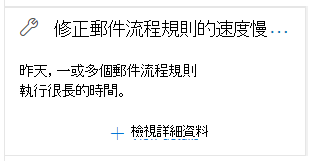

# 修正郵件流程規則安全 & 規範中心的洞察力Fix slow mail flow rules insight in the Security & Compliance Center

[!INCLUDE [Microsoft 365 Defender rebranding](../includes/microsoft-defender-for-office.md)]

**適用對象****Applies to**
- [Exchange Online ProtectionExchange Online Protection](https://go.microsoft.com/fwlink/?linkid=2148611)
- [Microsoft Defender for Office 365 方案1和方案2Microsoft Defender for Office 365 plan 1 and plan 2](https://go.microsoft.com/fwlink/?linkid=2148715)
- [Microsoft 365 DefenderMicrosoft 365 Defender](https://go.microsoft.com/fwlink/?linkid=2118804)

電子郵件流程規則（也稱為傳輸規則) ）可能會導致組織的郵件流程延期 (。Inefficient mail flow rules (also known as transport rules) can lead to mail flow delays for your organization. 這種洞察力可報告影響組織郵件流程的郵件流程規則。This insight reports mail flow rules that have an impact on your organization's mail flow. 這些規則類型的範例包括：Examples of these types of rules include:

- 使用的條件 **是** 大型群組的成員。Conditions that use **Is member of** for large groups.
- 使用複雜正則運算式 (RegEx) 模式比對的條件。Conditions that use complex regular expression (regex) pattern matching.
- 在附件中使用內容檢查的條件。Conditions that use content checking in attachments.

**修正慢速郵件流程規則** 會深入瞭解 [安全性 & 合規性中心](https://protection.office.com)的 [[郵件流程] 儀表板](mail-flow-insights-v2.md)的 [**建議**] 區域，當郵件流程規則耗時過長時通知您。The **Fix slow mail flow rules** insight in the **Recommended for you** area of the [Mail flow dashboard](mail-flow-insights-v2.md) in the [Security & Compliance Center](https://protection.office.com) notifies you when a mail flow rule is taking too long to complete.

這種洞察力只會在偵測到條件之後才會出現 (如果您沒有任何郵件迴圈，您就不會看到) 的洞察力。This insight appears only after the condition is detected (if you don't have any mail loops, you won't see the insight).

您可以使用此通知來協助您識別及微調郵件流程規則，以協助減少郵件流程延遲。You can use this notification to help you to identify and fine-tune mail flow rules to help reduce mail flow delays.

當您按一下小工具上的 [ **查看詳細資料** ] 時，會出現一個快顯視窗，包含詳細資訊：When you click **View details** on the widget, a flyout appears with more information:

- **規則**：您可以將游標置於摘要上方，以查看規則的所有條件、例外狀況及動作。**Rule**: You can hover over the summary to see all of the conditions, exceptions, and actions of the rule. 您可以按一下摘要，在 Exchange 系統管理中心 (EAC) 中編輯規則。You can click on the summary to edit the rule in the Exchange admin center (EAC).
- **評估的郵件數目**：您可以按一下 [ **View sample messages** ]，以查看受規則影響之郵件範例的 [郵件追蹤](message-trace-scc.md) 結果。**Number of messages evaluated**: You can click **View sample messages** to see the [message trace](message-trace-scc.md) results for a sample of the messages that were affected by the rule.
- **每封郵件所用的平均時間****Average time spent on each message**
- **郵件所用的中間時間**：將上半部分的時間資料與下半部的中間值分隔。**Median time spent on a message**: The middle value that separates the upper half from the lower half of time data.

![在修正慢速郵件流程規則真知灼見上，按一下 [查看詳細資料] 後出現的詳細資料浮出控制項](../../media/mfi-fix-slow-mail-flow-rules-details.png)

如需郵件流程規則中的條件和例外狀況的相關資訊，請參閱 [郵件流程規則條件和例外狀況) 在 Exchange Online 中的 (謂語](https://docs.microsoft.com/Exchange/security-and-compliance/mail-flow-rules/conditions-and-exceptions)。For more information about conditions and exceptions in mail flow rules, see [Mail flow rule conditions and exceptions (predicates) in Exchange Online](https://docs.microsoft.com/Exchange/security-and-compliance/mail-flow-rules/conditions-and-exceptions).

## 另請參閱See also

如需郵件流程儀表板中其他真知灼見的詳細資訊，請參閱 [Security & 合規性中心中的郵件流程洞察力](mail-flow-insights-v2.md)。For information about other insights in the Mail flow dashboard, see [Mail flow insights in the Security & Compliance Center](mail-flow-insights-v2.md).
