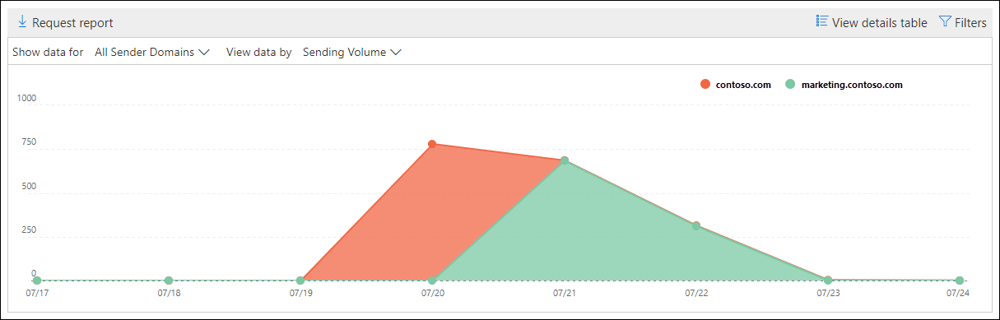
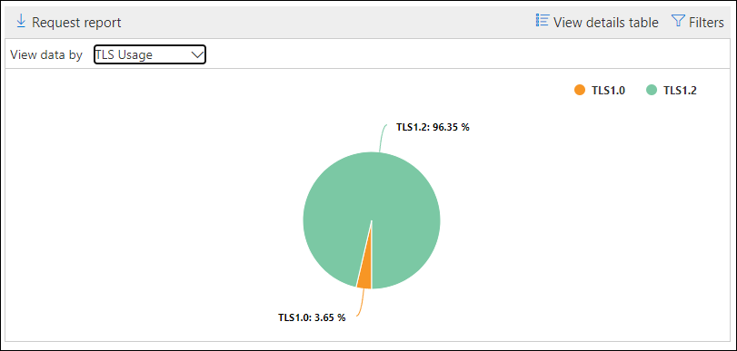

# SMTP 驗證用戶端在安全性 & 規範中心內的洞察力和報告

**Smtp 驗證用戶端**在[郵件流程儀表板](mail-flow-insights-v2.md)和關聯的[SMTP 驗證用戶端報告](#smtp-auth-clients-report)中，會顯示使用者或組織中的系統帳戶使用 SMTP 驗證用戶端提交通訊協定的方式。 這種舊版通訊協定 (會使用端點 smtp.office365.com) 僅提供基本驗證，而且很容易遭到受損帳戶使用以傳送電子郵件。 「洞察力」和「報告」可讓您檢查是否有不尋常的 SMTP 驗證電子郵件提交活動。 此外，它也會顯示使用 SMTP 驗證之用戶端或裝置的 TLS 使用狀況資料。

此小工具會指出過去7天內，已使用 SMTP 驗證通訊協定的使用者或服務帳戶數目。

如果您按一下小工具上的郵件數目，則會出現**SMTP 驗證用戶端**快顯視窗。 浮出控制項可提供過去一周之 TLS 使用狀況和磁片區的匯總視圖。

![在郵件流程儀表板中按一下 [SMTP 驗證用戶端] 小工具後的詳細資料浮出控制項](../../media/mfi-smtp-auth-clients-report-details.png)

您可以按一下 [ **Smtp 驗證用戶端] 報告**連結，以移至下一節所述的 smtp 驗證用戶端報告。

## SMTP 驗證用戶端報告

### SMTP 驗證用戶端報告的報表檢視

根據預設，報告會顯示過去7天的資料，但資料可用於過去的90天。

[一覽表] 區段包含下列圖表：

- 透過**下列方式來查看資料**：傳送磁片區：依預設，圖表會顯示從所有網域傳送來的 SMTP 驗證用戶端郵件數目 (顯示資料：預設會選取 [**所有寄件者網域**]) 。 您可以按一下 [**顯示資料**]，然後從下拉式清單中選取 [寄件者網域]，將結果篩選為特定寄件者網域。 如果您將特定資料點懸停 (day) 中，就會顯示訊息的數目。

  

- **資料查看依據： TLS 使用方式**：此圖表顯示選取時段內所有 SMTP 驗證用戶端郵件的 TLS 使用百分比。 這張圖表可讓您識別仍然使用舊版 TLS 的使用者和系統帳戶，並對其採取動作。

  

如果您按一下報表檢視中的 [**篩選器**]，您可以指定具有**開始日期**和**結束日期**的日期範圍。

按一下 [**要求報告**]，以在電子郵件訊息中接收更詳細的報表版本。 您可以指定日期範圍和接收報告的收件者。

### SMTP 驗證用戶端報告的詳細資料表格視圖

如果您按一下 [**查看詳細資料] 表格**，顯示的資訊將取決於您所查看的圖表：

- 透過**下列方式查看資料**：傳送磁片區：下列資訊會顯示在表格中：

  - **寄件者位址**
  - **訊息計數**

  如果您選取某列，則會在飛入的視窗中顯示相同的詳細資料。

- **資料查看依據： TLS 使用方式**：下列資訊會顯示在表格中：

  - **寄件者位址**
  - **TLS 1.0%**\*
  - **TLS 1.1%**\*
  - **TLS 1.2%**\*
  - **訊息計數**

  \*此欄位會顯示寄件者的百分比和郵件數目。

如果您按一下 [詳細資料] 表格視圖中的 [**篩選**]，您可以指定具有**開始日期**和**結束日期**的日期範圍。

如果您選取某列，則會在浮出控制項中顯示類似的詳細資料：

按一下 [**要求報告**]，以在電子郵件訊息中接收更詳細的報表版本。 您可以指定日期範圍和接收報告的收件者。

若要回到 [報告] 視圖，請按一下 [**查看報告**]。

## 相關主題

如需郵件流程儀表板中其他真知灼見的詳細資訊，請參閱[Security & 合規性中心中的郵件流程洞察力](mail-flow-insights-v2.md)。
