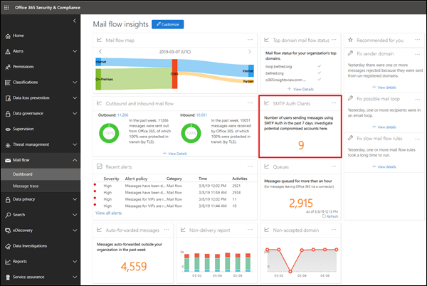
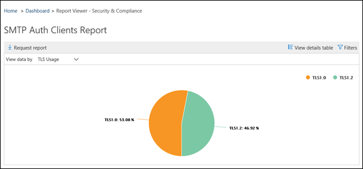

# SMTP 驗證用戶端報告SMTP Auth clients report

**Smtp 驗證用戶端**報告會強調使用者或組織中的系統帳戶如何使用 SMTP 驗證用戶端提交通訊協定。The **SMTP Auth clients** report highlights the use of the SMTP Auth client submission protocol by users or system accounts in your organization. 這種舊版通訊協定（使用端點 smtp.office365.com）只提供基本驗證，而且很容易受到受損帳戶的使用以傳送電子郵件。This legacy protocol (which uses the endpoint smtp.office365.com) only offers Basic authentication, and is susceptible to being used by compromised accounts to send email.  此報告可讓您檢查不尋常的活動。This report allows you to check for unusual activity. 此外，它也會顯示使用 SMTP 驗證之用戶端或裝置的 TLS 使用狀況資料。It also shows the TLS usage data for clients or devices using SMTP Auth.

[郵件流程] 儀表板中顯示的小工具會指出過去7天內，已使用 SMTP 驗證通訊協定的使用者或服務帳戶數目。The widget that's shown in the Mail Flow dashboard indicates the number of users or service accounts that have used the SMTP Auth protocol in the last 7 days.

按一下小工具會開啟浮出的浮出區，可提供過去一周的 TLS 使用狀況和磁片區的匯總視圖。Clicking on the widget opens a flyout that provides an aggregated view of the TLS usage and volumes for the last week.

當您按一下 [ **SMTP 驗證用戶端] 報告**連結時，您會看到兩個主要資料旋轉和兩個資料檢視。When you click on the **SMTP Auth Clients Report** link, you'll see two main data pivots and two data views. 資料轉動是傳送**量**和**TLS 使用方式**。The data pivots are the **Sending Volume** and **TLS Usage**. 資料檢視是圖表和詳細資料表格。The data views are the chart and the details table.

[傳送**大量**] 視圖會顯示在指定的時間範圍內，使用 SMTP 驗證傳送的郵件數目。The **Sending Volume** view shows the number of messages that were sent using SMTP Auth for the specified time range. 您可以按一下 [**篩選**] 來調整此範圍。You can adjust the range by clicking **Filters**. 圖表是由寄件者網域所組織。The chart is organized by sender domain. 您可以在 [**顯示資料**] 下拉式清單中選取網域，以查看每個網域的個別資料。You can see separate data for each domain by selecting the domain in the **Show data for** drop down.

您可以按一下 [ **view details table**]，以查看有關寄件者及其郵件數目的詳細資訊。You can view detailed information about the senders and their message counts by clicking **View details table**. 若要回到圖表，請按一下 [ **View report**]。To return to the chart, click **View report**.

**Tls 使用狀況**pivot 很重要，因為在 Office 365 中即將推出的 TLS 1.0 和 tls 1.1 即將過時。The **TLS Usage** pivot is important due to the upcoming deprecation of TLS1.0 and TLS1.1 in Office 365. 許多舊版裝置和應用程式只有能夠搭配使用 TLS 1.0 搭配 SMTP 驗證，否則無法傳送電子郵件。此樞紐分析表可讓您識別仍然使用舊版 TLS 的使用者和系統帳戶，並對其採取動作。Many legacy devices and applications will be unable to send email if they are only capable of using TLS1.0 with SMTP Auth. This pivot allows you to identify and take action on users and system accounts that are still using older versions of TLS.

您可以透過按一下 [**查看詳細資料] 表格**，查看寄件者的詳細資訊、這些寄件者所使用的 TLS 版本，以及其郵件數目。You can view detailed information about the senders, the versions of TLS they are using with SMTP Auth, and their message counts by clicking **View details table**. 若要回到圖表，請按一下 [ **View report**]。To return to the chart, click **View report**.

您也可以按一下 [要求報告]，下載更詳細的報表版本。You can also download a more detailed version of the report by clicking Request report.

## 相關主題Related topics

如需郵件流量儀表板中其他郵件流程深入解析之詳細資訊，請參閱[安全性與合規性中心中郵件流程深入解析](mail-flow-insights-v2.md)。For more information about other mail flow insights in the mail flow dashboard, see [Mail flow insights in the Security & Compliance Center](mail-flow-insights-v2.md).
