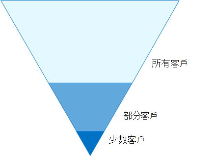
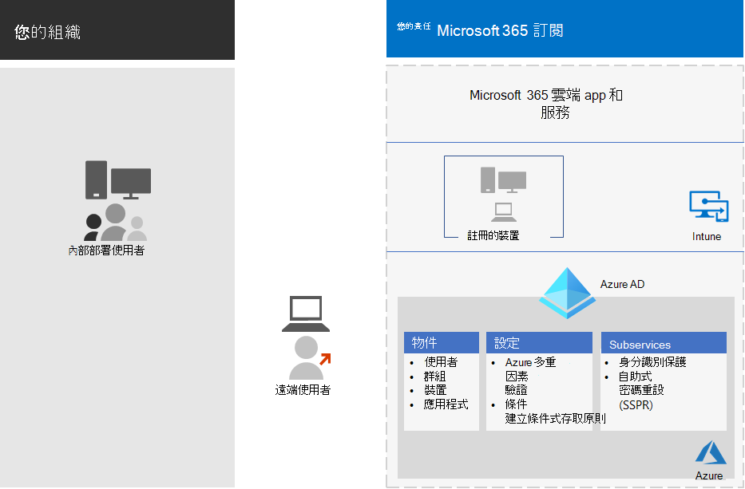

# 身分識別與裝置存取設定Identity and device access configurations

組織目前的安全性周邊環境會延伸至您的網路以外，以包含從各種裝置的任何位置存取雲端架構應用程式的使用者。The modern security perimeter of your organization now extends beyond your network to include users accessing cloud-based apps from any location with a variety of devices. 您的安全性基礎結構需要判斷是否應授與指定的存取要求，以及在哪些條件下。Your security infrastructure needs to determine whether a given access request should be granted and under what conditions.

這項判斷應該是根據登入的使用者帳戶、正在使用的裝置、使用者正在使用的應用程式、建立存取要求的位置，以及要求的風險評估。This determination should be based on the user account of the sign-in, the device being used, the app the user is using for access, the location from which the access request is made, and an assessment of the risk of the request. 這項功能有助於確保，只有經核准的使用者與裝置才可存取重要的資源。This capability helps ensure that only approved users and devices can access your critical resources.

本系列文章說明一組身分識別與裝置存取的必要條件設定，以及一組 Azure Active Directory (Azure AD) 條件式存取、Microsoft Intune 及其他原則，以保護對 Microsoft 365 for enterprise cloud app 和服務、其他 SaaS 服務，以及使用 Azure AD 應用程式 Proxy 發佈的內部部署應用程式的存取。This series of articles describes a set of identity and device access prerequisite configurations and a set of Azure Active Directory (Azure AD) Conditional Access, Microsoft Intune, and other policies to secure access to Microsoft 365 for enterprise cloud apps and services, other SaaS services, and on-premises applications published with Azure AD Application Proxy.

身分識別與裝置存取設定和原則，可在三個層級中使用：基準保護、機密保護，以及針對具有高管制或保密資料之環境的保護。Identity and device access settings and policies are recommended in three tiers: baseline protection, sensitive protection, and protection for environments with highly regulated or classified data. 這些層級及其對應的設定，可針對所有資料、身分識別和裝置，提供一致的保護層級。These tiers and their corresponding configurations provide consistent levels of protection across your data, identities, and devices.

這些功能及其建議：These capabilities and their recommendations:

- 支援 Microsoft 365 E3 和 Microsoft 365 E5。Are supported in Microsoft 365 E3 and Microsoft 365 E5.
- 會與 [Microsoft 安全分數](https://docs.microsoft.com/microsoft-365/security/mtp/microsoft-secure-score) 和 [Azure AD 中的身分識別分數](https://docs.microsoft.com/azure/active-directory/fundamentals/identity-secure-score)對齊，並且會為您的組織增加這些分數。Are aligned with [Microsoft Secure Score](https://docs.microsoft.com/microsoft-365/security/mtp/microsoft-secure-score) as well as [identity score in Azure AD](https://docs.microsoft.com/azure/active-directory/fundamentals/identity-secure-score), and will increase these scores for your organization.
- 會協助您執行下列 [五個步驟，以保護您的身分識別基礎結構](https://docs.microsoft.com/azure/security/azure-ad-secure-steps)。Will help you implement these [five steps to securing your identity infrastructure](https://docs.microsoft.com/azure/security/azure-ad-secure-steps).

如果您的組織有獨特的環境需求或複雜性，請使用這些建議做為開始點。If your organization has unique environment requirements or complexities, use these recommendations as a starting point. 不過，大多陣列織可依照預定的方式來執行這些建議。However, most organizations can implement these recommendations as prescribed.

> [!NOTE]
> Microsoft 也會為 Office 365 訂閱銷售企業行動 + 安全性 (EMS) 授權。Microsoft also sells Enterprise Mobility + Security (EMS) licenses for Office 365 subscriptions. EMS E3 和 EMS E5 功能相當於 Microsoft 365 E3 和 Microsoft 365 E5 中的功能。EMS E3 and EMS E5 capabilities are equivalent to those in Microsoft 365 E3 and Microsoft 365 E5. 如需詳細資訊，請參閱 [EMS 方案](https://www.microsoft.com/microsoft-365/enterprise-mobility-security/compare-plans-and-pricing) 。See [EMS plans](https://www.microsoft.com/microsoft-365/enterprise-mobility-security/compare-plans-and-pricing) for the details.

## 目標物件Intended audience

這些建議適用于企業架構師和 IT 專業人員，熟悉 Microsoft 365 雲端生產力與安全性服務，其中包括 Azure AD (身分識別) 、Microsoft Intune (裝置管理) ，以及 Azure 資訊保護 (資料保護) 。These recommendations are intended for enterprise architects and IT professionals who are familiar with Microsoft 365 cloud productivity and security services, which includes Azure AD (identity), Microsoft Intune (device management), and Azure Information Protection (data protection).

### 客戶環境Customer environment

建議的原則適用于完全在 Microsoft 雲端內運作的企業組織，以及具有混合式身分識別基礎結構的客戶，也就是內部部署 Active Directory 網域服務 (AD DS) 樹系，與 Azure AD 租使用者同步。The recommended policies are applicable to enterprise organizations operating both entirely within the Microsoft cloud and for customers with hybrid identity infrastructure, which is an on-premises Active Directory Domain Services (AD DS) forest that is synchronized with an Azure AD tenant.

所提供的許多建議，都依賴只有 Microsoft 365 E5 才能使用的服務、使用身分識別 & 威脅防護附加元件、EMS E5 或 Azure Premium P2 授權的 Microsoft 365 E3。Many of the provided recommendations rely on services available only with Microsoft 365 E5, Microsoft 365 E3 with the Identity & Threat Protection add-on, EMS E5, or Azure Premium P2 licenses.

對於沒有這些授權的組織，Microsoft 建議您至少執行 [安全性預設值，這些預設值](https://docs.microsoft.com/azure/active-directory/fundamentals/concept-fundamentals-security-defaults)包含在所有 Microsoft 365 方案中。For those organizations who do not have these licenses, Microsoft recommends you at least implement [security defaults](https://docs.microsoft.com/azure/active-directory/fundamentals/concept-fundamentals-security-defaults), which is included with all Microsoft 365 plans.

### 警告Caveats

您的組織可能會受限於法規或其他法規遵從性需求，包括可能要求您套用與這些建議設定分開之原則的特定建議。Your organization may be subject to regulatory or other compliance requirements, including specific recommendations that may require you to apply policies that diverge from these recommended configurations. 這些設定會建議過去未提供的使用情形控制項。These configurations recommend usage controls that have not historically been available. 我們建議使用這些控制措施，因為我們相信它們代表安全性和生產力之間的平衡。We recommend these controls because we believe they represent a balance between security and productivity.

我們已盡力考慮各種組織保護需求，但我們不能考慮所有可能的需求，或組織的所有獨有方面。We've done our best to account for a wide variety of organizational protection requirements, but we're not able to account for all possible requirements or for all the unique aspects of your organization.

## 三種保護層級Three tiers of protection

大部分組織都有安全性和資料保護的相關特定需求。Most organizations have specific requirements regarding security and data protection. 根據產業部門和組織內的職責，這些需求會不同。These requirements vary by industry segment and by job functions within organizations. 例如，您的法律部門和系統管理員可能需要其他的安全性和資訊保護，而不是其他商業單位所需的電子郵件對應。For example, your legal department and administrators might require additional security and information protection controls around their email correspondence that are not required for other business units.

每個產業也都有自己的一組特殊法規。Each industry also has their own set of specialized regulations. 建議針對三種不同的安全性和保護層級，而不是提供所有可能安全性選項的清單，也是針對每個行業區段或工作功能所提供的建議。Rather than providing a list of all possible security options or a recommendation per industry segment or job function, recommendations have been provided for three different tiers of security and protection that can be applied based on the granularity of your needs.

- **基準保護**：我們建議您建立保護資料的最低標準，以及存取資料的身分識別和裝置。**Baseline protection**: We recommend you establish a minimum standard for protecting data, as well as the identities and devices that access your data. 您可以遵循下列基準建議，提供符合許多組織需求的強預設保護。You can follow these baseline recommendations to provide strong default protection that meets the needs of many organizations.
- **敏感保護**：有些客戶的資料子集必須在較高的層級加以保護，否則可能需要以較高的層次保護所有的資料。**Sensitive protection**: Some customers have a subset of data that must be protected at higher levels, or they may require all data to be protected at a higher level. 您可以將增強的保護套用至 Microsoft 365 環境中的所有或特定資料集。You can apply increased protection to all or specific data sets in your Microsoft 365 environment. 建議保護以可比較的安全性層級存取敏感性資料的身分識別和裝置。We recommend protecting identities and devices that access sensitive data with comparable levels of security.
- **高度管制**：有些組織可能會具有少量的資料，以高度分類，組成交易機密或管制資料。**Highly regulated**: Some organizations may have a small amount of data that is highly classified, constitutes trade secrets, or is regulated data. Microsoft 所提供的功能可協助組織符合這些需求，包含針對身分識別和裝置新增的保護。Microsoft provides capabilities to help organizations meet these requirements, including added protection for identities and devices.

本指南說明如何針對每一種保護層級的身分識別和裝置執行保護。This guidance shows you how to implement protection for identities and devices for each of these tiers of protection. 使用此指導方針做為組織的起點，並調整原則，以符合組織的特定需求。Use this guidance as a starting point for your organization and adjust the policies to meet your organization's specific requirements.

請務必在您的資料、身分識別和裝置之間，使用一致層級的保護。It's important to use consistent levels of protection across your data, identities, and devices. 例如，如果您要執行此指導方針，請務必保護您的資料，以同等的層次。For example, if you implement this guidance, be sure to protect your data at comparable levels.

Microsoft 365 架構模型的身分 **識別與裝置保護** 會顯示哪些功能是可比較的。The **Identity and device protection for Microsoft 365** architecture model shows you which capabilities are comparable.

   [以 PDF 格式查看](../../downloads/MSFT_cloud_architecture_identity&device_protection.pdf) \|[以 PDF 格式下載](https://github.com/MicrosoftDocs/microsoft-365-docs/raw/public/microsoft-365/downloads/MSFT_cloud_architecture_identity&device_protection.pdf) \|[下載為 Visio](https://github.com/MicrosoftDocs/microsoft-365-docs/raw/public/microsoft-365/downloads/MSFT_cloud_architecture_identity&device_protection.vsdx)  [View as a PDF](../../downloads/MSFT_cloud_architecture_identity&device_protection.pdf) \| [Download as a PDF](https://github.com/MicrosoftDocs/microsoft-365-docs/raw/public/microsoft-365/downloads/MSFT_cloud_architecture_identity&device_protection.pdf)  \| [Download as a Visio](https://github.com/MicrosoftDocs/microsoft-365-docs/raw/public/microsoft-365/downloads/MSFT_cloud_architecture_identity&device_protection.vsdx)

此外，請參閱 [部署資訊保護以取得資料隱私權法規](../../solutions/information-protection-deploy.md) 解決方案，以保護儲存在 Microsoft 365 中的資訊。Additionally, see the [Deploy information protection for data privacy regulations](../../solutions/information-protection-deploy.md) solution to protect information stored in Microsoft 365.

## 安全性與生產力的取捨Security and productivity trade-offs

實施任何安全性策略時，必須權衡安全性和生產力。Implementing any security strategy requires trade-offs between security and productivity. 評估每個決策對安全性、功能和易用性的影響。It's helpful to evaluate how each decision affects the balance of security, functionality, and ease of use.

提供的建議是以下列原則為基礎：The recommendations provided are based on the following principles:

- 知道您的使用者，並根據安全性和功能需求進行彈性。Know your users and be flexible to their security and functional requirements.
- 及時套用安全性原則，並確保其有意義。Apply a security policy just in time and ensure it is meaningful.

## 身分識別與裝置存取保護的服務和概念Services and concepts for identity and device access protection

適用于企業的 Microsoft 365 是針對大型組織設計的，可讓每個人都具有創造性且安全地協同運作。Microsoft 365 for enterprise is designed for large organizations to empower everyone to be creative and work together securely.

本節概述對身分識別與裝置存取非常重要的 Microsoft 365 服務和功能。This section provides an overview of the Microsoft 365 services and capabilities that are important for identity and device access.

### Azure ADAzure AD

Azure AD 提供完整的身分識別管理功能套件。Azure AD provides a full suite of identity management capabilities. 我們建議使用這些功能來保護存取。We recommend using these capabilities to secure access.

|功能Capability or feature|描述Description|授權Licensing|
|---|---|---|
|[多重要素驗證 (MFA)Multi-factor authentication (MFA)](/azure/active-directory/authentication/concept-mfa-howitworks)|MFA 要求使用者提供兩種形式的驗證，例如使用者密碼加上 Microsoft 驗證應用程式或電話的通知。MFA requires users to provide two forms of verification, such as a user password plus a notification from the Microsoft Authenticator app or a phone call. MFA 大幅降低可供盜竊之認證存取您環境的風險。MFA greatly reduces the risk that stolen credentials can be used to access your environment. Microsoft 365 使用 Azure AD Multi-Factor 驗證服務進行 MFA 型登入。Microsoft 365 uses the Azure AD Multi-Factor Authentication service for MFA-based sign-ins.|Microsoft 365 E3 或 E5Microsoft 365 E3 or E5|
|[條件式存取Conditional Access](/azure/active-directory/conditional-access/overview)|Azure AD 評估使用者登入的條件，並使用條件式存取原則來決定允許的存取。Azure AD evaluates the conditions of the user sign-in and uses Conditional Access policies to determine the allowed access. 例如，在此指導中，我們會告訴您如何建立條件式存取原則，以要求存取機密資料的裝置合規性。For example, in this guidance we show you how to create a Conditional Access policy to require device compliance for access to sensitive data. 這會極大降低具有自身裝置和盜竊認證的駭客可以存取您機密資料的風險。This greatly reduces the risk that a hacker with their own device and stolen credentials can access your sensitive data. 它也會保護裝置上的機密資料，因為裝置必須符合健康和安全性的特定需求。It also protects sensitive data on the devices, because the devices must meet specific requirements for health and security.|Microsoft 365 E3 或 E5Microsoft 365 E3 or E5|
|[Azure AD 群組Azure AD groups](/azure/active-directory/fundamentals/active-directory-manage-groups)|條件式存取原則、具有 Intune 的裝置管理，以及對您組織中檔案和網站的許可權，都依賴指派給使用者帳戶或 Azure AD 群組。Conditional Access policies, device management with Intune, and even permissions to files and sites in your organization rely on the assignment to user accounts or Azure AD groups. 建議您建立對應至您所實施之保護層級的 Azure AD 群組。We recommend you create Azure AD groups that correspond to the levels of protection you are implementing. 例如，您的 executive 人員很可能是駭客的高價值目標。For example, your executive staff are likely higher value targets for hackers. 因此，您可以將這些員工的使用者帳戶新增至 Azure AD 群組，並將此群組指派給條件式存取原則及其他強制進行存取保護等級的原則。Therefore, it makes sense to add the user accounts of these employees to an Azure AD group and assign this group to Conditional Access policies and other policies that enforce a higher level of protection for access.|Microsoft 365 E3 或 E5Microsoft 365 E3 or E5|
|[裝置註冊Device enrollment](/azure/active-directory/devices/overview)|您可以在 Azure AD 中註冊裝置，以建立裝置的身分識別。You enroll a device into Azure AD to create an identity for the device. 此身分識別是用來在使用者登入並套用需要加入網域或合規的電腦的條件式存取原則時，用來驗證裝置。This identity is used to authenticate the device when a user signs in and to apply Conditional Access policies that require domain-joined or compliant PCs. 針對此指南，我們使用裝置註冊功能自動註冊加入網域的 Windows 電腦。For this guidance, we use device enrollment to automatically enroll domain-joined Windows computers. 裝置註冊是使用 Intune 管理裝置的必要條件。Device enrollment is a prerequisite for managing devices with Intune.|Microsoft 365 E3 或 E5Microsoft 365 E3 or E5|
|[Azure AD Identity ProtectionAzure AD Identity Protection](/azure/active-directory/identity-protection/overview)|可讓您偵測影響組織之身分識別的潛在弱點，並設定自動修正原則為低、中、高的登入風險和使用者風險。Enables you to detect potential vulnerabilities affecting your organization's identities and configure automated remediation policy to low, medium, and high sign-in risk and user risk. 本指南取決於此風險評估，針對多重要素驗證套用條件式存取原則。This guidance relies on this risk evaluation to apply Conditional Access policies for multi-factor authentication. 本指南也包含條件式存取原則，需要使用者在其帳戶中偵測到高風險的活動時變更其密碼。This guidance also includes a Conditional Access policy that requires users to change their password if high-risk activity is detected for their account.|Microsoft 365 E5，使用 Identity & 威脅防護附加元件、EMS E5 或 Azure Premium P2 授權的 Microsoft 365 E3Microsoft 365 E5, Microsoft 365 E3 with the Identity & Threat Protection add-on, EMS E5, or Azure Premium P2 licenses|
|[自助密碼重設 (SSPR) Self-service password reset (SSPR)](/azure/active-directory/authentication/concept-sspr-howitworks)|可讓您的使用者安全地重設其密碼，而不需要協助桌面的干預，只要提供系統管理員可控制的多個驗證方法的驗證。Allow your users to reset their passwords securely and without help-desk intervention, by providing verification of multiple authentication methods that the administrator can control.|Microsoft 365 E3 或 E5Microsoft 365 E3 or E5|
|[Azure AD 密碼保護Azure AD password protection](https://docs.microsoft.com/azure/active-directory/authentication/concept-password-ban-bad)|偵測並封鎖已知弱密碼和其變種，以及組織特有的其他弱字詞。Detect and block known weak passwords and their variants and additional weak terms that are specific to your organization. 預設全域禁用密碼清單會自動套用至 Azure AD 租用戶中的所有使用者。Default global banned password lists are automatically applied to all users in an Azure AD tenant. 您可以在自訂禁用密碼清單中定義其他條目。You can define additional entries in a custom banned password list. 使用者變更或重設密碼時，系統會檢查這些禁用密碼清單，以強制使用強式密碼。When users change or reset their passwords, these banned password lists are checked to enforce the use of strong passwords.|Microsoft 365 E3 或 E5Microsoft 365 E3 or E5|
|

以下是身分識別與裝置存取的元件，包括 Intune 和 Azure AD 物件、設定和 subservices。Here are the components of identity and device access, including Intune and Azure AD objects, settings, and subservices.

### Microsoft IntuneMicrosoft Intune

[Intune](https://docs.microsoft.com/intune/introduction-intune) 是 Microsoft 雲端型行動裝置管理服務。[Intune](https://docs.microsoft.com/intune/introduction-intune) is Microsoft's cloud-based mobile device management service. 本指南建議使用 Intune 的 Windows 電腦裝置管理，並建議裝置合規性原則設定。This guidance recommends device management of Windows PCs with Intune and recommends device compliance policy configurations. Intune 會判斷是否符合裝置，並將此資料傳送至 Azure AD，以在套用條件式存取原則時使用。Intune determines whether devices are compliant and sends this data to Azure AD to use when applying Conditional Access policies.

#### Intune 應用程式保護Intune app protection

您可以使用[Intune 應用程式保護](https://docs.microsoft.com/intune/app-protection-policy)原則，在行動應用程式中保護您組織的資料，但不需要將裝置登記至管理。[Intune app protection](https://docs.microsoft.com/intune/app-protection-policy) policies can be used to protect your organization's data in mobile apps, with or without enrolling devices into management. Intune 可協助保護資訊，確保您的員工仍可生產力，並防止資料遺失。Intune helps protect information, making sure your employees can still be productive, and preventing data loss. 透過實施應用層級原則，您可以限制公司資源的存取權，並將資料放在 IT 部門的控制中。By implementing app-level policies, you can restrict access to company resources and keep data within the control of your IT department.

本指南說明如何建立建議原則，以強制使用已核准的應用程式，以及決定如何將這些應用程式與您的商務資料搭配使用。This guidance shows you how to create recommended policies to enforce the use of approved apps and to determine how these apps can be used with your business data.

### Microsoft 365Microsoft 365

本指南將告訴您如何實施一組原則，以保護 Microsoft 365 雲端服務（包括 Microsoft 團隊、Exchange Online、SharePoint 線上和商務 OneDrive）的存取權。This guidance shows you how to implement a set of policies to protect access to Microsoft 365 cloud services, including Microsoft Teams, Exchange Online, SharePoint Online, and OneDrive for Business. 除了執行這些原則之外，也建議您使用下列資源提升租使用者的保護層級：In addition to implementing these policies, we recommend you also raise the level of protection for your tenant using these resources:

- [設定租用戶以提高安全性Configure your tenant for increased security](tenant-wide-setup-for-increased-security.md)

  適用于租使用者之基準安全性的建議。Recommendations that apply to baseline security for your tenant.

- [安全性藍圖：前30天、90天和之後的最高優先順序Security roadmap: Top priorities for the first 30 days, 90 days, and beyond](security-roadmap.md)

  包括記錄、資料管理、系統管理存取和威脅防護的建議。Recommendations that include logging, data governance, admin access, and threat protection.

### Windows 10 和 Microsoft 365 Apps 企業版Windows 10 and Microsoft 365 Apps for enterprise

Windows 10 搭配使用 Microsoft 365 應用程式的企業版是電腦的建議用戶端環境。Windows 10 with Microsoft 365 Apps for enterprise is the recommended client environment for PCs. 由於 Azure 設計為同時提供內部部署和 Azure AD 的最平滑體驗，因此建議採用 Windows 10。We recommend Windows 10 because Azure is designed to provide the smoothest experience possible for both on-premises and Azure AD. Windows 10 也包含可透過 Intune 管理的高級安全性功能。Windows 10 also includes advanced security capabilities that can be managed through Intune. Microsoft 365 應用程式企業版包含最新版的 Office 應用程式。Microsoft 365 Apps for enterprise includes the latest versions of Office applications. 這些使用的是新式驗證，也就是更安全，也是條件式存取的必要條件。These use modern authentication, which is more secure and a requirement for Conditional Access. 這些應用程式也包含增強的安全性和符合性工具。These apps also include enhanced security and compliance tools.

## 跨三種保護層級應用這些功能Applying these capabilities across the three tiers of protection

下表摘要說明在三種保護層級使用這些功能的建議。The following table summarizes our recommendations for using these capabilities across the three tiers of protection.

|保護機制Protection mechanism|基準Baseline|敏感性Sensitive|高管制Highly regulated|
|---|---|---|---|
|**強制執行 MFA****Enforce MFA**|在中或以上的登入風險上On medium or above sign-in risk|在低或以上的登入風險上On low or above sign-in risk|在所有新的工作階段上On all new sessions|
|**強制執行密碼變更****Enforce password change**|高風險使用者的For high-risk users|高風險使用者的For high-risk users|高風險使用者的For high-risk users|
|**強制執行 Intune 應用程式保護****Enforce Intune application protection**|是Yes|是Yes|是Yes|
|**針對組織擁有的裝置強制執行 Intune 登記****Enforce Intune enrollment for organization-owned device**|需要相容或加入網域的電腦，但允許附帶裝置 (BYOD) 電話和平板電腦Require a compliant or domain-joined PC, but allow bring-your-own devices (BYOD) phones and tablets|需要相容或加入網域的裝置Require a compliant or domain-joined device|需要相容或加入網域的裝置Require a compliant or domain-joined device|
|

## 裝置擁有權Device ownership

上表反映許多組織支援混合使用組織的裝置的趨勢，以及個人或 BYODs，以在整個工作力內啟用行動生產力。The above table reflects the trend for many organizations to support a mix of organization-owned devices, as well as personal or BYODs to enable mobile productivity across the workforce. Intune 應用程式保護原則可確保電子郵件在組織所擁有的裝置和 BYODs 上，避免從 Outlook 行動應用程式和其他 Office 行動應用程式 exfiltrating 出。Intune app protection policies ensure that email is protected from exfiltrating out of the Outlook mobile app and other Office mobile apps, on both organization-owned devices and BYODs.

建議以 Intune 或加入網域的方式管理組織擁有的裝置，以套用其他的保護和控制。We recommend organization-owned devices be managed by Intune or domain-joined to apply additional protections and control. 根據資料敏感度，您的組織可以選擇不允許特定使用者人口或特定應用程式的 BYODs。Depending on data sensitivity, your organization may choose to not allow BYODs for specific user populations or specific apps.

## 部署和您的應用程式Deployment and your apps

在設定及推出 Azure AD 整合應用程式的身分識別與裝置存取設定之前，您必須：Prior to configuring and rolling out identity and device access configuration for your Azure AD-integrated apps, you must:

- 決定您要保護組織中使用的應用程式。Decide which apps used in your organization you want to protect.
- 分析此應用程式清單，以決定提供適當保護等級的原則集合。Analyze this list of apps to determine the sets of policies that provide appropriate levels of protection.

  您不應為應用程式建立個別的原則集合，因為其管理可能會變得麻煩。You should not create separate sets of policies each for app because management of them can become cumbersome. Microsoft 建議您將相同使用者的相同保護需求群組為您的應用程式。Microsoft recommends that you group your apps that have the same protection requirements for the same users.

  例如，您可以使用一組原則，其中包括所有使用者的基準保護的所有 Microsoft 365 應用程式，以及所有機密應用程式的第二組原則，例如人力資源或財務部門所使用的原則，並將它們套用到這些群組。For example, you could have one set of policies that include all Microsoft 365 apps for all of your users for baseline protection and a second set of policies for all sensitive apps, such as those used by human resources or finance departments, and apply them to those groups.

一旦您已決定要保護之應用程式的原則集，請逐步向您的使用者推廣原則，以解決問題的方式。Once you have determined the set of policies for the apps you want to secure, roll the policies out to your users incrementally, addressing issues along the way.

例如，設定將用於所有 Microsoft 365 應用程式的原則，僅限 exchange Online 與 Exchange 的其他變更。For example, configure the policies that will be used for all your Microsoft 365 apps for just Exchange Online with the additional changes for Exchange. 請向您的使用者推出這些原則，並處理任何問題。Roll these policies out to your users and work through any issues. 然後，新增小組的其他變更，並將其推廣給您的使用者。Then, add Teams with its additional changes and roll this out to your users. 然後，新增包含其他變更的 SharePoint。Then, add SharePoint with its additional changes. 繼續新增應用程式的其餘部分，直到您可以自信地設定這些基準原則，以包含所有的 Microsoft 365 應用程式。Continue adding the rest of your apps until you can confidently configure these baseline policies to include all Microsoft 365 apps.

同樣地，針對您的敏感應用程式，建立一組原則，並一次加入一個應用程式，直到所有的問題都包含在機密應用程式原則集中為止。Similarly, for your sensitive apps, create the set of policies and add one app at a time and work through any issues until they are all included in the sensitive app policy set.

Microsoft 建議您不要建立適用于所有應用程式的原則集，因為這可能會造成某些未預期的設定。Microsoft recommends that you do not create policy sets that apply to all apps because it can result in some unintended configurations. 例如，封鎖所有應用程式的原則可能會鎖定您的系統管理員無法從 Azure 入口網站，且無法為 Microsoft Graph 等重要端點設定排除。For example, policies that block all apps could lock your admins out of the Azure portal and exclusions cannot be configured for important endpoints such as Microsoft Graph.

## 設定身分識別與裝置存取之程式中的步驟Steps in the process of configuring identity and device access

1. 設定必要身分識別功能及其設定。Configure prerequisite identity features and their settings.
2. 設定通用身分識別和存取條件式存取原則。Configure the common identity and access Conditional Access policies.
3. 為來賓和外部使用者設定條件式存取原則。Configure Conditional Access policies for guest and external users.
4. 針對 microsoft 團隊、Exchange Online 和 SharePoint，設定 Microsoft 365 雲端 app 的條件式存取原則。Configure Conditional Access policies for Microsoft 365 cloud apps such as Microsoft Teams, Exchange Online, and SharePoint.

在您設定身分識別與裝置存取後，請參閱 [AZURE ad 功能部署指南](https://docs.microsoft.com/azure/active-directory/fundamentals/active-directory-deployment-checklist-p2) ，以瞭解其他應考慮的功能和 [Azure AD 身分識別](https://docs.microsoft.com/azure/active-directory/governance/) 控管，以保護、監控和審核存取。After you have configured identity and device access, see the [Azure AD feature deployment guide](https://docs.microsoft.com/azure/active-directory/fundamentals/active-directory-deployment-checklist-p2) for a phased checklist of additional features to consider and [Azure AD Identity Governance](https://docs.microsoft.com/azure/active-directory/governance/) to protect, monitor, and audit access.

## 下一步Next step

[實施身分識別與裝置存取原則的必要條件工作Prerequisite work for implementing identity and device access policies](identity-access-prerequisites.md)
