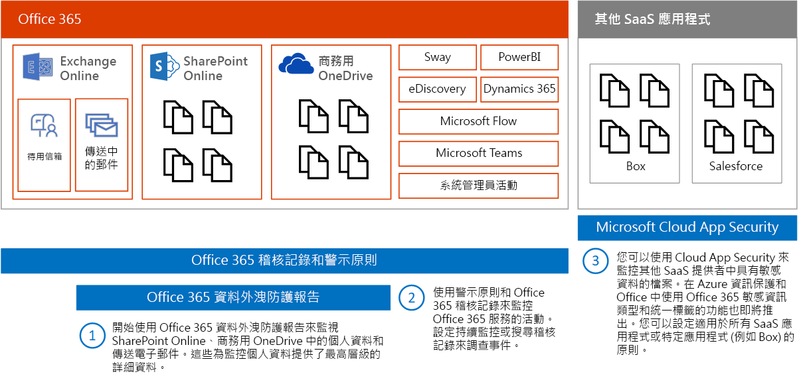
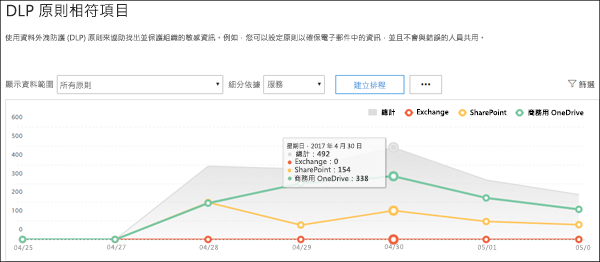
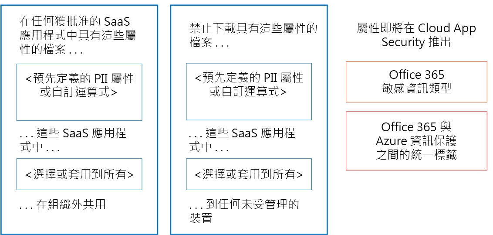
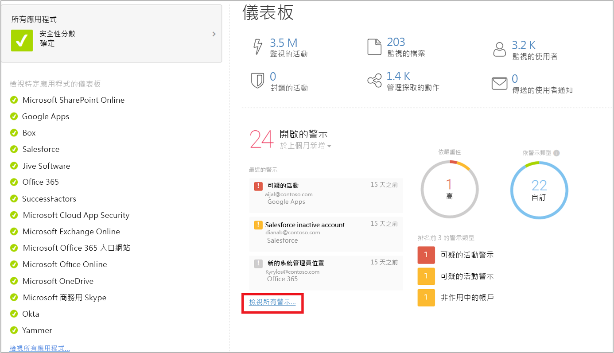

# 監視個人資料的外洩

[!INCLUDE [Microsoft 365 Defender rebranding](../includes/microsoft-defender-for-office.md)]

有許多工具，可用來監視個人資料的使用和傳輸。本主題描述三種效果不錯的工具。

在此圖例中：

- 從 Microsoft 365 資料外洩防護報告開始，這些報告用於監視 SharePoint Online、商務用 OneDrive 和傳輸中電子郵件中的個人資料。這些報告提供監視個人資料時的最大詳細資料層級。不過，這類報告不包含 Office 365 中的所有服務。

- 接下來，使用警示和稽核記錄，以監視整個服務的活動。設定持續監視，或搜尋稽核記錄以調查事件。稽核記錄適用於整個服務—Sway、Power BI、電子文件探索、Dynamics 365、Microsoft Flow、Microsoft Teams、系統管理活動、商務用 OneDrive、SharePoint Online、傳輸中郵件，以及靜態信箱。靜態信箱包括 Skype 交談。

- 最後，使用 Microsoft Cloud App Security 監視其他 SaaS 提供者中具有敏感資料的檔案。即將能夠在 Azure 資訊保護和具有 Cloud App Security 的 Office 之間使用敏感資訊類型和統一標籤。您可以設定適用於所有 SaaS 應用程式或特定應用程式 (例如 Box) 的原則。Cloud App Security 不會探索 Exchange 中的檔案，包括電子郵件的附加檔案。

## 資料外洩防護報告

建立資料外洩防護 (DLP) 原則之後，您會想要確認原則是否達到您想要的效果並協助您符合規範。使用 Office 365 中的 DLP 報告，您可以快速檢視 DLP 原則及規則相符、覆寫及誤判的數量、查看它們是否會隨時間而有趨勢上揚或下降的變化、以不同方式篩選報告，以及選取圖形上線條的點來檢視其他詳細資料。

您可以將 DLP 用於：

- 將重點放在特定時段，以了解尖峰和趨勢的原因。
- 探索違反貴組織 DLP 原則的商務程序。
- 了解 DLP 原則帶來的任何業務影響。
- 檢視當使用者藉由覆寫原則，或報告誤判以解析原則秘訣時，他們所提交的理由。
- 顯示該原則的任何符合項目來驗證是否符合特定 DLP 原則的規範。
- 檢視檔案清單，其中的敏感性資料符合詳細資料窗格中的 DLP 原則。

此外，在測試模式下執行 DLP 原則時，您可以使用 DLP 報告來微調這些原則。

DLP 報告位於 Microsoft 365 合規性中心。 前往 **[報告]** \> **[組織資料]** 區段，尋找 **[DLP 原則相符項目]**、**[DLP 事件]**，以及 **[DLP 誤判和覆寫]** 報告。

如需詳細資訊，請參閱[檢視資料外洩防護的報告](../../compliance/view-the-dlp-reports.md)。

## 稽核記錄和警示原則

稽核記錄包含的事件來自 Exchange Online、SharePoint Online、商務用 OneDrive、Azure Active Directory、Microsoft Teams’Power BI、Sway，以及其他服務。

Microsoft 365 Defender 入口網站和 Microsoft 365 合規性中心提供兩種方式來監視及報告稽核記錄：

- 設定警示原則、查看警示及監視趨勢 — 使用 Microsoft 365 Defender 入口網站或 Microsoft 365 合規性中心的警示原則和警示儀表板工具。
- 直接搜尋稽核記錄—搜尋指定日期範圍的所有事件。或者，根據特定準則 (例如執行動作的使用者、動作或目標物件) 篩選結果。

資訊合規性與安全性小組可以使用這些工具，主動檢閱使用者和系統管理員在服務之間執行的活動。您可以設定自動警示，在特定網站集合上發生特定活動時傳送電子郵件通知 - 例如，從已知包含 GDPR 相關資訊的網站共用內容時。這可讓那些小組追蹤使用者，以確保他們遵循公司安全性原則，或是提供其他訓練。

資訊安全小組也可以搜尋稽核記錄，以調查可疑的資料外洩，並判斷根本原因，以及外洩範圍。此內建功能有助於遵循 GDPR 的第 33 條和第 34 條，這需要在特定時段內將資料外洩通知 GDPR 監理局和資料主體本身。稽核記錄項目只會在服務內保留 90 天 - 通常這是建議的天數，但許多組織需要這些記錄保留更長的一段時間。

可用的解決方案透過 Microsoft Management Activity API 訂閱統一的稽核記錄，同時可以視需要儲存記錄項目，並提供進階儀表板和警示。範例有 [Microsoft Operations Management Suite (OMS)](/azure/operations-management-suite/oms-solution-office-365)。

警示原則和搜尋稽核記錄的相關資訊：

- [Microsoft 365 中的警示原則](../../compliance/alert-policies.md)
- [搜尋稽核記錄以取得 Office 365 中的使用者和系統管理員活動](../../compliance/search-the-audit-log-in-security-and-compliance.md) (簡介)
- [開啟或關閉稽核記錄搜尋](../../compliance/turn-audit-log-search-on-or-off.md)
- [搜尋稽核記錄](../../compliance/search-the-audit-log-in-security-and-compliance.md)
- [Search-UnifiedAuditLog](/powershell/module/exchange/search-unifiedauditlog) (Cmdlet)
- [稽核記錄中的詳細內容](../../compliance/detailed-properties-in-the-office-365-audit-log.md)

## Microsoft Cloud App Security

Microsoft Cloud App Security 可協助您探索在您的網路中使用的其他 SaaS 應用程式，以及在這些應用程式之間來回傳送的敏感性資料。

Microsoft Cloud App Security 是一種全方位服務，可為您的雲端應用程式提供深入的可見性、細微控制和增強的威脅防護。它可從您網路中的所有裝置識別出超過 15,000 個雲端應用程式，並提供風險評分和持續風險評估與分析。無需代理程式：從防火牆和 Proxy 收集資訊，為您提供雲端使用和影子 IT 的完整可見性和內容。

為了深入了解您的雲端環境，Cloud App Security 的調查功能可讓您深入了解所有獲核准和受管理應用程式的活動、文件和帳戶。您可以取得檔案層級的詳細資訊，並探索資料在雲端應用程式中的傳輸位置。

例如，下圖示範兩個可協助 GDPR 的 Cloud App Security 原則。

當具有預先定義的 PII 屬性或您選擇的自訂運算式的檔案，在組織外從您選擇的 SaaS 應用程式共用時，第一個原則會發出警示。

第二個原則會禁止將檔案至任何未受管理的裝置。您可以選擇檔案內要尋找的屬性，以及要套用原則的 SaaS 應用程式。

這些屬性類型即將在 Cloud App Security 推出：

- 敏感性資訊類型
- Microsoft 365 與 Azure 資訊保護之間的統一標籤

### Cloud App Security 儀表板

如果您還沒開始使用 Cloud App Security，請先將其啟動。若要存取 Cloud App Security：<https://portal.cloudappsecurity.com>。

> [!NOTE]
> 當開始使用 Cloud App Security 時，或在您指派標籤之前，請務必啟用 [自動掃描 Azure 資訊保護分類標籤的檔案] (在 [一般] 設定中)。設定後，Cloud App Security 不會重新掃描現有檔案，直到修改了它們。

詳細資訊：

- [部署 Cloud App Security](/cloud-app-security/getting-started-with-cloud-app-security)
- [Microsoft Cloud App Security 的詳細資訊](https://www.microsoft.com/cloud-platform/cloud-app-security)
- [禁止使用 Microsoft Cloud App Security Proxy 下載敏感資訊](/cloud-app-security/use-case-proxy-block-session-aad)

## 範例檔案以及偵測個人資料共用的活動原則

### 偵測包含 PII 之檔案的共用 — 信用卡號碼

從核准的雲端應用程式共用包含信用卡號碼的檔案時發出警示。

 

****

|控制項|設定|
|---|---|
|原則類型|檔案原則|
|原則範本|無範本|
|原則重要性|高|
|類別|DLP|
|篩選器設定|存取層級 = 公用 (網際網路)、公用、外部 
 App = \<select apps\> (如果想要限制對特定 SaaS 應用程式的監視，請使用此設定)|
|套用到|所有檔案，所有擁有者|
|內容檢查|包含符合當前運算式的檔案：所有國家/地區、金融、信用卡號碼 
 不需要相關內容：已取消核取 (此設定會比對關鍵字，以及 regex) 
 包含至少有 1 個相符項目的檔案 
 取消遮罩違規的最後 4 個字元：已核取|
|警示|建立每個相符檔案的警示：已核取 
 每日警示限制：1000 
 選取警示做為電子郵件：已核取 
 收件人：infosec@contoso.com|
|治理|Microsoft OneDrive for Business 
 專用： 核取 [移除外部使用者] 
 所有其他設定：已取消核取 
 Microsoft SharePoint Online 
 專用： 核取 [移除外部使用者] 
 所有其他設定：已取消核取|
|

類似原則：

- 偵測包含 PII 之檔案的共用 — 電子郵件地址
- 偵測包含 PII 之檔案的共用 — 護照號碼

### 偵測 Box 或商務用 OneDrive 中的客戶或 HR 資料

當標示為「客戶資料或 HR 資料」的檔案上傳至商務用 OneDrive 或 Box 時發出警示。

附註：

- Box 監視需要您使用 API 連接器 SDK 設定連接器。
- 此原則需要目前處於私人預覽的功能。

 

****

|控制項|設定|
|---|---|
|原則類型|活動原則|
|原則範本|無範本|
|原則重要性|高|
|類別|共用控制項|
|採取行動|單一活動|
|篩選器設定|活動類型 = 上傳檔案 
 應用程式 = Microsoft OneDrive for Business 和 Box 
 分類標籤 (目前處於私人預覽)：Azure 資訊保護 = 客戶資料、人力資源—薪資資料、人力資源—員工資料|
|警示|建立警示：已核取 
 每日警示限制：1000 
 選取警示做為電子郵件：已核取 
 收件人：infosec@contoso.com|
|治理|所有應用程式 
 將使用者隔離：已核取 
 所有其他設定：已取消核取 
 Office 365 
 將使用者隔離：已核取 
 所有其他設定：已取消核取|
|

類似原則：

- 偵測客戶資料或 HR 資料的大量下載—當偵測到單一使用者在短時間內下載大量包含客戶資料或 HR 資料的檔案時發出警示。
- 偵測客戶和 HR 資料的共用—當共用包含客戶或 HR 資料的檔案時發出警示。
