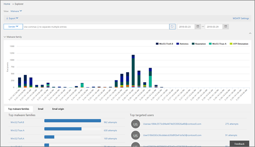

# 威脅調查及回應Threat investigation and response

[!INCLUDE [Microsoft 365 Defender rebranding](../includes/microsoft-defender-for-office.md)]

**適用於****Applies To**
- [適用於 Office 365 的 Microsoft Defender 方案 2Microsoft Defender for Office 365 plan 2](defender-for-office-365.md)

[Microsoft Defender 中的](defender-for-office-365.md)威脅調查和回應功能 Office 365 協助安全性分析程式和系統管理員以下列方式保護組織的企業使用者 Microsoft 365：Threat investigation and response capabilities in [Microsoft Defender for Office 365](defender-for-office-365.md) help security analysts and administrators protect their organization's Microsoft 365 for business users by:

- 讓您輕鬆識別、監視和瞭解 cyberattacksMaking it easy to identify, monitor, and understand cyberattacks
- 協助快速處理 Exchange Online、SharePoint 線上、商務用 OneDrive 和 Microsoft Teams 的威脅Helping to quickly address threats in Exchange Online, SharePoint Online, OneDrive for Business and Microsoft Teams
- 提供真知灼見和知識以協助安全性作業，以防止 cyberattacks 對其組織Providing insights and knowledge to help security operations prevent cyberattacks against their organization
- 針對重要的電子郵件威脅[，採用 Office 365 的自動化調查和回應](automated-investigation-response-office.md)Employing [automated investigation and response in Office 365](automated-investigation-response-office.md) for critical email-based threats

威脅調查和回應功能可讓您深入瞭解安全性 & 規範中心提供的威脅和相關回應動作。Threat investigation and response capabilities provide insights into threats and related response actions that are available in the Security & Compliance Center. 這些洞察力可協助貴組織的安全小組保護使用者免受電子郵件或檔案型的攻擊。These insights can help your organization's security team protect users from email- or file-based attacks. 這些功能可協助監控信號，並從多個來源收集資料，例如使用者活動、驗證、電子郵件、受損的電腦及安全性事件。The capabilities help monitor signals and gather data from multiple sources, such as user activity, authentication, email, compromised PCs, and security incidents. 業務決策者和您的安全作業小組可以使用此資訊來瞭解及回應組織的威脅，並保護您的智慧財產權。Business decision makers and your security operations team can use this information to understand and respond to threats against your organization and protect your intellectual property.

## 熟悉威脅調查和回應工具Get acquainted with threat investigation and response tools

安全性 & 規範中心的威脅調查和回應功能，做為一組工具和回應工作流程，包括下列專案：Threat investigation and response capabilities surface in the Security & Compliance Center, as a set of tools and response workflows, including the following:

- [威脅儀表板Threat dashboard](#threat-dashboard)
- [總管Explorer](#threat-explorer)
- [事件Incidents](#incidents)
- [攻擊模擬器Attack Simulator](#attack-simulator)
- [自動調查及回應Automated investigation and response](automated-investigation-response-office.md)

### 威脅儀表板Threat dashboard

使用 [威脅儀表板] (這也稱為[安全性儀表板](security-dashboard.md)) 以快速查看已解決的威脅，以及向業務決策者報告 Microsoft 365 服務如何保護您的企業的視覺方式。Use the Threat dashboard (this is also referred to as the [Security dashboard](security-dashboard.md)) to quickly see what threats have been addressed, and as a visual way to report to business decision makers how Microsoft 365 services are securing your business.

若要查看和使用此儀表板，請在安全性 & 合規性中心，移至 [ **威脅管理**] \> **儀表板**。To view and use this dashboard, in the Security & Compliance Center, go to **Threat management** \> **Dashboard**.

### 威脅總管Threat Explorer

使用 [威脅瀏覽器 (和即時偵測) ](threat-explorer.md) 來分析威脅、查看一段時間的攻擊量，以及依威脅系列、攻擊者基礎結構等來分析資料。Use [Threat Explorer (and real-time detections)](threat-explorer.md) to analyze threats, see the volume of attacks over time, and analyze data by threat families, attacker infrastructure, and more. 威脅瀏覽器 (也稱為 Explorer) 是任何安全分析員調查工作流程的開始位置。Threat Explorer (also referred to as Explorer) is the starting place for any security analyst's investigation workflow.

若要查看和使用此報告，請在安全性 & 規範中心內，移至 [ **威脅管理** \> **瀏覽器**]。To view and use this report, in the Security & Compliance Center, go to **Threat management** \> **Explorer**.

### 事件Incidents

使用事件清單 (這也稱為「調查」) ，以查看航班安全性事件的清單。Use the Incidents list (this is also called Investigations) to see a list of in flight security incidents. 事件用於追蹤可疑的電子郵件訊息，以及進行進一步調查和修正等威脅。Incidents are used to track threats such as suspicious email messages, and to conduct further investigation and remediation.

若要查看組織目前的事件清單，請在安全性 & 合規性中心，移至 **威脅管理** \> **回顧** \> **事件**。To view the list of current incidents for your organization, in the Security & Compliance Center, go to **Threat management** \> **Review** \> **Incidents**.

![在 [安全性 & 規範中心] 中，選擇 [威脅管理 \> 檢查]](../../media/e0f46454-fa38-40f0-a120-b595614d1d22.png)

### 攻擊模擬器Attack Simulator

使用攻擊模擬器，在您的組織中設定及執行實際的 cyberattacks，並在實際 cyberattack 影響您的公司之前識別有漏洞的人員。Use Attack Simulator to set up and run realistic cyberattacks in your organization, and identify vulnerable people before a real cyberattack affects your business. 若要深入瞭解，請參閱[Office 365 中的攻擊模擬器](attack-simulator.md)。To learn more, see [Attack Simulator in Office 365](attack-simulator.md).

### 自動調查及回應Automated investigation and response

使用自動調查和回應 (AIR) 功能，以儲存組織中威脅帶來的時間與精力，以關聯內容、裝置和人員。Use automated investigation and response (AIR) capabilities to save time and effort correlating content, devices, and people at risk from threats in your organization. 每當觸發特定警示時，或是當您的安全性作業小組開始時，就可以開始空氣處理常式。AIR processes can begin whenever certain alerts are triggered, or when started by your security operations team. 若要深入瞭解，請參閱[Office 365 中的自動化調查和回應](automated-investigation-response-office.md)。To learn more, see [automated investigation and response in Office 365](automated-investigation-response-office.md).

## 威脅智慧小元件Threat intelligence widgets

在 Office 365 方案2之 Microsoft Defender 的一部分中，安全性分析師可以查看已知威脅的詳細資料。As part of the Microsoft Defender for Office 365 Plan 2 offering, security analysts can review details about a known threat. 這有助於判斷是否有其他預防措施/步驟可讓使用者保持安全。This is useful to determine whether there are additional preventative measures/steps that can be taken to keep users safe.

## 如何取得這些功能？How do we get these capabilities?

Microsoft 365 威脅調查和回應功能會包含在適用于 Office 365 方案2的 Microsoft Defender 中，其包含在 Enterprise E5 或特定訂閱的附加元件中。Microsoft 365 threat investigation and response capabilities are included in Microsoft Defender for Office 365 Plan 2, which is included in Enterprise E5 or as an add-on to certain subscriptions. 若要深入瞭解，請參閱[Office 365 方案1和方案2的 Defender](defender-for-office-365.md#microsoft-defender-for-office-365-plan-1-and-plan-2)。To learn more, see [Defender for Office 365 Plan 1 and Plan 2](defender-for-office-365.md#microsoft-defender-for-office-365-plan-1-and-plan-2).

## 必要角色和權限Required roles and permissions

適用于 Office 365 的 Microsoft Defender 使用以角色為基礎的存取控制。Microsoft Defender for Office 365 uses role-based access control. 許可權是透過 Azure Active Directory、Microsoft 365 系統管理中心或安全性 & 規範中心的特定角色指派。Permissions are assigned through certain roles in Azure Active Directory, the Microsoft 365 admin center, or the Security & Compliance Center.

> [!TIP]
> 雖然在安全性 & 合規性中心可以指派某些角色（如安全性管理員），但改為使用 Microsoft 365 系統管理中心或 Azure Active Directory。Although some roles, such as Security Administrator, can be assigned in the Security & Compliance Center, consider using either the Microsoft 365 admin center or Azure Active Directory instead. 如需角色、角色群組和許可權的相關資訊，請參閱下列資源：For information about roles, role groups, and permissions, see the following resources:
>
> - [安全性與合規性中心的權限Permissions in the Security & Compliance Center](permissions-in-the-security-and-compliance-center.md)
>
> - [Azure Active Directory 中的系統管理員角色權限Administrator role permissions in Azure Active Directory](/azure/active-directory/users-groups-roles/directory-assign-admin-roles)

****

|活動Activity|角色及權限Roles and permissions|
|---|---|
|使用威脅儀表板 (或新的 [安全性儀表板](security-dashboard.md)) Use the Threat dashboard (or the new [Security dashboard](security-dashboard.md)) 
 查看最近或目前威脅的相關資訊View information about recent or current threats|下列其中之一：One of the following: <ul><li>**全域管理員****Global Administrator**</li><li>**安全性系統管理員****Security Administrator**</li><li>**安全性讀取者****Security Reader**</li></ul> 
 您可以在 Azure Active Directory (<https://portal.azure.com>) 或 Microsoft 365 系統管理中心 () 中指派這些角色 <https://admin.microsoft.com> 。These roles can be assigned in either Azure Active Directory (<https://portal.azure.com>) or the Microsoft 365 admin center (<https://admin.microsoft.com>).|
|使用 [威脅瀏覽器 (和即時偵測) ](threat-explorer.md) 來分析威脅Use [Threat Explorer (and real-time detections)](threat-explorer.md) to analyze threats|下列其中之一：One of the following: <ul><li>**全域管理員****Global Administrator**</li><li>**安全性系統管理員****Security Administrator**</li><li>**安全性讀取者****Security Reader**</li></ul> 
 您可以在 Azure Active Directory (<https://portal.azure.com>) 或 Microsoft 365 系統管理中心 () 中指派這些角色 <https://admin.microsoft.com> 。These roles can be assigned in either Azure Active Directory (<https://portal.azure.com>) or the Microsoft 365 admin center (<https://admin.microsoft.com>).|
|View 事件 (也稱為「調查」) View Incidents (also referred to as Investigations) 
 將電子郵件新增至事件Add email messages to an incident|下列其中之一：One of the following: <ul><li>**全域管理員****Global Administrator**</li><li>**安全性系統管理員****Security Administrator**</li><li>**安全性讀取者****Security Reader**</li></ul> 
 您可以在 Azure Active Directory (<https://portal.azure.com>) 或 Microsoft 365 系統管理中心 () 中指派這些角色 <https://admin.microsoft.com> 。These roles can be assigned in either Azure Active Directory (<https://portal.azure.com>) or the Microsoft 365 admin center (<https://admin.microsoft.com>).|
|觸發事件中的電子郵件動作Trigger email actions in an incident 
 尋找和刪除可疑的電子郵件Find and delete suspicious email messages|下列其中之一：One of the following: <ul><li>**全域管理員****Global Administrator**</li><li>**安全性管理員** 和 **搜尋及清除** 角色**Security Administrator** plus the **Search and Purge** role</li></ul> 
 **全域管理員** 及 **安全性管理員** 角色可在 Azure Active Directory (<https://portal.azure.com>) 或 Microsoft 365 系統管理中心 () 中指派 <https://admin.microsoft.com> 。The **Global Administrator** and **Security Administrator** roles can be assigned in either Azure Active Directory (<https://portal.azure.com>) or the Microsoft 365 admin center (<https://admin.microsoft.com>). 
 您必須在安全性 & 規範中心 () 中指派 **搜尋和清除** 角色 <https://protection.office.com> 。The **Search and Purge** role must be assigned in the Security & Compliance Center (<https://protection.office.com>).|
|整合 microsoft defender for Office 365 Plan 2 搭配 microsoft defender for EndpointIntegrate Microsoft Defender for Office 365 Plan 2 with Microsoft Defender for Endpoint  
 整合 Microsoft Defender for Office 365 Plan 2 搭配 SIEM serverIntegrate Microsoft Defender for Office 365 Plan 2 with a SIEM server|在 Azure Active Directory (中指派 **全域管理員** 或 **安全性管理員** 角色， <https://portal.azure.com>) 或 Microsoft 365 系統管理中心 (<https://admin.microsoft.com>) 。Either the **Global Administrator** or the **Security Administrator** role assigned in either Azure Active Directory (<https://portal.azure.com>) or the Microsoft 365 admin center (<https://admin.microsoft.com>). 
 --- **加** --- --- **plus** --- 
 在其他應用程式中指派的適當角色 (例如[Microsoft Defender 資訊安全中心](/windows/security/threat-protection/microsoft-defender-atp/user-roles)或您的 SIEM server) 。An appropriate role assigned in additional applications (such as [Microsoft Defender Security Center](/windows/security/threat-protection/microsoft-defender-atp/user-roles) or your SIEM server).|
|

## 後續步驟Next steps

- [深入瞭解威脅追蹤程式-新增及值得注意的事項Learn about Threat Trackers - New and Noteworthy](threat-trackers.md)

- [尋找並調查已傳遞 (Office 365 威脅調查和回應的惡意電子郵件) Find and investigate malicious email that was delivered (Office 365 Threat Investigation and Response)](investigate-malicious-email-that-was-delivered.md)

- [整合 Office 365 威脅調查，並使用 Microsoft Defender for Endpoint 進行回應Integrate Office 365 Threat Investigation and Response with Microsoft Defender for Endpoint](integrate-office-365-ti-with-mde.md)

- [深入瞭解攻擊模擬器Learn about Attack Simulator](attack-simulator.md)