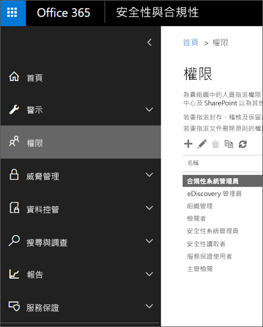
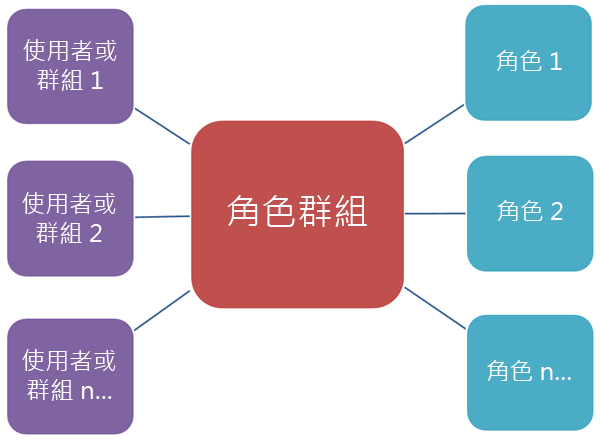

# Office 365 安全性與合規性中心中的權限Permissions page in the Office 365 Security & Compliance Center

Office 365 安全性與合規性中心可讓您將權限授與執行規範工作 (例如裝置管理、資料外洩防護、電子文件探索、保留等) 的人員。The Office 365 Security & Compliance Center lets you grant permissions to people who perform compliance tasks like device management, data loss prevention, eDiscovery, retention, and so on. 這些人員只能執行您已明確授與權限的工作。These people can perform only the tasks that you explicitly grant them access to. 若要存取安全性與合規性中心，使用者必須是 Office 365 全域系統管理員，或是一或多個安全性與合規性中心角色群組的成員。To access the Security & Compliance Center, users need to be an Office 365 global administrator or a member of one or more Security & Compliance Center role groups.

安全性與合規性中心權限的依據為角色型存取控制 (RBAC) 權限模型。Permissions in the Security & Compliance Center are based on the Role Based Access Control (RBAC) permissions model. 這個權限模型與 Exchange 所使用的權限模型相同，因此如果您熟悉 Exchange，就會了解安全性與合規性中心授與權限的方式與 Exchange 非常相似。This is the same permissions model that's used by Exchange, so if you're familiar with Exchange, granting permissions in the Security & Compliance Center will be very similar. 不過，Exchange 角色群組和安全性與合規性中心角色群組並未共用成員資格或權限，It's important to remember, however, that Exchange role groups and Security & Compliance Center role groups don't share membership or permissions. 因此雖然兩者都有組織管理角色群組，但這兩個組織管理角色群組其實並不相同。While both have an Organization Management role group, they aren't the same. 它們所授與的權限和角色群組成員都所有差異。The permissions they grant, and the members of the role groups, are different. 以下是安全性與合規性中心角色群組的清單。There's a list of Security & Compliance Center role groups below.

## 成員、角色和角色群組的關係Relationship of members, roles, and role groups

**角色**會授與執行一組工作的權限，例如，專案管理角色可讓人員使用電子文件探索案例。A **role** grants permissions to do a set of tasks; for example, the Case Management role lets people work with eDiscovery cases.

**角色群組**是可讓人員在整個安全性與合規性中心內執行其工作的一組角色，例如，「合規性系統管理員」角色群組包含專案管理、內容搜尋及組織組態 (以及其他項目) 的角色，因為某人的規範管理員需要那些工作權限，才能執行工作。A **role group** is a set of roles that lets people perform their job across the Security & Compliance Center; for example, the Compliance Administrator role group includes the roles for Case Management, Content Search, and Organization Configuration (plus others) because someone who's a compliance admin will need the permissions for those tasks to do their job.

安全性與合規性中心的預設角色群組包含必須指派給人員的最常見工作和功能。The Security & Compliance Center includes default role groups for the most common tasks and functions that you'll need to assign people to. 建議您只要將個別使用者新增為預設角色群組的**成員**。We recommend simply adding individual users as **members** to the default role groups.

您可以編輯或刪除現有的角色群組，但我們不建議您這麼做。You can edit or delete the existing role groups, but we don't recommend this. 除了編輯預設角色群組之外，您還可以複製、修改預設角色群組，然後將其儲存為不同名稱的角色群組。Instead of editing a default role group, you can copy it, modify it, and then save it with a different name.

## 在安全性與合規性中心使用功能的必要權限Permissions needed to use features in the Security & Compliance Center

下表列出安全性與合規性中心可用的預設角色群組，以及預設指派給角色群組的角色。The following table lists the default role groups that are available in the Security & Compliance Center, and the roles that are assigned to the role groups by default. 若要將執行規範工作的權限授與使用者，請將使用者新增至適當的安全性與合規性中心角色群組。To grant permissions to a user to perform a compliance task, add them to the appropriate Security & Compliance Center role group.

安全性與合規性中心的權限管理只能將安全性與合規性中心本身的規範功能存取權授與使用者。Managing permissions in the Security & Compliance Center only gives users access to the compliance features that are available within the Security & Compliance Center itself. 如果您想授與安全性與合規性中心以外的其他合規性功能權限，例如 Exchange 郵件流程規則 (也稱為傳輸規則)，則必須使用 Exchange 系統管理中心。If you want to grant permissions to other compliance features that aren't in the Security & Compliance Center, such as Exchange mail flow rules (also known as transport rules), you need to use the Exchange admin center.

若要了解如何授與安全性與合規性中心的存取權，請參閱[將 Office 365 合規性系統管理中心的存取權授與使用者](grant-access-to-the-security-and-compliance-center.md)。To see how to grant access to the Security & Compliance Center, check out [Give users access to Office 365 Compliance admin center](grant-access-to-the-security-and-compliance-center.md).

|**角色群組****Role group**|**描述****Description**|**已指派預設角色****Default roles assigned**|
|:-----|:-----|:-----|
|**合規性系統管理員**1**Compliance Administrator**1|成員可以管理裝置管理、資料外洩防護、報告和保留的設定。Members can manage settings for device management, data loss prevention, reports, and preservation.|案例管理Case Management    合規性系統管理員Compliance administrator    合規性搜尋Compliance Search    DLP 合規性管理DLP Compliance Management    裝置管理Device Management    處置管理Disposition Management    保留Hold    IB 合規性管理IB Compliance Management    管理警示Manage Alerts    組織組態Organization configuration    RecordManagementRecordManagement    保留管理Retention Management role    僅限檢視稽核記錄View-Only Audit Logs role    僅限檢視保留管理View-Only Retention Management    僅限檢視 DLP 合規性管理View-Only DLP Compliance Management    僅限檢視裝置管理View-Only Device Management    僅限檢視 IB 合規性管理View-Only IB Compliance Management    僅限檢視管理警示View-Only Manage Alerts    僅限檢視收件者View-Only Recipients    僅限檢視記錄管理View-Only Record Management|
|**合規性資料系統管理員****Compliance data administrator**|成員可以管理裝置管理、資料保護、資料外洩防護、報告和保留的設定。Members can manage settings for device management, data protection, data loss prevention, reports, and preservation.|合規性系統管理員Compliance administrator    合規性搜尋Compliance Search    DLP 合規性管理DLP Compliance Management    裝置管理Device Management    處置管理Disposition Management    IB 合規性管理IB Compliance Management    管理警示Manage Alerts    組織組態Organization configuration    RecordManagementRecordManagement    保留管理Retention Management role    敏感度標籤系統管理員Sensitivity Label Administrator    僅限檢視稽核記錄View-Only Audit Logs role    僅限檢視 DLP 合規性管理View-Only DLP Compliance Management    僅限檢視裝置管理View-Only Device Management    僅限檢視 IB 合規性管理View-Only IB Compliance Management    僅限檢視管理警示View-Only Manage Alerts    僅限檢視收件者View-Only Recipients    僅限檢視記錄管理View-Only Record Management    僅限檢視保留管理View-Only Retention Management|
|**資料調查人員****Data Investigator**|成員可以在信箱、SharePoint 網站和 OneDrive 帳戶上執行搜尋。Members can perform searches on mailboxes, SharePoint sites, and OneDrive accounts.|通訊Communication    合規性搜尋Compliance Search    監管人Custodian    資料調查管理Data Investigation Management    匯出Export   預覽Preview    RMS 解密RMS Decrypt    檢閱Review   搜尋和清除Search And Purge|
|**電子文件探索管理員****eDiscovery Manager**|這類成員可以執行搜尋及暫時停用信箱、SharePoint Online 網站和商務用 OneDrive 位置。Members can perform searches and place holds on mailboxes, SharePoint Online sites, and OneDrive for Business locations. 這類成員還可以建立及管理電子文件探索案例、新增及移除案例成員、建立及編輯與案例關聯的內容搜尋，以及存取 Office 365 進階電子文件探索中的案例資料。Members can also create and manage eDiscovery cases, add and remove members to a case, create and edit Content Searches associated with a case, and access case data in Office 365 Advanced eDiscovery.    電子文件探索系統管理員是獲派額外權限的電子文件探索管理員角色群組成員。An eDiscovery Administrator is also member of the eDiscovery Manager role group, but has been assigned additional eDiscovery privileges. 除了電子文件探索管理員可以執行的工作以外，電子文件探索系統管理員可以：In addition to the tasks that an eDiscovery Manager can perform, an eDiscovery Administrator can:  • 檢視組織中的所有電子文件探索案例。• View all eDiscovery cases in the organization.  • 在自行新增為案例的成員之後管理任何電子文件探索案例。Manage any eDiscovery case  in the organization after they add themself as a member of the case.    電子文件探索管理員與電子文件探索系統管理員之間的主要差異在於，電子文件探索系統管理員可以在安全性與合規性中心，存取列在**電子文件探索案例**頁面上的所有案例。The primary difference between an eDiscovery Manager and an eDiscovery Administrator is that an eDiscovery Administrator can access all cases that are listed on the **eDiscovery cases** page in the Security & Compliance Center. 電子文件探索管理員只能存取他們所建立的案例，或是他們所屬的案例。An eDiscovery manager can only access the cases they created or cases they are a member of. 如需將使用者設為電子文件探索系統管理員的詳細資訊，請參閱[在 Office 365 安全性與合規性中心指派電子文件探索權限](../../compliance/assign-ediscovery-permissions.md)。For more information about making a user an eDiscovery Administrator, see [Assign eDiscovery permissions in the Office 365 Security & Compliance Center](../../compliance/assign-ediscovery-permissions.md).|案例管理Case Management    通訊Communication    合規性搜尋Compliance Search    監管人Custodian    匯出Export    保留Hold    預覽Preview    RMS 解密RMS Decrypt    檢閱Review|
|**郵件流程系統管理員****MailFlow Administrator**|成員可以在安全性與合規性中心監視和檢視郵件流程深入解析和報告。Members can monitor and view mail flow insights and reports in the Security & Compliance Center. 全域管理員可以在此群組中新增一般使用者，但是如果使用者不是 Exchange 系統管理員群組的成員，使用者將無法存取 Exchange 系統管理員相關的工作。Global admins can add ordinary users to this group, but, if the user isn't a member of the Exchange Admin group, the user will not have access to Exchange admin-related tasks.|僅限檢視收件者View-Only Recipients|
|**組織管理**1**Organization Management**1|成員可以控制在安全性與合規性中心中存取功能的權限，也能管理裝置管理、資料遺失防護、報告和保留的設定。Members can control permissions for accessing features in the Security & Compliance Center, and also manage settings for device management, data loss prevention, reports, and preservation.    請注意，為了讓不是全域系統管理員的使用者能夠查看由 MDM 管理的 Office 365 裝置，並在這些裝置上執行動作 (例如從 MDM 停用 Office 365 裝置)，使用者必須是 Exchange 系統管理員。Note that in order for a user who is not a global administrator to see the list of devices managed by MDM for Office 365 and perform actions on these devices, such as retiring a device from MDM for Office 365, the user must be an Exchange administrator.    Office 365 全域管理員會自動新增為這個角色群組的成員。Office 365 global admins are automatically added as members of this role group.|稽核記錄Audit Logs    案例管理Case Management    合規性系統管理員Compliance administrator    合規性搜尋Compliance Search    DLP 合規性管理DLP Compliance Management    裝置管理Device Management    處置管理Disposition Management    保留Hold    IB 合規性管理IB Compliance Management    管理警示Manage Alerts    組織組態Organization configuration    RecordManagementRecordManagement    保留管理Retention Management role    角色管理Role Management role    搜尋和清除Search And Purge    安全性系統管理員Security Administrator    安全性讀取者Security reader    敏感度標籤系統管理員Sensitivity Label Administrator    服務保證檢視Service Assurance View    僅限檢視稽核記錄View-Only Audit Logs role    僅限檢視 DLP 合規性管理View-Only DLP Compliance Management    僅限檢視裝置管理View-Only Device Management    僅限檢視 IB 合規性管理View-Only IB Compliance Management    僅限檢視管理警示View-Only Manage Alerts    僅限檢視收件者View-Only Recipients    僅限檢視記錄管理View-Only Record Management    僅限檢視保留管理View-Only Retention Management|
|**記錄管理****Records Management**|成員可以管理和處置記錄內容。Members can manage and dispose record content.|稽核記錄Audit Logs    RecordManagementRecordManagement    保留管理Retention Management role|
|**檢閱者****Reviewer**|這類成員只能檢視安全性與合規性中心電子文件探索案例頁面上的案例清單，Members can only view the list of cases on the eDiscovery cases page in the Security & Compliance Center. 無法建立、開啟或管理電子文件探索案例。They can't create, open, or manage an eDiscovery case. 設定這個角色群組的主要目的是要讓成員檢視及存取進階電子文件探索中的案例資料。The primary purpose of this role group is to allow members to view and access case data in Advanced eDiscovery.    這個角色群組具有最嚴格的電子文件探索相關權限。This role group has the most restrictive eDiscovery-related permissions.|檢閱Review|
|**安全性系統管理員****Security Administrator**|這個角色群組的成員可能包括跨服務系統管理員，以及外部的合作夥伴群組和 Microsoft 支援服務。Members of this role group may include cross-service administrators, as well as external partner groups and Microsoft Support. 根據預設，這個群組中不會指派任何角色。By default, this group may not be assigned any roles. 不過，它是 Azure Active Directory 中安全性系統管理員角色的成員，且會繼承該角色的能力。However, it will be a member of the Security Administrators role in Azure Active Directory and will inherit the capabilities of that role. 若要集中管理權限，請在 Azure Active Directory 系統管理中心變更此角色，如需詳細資訊，請參閱 [Azure Active Directory 中的系統管理員角色權限](https://docs.microsoft.com/azure/active-directory/users-groups-roles/directory-assign-admin-roles) (部分機器翻譯)。To manage permissions centrally, make changes to this role in the Azure Active Directory admin center - for more information, see [Administrator role permissions in Azure Active Directory](https://docs.microsoft.com/azure/active-directory/users-groups-roles/directory-assign-admin-roles).    如果您在安全性與合規性中心編輯這個角色群組，這些變更只會套用到安全性與合規性中心，而不會套用到任何其他服務，而在 Azure Active Directory 系統管理中心所做的變更會影響所有服務。If you edit this role group in the Security & Compliance Center, those changes apply only to the Security & Compliance Center and not any other services, whereas changes made in the Azure Active Directory admin center affect all services.    安全性讀取者角色的所有唯讀權限，再加上相同服務的其他數種系統管理權限：Azure Information Protection、身分識別防護中心、特殊權限身分識別管理、監控 Office 365 服務健康情況，以及 Office 365 安全性與合規性中心。All of the read-only permissions of the Security reader role, plus a number of additional administrative permissions for the same services: Azure Information Protection, Identity Protection Center, Privileged Identity Management, Monitor Office 365 Service Health, and Office 365 Security & Compliance Center.|稽核記錄Audit Logs    DLP 合規性管理DLP Compliance Management    裝置管理Device Management    IB 合規性管理IB Compliance Management    管理警示Manage Alerts    安全性系統管理員Security Administrator    敏感度標籤系統管理員Sensitivity Label Administrator    僅限檢視稽核記錄View-Only Audit Logs role    僅限檢視 DLP 合規性管理View-Only DLP Compliance Management    僅限檢視裝置管理View-Only Device Management    僅限檢視 IB 合規性管理View-Only IB Compliance Management    僅限檢視管理警示View-Only Manage Alerts|
|**安全性操作員****Security operator**|成員可以管理安全性警示，也可以檢視安全性功能的報告和設定。Members can manage security alerts, and also view reports and settings of security features.|合規性搜尋Compliance Search    管理警示Manage Alerts    安全性讀取者Security reader    僅限檢視稽核記錄View-Only Audit Logs role    僅限檢視 DLP 合規性管理View-Only DLP Compliance Management    僅限檢視裝置管理View-Only Device Management    僅限檢視 IB 合規性管理View-Only IB Compliance Management    僅限檢視管理警示View-Only Manage Alerts|
|**安全性讀取者****Security reader**|這類成員擁有身分識別防護中心、特殊權限身分識別管理、監控 Office 365 服務健康情況，以及 Office 365 安全性與合規性中心數種安全性功能的唯讀存取權。Members have read-only access to a number of security features of Identity Protection Center, Privileged Identity Management, Monitor Office 365 Service Health, and Office 365 Security & Compliance Center.    這個角色群組中的成員資格能跨服務同步，且為集中管理的。Membership in this role group is synchronized across services and managed centrally. 這個角色群組的成員可能包括跨服務系統管理員，以及外部的合作夥伴群組和 Microsoft 支援服務。Members of this role group may include cross-service administrators, as well as external partner groups and Microsoft Support. 根據預設，這個群組中不會指派任何角色。By default, this group may not be assigned any roles. 不過，它是 Azure Active Directory 中安全性讀取者角色的成員，且會繼承該角色的能力。However, it will be a member of the Security Readers role in Azure Active Directory and will inherit the capabilities of that role. 若要集中管理權限，請在 Azure Active Directory 系統管理中心變更此角色，如需詳細資訊，請參閱 [Azure Active Directory 中的系統管理員角色權限](https://docs.microsoft.com/azure/active-directory/users-groups-roles/directory-assign-admin-roles) (部分機器翻譯)。To manage permissions centrally, make changes to this role in the Azure Active Directory admin center - for more information, see [Administrator role permissions in Azure Active Directory](https://docs.microsoft.com/azure/active-directory/users-groups-roles/directory-assign-admin-roles). 如果您在安全性與合規性中心編輯這個角色群組，這些變更只會套用到安全性與合規性中心，而不會套用到任何其他服務，而在 Azure Active Directory 系統管理中心所做的變更會影響所有服務If you edit this role group in the Security & Compliance Center, those changes apply only to the Security & Compliance Center and not any other services, whereas changes made in the Azure Active Directory admin center affect all services|安全性讀取者Security reader    僅限檢視 DLP 合規性管理View-Only DLP Compliance Management    僅限檢視裝置管理View-Only Device Management    僅限檢視 IB 合規性管理View-Only IB Compliance Management    僅限檢視管理警示View-Only Manage Alerts|
|**服務保證使用者****Service Assurance User**|這類成員可存取 Office 365 安全性與合規性中心中的 [服務保證] 區段。Members can access the Service assurance section in the Office 365 Security & Compliance Center. 服務保證會針對儲存在 Office 365 中的客戶資料，提供描述 Microsoft 安全性做法的報告和文件。Service assurance provides reports and documents that describe Microsoft's security practices for customer data that's stored in Office 365. 此外，這個區段也會提供 Office 365 的獨立第三方稽核報告。It also provides independent third-party audit reports on Office 365. 如需詳細資訊，請參閱 [Office 365 安全性與合規性中心的服務保證](https://docs.microsoft.com/microsoft-365/compliance/service-assurance) (部分機器翻譯)。[Service assurance in the Office 365 Security & Compliance Center](https://docs.microsoft.com/microsoft-365/compliance/service-assurance)|服務保證檢視Service Assurance View|
|**主管檢閱****Supervisory Review**|成員可以建立和管理原則，該原則定義了組織中要被檢視的是那些通訊。Members can create and manage the policies that define which communications are subject to review in an organization. 如需詳細資訊，請參閱[設定貴組織的通訊合規性原則](../../compliance/communication-compliance-configure.md)。For more information, see [Configure communication compliance policies for your organization](../../compliance/communication-compliance-configure.md).|主管檢閱系統管理員Supervisory Review Administrator|

> [!NOTE]
> 1這個角色群組不會對成員指派搜尋 Office 365 稽核記錄所需的權限，或使用任何可能包含 Exchange 資料的報告，例如 DLP 或 ATP 報告。1This role group doesn't assign members the permissions necessary to search the Office 365 audit log or to use any reports that might include Exchange data, such as the DLP or ATP reports. 若要搜尋稽核記錄或檢視所有報告，使用者必須在 Exchange Online 中獲指派權限。To search the audit log or to view all reports, a user has to be assigned permissions in Exchange Online. 這是因為用來搜尋稽核記錄的基礎 Cmdlet 是 Exchange Online Cmdlet。This is because the underlying cmdlet used to search the audit log is an Exchange Online cmdlet. Office 365 全域管理員可以搜尋稽核記錄並檢視所有報告，因為他們會自動新增為 Exchange Online 中組織管理角色群組的成員。Office 365 global admins can search the audit log and view all reports because they're automatically added as members of the Organization Management role group in Exchange Online. 如需詳細資訊，請參閱[在 Office 365 安全性與合規性中心搜尋稽核記錄](https://docs.microsoft.com/microsoft-365/compliance/search-the-audit-log-in-security-and-compliance)。For more information see Search the audit log in the Office 365 Security  Compliance Center

## 安全性與合規性中心的角色Permissions in the Security & Compliance Center

下表列出預設指派給他們的可用角色以及角色群組。The following table shows the roles that enable the creation of security principals in Exchange and the management role groups they're assigned to by default.

請注意，下列角色預設不會指派給組織管理角色群組：Note that the following roles aren't assigned to the Organization Management role group by default:

- 通訊Communication

- 監管人Custodian

- 資料調查管理Data Investigation Management

- 匯出Export

- 預覽Preview

- 檢閱Review

- RMS 解密RMS Decrypt

- 主管檢閱系統管理員Supervisory Review Administrator

|**Role****Role**|**描述****Description**|**預設角色群組指派**\*\*\*\* Default management role assignments|
|:-----|:-----|:-----|
|**稽核記錄****Audit logs**|開啟並設定 Office 365 組織的稽核、檢視組織的稽核報告，然後將這些報告匯出至檔案。Turn on and configure auditing for the Office 365 organization, view the organization's audit reports, and then export these reports to a file.|組織管理Organization Management    記錄管理Records Management    安全性系統管理員Security Administrator|
|**案例管理****Case Management**|建立、編輯、刪除及控制電子文件探索案例的存取權。Create, edit, delete, and control access to eDiscovery cases.|合規性系統管理員Compliance administrator    eDiscovery 管理員eDiscovery Manager    組織管理Organization Management|
|**資料調查人員****Data Investigator**|在信箱、SharePoint Online 網站和商務用 OneDrive 位置上執行搜尋。Perform searches on mailboxes, SharePoint Online sites, and OneDrive for Business locations.|匯出Export    RMS 解密RMS Decrypt    監管人Custodian    通訊Communication    檢閱Review    預覽Preview    合規性搜尋Compliance Search    資料調查管理Data Investigation Management|
|**通訊****Communication**|管理所有與監管人之間以進階電子文件探索案例識別的通訊。Manage all communications with the custodians identified in an Advanced eDiscovery case.  建立保留通知、保留提醒，以及呈報至管理。Create hold notifications, hold reminders, and escalations to management. 追蹤保留通知的監管人認可，並管理每位監管人所使用的監管人入口網站存取權，以追蹤他們在其中識別為監管人的案例通訊。Track custodian acknowledgement of hold notifications and manage access to the custodian portal that is used by each custodian in a case to track communications for the cases where they were identified as a custodian.|電子文件探索管理員eDiscovery Manager|
|**合規性系統管理員****Compliance administrator**|檢視及編輯合規性功能的設定和報告。View and edit settings and reports for compliance features.|合規性系統管理員Compliance administrator    合規性資料系統管理員Compliance data administrator    組織管理Organization Management|
|**合規性搜尋****Compliance Search**|跨信箱執行搜尋，並取得結果的估計。Perform searches across mailboxes and get an estimate of the results.|合規性系統管理員Compliance administrator    合規性資料系統管理員Compliance data administrator    電子文件探索管理員eDiscovery Manager    組織管理Organization Management    安全性操作員Security operator|
|**監管人****Custodian**|識別和管理進階電子文件探索案例的監管人，並使用 Azure Active Directory 和其他來源的資訊，尋找與監管人相關聯的資料來源。Identify and manage custodians for Advanced eDiscovery cases and use the information from Azure Active Directory and other sources to find data sources associated with custodians. 在案例中將其他資料來源 (例如信箱、SharePoint 網站及 Teams) 與監管人建立關聯。Associate other data sources such as mailboxes, SharePoint sites, and Teams with custodians in a case.  在與監管人相關聯的資料來源進行法務保存措施，以便在案例的內容中保留內容。Place a legal hold on the data sources associated with custodians to preserve content in the context of a case.|電子文件探索管理員eDiscovery Manager|
|**資料調查管理****Data Investigation Management**|建立、編輯、刪除及控制資料調查的存取權。Create, edit, delete, and control access to data investigations.|資料調查人員Data Investigator|
|**裝置管理****Device Management**|檢視及編輯裝置管理功能的設定和報告。View and edit settings and reports for device management features.|合規性系統管理員Compliance administrator    合規性資料系統管理員Compliance data administrator    組織管理Organization Management    安全性系統管理員Security Administrator|
|**處置管理****Disposition Management**|在安全性與合規性中心中存取手動處置的權限。Control permissions for accessing Manual Disposition in the Security & Compliance Center.|合規性系統管理員Compliance administrator    合規性資料系統管理員Compliance data administrator    組織管理Organization Management|
|**DLP 合規性管理****DLP Compliance Management**|檢視及編輯資料外洩防護 (DLP) 原則的設定和報告。View and edit settings and reports for data loss prevention (DLP) policies.|合規性系統管理員Compliance administrator    合規性資料系統管理員Compliance data administrator    組織管理Organization Management    安全性系統管理員Security Administrator|
|**匯出****Export**|匯出從搜尋傳回的信箱和網站內容。Export mailbox and site content that's returned from searches.|電子文件探索管理員eDiscovery Manager|
|**保留****Hold**|保留信箱、網站和公用資料夾中的內容。Place content in mailboxes, sites, and public folders on hold. 保留時，內容複本會儲存在安全的位置。When on hold, a copy of the content is stored in a secure location. 內容擁有者仍然可以修改或刪除原始內容。Content owners will still be able to modify or delete the original content.|合規性系統管理員Compliance administrator    eDiscovery 管理員eDiscovery Manager    組織管理Organization Management|
|**IB 合規性管理****IB Compliance Management**|檢視、建立、移除、修改及測試資訊屏障原則。View, create, remove, modify, and test Information Barrier policies.|合規性系統管理員Compliance administrator    合規性資料系統管理員Compliance data administrator    組織管理Organization Management    安全性系統管理員Security Administrator|
|**管理警示****Manage alerts.**|檢視及編輯警示的設定和報告。View and edit settings and reports for alerts.|合規性系統管理員Compliance administrator    合規性資料系統管理員Compliance data administrator    組織管理Organization Management    安全性系統管理員Security Administrator    安全性操作員Security operator|
|**組織組態****Organization configuration**|針對 DLP、裝置及保留執行、檢視及匯出稽核報告和管理合規性原則。Run, view, and export audit reports and manage compliance policies for DLP, devices, and preservation.|合規性系統管理員Compliance administrator    合規性資料系統管理員Compliance data administrator    組織管理Organization Management|
|**預覽****Preview**|檢視從內容搜尋傳回的項目清單，並且從清單開啟每個項目以檢視其內容。View a list of items that are returned from content searches, and open each item from the list to view its contents.|電子文件探索管理員eDiscovery Manager|
|**RecordManagement****RecordManagement**|檢視及編輯記錄管理功能的設定和報告。View and edit the configuration and reports for the Record Management feature.|合規性系統管理員Compliance administrator    合規性資料系統管理員Compliance data administrator    組織管理Organization Management    記錄管理Records Management|
|**保留管理**\*\*\*\* Retention Management role|管理保留原則。Manage retention policies.|記錄管理Records Management    合規性系統管理員Compliance administrator    合規性資料系統管理員Compliance data administrator    組織管理Organization Management|
|**檢閱****Review**|使用 Office 365 進階電子文件探索來追蹤、標記、分析及測試指派給他們的文件。Use Office 365 Advanced eDiscovery to track, tag, analyze, and test documents that are assigned to them.|電子文件探索管理員eDiscovery Manager    檢閱者Reviewer|
|**RMS 解密****RMS Decrypt**|在匯出搜尋結果時解密受 RMS 保護的內容。Decrypt RMS-protected content when exporting search results.|電子文件探索管理員eDiscovery Manager|
|**角色管理****Role Management role**|管理角色群組成員資格，以及建立或刪除自訂角色群組。Manage role group membership and create or delete custom role groups.|組織管理Organization Management|
|**搜尋和清除****Search And Purge**|讓人員大量移除符合內容搜尋準則的資料。Lets people bulk-remove data that matches the criteria of a content search.|組織管理Organization Management|
|**安全性系統管理員****Security Administrator**|檢視及編輯安全性功能的設定和報告。View and edit the configuration and reports for Security features.|組織管理Organization Management    安全性系統管理員Security Administrator|
|**安全性讀取者****Security reader**|檢視安全性功能的設定和報告。View the configuration and reports for Security features.|組織管理Organization Management    安全性操作員Security operator    安全性讀取者Security reader|
|**敏感度標籤系統管理員****Sensitivity Label Administrator**|檢視、建立、修改及移除敏感度標籤。View, create, modify, and remove sensitivity labels.|合規性資料系統管理員Compliance data administrator    組織管理Organization Management    安全性系統管理員Security Administrator|
|**服務保證檢視****Service Assurance View**|從 [服務保證] 區段下載可用的文件。Download the available documents from the Service Assurance section. 內容包括針對使用 Office 365 功能來管理法規合規性與安全性風險的獨立稽核、合規性文件，以及信任相關指導方針。Content includes independent auditing, compliance documentation, and trust-related guidance for using Office 365 features to manage regulatory compliance and security risks.|服務保證使用者Service Assurance User    組織管理Organization Management|
|**主管檢閱系統管理員****Supervisory Review Administrator**|管理主管檢閱原則，包括要檢閱哪些通訊，以及誰可以執行檢閱。Manage supervisory review policies, including which communications to review and who should perform the review.|主管檢閱Supervisory Review|
|**僅限檢視稽核記錄****View-Only Audit Logs role**|檢視及匯出稽核報告。View and export audit reports. 由於這些報告可能包含敏感性資訊，因此您應該僅將此角色指派給明確需要檢視此資訊的人員。Because these reports might contain sensitive information, you should only assign this role to people with an explicit need to view this information.|合規性系統管理員Compliance administrator    合規性資料系統管理員Compliance data administrator    組織管理Organization Management    安全性系統管理員Security Administrator    安全性操作員Security operator|
|**僅限檢視裝置管理****View-Only Device Management**|檢視裝置管理功能的設定和報告。View the configuration and reports for the Device Management feature.|合規性系統管理員Compliance administrator    合規性資料系統管理員Compliance data administrator    組織管理Organization Management    安全性系統管理員Security Administrator    安全性操作員Security operator    安全性讀取者Security reader|
|**僅限檢視 DLP 合規性管理****View-Only DLP Compliance Management**|檢視資料外洩防護 (DLP) 原則的設定和報告。View the settings and reports for data loss prevention (DLP) policies.|合規性系統管理員Compliance administrator    合規性資料系統管理員Compliance data administrator    組織管理Organization Management    安全性系統管理員Security Administrator    安全性操作員Security operator    安全性讀取者Security reader|
|**僅限檢視 IB 合規性管理****View-Only IB Compliance Management**|檢視資訊屏障功能的設定和報告。View the configuration and reports for the Information Barriers feature.|合規性系統管理員Compliance administrator    合規性資料系統管理員Compliance data administrator    組織管理Organization Management    安全性系統管理員Security Administrator    安全性操作員Security operator    安全性讀取者Security reader|
|**僅限檢視管理警示****View-Only Manage Alerts**|檢視管理警示功能的設定和報告。View the configuration and reports for the Manage Alerts feature.|安全性系統管理員Security Administrator    安全性操作員Security operator    安全性讀取者Security reader    合規性系統管理員Compliance administrator    合規性資料系統管理員Compliance data administrator    組織管理Organization Management|
|**僅限檢視收件者****View-Only Recipients**|檢視使用者和群組的相關資訊。View information about users and groups.|郵件流程系統管理員MailFlow Administrator    合規性系統管理員Compliance administrator    合規性資料系統管理員Compliance data administrator    組織管理Organization Management|
|**僅限檢視記錄管理****View-Only Record Management**|檢視記錄管理功能的設定和報告。View the configuration and reports for the Record Management feature.|合規性系統管理員Compliance administrator    合規性資料系統管理員Compliance data administrator    組織管理Organization Management|
|**僅限檢視保留管理****View-Only Retention Management**|檢視保留管理功能的設定和報告。View the configuration and reports for the Retention Management feature.|合規性資料系統管理員Compliance data administrator    組織管理Organization Management    合規性系統管理員Compliance administrator|
