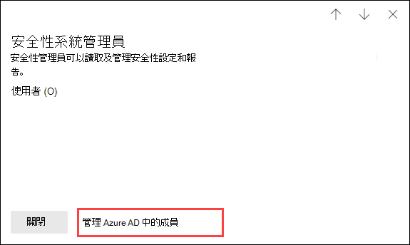
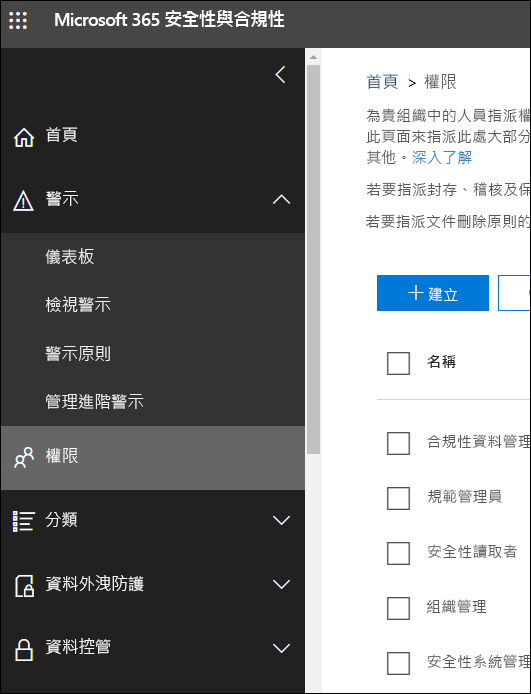

# Microsoft 365 合規性中心和 Microsoft 365 安全性中心中的權限

[!INCLUDE [Microsoft 365 Defender rebranding](../includes/microsoft-defender-for-office.md)]

**適用於**
- [Exchange Online Protection](exchange-online-protection-overview.md)
- [適用於 Office 365 的 Microsoft Defender 方案 1 和方案 2](office-365-atp.md)
- [Microsoft 365 Defender](../mtp/microsoft-threat-protection.md)

您的組織需要管理跨所有 Microsoft 365 服務的安全性與合規性案例。 您需要靈活地為組織 IT 群組中的合適人員提供正確的管理員權限。 透過使用 Microsoft 365 安全性中心或 Microsoft 365 合規性中心，您可以集中管理與安全性或合規性相關的所有工作權限。

在全域管理員新增這些系統管理員角色後，系統管理員就可以存取 Microsoft 365 中所有服務的功能和資料，例如 Microsoft 365 安全性中心、Microsoft 365 合規性中心、Azure、Office 365 和企業行動力 + 安全性。

## 什麼是 Microsoft 365 角色

Microsoft 365 合規性中心和Microsoft 365 安全性中心中出現的角色是 Azure Active Directory 角色。 這些角色的設計符合組織 IT 群組中的各個職位，進而能輕鬆地為人員提供完成工作所需的所有權限。

****

|角色|描述|
|---|---|
|**全域管理員**|可以存取所有 Microsoft 365 服務中的所有系統管理功能。 只有全域管理員才能指派其他系統管理員角色。 如需詳細資訊，請參閱[全域系統管理員／公司系統管理員](/azure/active-directory/roles/permissions-reference#global-administrator--company-administrator)。|
|**合規性資料管理員**|可以追蹤 Microsoft 365 中的組織資料，確保其受到保護，並深入了解任何問題以協助降低風險。 如需詳細資訊，請參閱[合規性資料系統管理員](/azure/active-directory/roles/permissions-reference#compliance-data-administrator)。|
|**合規性系統管理員**|可幫助您的組織遵守任何法規要求、管理電子文件探索案例，並維護 Microsoft 365 各個位置、身分和應用程式的資料監管原則。 如需詳細資訊，請參閱 [合規性系統管理員](/azure/active-directory/roles/permissions-reference#compliance-administrator)。|
|**安全性操作員**|可檢視、調查和回應 Microsoft 365 使用者、裝置和內容所受的主動威脅。 如需詳細資訊，請參閱 [安全性運算子](/azure/active-directory/roles/permissions-reference#security-operator)。|
|**安全性讀取者**|可檢視和調查 Microsoft 365 使用者、裝置和內容所受的主動威脅，但是 (與安全性運算子不同) 他們沒有透過採取行動而回應的權限。 如需詳細資訊，請參閱 [安全性讀取者](/azure/active-directory/roles/permissions-reference#security-reader)。|
|**安全性系統管理員**|可透過管理安全性原則、檢視 Microsoft 365 各項產品的安全性分析和報告，以及在威脅環境中保持最新速度，來控制組織的整體安全性。 如需詳細資訊，請參閱 [安全性系統管理員](/azure/active-directory/roles/permissions-reference#security-administrator)。|
|**全域讀取者**|**全域系統管理員** 角色的唯讀版本。 在 Microsoft 365 中檢視所有設定和管理資訊。 如需詳細資訊，請參閱 [全域讀取者](/azure/active-directory/roles/permissions-reference#global-reader)。|
|

## 全域管理員可在 Azure Active Directory 中管理角色

在 Microsoft 365合規性中心和 Microsoft 365 安全性中心選取角色時，即可檢視其指派。 但若要管理這些指派，您需要移至 Azure Active Directory。

如需詳細資訊，請參閱[在 Azure Active Directory 中檢視和指派系統管理員角色](/azure/active-directory/users-groups-roles/directory-manage-roles-portal)。

## 在服務而非 Azure Active Directory 中管理角色

在 Microsoft 365 合規性中心和Microsoft 365 安全性中心中出現的角色也會出現在這些角色有權限的服務中。 例如，您可以在安全性與合規性中心看到這些角色。

如需要關於安全性與合規性中心如何使用這些角色的詳細資訊，請參閱[安全性與合規性中心裡的權限](permissions-in-the-security-and-compliance-center.md)。

### 打破繼承

請務必了解，您在 Azure Active Directory 中管理這些角色時，您也是在為「所有」Microsoft 365 服務集中管理這些角色。 但是，當您在特定服務中 (例如安全性與合規性中心) 中管理角色時，您只是管理「該特定服務」的角色。 服務中角色的指派和權限會覆寫授予 Azure Active Directory 角色的任何權限。

這可以相當實用。 例如，如果將某人指派為安全性系統管理員角色，則他們沒有管理事件的權限。 但是，您可以使用適用於端點的 Microsoft Defender 中的權限，來授與他們該服務中事件管理的特定權限。

## 在哪裡可找到每個 Microsoft 365 服務的角色資訊

透過將使用者指派為其中一個 Microsoft 365 合規性或安全性系統管理員角色，您可以授與該使用者授予一系列的 Microsoft 365 服務權限。 使用以下連結來尋找每個服務中，角色特定權限的詳細資訊。

****

|Microsoft 365 服務|角色資訊|
|---|---|
|Office 365 與 Microsoft 365 商務方案中的系統管理員角色|[Microsoft 365 系統管理員角色](../../admin/add-users/about-admin-roles.md)|
|Azure Active Directory (Azure AD) 與 Azure AD Identity Protection|[Azure AD 系統管理員角色](/azure/active-directory/users-groups-roles/directory-assign-admin-roles)|
|適用於身分識別的 Microsoft Defender|[適用於身分識別的 Microsoft Defender 角色群組](/azure-advanced-threat-protection/atp-role-groups)|
|Azure 資訊保護|[Azure AD 系統管理員角色](/azure/active-directory/users-groups-roles/directory-assign-admin-roles)|
|合規性管理員|[合規性管理員](../../compliance/compliance-manager-setup.md#set-user-permissions-and-assign-roles) (英文)|
|Exchange Online|[Exchange 角色型存取控制](/exchange/permissions-exo/permissions-exo)|
|Intune|[Intune 角色型存取控制](/intune/role-based-access-control)|
|受管理的電腦|[Azure AD 系統管理員角色](/azure/active-directory/users-groups-roles/directory-assign-admin-roles)|
|Microsoft Cloud App Security|[角色型存取控制](/cloud-app-security/manage-admins)|
|安全性與合規性中心|[Microsoft 365 系統管理員角色](permissions-in-the-security-and-compliance-center.md)|
|Privileged Identity Management|[Azure AD 系統管理員角色](/azure/active-directory/users-groups-roles/directory-assign-admin-roles)|
|安全分數|[Azure AD 系統管理員角色](/azure/active-directory/users-groups-roles/directory-assign-admin-roles)|
|SharePoint Online|[Azure AD 系統管理員角色](/azure/active-directory/users-groups-roles/directory-assign-admin-roles) 
 [關於 Office 365 中的 SharePoint 系統管理員角色](/sharepoint/sharepoint-admin-role)|
|Teams/商務用 Skype|[Azure AD 系統管理員角色](/azure/active-directory/users-groups-roles/directory-assign-admin-roles)|
|適用於端點的 Microsoft Defender|[適用於端點的 Microsoft Defender 角色式存取控制](/windows/security/threat-protection/windows-defender-atp/rbac-windows-defender-advanced-threat-protection)|
|

## 即將推出

我們仍在努力建立 Microsoft 365 合規性中心和 Microsoft 365 安全性中心中的權限。 例如，我們目前正努力支援以下功能：

- 在 Microsoft 365 合規性中心和Microsoft 365 安全性中心中管理角色，而不需移至 Azure Active Directory。
- 透過新增或移除特定權限來自訂角色。
- 使用您所選權限來建立自訂角色。