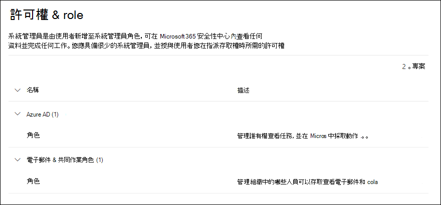

# Microsoft 365 安全性中心的權限Permissions in the Microsoft 365 security center

[!INCLUDE [Microsoft 365 Defender rebranding](../includes/microsoft-defender-for-office.md)]

**適用於****Applies to**
- [Exchange Online ProtectionExchange Online Protection](exchange-online-protection-overview.md)
- [適用於 Office 365 的 Microsoft Defender 方案 1 和方案 2Microsoft Defender for Office 365 plan 1 and plan 2](defender-for-office-365.md)
- [Microsoft 365 DefenderMicrosoft 365 Defender](../defender/microsoft-365-defender.md)

您需要管理橫跨所有 Microsoft 365 服務的安全性案例。You need to manage security scenarios that span all the Microsoft 365 services. 而且您需要靈活地為組織中的合適人員提供正確的管理員權限。And you need the flexibility to give the right admin permissions to the right people in your organization.

<https://security.microsoft.com> 的 Microsoft 365 安全性中心支援直接管理在 Microsoft 365 中執行安全性工作的使用者的權限。The Microsoft 365 security center at <https://security.microsoft.com> supports directly managing permissions for users who perform security tasks in Microsoft 365. 透過使用安全性中心管理權限，您可以集中管理與安全性相關的所有工作權限。By using the security center to manage permissions, you can manage permissions centrally for all tasks related to security.

要在安全性中心内管理權限，移至 **[權限和角色]** 或 <https://security.microsoft.com/securitypermissions>。To manage permissions in the security center, go to **Permissions & roles** or <https://security.microsoft.com/securitypermissions>. 您需要是 **全域系統管理員** 或安全性中心中 **組織管理** 角色群組的成員。You need to be a **global administrator** or a member of the **Organization Management** role group in the security center. 具體來說，**角色管理** 角色允許使用者在安全性中心檢視、建立和修改角色群組，預設情況下，該角色僅分配給 **組織管理** 角色群組。Specifically, the **Role Management** role allows users to view, create, and modify role groups in the security center, and by default, that role is assigned only to the **Organization Management** role group.

## 成員、角色和角色群組的關係Relationship of members, roles, and role groups

安全性中心的權限是根據角色型存取控制 (RBAC) 權限模型。Permissions in the security center are based on the role-based access control (RBAC) permissions model. RBAC 與大多數 Microsoft 365 服務使用的權限模型相同，因此如果您熟悉這些服務中的權限結構，那麼就會非常熟悉如何在安全性中心授予權限。RBAC is the same permissions model that's used by most Microsoft 365 services, so if you're familiar with the permission structure in these services, granting permissions in the security center will be very familiar.

**角色** 會授予執行工作集的權限。A **role** grants the permissions to do a set of tasks.

**角色群組** 是一組讓人員在安全性中心完成工作的角色。A **role group** is a set of roles that lets people do their jobs in the security center. 例如，攻擊模擬器管理員角色群組包含攻擊模擬器管理員角色，以建立和管理攻擊模擬培訓的所有方面。For example, the Attack Simulator Administrators role group includes the Attack Simulator Admin role to create and manage all aspects of attack simulation training.

安全性中心的預設角色群組包含必須指派給人員的最常見工作和功能。The security center includes default role groups for the most common tasks and functions that you'll need to assign. 通常，我們建議您只要將個別使用者新增為預設角色群組的 **成員**。Generally, we recommend simply adding individual users as **members** to the default role groups.

## 安全性中心的角色和角色群組Roles and role groups in the security center

安全性中心的 **權限和角色** 中提供以下類型的角色和角色群組:The following types of roles and role groups are available in **Permissions & roles** in the security center:

- **Azure AD 角色**: 可以檢視角色和指派使用者，但不能直接在安全性中心進行管理。**Azure AD roles**: You can view the roles and assigned users, but you can't manage them directly in the security center. Azure AD 角色是為 **所有** Microsoft 365 服務指派權限的中心角色。Azure AD roles are central roles that assign permissions for **all** Microsoft 365 services.

- **電子郵件和共同作業角色**: 這些角色群組與安全性和合規性中心中可用的角色群組相同，但您可以直接在安全性中心管理它們。**Email & collaboration roles**: These are the same role groups that are available in the Security & Compliance Center, but you can manage them directly in the security center. 你在此處指派的權限僅用於 Microsoft 365 安全性中心、Microsoft 365 合規性中心和安全性與合規性中心，並不涵蓋其他 Microsoft 365 工作負載所需的所有權限。The permissions that you assign here are specific to the Microsoft 365 security center, the Microsoft 365 compliance center, and the Security & Compliance Center, and don't cover all of the permissions that are needed in other Microsoft 365 workloads.

### 安全性中心的 Azure AD 角色Azure AD roles in the security center

當您移至 **電子郵件和共同作業角色** \> **權限和角色** \> **Azure AD 角色** \> **角色**（或直接轉到 <https://security.microsoft.com/aadpermissions>）時，您將看到本章節中描述的 Azure AD 角色。When you go **Email & collaboration roles** \> **Permissions & roles** \> **Azure AD roles** \> **Roles** (or directly to <https://security.microsoft.com/aadpermissions>) you'll see the Azure AD roles that are described in this section.

選取角色時，會出現一個包含角色描述和使用者作業的詳細資料飛出視窗。When you select a role, a details flyout that contains the description of the role and the user assignments appears. 但是要管理這些作業，您需要在詳細資料飛出視窗中點擊 **[管理 Azure AD 中的成員]**。But to manage those assignments, you need to click **Manage members in Azure AD** in the details flyout.

如需詳細資訊，請參閱 [在 Azure Active Directory 中檢視和指派系統管理員角色](/azure/active-directory/users-groups-roles/directory-manage-roles-portal)。For more information, see [View and assign administrator roles in Azure Active Directory](/azure/active-directory/users-groups-roles/directory-manage-roles-portal).

 

****

|角色Role|描述Description|
|---|---|
|**全域管理員****Global administrator**|可以存取所有 Microsoft 365 服務中的所有系統管理功能。Access to all administrative features in all Microsoft 365 services. 只有全域管理員才能指派其他系統管理員角色。Only global administrators can assign other administrator roles. 如需詳細資訊，請參閱[全域系統管理員／公司系統管理員](/azure/active-directory/roles/permissions-reference#global-administrator--company-administrator)。For more information, see [Global Administrator / Company Administrator](/azure/active-directory/roles/permissions-reference#global-administrator--company-administrator).|
|**合規性資料管理員****Compliance data administrator**|可以追蹤 Microsoft 365 中的組織資料，確保其受到保護，並深入了解任何問題以協助降低風險。Keep track of your organization's data across Microsoft 365, make sure it's protected, and get insights into any issues to help mitigate risks. 如需詳細資訊，請參閱[合規性資料系統管理員](/azure/active-directory/roles/permissions-reference#compliance-data-administrator)。For more information, see [Compliance Data Administrator](/azure/active-directory/roles/permissions-reference#compliance-data-administrator).|
|**合規性系統管理員****Compliance administrator**|可幫助您的組織遵守任何法規要求、管理電子文件探索案例，並維護 Microsoft 365 各個位置、身分和應用程式的資料監管原則。Help your organization stay compliant with any regulatory requirements, manage eDiscovery cases, and maintain data governance policies across Microsoft 365 locations, identities, and apps. 如需詳細資訊，請參閱 [合規性系統管理員](/azure/active-directory/roles/permissions-reference#compliance-administrator)。For more information, see [Compliance Administrator](/azure/active-directory/roles/permissions-reference#compliance-administrator).|
|**安全性操作員****Security operator**|可檢視、調查和回應 Microsoft 365 使用者、裝置和內容所受的主動威脅。View, investigate, and respond to active threats to your Microsoft 365 users, devices, and content. 如需詳細資訊，請參閱 [安全性運算子](/azure/active-directory/roles/permissions-reference#security-operator)。For more information, see [Security Operator](/azure/active-directory/roles/permissions-reference#security-operator).|
|**安全性讀取者****Security reader**|可檢視和調查 Microsoft 365 使用者、裝置和內容所受的主動威脅，但是 (與安全性運算子不同) 他們沒有透過採取行動而回應的權限。View and investigate active threats to your Microsoft 365 users, devices, and content, but (unlike the Security operator) they do not have permissions to respond by taking action. 如需詳細資訊，請參閱 [安全性讀取者](/azure/active-directory/roles/permissions-reference#security-reader)。For more information, see [Security Reader](/azure/active-directory/roles/permissions-reference#security-reader).|
|**安全性系統管理員****Security administrator**|可透過管理安全性原則、檢視 Microsoft 365 各項產品的安全性分析和報告，以及在威脅環境中保持最新速度，來控制組織的整體安全性。Control your organization's overall security by managing security policies, reviewing security analytics and reports across Microsoft 365 products, and staying up-to-speed on the threat landscape. 如需詳細資訊，請參閱 [安全性系統管理員](/azure/active-directory/roles/permissions-reference#security-administrator)。For more information, see [Security Administrator](/azure/active-directory/roles/permissions-reference#security-administrator).|
|**全域讀取者****Global reader**|**全域系統管理員** 角色的唯讀版本。The read-only version of the **Global administrator** role. 在 Microsoft 365 中檢視所有設定和管理資訊。View all settings and administrative information across Microsoft 365. 如需詳細資訊，請參閱 [全域讀取者](/azure/active-directory/roles/permissions-reference#global-reader)。For more information, see [Global Reader](/azure/active-directory/roles/permissions-reference#global-reader).|
|**攻擊模擬系統管理員****Attack simulation administrator**|建立和管理 [攻擊模擬系統](attack-simulation-training.md) 創建、模擬的啟動/排程，以及模擬結果審查的所有方面。Create and manage all aspects of [attack simulation](attack-simulation-training.md) creation, launch/scheduling of a simulation, and the review of simulation results. 詳細資訊，請參閲 [攻擊模擬系統管理員](/azure/active-directory/roles/permissions-reference#attack-simulation-administrator)。For more information, see [Attack Simulation Administrator](/azure/active-directory/roles/permissions-reference#attack-simulation-administrator).|
|**攻擊承載作者****Attack payload author**|建立攻擊承載，但不實際啟動或排程它們。Create attack payloads but not actually launch or schedule them. 如需詳細資訊，請參閱 [攻擊承載作者](/azure/active-directory/roles/permissions-reference#attack-payload-author)。For more information, see [Attack Payload Author](/azure/active-directory/roles/permissions-reference#attack-payload-author).|
|

### 安全性中心中的電子郵件和共同作業角色Email & collaboration roles in the security center

當您移至 **電子郵件和共同作業角色** \> **權限和角色** \> **電子郵件和共同作業角色** \> **角色**（或直接轉到 <https://security.microsoft.com/emailandcollabpermissions>）時，您將看到安全性與合規性中心中可用的相同角色群組。When you go to **Email & collaboration roles** \> **Permissions & roles** \> **Email & collaboration roles** \> **Roles** (or directly to <https://security.microsoft.com/emailandcollabpermissions>) you'll see the same role groups that are available in the Security & Compliance Center.

如需有關這些角色群組的詳細資訊，請參閱 [安全性與合規性中心的權限](permissions-in-the-security-and-compliance-center.md)。For complete information about these role groups, see [Permissions in the Security & Compliance Center](permissions-in-the-security-and-compliance-center.md)

#### 修改安全性中心中的電子郵件和共同作業角色成員資格Modify Email & collaboration role membership in the security center

1. 在安全性中心，移至 **電子郵件和共同作業角色** \> **權限和角色** \> **電子郵件和共同作業角色** \> **角色**。In the security center, go to **Email & collaboration roles** \> **Permissions & roles** \> **Email & collaboration roles** \> **Roles**.

2. 在 **權限** 頁面中，從清單中開啟和選取要修改的角色群組。In the **Permissions** page that opens, select the role group that you want to modify from the list. 您可以點擊 **[名稱]** 資料行標題，以按名稱進行排序，也可以點擊 **[搜尋]** ![[搜尋圖示]](../../media/m365-cc-sc-search-icon.png) 來查找角色群組。You can click on the **Name** column header to sort the list by name, or you can click **Search**  to find the role group.

3. 在顯示角色群組詳細資料的飛出視窗中，按一下 **[成員]** 章節中的 **[編輯]**。In the role group details flyout that appears, click **Edit** in the **Members** section.

4. 在出現的 **[正在編輯選擇成員]** 頁面執行下列其中一項操作:In the **Editing choose members** page that appears, do one of the following steps:
   - 如果沒有角色群組成員，請點擊 **[選擇成員]**。If there are no role group members, click **Choose members**.
   - 如果有現有的角色群組成員，請點擊 **[編輯]**。If there are existing role group members, click **Edit**

5. 在出現的 **[選擇成員]** 飛出視窗執行下列其中一項操作:In the **Choose members** flyout that appears, do one of the following steps:

   - 點擊 **[新增]**。Click **Add**. 在出現的使用者清單中，選取一個或多個使用者。In the list of users that appears, select one or more users. 或者，您可以點擊 **[搜尋]** ![[搜尋圖示]](../../media/m365-cc-sc-search-icon.png) 以找出和選取使用者。Or, you can click **Search**  to find and select users.

     選好要新增的使用者後，點擊 **[新增]**。When you've selected the users that you want to add, click **Add**.

   - 點擊 **[移除]**。Click **Remove**. 選取下列一個或多個現有的成員。Select one or more of the existing members. 或者，您可以點擊 **[搜尋]** ![[搜尋圖示]](../../media/m365-cc-sc-search-icon.png) 以找出和選取成員。Or, you can click **Search**  to find and select members.

     選好要移除的使用者後，點擊 **[移除]**。When you've selected the users that you want to remove, click **Remove**.

6. 返回 **[選擇成員]** 飛出視窗，點擊 **[完成]**。Back on the **Choose members** flyout, click **Done**.

7. 返回 **[正在編輯選擇成員]** 頁面，點擊 **[儲存]**。Back on the **Editing choose members** page, click **Save**.

8. 返回角色群組詳細資料飛出視窗，點擊 **[完成]**。Back on the role group details flyout, click **Done**.
