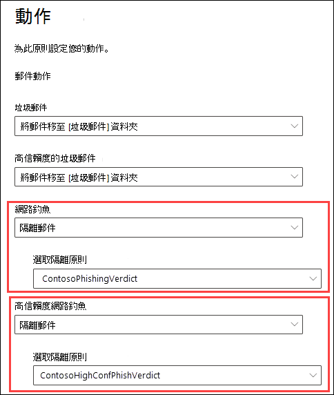
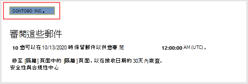
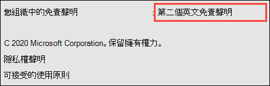
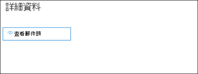
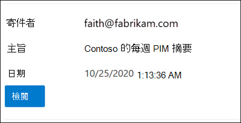
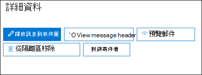
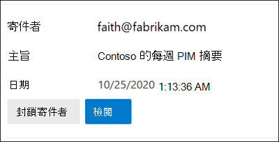
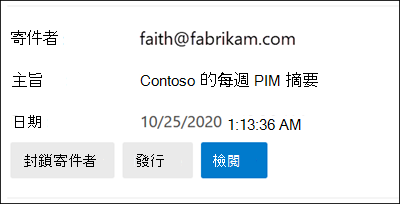

# <a name="quarantine-tags"></a>隔離標記

> [!NOTE]
> 本文中所述的功能目前在預覽中，無法供所有人使用，而且可能會變更。

Exchange Online Protection () EOP 中的隔離標籤，可讓系統管理員根據郵件如何抵達隔離的方式，控制使用者可以對隔離郵件執行的動作。

EOP 已傳統允許或防止 [隔離](find-and-release-quarantined-messages-as-a-user.md) 和 [使用者垃圾郵件通知](use-spam-notifications-to-release-and-report-quarantined-messages.md)中的郵件的某些層級互動。 例如，使用者可以查看和放開反垃圾郵件篩選為垃圾郵件或大量進行隔離的郵件，但是不能查看或發行被隔離為高可信度網路釣魚的郵件。

針對 [支援的保護功能](#step-2-assign-a-quarantine-tag-to-supported-features)，隔離標籤會指定在使用者是收件者) 的情況下，使用者可以在使用者的垃圾郵件通知訊息和隔離的郵件中執行的功能 (郵件。 預設的隔離標記會自動指派給使用者強制執行隔離郵件的歷史功能。 或者，您也可以建立並指派自訂隔離標記，以允許或防止使用者對隔離郵件執行特定動作。

個別許可權會組合成下列預設許可權群組：

- 沒有存取權
- 限制存取
- 完全存取

下表說明可用的個別許可權，以及在預置許可權群組中包含或不包含的專案：

|權限|沒有存取權|限制存取|完全存取|
|---|:---:|:---:|:---:|
|**允許寄件者** (_PermissionToAllowSender_) ||||
|**封鎖寄件者** (_PermissionToBlockSender_) ||||
|**Delete** (_PermissionToDelete_) ||||
|**預覽** (_PermissionToPreview_) ||||
|**允許收件者從隔離區釋放郵件** (_PermissionToRelease_) ||||
|**允許收件者要求從隔離區發行郵件** (_PermissionToRequestRelease_) ||||
|

如果您不喜歡預設許可權群組中的預設許可權，您可以在建立或修改自訂隔離標記時使用自訂許可權。 如需每個許可權的相關資訊，請參閱本文稍後的隔離標籤 [許可權詳細資料](#quarantine-tag-permission-details) 一節。

您可以使用 Exchange Online 信箱，在安全性 & 合規性中心或 PowerShell (Exchange Online 365 PowerShell 中建立並指派隔離標記;EOP 組織中的獨立 EOP PowerShell，但沒有 Exchange Online 信箱) 。

## <a name="what-do-you-need-to-know-before-you-begin"></a>開始之前有哪些須知？

- 您要在 <https://protection.office.com/> 開啟安全性與合規性中心。 若要直接移至 [ **隔離標記** ] 頁面，請開啟] <https://protection.office.com/quarantineTags> 。

- 若要連線至 Exchange Online PowerShell，請參閱[連線至 Exchange Online PowerShell](/powershell/exchange/connect-to-exchange-online-powershell)。 若要連接至獨立版 EOP PowerShell，請參閱[連線到 Exchange Online Protection PowerShell](/powershell/exchange/connect-to-exchange-online-protection-powershell)。

- 若要查看、建立、修改或移除隔離標記，您必須是「[安全性 & 規範中心](permissions-in-the-security-and-compliance-center.md)」中「**組織管理**」或「**安全性管理員**」角色的成員。

## <a name="step-1-create-quarantine-tags-in-the-security--compliance-center"></a>步驟1：在安全性 & 規範中心建立隔離標記

1. 在 [安全性 & 規範中心] 中，移至 [ **威脅管理** \> **原則** ]，然後選取 [ **隔離標記**]。

2. 在 [ **隔離標記** ] 頁面上，選取 [ **新增自訂標記**]。

3. [ **新增標記** ] 嚮導隨即開啟。 在 [ **標記名稱** ] 頁面上，于 [ **標記名稱** ] 欄位中輸入簡短但唯一的名稱。 您必須在後續步驟中以名稱識別並選取標記。 完成後，按 [下一步]。

4. 在 [ **收件者郵件存取** ] 頁面上，選取下列其中一個值：
   - **無法存取**
   - **限制存取**
   - **完全存取**

   本文先前會說明這些許可權群組中包含的個別許可權。

   若要指定自訂許可權，請選取 [ **設定特定 access (Advanced)** ]，然後設定下列設定：

     - **選取 [發行動作偏好** 設定]：選取下列其中一個值：
       - **無發行動作**：此為預設值。
       - **允許收件者從隔離區釋放郵件**
       - **允許收件者要求從隔離區釋放郵件**

     - **選取其他動作收件者可對隔離郵件採取採取動作**：選取 [部分]、[全部] 或 [無下列任何] 值：
       - **Delete**
       - **預覽**
       - **允許寄件者**
       - **封鎖寄件者**

   這些許可權及其對隔離郵件和使用者垃圾郵件通知中的影響將會在本文稍後的隔離標籤 [許可權詳細資料](#quarantine-tag-permission-details) 一節中說明。

   完成後，按 [下一步]。

5. 在出現的 [ **摘要** ] 頁面上，複查您的設定。 您可以按一下每個設定的 [ **編輯** ] 進行修改。

   當您完成時，按一下 [ **提交**]。

6. 在出現的確認頁面上，按一下 [ **完成** ]。

現在，您已準備好將隔離標籤指派給隔離功能（如 [步驟 2](#step-2-assign-a-quarantine-tag-to-supported-features) 區段所述）。

### <a name="create-quarantine-tags-in-powershell"></a>在 PowerShell 中建立隔離標記

如果您想要使用 PowerShell 建立隔離標記，請連線至 Exchange Online PowerShell 或 Exchange Online Protection PowerShell 並使用 **QuarantineTag** Cmdlet。 您有兩種不同的方法可供您選擇：

- 使用 _EndUserQuarantinePermissionsValue_ 參數。
- 使用 _EndUserQuarantinePermissions_ 參數。

這些方法將在下列各節中說明。

#### <a name="use-the-enduserquarantinepermissionsvalue-parameter"></a>使用 EndUserQuarantinePermissionsValue 參數

若要使用 _EndUserQuarantinePermissionsValue_ 參數建立隔離標記，請使用下列語法：

```powershell
New-QuarantineTag -Name "<UniqueName>" -EndUserQuarantinePermissionsValue <0 to 236>
```

_EndUserQuarantinePermissionsValue_ 參數會使用從二進位值轉換而來的十進位值。 二進位值對應至可用的使用者隔離許可權特定順序。 針對每個許可權，值1等於 True，值0等於 False。

下表說明預設許可權群組中每個個別許可權的必要順序和值：

****

|權限|沒有存取權|限制存取|完全存取|
|---|:---:|:---:|:---:|
|PermissionToAllowSender|0|0|1|
|PermissionToBlockSender|0|1|1|
|PermissionToDelete|0|1|1|
|PermissionToDownload<sup>\*</sup>|0|0|0|
|PermissionToPreview|0|1|1|
|PermissionToRelease<sup>\*\*</sup>|0|0|1|
|PermissionToRequestRelease<sup>\*\*</sup>|0|1|0|
|PermissionToViewHeader<sup>\*</sup>|0|0|0|
|二進位值|00000000|01101010|11101100|
|要使用的十進位數值|0|106|236|

<sup>\*</sup> 目前這個值永遠為0。 若為 PermissionToViewHeader，值0不會隱藏「 **查看郵件頁首** 」按鈕的隔離郵件的詳細資料 (按鈕永遠可供使用) 。

<sup>\*\*</sup> 請勿將這兩個值都設為1。 將 one 設定為1，另一個設定為0，或設定為0。

這個範例會建立新的隔離標籤名稱 NoAccess，該名稱會指派上表中所述的「沒有存取」許可權。

```powershell
New-QuarantineTag -Name NoAccess -EndUserQuarantinePermissionsValue 0
```

若為「限制存取」許可權，請使用值106。 如需完整存取許可權，請使用值236。

若為自訂許可權，請使用上表取得與您想要的許可權相對應的二進位值。 將二進位值轉換為十進位值，並使用 _EndUserQuarantinePermissionsValue_ 參數的十進位值。

如需詳細的語法及參數資訊，請參閱 [QuarantineTag](/powershell/module/exchange/new-quarantinetag)。

#### <a name="use-the-enduserquarantinepermissions-parameter"></a>使用 EndUserQuarantinePermissions 參數

若要使用 _EndUserQuarantinePermissionsValue_ 參數建立隔離標記，請執行下列步驟：

答： 使用 **QuarantinePermissions 指令程式** ，將隔離權限物件儲存在變數中。

<p>

B。 使用此變數做為 **QuarantineTag** 命令中的 _EndUserQuarantinePermissions_ 值。

##### <a name="step-a-store-a-quarantine-permissions-object-in-a-variable"></a>步驟 A：將隔離權限物件儲存在變數中

使用下列語法：

```powershell
$<VariableName> = New-QuarantinePermissions [-PermissionToAllowSender <$true | $False>] [-PermissionToBlockSender <$true | $False>] [-PermissionToDelete <$true | $False>] [-PermissionToPreview <$true | $False>] [-PermissionToRelease <$true | $False>] [-PermissionToRequestRelease <$true | $False>]
```

任何未使用參數的預設值為 `$false` ，所以您只需要使用您要設定值的參數 `$true` 。

下列範例顯示如何建立與「預置」許可權群組相對應的權限物件：

- **無存取權**：

  ```powershell
  $NoAccess = New-QuarantinePermissions
  ```

- **限制存取**：

  ```powershell
  $LimitedAccess = New-QuarantinePermissions -PermissionToBlockSender $true -PermissionToDelete $true -PermissionToPreview $true -PermissionToRequestRelease $true
  ```

- **完全存取**：

  ```powershell
  $FullAccess = New-QuarantinePermissions -PermissionToAllowSender $true -PermissionToBlockSender $true -PermissionToDelete $true -PermissionToPreview $true -PermissionToRelease $true
  ```

若要查看您設定的值，請以命令 (執行變數名稱。例如，執行命令 `$NoAccess`) 。

若為自訂許可權，請勿將 _PermissionToRelease_ 和 _PermissionToRequestRelease_ 參數都設定為 `$true` 。 將其中一個設為 `$true` ，並保留另一個為 `$false` ，或保留兩者 `$false` 。

您也可以在建立之後，使用 **QuarantinePermissions** 指令程式來修改現有的權限物件變數。

如需詳細的語法及參數資訊，請參閱 [QuarantinePermissions](/powershell/module/exchange/new-quarantinepermissions) and [Set-QuarantinePermissions](/powershell/module/exchange/set-quarantinepermissions)。

##### <a name="step-b-use-the-variable-in-the-new-quarantinetag-command"></a>步驟 B：使用 New-QuarantineTag 命令中的變數

在變數中建立及儲存權限物件之後，請在下列 **QuarantineTag** 命令中使用 _EndUserQuarantinePermission_ 參數值的變數：

```powershell
New-QuarantineTag -Name "<UniqueName>" -EndUserQuarantinePermissions $<VariableName>
```

此範例會使用 `$LimitedAccess` 上一個步驟中所述及建立的權限物件，建立名為 LimitedAccess 的新隔離標記。

```powershell
New-QuarantineTag -Name LimitedAccess -EndUserQuarantinePermissions $LimitedAccess
```

如需詳細的語法及參數資訊，請參閱 [QuarantineTag](/powershell/module/exchange/new-quarantinetag)。

## <a name="step-2-assign-a-quarantine-tag-to-supported-features"></a>步驟2：指派隔離標記至支援的功能

在 [隔離郵件或檔案 (會自動或作為可設定動作) 的 _支援_ 保護功能中，您可以指派隔離標籤至可用的隔離動作。 下表說明隔離郵件和隔離標記可用性的功能：

****

|功能|支援隔離標記？|使用的預設隔離標記|
|---|:---:|---|
|[反垃圾郵件原則](configure-your-spam-filter-policies.md)： <ul><li>**垃圾郵件** (_SpamAction_) </li><li>**高信賴垃圾郵件** (_HighConfidenceSpamAction_) </li><li>**網路釣魚電子郵件** (_PhishSpamAction_) </li><li>**高信賴網路釣魚電子郵件** (_HighConfidencePhishAction_) </li><li>**大量電子郵件** (_BulkSpamAction_) </li></ul>|是|<ul><li>DefaultSpamTag (完整存取) </li><li>DefaultHighConfSpamTag (完整存取) </li><li>DefaultPhishTag (完整存取) </li><li>DefaultHighConfPhishTag (無法存取) </li><li>DefaultBulkTag (完整存取) </li></ul>
|反網路釣魚原則： <ul><li>_AuthenticationFailAction_ 的 [欺騙情報防護](set-up-anti-phishing-policies.md#spoof-settings) () </li><li>[類比保護](set-up-anti-phishing-policies.md#impersonation-settings-in-anti-phishing-policies-in-microsoft-defender-for-office-365)：<sup>\*</sup> <ul><li>**如果由類比的使用者傳送電子郵件** (_TargetedUserProtectionAction_) </li><li>**如果模擬的網域傳送電子郵件** (_TargetedDomainProtectionAction_) </li><li>**信箱智慧** \>**如果由類比的使用者傳送電子郵件** (_MailboxIntelligenceProtectionAction_) </li></ul></li></ul></ul>|否|不適用|
|[反惡意程式碼原則](configure-anti-malware-policies.md)：永遠會隔離所有偵測到的郵件。|否|不適用|
|[適用於 SharePoint、OneDrive 和 Microsoft Teams 的安全附件](mdo-for-spo-odb-and-teams.md)|否|不適用|
|[郵件流程規則](/exchange/security-and-compliance/mail-flow-rules/mail-flow-rules) (也稱為傳輸規則) 具有動作：將 **郵件傳遞至主控隔離** (_隔離_) 。|否|不適用|
|

<sup>\*</sup> 模擬保護設定只適用于 Microsoft Defender for Office 365 中的反網路釣魚原則。

如果您很樂意使用預設隔離標記所提供的使用者權限，您不需要執行任何動作。 如果您想要自訂使用者功能 (可用按鈕) 使用者垃圾郵件通知或隔離的郵件詳細資料中，您可以指定自訂隔離標記。

### <a name="assign-quarantine-tags-in-anti-spam-policies-in-the-security--compliance-center"></a>在安全性 & 合規性中心的反垃圾郵件原則中指派隔離標記

在 [EOP 中設定反垃圾郵件原則](configure-your-spam-filter-policies.md)，說明建立及修改反垃圾郵件原則的完整指示。

1. 在 [安全性 & 規範中心] 中，移至 [ **威脅管理** \> **原則**]， \> 然後選取 [ **反垃圾郵件**]。 或者，開啟 <https://protection.office.com/antispam> 。

2. 尋找並選取要編輯的現有反垃圾郵件原則，或建立新的反垃圾郵件原則。

3. 在 [原則詳細資料] 浮出視窗中，展開 [ **垃圾郵件和大量動作** ] 區段。

4. 如果您已針對可用垃圾郵件篩選判定的動作選取 [ **隔離郵件** ]，則可以使用 [套用 **隔離原則** 標籤] 方塊，為該判定選取隔離標記。

   **附注**：當您建立新的原則時，垃圾郵件篩選判定的空白隔離標籤值會指出使用該判定的預設隔離標籤。 當您後來編輯原則時，空白值會以實際的預設隔離標記名稱取代，如上表所述。

   

5. 完成後，請按一下 **[儲存]**。

#### <a name="assign-quarantine-tags-in-anti-spam-policies-in-powershell"></a>在 PowerShell 中的反垃圾郵件原則中指派隔離標記

如果您想要使用 PowerShell 來指派反垃圾郵件原則中的隔離標記，請連線至 Exchange Online PowerShell 或 Exchange Online Protection PowerShell，並使用下列語法：

```powershell
<New-HostedContentFilterPolicy -Name "<Unique name>" | Set-HostedContentFilterPolicy -Identity "<Policy name>">  [-SpamAction Quarantine] [-SpamQuarantineTag <QuarantineTagName>] [-HighConfidenceSpamAction Quarantine] [-HighConfidenceSpamQuarantineTag <QuarantineTagName>] [-PhishSpamAction Quarantine] [-PhishQuarantineTag <QuarantineTagName>] [-HighConfidencePhishQuarantineTag <QuarantineTagName>] [-BulkSpamAction Quarantine] [-BulkQuarantineTag <QuarantineTagName>] ...
```

**附註**：

- _HighConfidencePhishAction_ 參數的預設值是「隔離」，所以您不需要為新反垃圾郵件原則中的高可信度網路釣魚偵測設定隔離動作。 針對新的或現有的反垃圾郵件原則中的所有其他垃圾郵件篩選 verdicts，隔離標籤只有在 action 值為「隔離」時才有效。 若要查看現有反垃圾郵件原則中的動作值，請執行下列命令：

  ```powershell
  Get-HostedContentFilterPolicy | Format-Table Name,*SpamAction,HighConfidencePhishAction
  ```

  如需有關 Standard 和 Strict 之預設動作值及建議動作值的詳細資訊，請參閱 [EOP 反垃圾郵件原則設定](recommended-settings-for-eop-and-office365.md#eop-anti-spam-policy-settings)。

- 垃圾郵件篩選會判定沒有對應的隔離標籤參數，這表示使用該判定的 [預設隔離標記](#step-2-assign-a-quarantine-tag-to-supported-features) 。

  如果您想要變更隔離郵件的預設使用者功能，您只需要將預設的隔離標記取代為自訂隔離標籤。

- PowerShell 中的新反垃圾郵件原則需要垃圾郵件篩選原則 (設定) 使用 **New-HostedContentFilterPolicy** 指令程式和新的垃圾郵件篩選規則 (收件者篩選器) 使用 **New-HostedContentFilterRule** Cmdlet。 如需相關指示，請參閱 [使用 PowerShell 建立反垃圾郵件原則](configure-your-spam-filter-policies.md#use-powershell-to-create-anti-spam-policies)。

此範例會使用下列設定來建立名為「Research 部門」的新垃圾郵件篩選原則：

- 所有垃圾郵件篩選 verdicts 的動作都設為隔離。
- 名為「NoAccess 的自訂隔離標籤會將 **沒有** 指派任何存取權限的預設隔離標記取代為預設 **不指派任何** 預設的隔離標記。

```powershell
New-HostedContentFilterPolicy -Name Research Department -SpamAction Quarantine -SpamQuarantineTag NoAccess -HighConfidenceSpamAction Quarantine -HighConfidenceSpamQuarantineTag NoAction -PhishSpamAction Quarantine -PhishQuarantineTag NoAction -BulkSpamAction Quarantine -BulkQuarantineTag NoAccess
```

如需詳細的語法及參數資訊，請參閱 [New-HostedContentFilterPolicy](/powershell/module/exchange/new-hostedcontentfilterpolicy)。

此範例會修改名為「人力資源」的現有垃圾郵件篩選原則。 垃圾郵件隔離判定的動作會設定為 [隔離]，而且會指派名為 NoAccess 的自訂隔離標記。

```powershell
Set-HostedContentFilterPolicy -Identity "Human Resources" -SpamAction Quarantine -SpamQuarantineTag NoAccess
```

如需詳細的語法及參數資訊，請參閱 [Set-HostedContentFilterPolicy](/powershell/module/exchange/set-hostedcontentfilterpolicy)。

## <a name="configure-global-quarantine-notification-settings-in-the-security--compliance-center"></a>在安全性 & 規範中心設定全域隔離通知設定

隔離標籤的通用設定可讓您自訂使用者的垃圾郵件通知，該通知會傳送給被隔離的郵件收件者。 如需這些通知的詳細資訊，請參閱 [使用者垃圾郵件通知](use-spam-notifications-to-release-and-report-quarantined-messages.md)。

1. 在 [安全性 & 規範中心] 中，移至 [ **威脅管理** \> **原則** ]，然後選取 [ **隔離標記**]。

2. 在 [ **隔離標記** ] 頁面上，選取 [ **通用設定**]。

3. 在開啟的 [ **隔離通知設定** ] 浮出控制項中，設定下列部分或所有設定：

   - **使用我的公司徽標**：選取此選項以取代在使用者垃圾郵件通知頂端使用的預設 Microsoft 標誌。 在執行這項作業之前，您必須依照 [自訂群組織的 Microsoft 365 主題](../../admin/setup/customize-your-organization-theme.md) 中的指示，上傳自訂的徽標。

     下列螢幕擷取畫面顯示使用者垃圾郵件通知中的自訂標誌：

     

   - **選擇語言**：使用者垃圾郵件通知已根據收件者的語言設定進行當地語系化。 您可以針對 **顯示名稱** 和 **免責聲明** 值，以不同語言指定自訂的文字。

     選取 [第一個語言] 方塊中至少一種語言，然後按一下 [ **新增**]。 您可以在每個語言之後按一下 [ **新增** ]，以選取多種語言。 [區段語言] 方塊會顯示您所選取的所有語言：

     ![隔離標籤全域隔離通知設定中的 [第二語言] 方塊中選取的語言](../../media/quarantine-tags-esn-customization-selected-languages.png)

   - **顯示名稱**：自訂在使用者垃圾郵件通知中使用的寄件者顯示名稱。

     針對您新增的每種語言，在 [第二語言] 方塊中選取語言 (不要按一下 X) ，然後在 [ **顯示名稱** ] 方塊中輸入您想要的文字值。

     下列螢幕擷取畫面顯示使用者垃圾郵件通知中的自訂顯示名稱：

     

   - **免責聲明**：將自訂免責聲明新增至使用者垃圾郵件通知的底部。 當地語系化的文字（ **來自您組織的免責聲明** ）永遠包含在第一列，接著您指定的文字。

     針對您已新增的每種語言，選取 [第二語言] 方塊中的語言 (請勿按一下 X) ，然後在 [ **免責聲明** ] 方塊中輸入您想要的文字值。

     下列螢幕擷取畫面顯示使用者垃圾郵件通知中的自訂免責聲明：

     

## <a name="view-quarantine-tags-in-the-security--compliance-center"></a>在安全性 & 規範中心內查看隔離標記

1. 在 [安全性 & 規範中心] 中，移至 [ **威脅管理** \> **原則** ]，然後選取 [ **隔離標記**]。

- 若要查看內建或自訂隔離標籤的設定，請從清單中選取 [隔離] 標記 (不要選取] 核取方塊) 。

- 若要查看全域設定，請選取 [**通用設定**]

### <a name="view-quarantine-tags-in-powershell"></a>在 PowerShell 中查看隔離標記

如果您想要使用 PowerShell 來查看隔離標記，請執行下列任一步驟：

- 若要查看所有內建或自訂標記的摘要清單，請執行下列命令：

  ```powershell
  Get-QuarantineTag | Format-Table Name
  ```

- 若要查看內建或自訂隔離標記的設定，請 \<TagName\> 以隔離標記的名稱取代，並執行下列命令：

  ```powershell
  Get-QuarantineTag -Identity "<TagName>"
  ```

- 若要查看全域設定，請執行下列命令：

  ```powershell
  Get-QuarantineTag -QuarantineTagType GlobalQuarantineTag
  ```

如需詳細的語法及參數資訊，請參閱 [Get-HostedContentFilterPolicy](/powershell/module/exchange/get-hostedcontentfilterpolicy)。

## <a name="remove-quarantine-tags-in-the-security--compliance-center"></a>移除安全性 & 規範中心內的隔離標記

**附註**：

- 您無法移除內建的隔離標記。

- 在您移除自訂隔離標記之前，請確認未使用它。 例如，在 PowerShell: 中執行下列命令

  ```powershell
  Get-HostedContentFilterPolicy | Format-List Name,*QuarantineTag
  ```

  若要使用隔離標記，請 [取代指派的隔離標記](#step-2-assign-a-quarantine-tag-to-supported-features) ，然後再將其移除。

1. 在 [安全性 & 規範中心] 中，移至 [ **威脅管理** \> **原則** ]，然後選取 [ **隔離標記**]。

2. 在 [ **隔離標記** ] 頁面上，選取您要移除的自訂隔離標記，然後按一下 [ **刪除** 標籤]。

3. 在出現的確認對話方塊中，按一下 [ **移除** 標籤]。

### <a name="remove-quarantine-tags-in-powershell"></a>移除 PowerShell 中的隔離標記

如果您想要使用 PowerShell 移除自訂隔離標記，請 \<TagName\> 以隔離標記的名稱取代，並執行下列命令：

```powershell
Remove-QuarantineTag -Identity "<TagName>"
```

如需詳細的語法及參數資訊，請參閱 [Remove-QuarantineTag](/powershell/module/exchange/remove-quarantinetag)。

## <a name="quarantine-tag-permission-details"></a>隔離標記許可權詳細資料

下列各節說明在隔離郵件和使用者垃圾郵件通知的詳細資料中，預置許可權群組和個別許可權的影響。

### <a name="preset-permissions-groups"></a>預設許可權群組

在「預置」許可權群組中包含的個別許可權會列在本文開頭的表格中。

#### <a name="no-access"></a>沒有存取權

如果隔離標籤指派「 **無存取** 」許可權 (無許可權) ，使用者仍會取得某些基準功能：

- **隔離的郵件詳細資料**： [ **View message header** ] 按鈕永遠可供使用。

  

- **使用者垃圾郵件通知**：將使用者帶至隔離區中郵件的 [ **檢查** ] 按鈕永遠可供使用。

  

#### <a name="limited-access"></a>限制存取

如果隔離標籤指派「 **限制存取** 」許可權，使用者就可以取得下列功能：

- **隔離的郵件詳細資料**：下列按鈕可用：
  - **要求版本**
  - **查看郵件頭**
  - **預覽郵件**
  - **封鎖寄件者**
  - **從隔離區移除**

  

- **使用者垃圾郵件通知**：下列按鈕可用：
  - **封鎖寄件者**
  - **檢閱**

  

#### <a name="full-access"></a>完全存取

如果隔離標籤會指派「 **完整存取** 」許可權 (所有可用的許可權) ，使用者會收到下列功能：

- **隔離的郵件詳細資料**：下列按鈕可用：
  - **Release message**
  - **查看郵件頭**
  - **預覽郵件**
  - **封鎖寄件者**
  - **允許寄件者**
  - **從隔離區移除**

  

- **使用者垃圾郵件通知**：下列按鈕可用：
  - **封鎖寄件者**
  - **發行**
  - **檢閱**

  

### <a name="individual-permissions"></a>個別許可權

> [!NOTE]
> 請記住，使用者永遠會收到「 [無法存取](#no-access) 」區段中所述的按鈕。 這些按鈕不會包含在個別的許可權描述中。

#### <a name="allow-sender-permission"></a>允許寄件者許可權

[ **允許寄件者** ] 許可權 (_PermissionToAllowSender_) 控制對按鈕的存取權，讓使用者可以輕鬆地將隔離的郵件寄件者新增至其安全的寄件者清單。

- **隔離的郵件詳細資料**：
  - 啟用 [**允許寄件者**] 許可權：可以使用 [**允許寄件者**] 按鈕。
  - **允許停用寄件者** 許可權：無法使用 [ **允許寄件者** ] 按鈕。

- **使用者垃圾郵件通知**：沒有作用。

如需安全寄件者清單的詳細資訊，請參閱 [防止受信任的寄件者遭到封鎖](https://support.microsoft.com/office/274ae301-5db2-4aad-be21-25413cede077#__toc304379666) ，並 [使用 Exchange Online PowerShell 來設定信箱上的安全清單集合](configure-junk-email-settings-on-exo-mailboxes.md#use-exchange-online-powershell-to-configure-the-safelist-collection-on-a-mailbox)。

#### <a name="block-sender-permission"></a>封鎖寄件者許可權

**Block sender** 許可權 (_PermissionToBlockSender_) 控制對按鈕的存取權，讓使用者可以輕鬆地將隔離的郵件寄件者新增至其封鎖的寄件者清單。

- **隔離的郵件詳細資料**：
  - 已啟用 **封鎖寄件者** 許可權：可用的 **封鎖寄件者** 按鈕。
  - 禁止 **封鎖寄件者** 許可權：無法使用 [**封鎖寄件者**] 按鈕。

- **使用者垃圾郵件通知**：
  - 禁止 **封鎖寄件者** 許可權：無法使用 [**封鎖寄件者**] 按鈕。
  - 已啟用 **封鎖寄件者** 許可權：可用的 **封鎖寄件者** 按鈕。

如需有關封鎖的寄件者清單的詳細資訊，請參閱 [封鎖來自某人的郵件](https://support.microsoft.com/office/274ae301-5db2-4aad-be21-25413cede077#__toc304379667) ，並 [使用 Exchange Online PowerShell 來設定信箱上的安全清單集合](configure-junk-email-settings-on-exo-mailboxes.md#use-exchange-online-powershell-to-configure-the-safelist-collection-on-a-mailbox)。

#### <a name="delete-permission"></a>刪除權限

「 **刪除** 」許可權 (_PermissionToDelete_) 會控制使用者對其郵件的功能 (郵件的收件者) 從隔離區。

- **隔離的郵件詳細資料**：
  - 已啟用 **刪除** 許可權：可以使用 [**從隔離區移除**] 按鈕。
  - 已停用 **刪除** 許可權：無法使用 [**從隔離區移除**] 按鈕。

- **使用者垃圾郵件通知**：沒有作用。

#### <a name="preview-permission"></a>預覽許可權

**預覽** 許可權 (_PermissionToPreview_) 控制使用者的功能，以在隔離區中預覽其郵件。

- **隔離的郵件詳細資料**：
  - 已啟用 **預覽** 許可權： [**預覽郵件**] 按鈕可供使用。
  - 已停用 **預覽** 許可權：無法使用 **預覽郵件** 按鈕。

- **使用者垃圾郵件通知**：沒有作用。

#### <a name="allow-recipients-to-release-a-message-from-quarantine-permission"></a>允許收件者從隔離許可權放開郵件

[ **允許收件者從隔離許可權發行郵件** ] (_PermissionToRelease_) 控制使用者在不核准系統管理員的情況下，直接釋放隔離郵件的能力。

- **隔離的郵件詳細資料**：
  - 已啟用許可權：「 **發行訊息** 」按鈕可用。
  - 已停用許可權：無法使用「 **發行訊息** 」按鈕。

- **使用者垃圾郵件通知**：
  - 已啟用許可權：「 **發行** 」按鈕可用。
  - 已停用許可權：無法使用「 **發行** 」按鈕。

#### <a name="allow-recipients-to-request-a-message-to-be-released-from-quarantine-permission"></a>允許收件者要求從隔離許可權發行郵件

[ **允許收件者要求從隔離許可權發行郵件** ] (_PermissionToRequestRelease_) 控制使用者 _要求_ 發行隔離郵件的能力。 只有在系統管理員核准要求之後，才會發佈郵件。

- **隔離的郵件詳細資料**：
  - 已啟用許可權： [ **要求版本** ] 按鈕可用。
  - 已停用許可權： [ **要求版本** ] 按鈕無法使用。

- **使用者垃圾郵件通知**：無法使用「 **發行** 」按鈕。