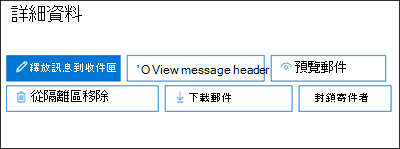

# <a name="quarantine-tags"></a><span data-ttu-id="08fbe-103">隔離標記</span><span class="sxs-lookup"><span data-stu-id="08fbe-103">Quarantine tags</span></span>

> [!NOTE]
> <span data-ttu-id="08fbe-104">本文中所述的功能目前在預覽中，無法供所有人使用，而且可能會變更。</span><span class="sxs-lookup"><span data-stu-id="08fbe-104">The features that are described in this article are currently in Preview, aren't available to everyone, and are subject to change.</span></span>

<span data-ttu-id="08fbe-105">Exchange Online Protection () EOP 中的隔離標籤，可讓系統管理員根據郵件如何抵達隔離的方式，控制使用者可以對隔離郵件執行的動作。</span><span class="sxs-lookup"><span data-stu-id="08fbe-105">Quarantine tags in Exchange Online Protection (EOP) allow admins to control what users are able to do to their quarantined messages based on how the message arrived in quarantine.</span></span>

<span data-ttu-id="08fbe-106">EOP 已傳統允許或防止 [隔離](find-and-release-quarantined-messages-as-a-user.md) 和 [使用者垃圾郵件通知](use-spam-notifications-to-release-and-report-quarantined-messages.md)中的郵件的某些層級互動。</span><span class="sxs-lookup"><span data-stu-id="08fbe-106">EOP has traditionally allowed or prevented certain levels of interactivity for messages in [quarantine](find-and-release-quarantined-messages-as-a-user.md) and in [end-user spam notifications](use-spam-notifications-to-release-and-report-quarantined-messages.md).</span></span> <span data-ttu-id="08fbe-107">例如，使用者可以查看和放開反垃圾郵件篩選為垃圾郵件或大量進行隔離的郵件，但是不能查看或發行被隔離為高可信度網路釣魚的郵件。</span><span class="sxs-lookup"><span data-stu-id="08fbe-107">For example, end-users can view and release messages that were quarantined by anti-spam filtering as spam or bulk, but they can't view or release messages that were quarantined as high confidence phishing.</span></span>

<span data-ttu-id="08fbe-108">針對 [支援的保護功能](#step-2-assign-a-quarantine-tag-to-supported-features)，隔離標籤會指定在使用者是收件者) 的情況下，使用者可以在使用者的垃圾郵件通知訊息和隔離的郵件中執行的功能 (郵件。</span><span class="sxs-lookup"><span data-stu-id="08fbe-108">For [supported protection features](#step-2-assign-a-quarantine-tag-to-supported-features), quarantine tags specify what users are allowed to do in end-user spam notification messages and in their quarantined messages in quarantine (messages where the user is a recipient).</span></span> <span data-ttu-id="08fbe-109">預設的隔離標記會自動指派給使用者強制執行隔離郵件的歷史功能。</span><span class="sxs-lookup"><span data-stu-id="08fbe-109">Default quarantine tags are automatically assigned to enforce the historical capabilities for end-users on quarantined messages.</span></span> <span data-ttu-id="08fbe-110">或者，您也可以建立並指派自訂隔離標記，以允許或防止使用者對隔離郵件執行特定動作。</span><span class="sxs-lookup"><span data-stu-id="08fbe-110">Or, you can create and assign custom quarantine tags to allow or prevent end-users from performing specific actions on quarantined messages.</span></span>

<span data-ttu-id="08fbe-111">個別許可權會組合成下列預設許可權群組：</span><span class="sxs-lookup"><span data-stu-id="08fbe-111">The individual permissions are combined into the following preset permission groups:</span></span>

- <span data-ttu-id="08fbe-112">沒有存取權</span><span class="sxs-lookup"><span data-stu-id="08fbe-112">No access</span></span>
- <span data-ttu-id="08fbe-113">限制存取</span><span class="sxs-lookup"><span data-stu-id="08fbe-113">Limited access</span></span>
- <span data-ttu-id="08fbe-114">完全存取</span><span class="sxs-lookup"><span data-stu-id="08fbe-114">Full access</span></span>

<span data-ttu-id="08fbe-115">下表說明可用的個別許可權，以及在預置許可權群組中包含或不包含的專案：</span><span class="sxs-lookup"><span data-stu-id="08fbe-115">The available individual permissions and what's included or not included in the preset permission groups are described in the following table:</span></span>

|<span data-ttu-id="08fbe-116">權限</span><span class="sxs-lookup"><span data-stu-id="08fbe-116">Permission</span></span>|<span data-ttu-id="08fbe-117">沒有存取權</span><span class="sxs-lookup"><span data-stu-id="08fbe-117">No access</span></span>|<span data-ttu-id="08fbe-118">限制存取</span><span class="sxs-lookup"><span data-stu-id="08fbe-118">Limited access</span></span>|<span data-ttu-id="08fbe-119">完全存取</span><span class="sxs-lookup"><span data-stu-id="08fbe-119">Full access</span></span>|
|---|:---:|:---:|:---:|
|<span data-ttu-id="08fbe-120">**允許寄件者** ( _PermissionToAllowSender_ ) </span><span class="sxs-lookup"><span data-stu-id="08fbe-120">**Allow sender** ( _PermissionToAllowSender_ )</span></span>||||
|<span data-ttu-id="08fbe-122">**封鎖寄件者** ( _PermissionToBlockSender_ ) </span><span class="sxs-lookup"><span data-stu-id="08fbe-122">**Block sender** ( _PermissionToBlockSender_ )</span></span>||||
|<span data-ttu-id="08fbe-125">**Delete** ( _PermissionToDelete_ ) </span><span class="sxs-lookup"><span data-stu-id="08fbe-125">**Delete** ( _PermissionToDelete_ )</span></span>||||
|<span data-ttu-id="08fbe-128">**預覽** ( _PermissionToPreview_ ) </span><span class="sxs-lookup"><span data-stu-id="08fbe-128">**Preview** ( _PermissionToPreview_ )</span></span>||||
|<span data-ttu-id="08fbe-131">**允許收件者從隔離區釋放郵件** ( _PermissionToRelease_ ) </span><span class="sxs-lookup"><span data-stu-id="08fbe-131">**Allow recipients to release a message from quarantine** ( _PermissionToRelease_ )</span></span>||||
|<span data-ttu-id="08fbe-133">**允許收件者要求從隔離區發行郵件** ( _PermissionToRequestRelease_ ) </span><span class="sxs-lookup"><span data-stu-id="08fbe-133">**Allow recipients to request a message to be released from quarantine** ( _PermissionToRequestRelease_ )</span></span>||||
|

<span data-ttu-id="08fbe-135">如果您不喜歡預設許可權群組中的預設許可權，您可以在建立或修改自訂隔離標記時使用自訂許可權。</span><span class="sxs-lookup"><span data-stu-id="08fbe-135">If you don't like the default permissions in the preset permission groups, you can use custom permissions when you create or modify custom quarantine tags.</span></span> <span data-ttu-id="08fbe-136">如需每個許可權的相關資訊，請參閱本文稍後的隔離標籤 [許可權詳細資料](#quarantine-tag-permission-details) 一節。</span><span class="sxs-lookup"><span data-stu-id="08fbe-136">For more information about what each permission does, see the [Quarantine tag permission details](#quarantine-tag-permission-details) section later in this article.</span></span>

<span data-ttu-id="08fbe-137">您可以使用 Exchange Online 信箱，在安全性 & 合規性中心或 PowerShell (Exchange Online 365 PowerShell 中建立並指派隔離標記;EOP 組織中的獨立 EOP PowerShell，但沒有 Exchange Online 信箱) 。</span><span class="sxs-lookup"><span data-stu-id="08fbe-137">You create and assign quarantine tags in the Security & Compliance Center or in PowerShell (Exchange Online PowerShell for Microsoft 365 organizations with Exchange Online Mailboxes; standalone EOP PowerShell in EOP organizations without Exchange Online mailboxes).</span></span>

## <a name="what-do-you-need-to-know-before-you-begin"></a><span data-ttu-id="08fbe-138">開始之前有哪些須知？</span><span class="sxs-lookup"><span data-stu-id="08fbe-138">What do you need to know before you begin?</span></span>

- <span data-ttu-id="08fbe-139">您要在 <https://protection.office.com/> 開啟安全性與合規性中心。</span><span class="sxs-lookup"><span data-stu-id="08fbe-139">You open the Security & Compliance Center at <https://protection.office.com/>.</span></span> <span data-ttu-id="08fbe-140">若要直接移至 [ **隔離標記** ] 頁面，請開啟] <https://protection.office.com/quarantineTags> 。</span><span class="sxs-lookup"><span data-stu-id="08fbe-140">To go directly to the **Quarantine tags** page, open <https://protection.office.com/quarantineTags>.</span></span>

- <span data-ttu-id="08fbe-141">若要連線至 Exchange Online PowerShell，請參閱[連線至 Exchange Online PowerShell](https://docs.microsoft.com/powershell/exchange/connect-to-exchange-online-powershell)。</span><span class="sxs-lookup"><span data-stu-id="08fbe-141">To connect to Exchange Online PowerShell, see [Connect to Exchange Online PowerShell](https://docs.microsoft.com/powershell/exchange/connect-to-exchange-online-powershell).</span></span> <span data-ttu-id="08fbe-142">若要連接至獨立版 EOP PowerShell，請參閱[連線到 Exchange Online Protection PowerShell](https://docs.microsoft.com/powershell/exchange/connect-to-exchange-online-protection-powershell)。</span><span class="sxs-lookup"><span data-stu-id="08fbe-142">To connect to standalone EOP PowerShell, see [Connect to Exchange Online Protection PowerShell](https://docs.microsoft.com/powershell/exchange/connect-to-exchange-online-protection-powershell).</span></span>

- <span data-ttu-id="08fbe-143">若要查看、建立、修改或移除隔離標記，您必須是下列其中一個角色群組的成員：</span><span class="sxs-lookup"><span data-stu-id="08fbe-143">To view, create, modify, or remove quarantine tags, you need to be a member of one of the following role groups:</span></span>
  - <span data-ttu-id="08fbe-144">**組織管理** 或 [安全性 & 規範中心](permissions-in-the-security-and-compliance-center.md) 的 **安全性系統管理員** 。 </span><span class="sxs-lookup"><span data-stu-id="08fbe-144">**Organization Management** or **Security Administrator** in the [Security & Compliance Center](permissions-in-the-security-and-compliance-center.md).</span></span>
  - <span data-ttu-id="08fbe-145">**組織管理** 或 [線上交換](https://docs.microsoft.com/Exchange/permissions-exo/permissions-exo#role-groups) 中的 **檢疫管理** 。</span><span class="sxs-lookup"><span data-stu-id="08fbe-145">**Organization Management** or **Hygiene Management** in [Exchange Online](https://docs.microsoft.com/Exchange/permissions-exo/permissions-exo#role-groups).</span></span>

## <a name="step-1-create-quarantine-tags-in-the-security--compliance-center"></a><span data-ttu-id="08fbe-146">步驟1：在安全性 & 規範中心建立隔離標記</span><span class="sxs-lookup"><span data-stu-id="08fbe-146">Step 1: Create quarantine tags in the Security & Compliance Center</span></span>

1. <span data-ttu-id="08fbe-147">在 [安全性 & 規範中心] 中，移至 [ **威脅管理** \> **原則** ]，然後選取 [ **隔離標記** ]。</span><span class="sxs-lookup"><span data-stu-id="08fbe-147">In the Security & Compliance Center, go to **Threat management** \> **Policy** and then select **Quarantine tags** .</span></span>

2. <span data-ttu-id="08fbe-148">在 [ **隔離標記** ] 頁面上，選取 [ **新增自訂標記** ]。</span><span class="sxs-lookup"><span data-stu-id="08fbe-148">On the **Quarantine tags** page, select **Add custom tag** .</span></span>

3. <span data-ttu-id="08fbe-149">[ **新增標記** ] 嚮導隨即開啟。</span><span class="sxs-lookup"><span data-stu-id="08fbe-149">The **New tag** wizard opens.</span></span> <span data-ttu-id="08fbe-150">在 [ **標記名稱** ] 頁面上，于 [ **標記名稱** ] 欄位中輸入簡短但唯一的名稱。</span><span class="sxs-lookup"><span data-stu-id="08fbe-150">On the **Tag name** page, enter a brief but unique name in the **Tag name** field.</span></span> <span data-ttu-id="08fbe-151">您必須在後續步驟中以名稱識別並選取標記。</span><span class="sxs-lookup"><span data-stu-id="08fbe-151">You'll need to identify and select the tag by name in upcoming steps.</span></span> <span data-ttu-id="08fbe-152">完成後，按 [下一步]  。</span><span class="sxs-lookup"><span data-stu-id="08fbe-152">When you're finished, click **Next** .</span></span>

4. <span data-ttu-id="08fbe-153">在 [ **收件者郵件存取** ] 頁面上，選取下列其中一個值：</span><span class="sxs-lookup"><span data-stu-id="08fbe-153">On the **Recipient message access** page, select one of the following values:</span></span>
   - <span data-ttu-id="08fbe-154">**無法存取**</span><span class="sxs-lookup"><span data-stu-id="08fbe-154">**No access**</span></span>
   - <span data-ttu-id="08fbe-155">**限制存取**</span><span class="sxs-lookup"><span data-stu-id="08fbe-155">**Limited access**</span></span>
   - <span data-ttu-id="08fbe-156">**完全存取**</span><span class="sxs-lookup"><span data-stu-id="08fbe-156">**Full access**</span></span>

   <span data-ttu-id="08fbe-157">本文先前會說明這些許可權群組中包含的個別許可權。</span><span class="sxs-lookup"><span data-stu-id="08fbe-157">The individual permissions that are included in these permission groups are described earlier in this article.</span></span>

   <span data-ttu-id="08fbe-158">若要指定自訂許可權，請選取 [ **設定特定 access (Advanced)** ]，然後設定下列設定：</span><span class="sxs-lookup"><span data-stu-id="08fbe-158">To specify custom permissions, select **Set specific access (Advanced)** and configure the following settings:</span></span>

     - <span data-ttu-id="08fbe-159">**選取 [發行動作偏好** 設定]：選取下列其中一個值：</span><span class="sxs-lookup"><span data-stu-id="08fbe-159">**Select release action preference** : Select one of the following values:</span></span>
       - <span data-ttu-id="08fbe-160">**無發行動作** ：此為預設值。</span><span class="sxs-lookup"><span data-stu-id="08fbe-160">**No release action** : This is the default value.</span></span>
       - <span data-ttu-id="08fbe-161">**允許收件者從隔離區釋放郵件**</span><span class="sxs-lookup"><span data-stu-id="08fbe-161">**Allow recipients to release a message from quarantine**</span></span>
       - <span data-ttu-id="08fbe-162">**允許收件者要求從隔離區釋放郵件**</span><span class="sxs-lookup"><span data-stu-id="08fbe-162">**Allow recipients to request a message to be released from quarantine**</span></span>

     - <span data-ttu-id="08fbe-163">**選取其他動作收件者可對隔離郵件採取採取動作** ：選取 [部分]、[全部] 或 [無下列任何] 值：</span><span class="sxs-lookup"><span data-stu-id="08fbe-163">**Select additional actions recipients can take on quarantined messages** : Select some, all, or none of the following values:</span></span>
       - <span data-ttu-id="08fbe-164">**Delete**</span><span class="sxs-lookup"><span data-stu-id="08fbe-164">**Delete**</span></span>
       - <span data-ttu-id="08fbe-165">**預覽**</span><span class="sxs-lookup"><span data-stu-id="08fbe-165">**Preview**</span></span>
       - <span data-ttu-id="08fbe-166">**允許寄件者**</span><span class="sxs-lookup"><span data-stu-id="08fbe-166">**Allow sender**</span></span>
       - <span data-ttu-id="08fbe-167">**封鎖寄件者**</span><span class="sxs-lookup"><span data-stu-id="08fbe-167">**Block sender**</span></span>

   <span data-ttu-id="08fbe-168">這些許可權及其對隔離郵件和使用者垃圾郵件通知中的影響將會在本文稍後的隔離標籤 [許可權詳細資料](#quarantine-tag-permission-details) 一節中說明。</span><span class="sxs-lookup"><span data-stu-id="08fbe-168">These permissions and their effect on quarantined messages and in end-user spam notifications are described in the [Quarantine tag permission details](#quarantine-tag-permission-details) section later in this article.</span></span>

   <span data-ttu-id="08fbe-169">完成後，按 [下一步]  。</span><span class="sxs-lookup"><span data-stu-id="08fbe-169">When you're finished, click **Next** .</span></span>

5. <span data-ttu-id="08fbe-170">在出現的 [ **摘要** ] 頁面上，複查您的設定。</span><span class="sxs-lookup"><span data-stu-id="08fbe-170">On the **Summary** page that appears, review your settings.</span></span> <span data-ttu-id="08fbe-171">您可以按一下每個設定的 [ **編輯** ] 進行修改。</span><span class="sxs-lookup"><span data-stu-id="08fbe-171">You can click **Edit** on each setting to modify it.</span></span>

   <span data-ttu-id="08fbe-172">當您完成時，按一下 [ **提交** ]。</span><span class="sxs-lookup"><span data-stu-id="08fbe-172">When you're finished, click **Submit** .</span></span>

6. <span data-ttu-id="08fbe-173">在出現的確認頁面上，按一下 [ **完成** ]。</span><span class="sxs-lookup"><span data-stu-id="08fbe-173">Click **Done** on the confirmation page that appears.</span></span>

<span data-ttu-id="08fbe-174">現在，您已準備好將隔離標籤指派給隔離功能（如 [步驟 2](#step-2-assign-a-quarantine-tag-to-supported-features) 區段所述）。</span><span class="sxs-lookup"><span data-stu-id="08fbe-174">Now you are ready to assign the quarantine tag to a quarantine feature as described in the [Step 2](#step-2-assign-a-quarantine-tag-to-supported-features) section.</span></span>

### <a name="create-quarantine-tags-in-powershell"></a><span data-ttu-id="08fbe-175">在 PowerShell 中建立隔離標記</span><span class="sxs-lookup"><span data-stu-id="08fbe-175">Create quarantine tags in PowerShell</span></span>

<span data-ttu-id="08fbe-176">如果您想要使用 PowerShell 建立隔離標記，請連線至 Exchange Online PowerShell 或 Exchange Online Protection PowerShell 並使用 **QuarantineTag** Cmdlet。</span><span class="sxs-lookup"><span data-stu-id="08fbe-176">If you'd rather use PowerShell to create quarantine tags, connect to Exchange Online PowerShell or Exchange Online Protection PowerShell and use the **New-QuarantineTag** cmdlet.</span></span> <span data-ttu-id="08fbe-177">您有兩種不同的方法可供您選擇：</span><span class="sxs-lookup"><span data-stu-id="08fbe-177">You have two different methods to choose from:</span></span>

- <span data-ttu-id="08fbe-178">使用 _EndUserQuarantinePermissionsValue_ 參數。</span><span class="sxs-lookup"><span data-stu-id="08fbe-178">Use the _EndUserQuarantinePermissionsValue_ parameter.</span></span>
- <span data-ttu-id="08fbe-179">使用 _EndUserQuarantinePermissions_ 參數。</span><span class="sxs-lookup"><span data-stu-id="08fbe-179">Use the _EndUserQuarantinePermissions_ parameter.</span></span>

<span data-ttu-id="08fbe-180">這些方法將在下列各節中說明。</span><span class="sxs-lookup"><span data-stu-id="08fbe-180">These methods are described in the following sections.</span></span>

#### <a name="use-the-enduserquarantinepermissionsvalue-parameter"></a><span data-ttu-id="08fbe-181">使用 EndUserQuarantinePermissionsValue 參數</span><span class="sxs-lookup"><span data-stu-id="08fbe-181">Use the EndUserQuarantinePermissionsValue parameter</span></span>

<span data-ttu-id="08fbe-182">若要使用 _EndUserQuarantinePermissionsValue_ 參數建立隔離標記，請使用下列語法：</span><span class="sxs-lookup"><span data-stu-id="08fbe-182">To create a quarantine tag using the _EndUserQuarantinePermissionsValue_ parameter, use the following syntax:</span></span>

```powershell
New-QuarantineTag -Name "<UniqueName>" -EndUserQuarantinePermissionsValue <0 to 236>
```

<span data-ttu-id="08fbe-183">_EndUserQuarantinePermissionsValue_ 參數會使用從二進位值轉換而來的十進位值。</span><span class="sxs-lookup"><span data-stu-id="08fbe-183">The _EndUserQuarantinePermissionsValue_ parameter uses a decimal value that's converted from a binary value.</span></span> <span data-ttu-id="08fbe-184">二進位值對應至可用的使用者隔離許可權特定順序。</span><span class="sxs-lookup"><span data-stu-id="08fbe-184">The binary value corresponds to the available end-user quarantine permissions in a specific order.</span></span> <span data-ttu-id="08fbe-185">針對每個許可權，值1等於 True，值0等於 False。</span><span class="sxs-lookup"><span data-stu-id="08fbe-185">For each permission, the value 1 equals True and the value 0 equals False.</span></span>

<span data-ttu-id="08fbe-186">下表說明預設許可權群組中每個個別許可權的必要順序和值：</span><span class="sxs-lookup"><span data-stu-id="08fbe-186">The required order and values for each individual permission in preset permission groups are described in the following table:</span></span>

****

|<span data-ttu-id="08fbe-187">權限</span><span class="sxs-lookup"><span data-stu-id="08fbe-187">Permission</span></span>|<span data-ttu-id="08fbe-188">沒有存取權</span><span class="sxs-lookup"><span data-stu-id="08fbe-188">No access</span></span>|<span data-ttu-id="08fbe-189">限制存取</span><span class="sxs-lookup"><span data-stu-id="08fbe-189">Limited access</span></span>|<span data-ttu-id="08fbe-190">完全存取</span><span class="sxs-lookup"><span data-stu-id="08fbe-190">Full access</span></span>|
|---|:---:|:---:|:---:|
|<span data-ttu-id="08fbe-191">PermissionToAllowSender</span><span class="sxs-lookup"><span data-stu-id="08fbe-191">PermissionToAllowSender</span></span>|<span data-ttu-id="08fbe-192">0</span><span class="sxs-lookup"><span data-stu-id="08fbe-192">0</span></span>|<span data-ttu-id="08fbe-193">0</span><span class="sxs-lookup"><span data-stu-id="08fbe-193">0</span></span>|<span data-ttu-id="08fbe-194">1 </span><span class="sxs-lookup"><span data-stu-id="08fbe-194">1</span></span>|
|<span data-ttu-id="08fbe-195">PermissionToBlockSender</span><span class="sxs-lookup"><span data-stu-id="08fbe-195">PermissionToBlockSender</span></span>|<span data-ttu-id="08fbe-196">0</span><span class="sxs-lookup"><span data-stu-id="08fbe-196">0</span></span>|<span data-ttu-id="08fbe-197">1 </span><span class="sxs-lookup"><span data-stu-id="08fbe-197">1</span></span>|<span data-ttu-id="08fbe-198">1 </span><span class="sxs-lookup"><span data-stu-id="08fbe-198">1</span></span>|
|<span data-ttu-id="08fbe-199">PermissionToDelete</span><span class="sxs-lookup"><span data-stu-id="08fbe-199">PermissionToDelete</span></span>|<span data-ttu-id="08fbe-200">0</span><span class="sxs-lookup"><span data-stu-id="08fbe-200">0</span></span>|<span data-ttu-id="08fbe-201">1 </span><span class="sxs-lookup"><span data-stu-id="08fbe-201">1</span></span>|<span data-ttu-id="08fbe-202">1 </span><span class="sxs-lookup"><span data-stu-id="08fbe-202">1</span></span>|
|<span data-ttu-id="08fbe-203">PermissionToDownload<sup>\*</sup></span><span class="sxs-lookup"><span data-stu-id="08fbe-203">PermissionToDownload<sup>\*</sup></span></span>|<span data-ttu-id="08fbe-204">0</span><span class="sxs-lookup"><span data-stu-id="08fbe-204">0</span></span>|<span data-ttu-id="08fbe-205">0</span><span class="sxs-lookup"><span data-stu-id="08fbe-205">0</span></span>|<span data-ttu-id="08fbe-206">0</span><span class="sxs-lookup"><span data-stu-id="08fbe-206">0</span></span>|
|<span data-ttu-id="08fbe-207">PermissionToPreview</span><span class="sxs-lookup"><span data-stu-id="08fbe-207">PermissionToPreview</span></span>|<span data-ttu-id="08fbe-208">0</span><span class="sxs-lookup"><span data-stu-id="08fbe-208">0</span></span>|<span data-ttu-id="08fbe-209">1 </span><span class="sxs-lookup"><span data-stu-id="08fbe-209">1</span></span>|<span data-ttu-id="08fbe-210">1 </span><span class="sxs-lookup"><span data-stu-id="08fbe-210">1</span></span>|
|<span data-ttu-id="08fbe-211">PermissionToRelease<sup>\*\*</sup></span><span class="sxs-lookup"><span data-stu-id="08fbe-211">PermissionToRelease<sup>\*\*</sup></span></span>|<span data-ttu-id="08fbe-212">0</span><span class="sxs-lookup"><span data-stu-id="08fbe-212">0</span></span>|<span data-ttu-id="08fbe-213">0</span><span class="sxs-lookup"><span data-stu-id="08fbe-213">0</span></span>|<span data-ttu-id="08fbe-214">1 </span><span class="sxs-lookup"><span data-stu-id="08fbe-214">1</span></span>|
|<span data-ttu-id="08fbe-215">PermissionToRequestRelease<sup>\*\*</sup></span><span class="sxs-lookup"><span data-stu-id="08fbe-215">PermissionToRequestRelease<sup>\*\*</sup></span></span>|<span data-ttu-id="08fbe-216">0</span><span class="sxs-lookup"><span data-stu-id="08fbe-216">0</span></span>|<span data-ttu-id="08fbe-217">1 </span><span class="sxs-lookup"><span data-stu-id="08fbe-217">1</span></span>|<span data-ttu-id="08fbe-218">0</span><span class="sxs-lookup"><span data-stu-id="08fbe-218">0</span></span>|
|<span data-ttu-id="08fbe-219">PermissionToViewHeader<sup>\*</sup></span><span class="sxs-lookup"><span data-stu-id="08fbe-219">PermissionToViewHeader<sup>\*</sup></span></span>|<span data-ttu-id="08fbe-220">0</span><span class="sxs-lookup"><span data-stu-id="08fbe-220">0</span></span>|<span data-ttu-id="08fbe-221">0</span><span class="sxs-lookup"><span data-stu-id="08fbe-221">0</span></span>|<span data-ttu-id="08fbe-222">0</span><span class="sxs-lookup"><span data-stu-id="08fbe-222">0</span></span>|
|<span data-ttu-id="08fbe-223">二進位值</span><span class="sxs-lookup"><span data-stu-id="08fbe-223">Binary value</span></span>|<span data-ttu-id="08fbe-224">00000000</span><span class="sxs-lookup"><span data-stu-id="08fbe-224">00000000</span></span>|<span data-ttu-id="08fbe-225">01101010</span><span class="sxs-lookup"><span data-stu-id="08fbe-225">01101010</span></span>|<span data-ttu-id="08fbe-226">11101100</span><span class="sxs-lookup"><span data-stu-id="08fbe-226">11101100</span></span>|
|<span data-ttu-id="08fbe-227">要使用的十進位數值</span><span class="sxs-lookup"><span data-stu-id="08fbe-227">Decimal value to use</span></span>|<span data-ttu-id="08fbe-228">0</span><span class="sxs-lookup"><span data-stu-id="08fbe-228">0</span></span>|<span data-ttu-id="08fbe-229">106</span><span class="sxs-lookup"><span data-stu-id="08fbe-229">106</span></span>|<span data-ttu-id="08fbe-230">236</span><span class="sxs-lookup"><span data-stu-id="08fbe-230">236</span></span>|

<span data-ttu-id="08fbe-231"><sup>\*</sup> 目前這個值永遠為0。</span><span class="sxs-lookup"><span data-stu-id="08fbe-231"><sup>\*</sup> Currently, this value is always 0.</span></span> <span data-ttu-id="08fbe-232">若為 PermissionToViewHeader，值0不會隱藏「 **查看郵件頁首** 」按鈕的隔離郵件的詳細資料 (按鈕永遠可供使用) 。</span><span class="sxs-lookup"><span data-stu-id="08fbe-232">For PermissionToViewHeader, the value 0 doesn't hide the **View message header** button in the details of the quarantined message (the button is always available).</span></span>

<span data-ttu-id="08fbe-233"><sup>\*\*</sup> 請勿將這兩個值都設為1。</span><span class="sxs-lookup"><span data-stu-id="08fbe-233"><sup>\*\*</sup> Don't set both of these values to 1.</span></span> <span data-ttu-id="08fbe-234">將 one 設定為1，另一個設定為0，或設定為0。</span><span class="sxs-lookup"><span data-stu-id="08fbe-234">Set one to 1 and the other to 0, or set both to 0.</span></span>

<span data-ttu-id="08fbe-235">這個範例會建立新的隔離標籤名稱 NoAccess，該名稱會指派上表中所述的「沒有存取」許可權。</span><span class="sxs-lookup"><span data-stu-id="08fbe-235">This example creates a new quarantine tag name NoAccess that assigns the No access permissions as described in the previous table.</span></span>

```powershell
New-QuarantineTag -Name NoAccess -EndUserQuarantinePermissionsValue 0
```

<span data-ttu-id="08fbe-236">若為「限制存取」許可權，請使用值106。</span><span class="sxs-lookup"><span data-stu-id="08fbe-236">For Limited access permissions, use the value 106.</span></span> <span data-ttu-id="08fbe-237">如需完整存取許可權，請使用值236。</span><span class="sxs-lookup"><span data-stu-id="08fbe-237">For Full access permissions, use the value 236.</span></span>

<span data-ttu-id="08fbe-238">若為自訂許可權，請使用上表取得與您想要的許可權相對應的二進位值。</span><span class="sxs-lookup"><span data-stu-id="08fbe-238">For custom permissions, use the previous table to get the binary value that corresponds to the permissions you want.</span></span> <span data-ttu-id="08fbe-239">將二進位值轉換為十進位值，並使用 _EndUserQuarantinePermissionsValue_ 參數的十進位值。</span><span class="sxs-lookup"><span data-stu-id="08fbe-239">Convert the binary value to a decimal value and use the decimal value for the _EndUserQuarantinePermissionsValue_ parameter.</span></span>

<span data-ttu-id="08fbe-240">如需詳細的語法及參數資訊，請參閱 [QuarantineTag](https://docs.microsoft.com/powershell/module/exchange/new-quarantinetag)。</span><span class="sxs-lookup"><span data-stu-id="08fbe-240">For detailed syntax and parameter information, see [New-QuarantineTag](https://docs.microsoft.com/powershell/module/exchange/new-quarantinetag).</span></span>

#### <a name="use-the-enduserquarantinepermissions-parameter"></a><span data-ttu-id="08fbe-241">使用 EndUserQuarantinePermissions 參數</span><span class="sxs-lookup"><span data-stu-id="08fbe-241">Use the EndUserQuarantinePermissions parameter</span></span>

<span data-ttu-id="08fbe-242">若要使用 _EndUserQuarantinePermissionsValue_ 參數建立隔離標記，請執行下列步驟：</span><span class="sxs-lookup"><span data-stu-id="08fbe-242">To create a quarantine tag using the _EndUserQuarantinePermissionsValue_ parameter, do the following steps:</span></span>

<span data-ttu-id="08fbe-243">答：</span><span class="sxs-lookup"><span data-stu-id="08fbe-243">A.</span></span> <span data-ttu-id="08fbe-244">使用 **QuarantinePermissions 指令程式** ，將隔離權限物件儲存在變數中。</span><span class="sxs-lookup"><span data-stu-id="08fbe-244">Store a quarantine permissions object in a variable using the **New-QuarantinePermissions** cmdlet.</span></span>
<br/>
<span data-ttu-id="08fbe-245">B。</span><span class="sxs-lookup"><span data-stu-id="08fbe-245">B.</span></span> <span data-ttu-id="08fbe-246">使用此變數做為 **QuarantineTag** 命令中的 _EndUserQuarantinePermissions_ 值。</span><span class="sxs-lookup"><span data-stu-id="08fbe-246">Use the variable as the _EndUserQuarantinePermissions_ value in the **New-QuarantineTag** command.</span></span>

##### <a name="step-a-store-a-quarantine-permissions-object-in-a-variable"></a><span data-ttu-id="08fbe-247">步驟 A：將隔離權限物件儲存在變數中</span><span class="sxs-lookup"><span data-stu-id="08fbe-247">Step A: Store a quarantine permissions object in a variable</span></span>

<span data-ttu-id="08fbe-248">使用下列語法：</span><span class="sxs-lookup"><span data-stu-id="08fbe-248">Use the following syntax:</span></span>

```powershell
$<VariableName> = New-QuarantinePermissions [-PermissionToAllowSender <$true | $False>] [-PermissionToBlockSender <$true | $False>] [-PermissionToDelete <$true | $False>] [-PermissionToPreview <$true | $False>] [-PermissionToRelease <$true | $False>] [-PermissionToRequestRelease <$true | $False>]
```

<span data-ttu-id="08fbe-249">任何未使用參數的預設值為 `$false` ，所以您只需要使用您要設定值的參數 `$true` 。</span><span class="sxs-lookup"><span data-stu-id="08fbe-249">The default value for any unused parameters is `$false`, so you only need to use the parameters where you want to set value to `$true`.</span></span>

<span data-ttu-id="08fbe-250">下列範例顯示如何建立與「預置」許可權群組相對應的權限物件：</span><span class="sxs-lookup"><span data-stu-id="08fbe-250">The following examples show how to create permission objects that correspond to the preset permissions groups:</span></span>

- <span data-ttu-id="08fbe-251">**無存取權** ：</span><span class="sxs-lookup"><span data-stu-id="08fbe-251">**No access** :</span></span>

  ```powershell
  $NoAccess = New-QuarantinePermissions
  ```

- <span data-ttu-id="08fbe-252">**限制存取** ：</span><span class="sxs-lookup"><span data-stu-id="08fbe-252">**Limited access** :</span></span>

  ```powershell
  $LimitedAccess = New-QuarantinePermissions -PermissionToBlockSender $true -PermissionToDelete $true -PermissionToPreview $true -PermissionToRequestRelease $true
  ```

- <span data-ttu-id="08fbe-253">**完全存取** ：</span><span class="sxs-lookup"><span data-stu-id="08fbe-253">**Full access** :</span></span>

  ```powershell
  $FullAccess = New-QuarantinePermissions -PermissionToAllowSender $true -PermissionToBlockSender $true -PermissionToDelete $true -PermissionToPreview $true -PermissionToRelease $true
  ```

<span data-ttu-id="08fbe-254">若要查看您設定的值，請以命令 (執行變數名稱。例如，執行命令 `$NoAccess`) 。</span><span class="sxs-lookup"><span data-stu-id="08fbe-254">To see the values that you've set, run the variable name as a command (for example, run the command `$NoAccess`).</span></span>

<span data-ttu-id="08fbe-255">若為自訂許可權，請勿將 _PermissionToRelease_ 和 _PermissionToRequestRelease_ 參數都設定為 `$true` 。</span><span class="sxs-lookup"><span data-stu-id="08fbe-255">For custom permissions, don't set both the _PermissionToRelease_ and _PermissionToRequestRelease_ parameters to `$true`.</span></span> <span data-ttu-id="08fbe-256">將其中一個設為 `$true` ，並保留另一個為 `$false` ，或保留兩者 `$false` 。</span><span class="sxs-lookup"><span data-stu-id="08fbe-256">Set one to `$true` and leave the other as `$false`, or leave both as `$false`.</span></span>

<span data-ttu-id="08fbe-257">您也可以在建立之後，使用 **QuarantinePermissions** 指令程式來修改現有的權限物件變數。</span><span class="sxs-lookup"><span data-stu-id="08fbe-257">You can also modify an existing permissions object variable after you create but before you use it by using the **Set-QuarantinePermissions** cmdlet.</span></span>

<span data-ttu-id="08fbe-258">如需詳細的語法及參數資訊，請參閱 [QuarantinePermissions](https://docs.microsoft.com/powershell/module/exchange/new-quarantinepermissions) and [Set-QuarantinePermissions](https://docs.microsoft.com/powershell/module/exchange/set-quarantinepermissions)。</span><span class="sxs-lookup"><span data-stu-id="08fbe-258">For detailed syntax and parameter information, see [New-QuarantinePermissions](https://docs.microsoft.com/powershell/module/exchange/new-quarantinepermissions) and [Set-QuarantinePermissions](https://docs.microsoft.com/powershell/module/exchange/set-quarantinepermissions).</span></span>

##### <a name="step-b-use-the-variable-in-the-new-quarantinetag-command"></a><span data-ttu-id="08fbe-259">步驟 B：使用 New-QuarantineTag 命令中的變數</span><span class="sxs-lookup"><span data-stu-id="08fbe-259">Step B: Use the variable in the New-QuarantineTag command</span></span>

<span data-ttu-id="08fbe-260">在變數中建立及儲存權限物件之後，請在下列 **QuarantineTag** 命令中使用 _EndUserQuarantinePermission_ 參數值的變數：</span><span class="sxs-lookup"><span data-stu-id="08fbe-260">After you've created and stored the permissions object in a variable, use the variable for the _EndUserQuarantinePermission_ parameter value in the following **New-QuarantineTag** command:</span></span>

```powershell
New-QuarantineTag -Name "<UniqueName>" -EndUserQuarantinePermissions $<VariableName>
```

<span data-ttu-id="08fbe-261">此範例會使用 `$LimitedAccess` 上一個步驟中所述及建立的權限物件，建立名為 LimitedAccess 的新隔離標記。</span><span class="sxs-lookup"><span data-stu-id="08fbe-261">This example creates a new quarantine tag named LimitedAccess using the `$LimitedAccess` permissions object that was described and created in the previous step.</span></span>

```powershell
New-QuarantineTag -Name LimitedAccess -EndUserQuarantinePermissions $LimitedAccess
```

<span data-ttu-id="08fbe-262">如需詳細的語法及參數資訊，請參閱 [QuarantineTag](https://docs.microsoft.com/powershell/module/exchange/new-quarantinetag)。</span><span class="sxs-lookup"><span data-stu-id="08fbe-262">For detailed syntax and parameter information, see [New-QuarantineTag](https://docs.microsoft.com/powershell/module/exchange/new-quarantinetag).</span></span>

## <a name="step-2-assign-a-quarantine-tag-to-supported-features"></a><span data-ttu-id="08fbe-263">步驟2：指派隔離標記至支援的功能</span><span class="sxs-lookup"><span data-stu-id="08fbe-263">Step 2: Assign a quarantine tag to supported features</span></span>

<span data-ttu-id="08fbe-264">在 [隔離郵件或檔案 (會自動或作為可設定動作) 的 _支援_ 保護功能中，您可以指派隔離標籤至可用的隔離動作。</span><span class="sxs-lookup"><span data-stu-id="08fbe-264">In _supported_ protection features that quarantine messages or files (automatically or as a configurable action), you can assign a quarantine tag to the available quarantine actions.</span></span> <span data-ttu-id="08fbe-265">下表說明隔離郵件和隔離標記可用性的功能：</span><span class="sxs-lookup"><span data-stu-id="08fbe-265">Features that quarantine messages and the availability of quarantine tags are described in the following table:</span></span>

****

|<span data-ttu-id="08fbe-266">功能</span><span class="sxs-lookup"><span data-stu-id="08fbe-266">Feature</span></span>|<span data-ttu-id="08fbe-267">支援隔離標記？</span><span class="sxs-lookup"><span data-stu-id="08fbe-267">Quarantine tags supported?</span></span>|<span data-ttu-id="08fbe-268">使用的預設隔離標記</span><span class="sxs-lookup"><span data-stu-id="08fbe-268">Default quarantine tags used</span></span>|
|---|:---:|---|
|<span data-ttu-id="08fbe-269">[反垃圾郵件原則](configure-your-spam-filter-policies.md)：</span><span class="sxs-lookup"><span data-stu-id="08fbe-269">[Anti-spam policies](configure-your-spam-filter-policies.md):</span></span> <ul><li><span data-ttu-id="08fbe-270">**垃圾郵件** ( _SpamAction_ ) </span><span class="sxs-lookup"><span data-stu-id="08fbe-270">**Spam** ( _SpamAction_ )</span></span></li><li><span data-ttu-id="08fbe-271">**高信賴垃圾郵件** ( _HighConfidenceSpamAction_ ) </span><span class="sxs-lookup"><span data-stu-id="08fbe-271">**High confidence spam** ( _HighConfidenceSpamAction_ )</span></span></li><li><span data-ttu-id="08fbe-272">**網路釣魚電子郵件** ( _PhishSpamAction_ ) </span><span class="sxs-lookup"><span data-stu-id="08fbe-272">**Phishing email** ( _PhishSpamAction_ )</span></span></li><li><span data-ttu-id="08fbe-273">**高信賴網路釣魚電子郵件** ( _HighConfidencePhishAction_ ) </span><span class="sxs-lookup"><span data-stu-id="08fbe-273">**High confidence phishing email** ( _HighConfidencePhishAction_ )</span></span></li><li><span data-ttu-id="08fbe-274">**大量電子郵件** ( _BulkSpamAction_ ) </span><span class="sxs-lookup"><span data-stu-id="08fbe-274">**Bulk email** ( _BulkSpamAction_ )</span></span></li></ul>|<span data-ttu-id="08fbe-275">是</span><span class="sxs-lookup"><span data-stu-id="08fbe-275">Yes</span></span>|<ul><li><span data-ttu-id="08fbe-276">DefaultSpamTag (完整存取) </span><span class="sxs-lookup"><span data-stu-id="08fbe-276">DefaultSpamTag (Full access)</span></span></li><li><span data-ttu-id="08fbe-277">DefaultHighConfSpamTag (完整存取) </span><span class="sxs-lookup"><span data-stu-id="08fbe-277">DefaultHighConfSpamTag (Full access)</span></span></li><li><span data-ttu-id="08fbe-278">DefaultPhishTag (完整存取) </span><span class="sxs-lookup"><span data-stu-id="08fbe-278">DefaultPhishTag (Full access)</span></span></li><li><span data-ttu-id="08fbe-279">DefaultHighConfPhishTag (無法存取) </span><span class="sxs-lookup"><span data-stu-id="08fbe-279">DefaultHighConfPhishTag (No access)</span></span></li><li><span data-ttu-id="08fbe-280">DefaultBulkTag (完整存取) </span><span class="sxs-lookup"><span data-stu-id="08fbe-280">DefaultBulkTag (Full access)</span></span></li></ul>
|<span data-ttu-id="08fbe-281">反網路釣魚原則：</span><span class="sxs-lookup"><span data-stu-id="08fbe-281">Anti-phishing policies:</span></span> <ul><li><span data-ttu-id="08fbe-282">_AuthenticationFailAction_ 的 [欺騙情報防護](set-up-anti-phishing-policies.md#spoof-settings) () </span><span class="sxs-lookup"><span data-stu-id="08fbe-282">[Spoof intelligence protection](set-up-anti-phishing-policies.md#spoof-settings) ( _AuthenticationFailAction_ )</span></span></li><li><span data-ttu-id="08fbe-283">[類比保護](set-up-anti-phishing-policies.md#impersonation-settings-in-atp-anti-phishing-policies)：<sup>\*</sup></span><span class="sxs-lookup"><span data-stu-id="08fbe-283">[Impersonation protection](set-up-anti-phishing-policies.md#impersonation-settings-in-atp-anti-phishing-policies):<sup>\*</sup></span></span> <ul><li><span data-ttu-id="08fbe-284">**如果由類比的使用者傳送電子郵件** ( _TargetedUserProtectionAction_ ) </span><span class="sxs-lookup"><span data-stu-id="08fbe-284">**If email is sent by an impersonated user** ( _TargetedUserProtectionAction_ )</span></span></li><li><span data-ttu-id="08fbe-285">**如果模擬的網域傳送電子郵件** ( _TargetedDomainProtectionAction_ ) </span><span class="sxs-lookup"><span data-stu-id="08fbe-285">**If email is sent by an impersonated domain** ( _TargetedDomainProtectionAction_ )</span></span></li><li><span data-ttu-id="08fbe-286">**信箱智慧** \>**如果由類比的使用者傳送電子郵件** ( _MailboxIntelligenceProtectionAction_ ) </span><span class="sxs-lookup"><span data-stu-id="08fbe-286">**Mailbox intelligence** \> **If email is sent by an impersonated user** ( _MailboxIntelligenceProtectionAction_ )</span></span></li></ul></li></ul></ul>|<span data-ttu-id="08fbe-287">否</span><span class="sxs-lookup"><span data-stu-id="08fbe-287">No</span></span>|<span data-ttu-id="08fbe-288">不適用</span><span class="sxs-lookup"><span data-stu-id="08fbe-288">n/a</span></span>|
|<span data-ttu-id="08fbe-289">[反惡意程式碼原則](configure-anti-malware-policies.md)：永遠會隔離所有偵測到的郵件。</span><span class="sxs-lookup"><span data-stu-id="08fbe-289">[Anti-malware policies](configure-anti-malware-policies.md): All detected messages are always quarantined.</span></span>|<span data-ttu-id="08fbe-290">否</span><span class="sxs-lookup"><span data-stu-id="08fbe-290">No</span></span>|<span data-ttu-id="08fbe-291">不適用</span><span class="sxs-lookup"><span data-stu-id="08fbe-291">n/a</span></span>|
|[<span data-ttu-id="08fbe-292">適用於 SharePoint、OneDrive 及 Microsoft Teams 的 ATP</span><span class="sxs-lookup"><span data-stu-id="08fbe-292">ATP for SharePoint, OneDrive, and Microsoft Teams</span></span>](atp-for-spo-odb-and-teams.md)|<span data-ttu-id="08fbe-293">否</span><span class="sxs-lookup"><span data-stu-id="08fbe-293">No</span></span>|<span data-ttu-id="08fbe-294">不適用</span><span class="sxs-lookup"><span data-stu-id="08fbe-294">n/a</span></span>|
|<span data-ttu-id="08fbe-295">[郵件流程規則](https://docs.microsoft.com/exchange/security-and-compliance/mail-flow-rules/mail-flow-rules) (也稱為傳輸規則) 具有動作：將 **郵件傳遞至主控隔離** ( _隔離_ ) 。</span><span class="sxs-lookup"><span data-stu-id="08fbe-295">[Mail flow rules](https://docs.microsoft.com/exchange/security-and-compliance/mail-flow-rules/mail-flow-rules) (also known as transport rules) with the action: **Deliver the message to the hosted quarantine** ( _Quarantine_ ).</span></span>|<span data-ttu-id="08fbe-296">否</span><span class="sxs-lookup"><span data-stu-id="08fbe-296">No</span></span>|<span data-ttu-id="08fbe-297">不適用</span><span class="sxs-lookup"><span data-stu-id="08fbe-297">n/a</span></span>|
|

<span data-ttu-id="08fbe-298"><sup>\*</sup> 模擬保護設定只適用于 Microsoft Defender for Office 365 中的反網路釣魚原則。</span><span class="sxs-lookup"><span data-stu-id="08fbe-298"><sup>\*</sup> Impersonation protection settings are available only in anti-phishing policies in Microsoft Defender for Office 365.</span></span>

<span data-ttu-id="08fbe-299">如果您很樂意使用預設隔離標記所提供的使用者權限，您不需要執行任何動作。</span><span class="sxs-lookup"><span data-stu-id="08fbe-299">If you're happy with the end-user permissions that are provided by the default quarantine tags, you don't need to do anything.</span></span> <span data-ttu-id="08fbe-300">如果您想要自訂使用者功能 (可用按鈕) 使用者垃圾郵件通知或隔離的郵件詳細資料中，您可以指定自訂隔離標記。</span><span class="sxs-lookup"><span data-stu-id="08fbe-300">If you want to customize the end-user capabilities (available buttons) in end-user spam notifications or in quarantined message details, you can assign a custom quarantine tag.</span></span>

### <a name="assign-quarantine-tags-in-anti-spam-policies-in-the-security--compliance-center"></a><span data-ttu-id="08fbe-301">在安全性 & 合規性中心的反垃圾郵件原則中指派隔離標記</span><span class="sxs-lookup"><span data-stu-id="08fbe-301">Assign quarantine tags in anti-spam policies in the Security & Compliance Center</span></span>

<span data-ttu-id="08fbe-302">在 [EOP 中設定反垃圾郵件原則](configure-your-spam-filter-policies.md)，說明建立及修改反垃圾郵件原則的完整指示。</span><span class="sxs-lookup"><span data-stu-id="08fbe-302">Full instructions for creating and modifying anti-spam policies are described in [Configure anti-spam policies in EOP](configure-your-spam-filter-policies.md).</span></span>

1. <span data-ttu-id="08fbe-303">在 [安全性 & 規範中心] 中，移至 [ **威脅管理** \> **原則** ]， \> 然後選取 [ **反垃圾郵件** ]。</span><span class="sxs-lookup"><span data-stu-id="08fbe-303">In the Security & Compliance Center, go to **Threat management** \> **Policy** \> and then select **Anti-spam** .</span></span> <span data-ttu-id="08fbe-304">或者，開啟 <https://protection.office.com/antispam> 。</span><span class="sxs-lookup"><span data-stu-id="08fbe-304">Or, open <https://protection.office.com/antispam>.</span></span>

2. <span data-ttu-id="08fbe-305">尋找並選取要編輯的現有反垃圾郵件原則，或建立新的反垃圾郵件原則。</span><span class="sxs-lookup"><span data-stu-id="08fbe-305">Find and select an existing anti-spam policy to edit, or create a new anti-spam policy.</span></span>

3. <span data-ttu-id="08fbe-306">在 [原則詳細資料] 浮出視窗中，展開 [ **垃圾郵件和大量動作** ] 區段。</span><span class="sxs-lookup"><span data-stu-id="08fbe-306">In the policy details flyout, expand the **Spam and bulk actions** section.</span></span>
  
4. <span data-ttu-id="08fbe-307">如果您已針對可用垃圾郵件篩選判定的動作選取 [ **隔離郵件** ]，則可以使用 [套用 **隔離原則** 標籤] 方塊，為該判定選取隔離標記。</span><span class="sxs-lookup"><span data-stu-id="08fbe-307">If you've selected **Quarantine message** for the action of an available spam filtering verdict, the **Apply quarantine policy tag** box is available for you to select the quarantine tag for that verdict.</span></span>

   <span data-ttu-id="08fbe-308">**附注** ：當您建立新的原則時，垃圾郵件篩選判定的空白隔離標籤值會指出使用該判定的預設隔離標籤。</span><span class="sxs-lookup"><span data-stu-id="08fbe-308">**Note** : When you create a new policy, a blank quarantine tag value for a spam filtering verdict indicates the default quarantine tag for that verdict is used.</span></span> <span data-ttu-id="08fbe-309">當您後來編輯原則時，空白值會以實際的預設隔離標記名稱取代，如上表所述。</span><span class="sxs-lookup"><span data-stu-id="08fbe-309">When you later edit the policy, the blank values are replaced by the actual default quarantine tag names as described in the previous table.</span></span>
  
   

5. <span data-ttu-id="08fbe-311">完成後，按一下 [儲存]  。</span><span class="sxs-lookup"><span data-stu-id="08fbe-311">When you're finished, click **Save** .</span></span>

#### <a name="assign-quarantine-tags-in-anti-spam-policies-in-powershell"></a><span data-ttu-id="08fbe-312">在 PowerShell 中的反垃圾郵件原則中指派隔離標記</span><span class="sxs-lookup"><span data-stu-id="08fbe-312">Assign quarantine tags in anti-spam policies in PowerShell</span></span>

<span data-ttu-id="08fbe-313">如果您想要使用 PowerShell 來指派反垃圾郵件原則中的隔離標記，請連線至 Exchange Online PowerShell 或 Exchange Online Protection PowerShell，並使用下列語法：</span><span class="sxs-lookup"><span data-stu-id="08fbe-313">If you'd rather use PowerShell to assign quarantine tags in anti-spam policies, connect to Exchange Online PowerShell or Exchange Online Protection PowerShell and use the following syntax:</span></span>

```powershell
<New-HostedContentFilterPolicy -Name "<Unique name>" | Set-HostedContentFilterPolicy -Identity "<Policy name>">  [-SpamAction Quarantine] [-SpamQuarantineTag <QuarantineTagName>] [-HighConfidenceSpamAction Quarantine] [-HighConfidenceSpamQuarantineTag <QuarantineTagName>] [-PhishSpamAction Quarantine] [-PhishQuarantineTag <QuarantineTagName>] [-HighConfidencePhishQuarantineTag <QuarantineTagName>] [-BulkSpamAction Quarantine] [-BulkQuarantineTag <QuarantineTagName>] ...
```

<span data-ttu-id="08fbe-314">**附註** ：</span><span class="sxs-lookup"><span data-stu-id="08fbe-314">**Notes** :</span></span>

- <span data-ttu-id="08fbe-315">_HighConfidencePhishAction_ 參數的預設值是「隔離」，所以您不需要為新反垃圾郵件原則中的高可信度網路釣魚偵測設定隔離動作。</span><span class="sxs-lookup"><span data-stu-id="08fbe-315">The default value for the _HighConfidencePhishAction_ parameter is Quarantine, so you don't need to set the Quarantine action for high confidence phishing detections in new anti-spam policies.</span></span> <span data-ttu-id="08fbe-316">針對新的或現有的反垃圾郵件原則中的所有其他垃圾郵件篩選 verdicts，隔離標籤只有在 action 值為「隔離」時才有效。</span><span class="sxs-lookup"><span data-stu-id="08fbe-316">For all other spam filtering verdicts in new or existing anti-spam policies, the quarantine tag is only effective if the action value is Quarantine.</span></span> <span data-ttu-id="08fbe-317">若要查看現有反垃圾郵件原則中的動作值，請執行下列命令：</span><span class="sxs-lookup"><span data-stu-id="08fbe-317">To see the action values in existing anti-spam policies, run the following command:</span></span>

  ```powershell
  Get-HostedContentFilterPolicy | Format-Table Name,*SpamAction,HighConfidencePhishAction
  ```

  <span data-ttu-id="08fbe-318">如需有關 Standard 和 Strict 之預設動作值及建議動作值的詳細資訊，請參閱 [EOP 反垃圾郵件原則設定](recommended-settings-for-eop-and-office365-atp.md#eop-anti-spam-policy-settings)。</span><span class="sxs-lookup"><span data-stu-id="08fbe-318">For information about the default action values and the recommended action values for Standard and Strict, see [EOP anti-spam policy settings](recommended-settings-for-eop-and-office365-atp.md#eop-anti-spam-policy-settings).</span></span>

- <span data-ttu-id="08fbe-319">垃圾郵件篩選會判定沒有對應的隔離標籤參數，這表示使用該判定的 [預設隔離標記](#step-2-assign-a-quarantine-tag-to-supported-features) 。</span><span class="sxs-lookup"><span data-stu-id="08fbe-319">A spam filtering verdict without a corresponding quarantine tag parameter means the [default quarantine tag](#step-2-assign-a-quarantine-tag-to-supported-features) for that verdict is used.</span></span>

  <span data-ttu-id="08fbe-320">如果您想要變更隔離郵件的預設使用者功能，您只需要將預設的隔離標記取代為自訂隔離標籤。</span><span class="sxs-lookup"><span data-stu-id="08fbe-320">You only need to replace a default quarantine tag with a custom quarantine tag if you want to change the default end-user capabilities on quarantined messages.</span></span>

- <span data-ttu-id="08fbe-321">PowerShell 中的新反垃圾郵件原則需要垃圾郵件篩選原則 (設定) 使用 **New-HostedContentFilterPolicy** 指令程式和新的垃圾郵件篩選規則 (收件者篩選器) 使用 **New-HostedContentFilterRule** Cmdlet。</span><span class="sxs-lookup"><span data-stu-id="08fbe-321">A new anti-spam policy in PowerShell requires a spam filter policy (settings) using the **New-HostedContentFilterPolicy** cmdlet and a new spam filter rule (recipient filters) using the **New-HostedContentFilterRule** cmdlet.</span></span> <span data-ttu-id="08fbe-322">如需相關指示，請參閱 [使用 PowerShell 建立反垃圾郵件原則](configure-your-spam-filter-policies.md#use-powershell-to-create-anti-spam-policies)。</span><span class="sxs-lookup"><span data-stu-id="08fbe-322">For instructions, see [Use PowerShell to create anti-spam policies](configure-your-spam-filter-policies.md#use-powershell-to-create-anti-spam-policies).</span></span>

<span data-ttu-id="08fbe-323">此範例會使用下列設定來建立名為「Research 部門」的新垃圾郵件篩選原則：</span><span class="sxs-lookup"><span data-stu-id="08fbe-323">This example creates a new spam filter policy named Research Department with the following settings:</span></span>

- <span data-ttu-id="08fbe-324">所有垃圾郵件篩選 verdicts 的動作都設為隔離。</span><span class="sxs-lookup"><span data-stu-id="08fbe-324">The action for all spam filtering verdicts is set to Quarantine.</span></span>
- <span data-ttu-id="08fbe-325">名為「NoAccess 的自訂隔離標籤會將 **沒有** 指派任何存取權限的預設隔離標記取代為預設 **不指派任何** 預設的隔離標記。</span><span class="sxs-lookup"><span data-stu-id="08fbe-325">The custom quarantine tag named NoAccess that assigns **No access** permissions replaces any default quarantine tags that don't already assign **No access** permissions by default.</span></span>

```powershell
New-HostedContentFilterPolicy -Name Research Department -SpamAction Quarantine -SpamQuarantineTag NoAccess -HighConfidenceSpamAction Quarantine -HighConfidenceSpamQuarantineTag NoAction -PhishSpamAction Quarantine -PhishQuarantineTag NoAction -BulkSpamAction Quarantine -BulkQuarantineTag NoAccess
```

<span data-ttu-id="08fbe-326">如需詳細的語法及參數資訊，請參閱 [New-HostedContentFilterPolicy](https://docs.microsoft.com/powershell/module/exchange/new-hostedcontentfilterpolicy)。</span><span class="sxs-lookup"><span data-stu-id="08fbe-326">For detailed syntax and parameter information, see [New-HostedContentFilterPolicy](https://docs.microsoft.com/powershell/module/exchange/new-hostedcontentfilterpolicy).</span></span>

<span data-ttu-id="08fbe-327">此範例會修改名為「人力資源」的現有垃圾郵件篩選原則。</span><span class="sxs-lookup"><span data-stu-id="08fbe-327">This example modifies the existing spam filter policy named Human Resources.</span></span> <span data-ttu-id="08fbe-328">垃圾郵件隔離判定的動作會設定為 [隔離]，而且會指派名為 NoAccess 的自訂隔離標記。</span><span class="sxs-lookup"><span data-stu-id="08fbe-328">The action for the spam quarantine verdict is set to Quarantine, and the custom quarantine tag named NoAccess is assigned.</span></span>

```powershell
Set-HostedContentFilterPolicy -Identity "Human Resources" -SpamAction Quarantine -SpamQuarantineTag NoAccess
```

<span data-ttu-id="08fbe-329">如需詳細的語法及參數資訊，請參閱 [Set-HostedContentFilterPolicy](https://docs.microsoft.com/powershell/module/exchange/set-hostedcontentfilterpolicy)。</span><span class="sxs-lookup"><span data-stu-id="08fbe-329">For detailed syntax and parameter information, see [Set-HostedContentFilterPolicy](https://docs.microsoft.com/powershell/module/exchange/set-hostedcontentfilterpolicy).</span></span>

## <a name="configure-global-quarantine-notification-settings-in-the-security--compliance-center"></a><span data-ttu-id="08fbe-330">在安全性 & 規範中心設定全域隔離通知設定</span><span class="sxs-lookup"><span data-stu-id="08fbe-330">Configure global quarantine notification settings in the Security & Compliance Center</span></span>

<span data-ttu-id="08fbe-331">隔離標籤的通用設定可讓您自訂使用者的垃圾郵件通知，該通知會傳送給被隔離的郵件收件者。</span><span class="sxs-lookup"><span data-stu-id="08fbe-331">The global settings for quarantine tags allow you to customize the end-user spam notifications that are sent to recipients of messages that were quarantined.</span></span> <span data-ttu-id="08fbe-332">如需這些通知的詳細資訊，請參閱 [使用者垃圾郵件通知](use-spam-notifications-to-release-and-report-quarantined-messages.md)。</span><span class="sxs-lookup"><span data-stu-id="08fbe-332">For more information about these notifications, see [End-user spam notifications](use-spam-notifications-to-release-and-report-quarantined-messages.md).</span></span>

1. <span data-ttu-id="08fbe-333">在 [安全性 & 規範中心] 中，移至 [ **威脅管理** \> **原則** ]，然後選取 [ **隔離標記** ]。</span><span class="sxs-lookup"><span data-stu-id="08fbe-333">In the Security & Compliance Center, go to **Threat management** \> **Policy** and then select **Quarantine tags** .</span></span>

2. <span data-ttu-id="08fbe-334">在 [ **隔離標記** ] 頁面上，選取 [ **通用設定** ]。</span><span class="sxs-lookup"><span data-stu-id="08fbe-334">On the **Quarantine tags** page, select **Global settings** .</span></span>

3. <span data-ttu-id="08fbe-335">在開啟的 [ **隔離通知設定** ] 浮出控制項中，設定下列部分或所有設定：</span><span class="sxs-lookup"><span data-stu-id="08fbe-335">In the **Quarantine notification settings** flyout that opens, configure some or all of the following settings:</span></span>

   - <span data-ttu-id="08fbe-336">**使用我的公司徽標** ：選取此選項以取代在使用者垃圾郵件通知頂端使用的預設 Microsoft 標誌。</span><span class="sxs-lookup"><span data-stu-id="08fbe-336">**Use my company logo** : Select this option to replace the default Microsoft logo that's use at the top of end-user spam notifications.</span></span> <span data-ttu-id="08fbe-337">在執行這項作業之前，您必須依照 [自訂群組織的 Microsoft 365 主題](https://docs.microsoft.com/microsoft-365/admin/setup/customize-your-organization-theme) 中的指示，上傳自訂的徽標。</span><span class="sxs-lookup"><span data-stu-id="08fbe-337">Before you do this, you need to follow the instructions in [Customize the Microsoft 365 theme for your organization](https://docs.microsoft.com/microsoft-365/admin/setup/customize-your-organization-theme) to upload your custom logo.</span></span>

     <span data-ttu-id="08fbe-338">下列螢幕擷取畫面顯示使用者垃圾郵件通知中的自訂標誌：</span><span class="sxs-lookup"><span data-stu-id="08fbe-338">The following screenshot shows a custom logo in an end-user spam notification:</span></span>

     

   - <span data-ttu-id="08fbe-340">**選擇語言** ：使用者垃圾郵件通知已根據收件者的語言設定進行當地語系化。</span><span class="sxs-lookup"><span data-stu-id="08fbe-340">**Choose language** : End-user spam notifications are already localized based on the recipient's language settings.</span></span> <span data-ttu-id="08fbe-341">您可以針對 **顯示名稱** 和 **免責聲明** 值，以不同語言指定自訂的文字。</span><span class="sxs-lookup"><span data-stu-id="08fbe-341">You can specify customized text in different languages for the **Display name** and **Disclaimer** values.</span></span>

     <span data-ttu-id="08fbe-342">選取 [第一個語言] 方塊中至少一種語言，然後按一下 [ **新增** ]。</span><span class="sxs-lookup"><span data-stu-id="08fbe-342">Select at least one language from the first language box and then click **Add** .</span></span> <span data-ttu-id="08fbe-343">您可以在每個語言之後按一下 [ **新增** ]，以選取多種語言。</span><span class="sxs-lookup"><span data-stu-id="08fbe-343">You can select multiple languages by clicking **Add** after each one.</span></span> <span data-ttu-id="08fbe-344">[區段語言] 方塊會顯示您所選取的所有語言：</span><span class="sxs-lookup"><span data-stu-id="08fbe-344">A section language box shows all of the languages that you've selected:</span></span>

     ![隔離標籤全域隔離通知設定中的 [第二語言] 方塊中選取的語言](../../media/quarantine-tags-esn-customization-selected-languages.png)

   - <span data-ttu-id="08fbe-346">**顯示名稱** ：自訂在使用者垃圾郵件通知中使用的寄件者顯示名稱。</span><span class="sxs-lookup"><span data-stu-id="08fbe-346">**Display name** : Customize the sender's display name that's used in end-user spam notifications.</span></span>

     <span data-ttu-id="08fbe-347">針對您新增的每種語言，在 [第二語言] 方塊中選取語言 (不要按一下 X) ，然後在 [ **顯示名稱** ] 方塊中輸入您想要的文字值。</span><span class="sxs-lookup"><span data-stu-id="08fbe-347">For each language that you've added, select the language in the second language box (don't click on the X) and enter the text value you want in the **Display name** box.</span></span>

     <span data-ttu-id="08fbe-348">下列螢幕擷取畫面顯示使用者垃圾郵件通知中的自訂顯示名稱：</span><span class="sxs-lookup"><span data-stu-id="08fbe-348">The following screenshot shows the customized display name in an end-user spam notification:</span></span>

     

   - <span data-ttu-id="08fbe-350">**免責聲明** ：將自訂免責聲明新增至使用者垃圾郵件通知的底部。</span><span class="sxs-lookup"><span data-stu-id="08fbe-350">**Disclaimer** : Add a custom disclaimer to the bottom of end-user spam notifications.</span></span> <span data-ttu-id="08fbe-351">當地語系化的文字（ **來自您組織的免責聲明** ）永遠包含在第一列，接著您指定的文字。</span><span class="sxs-lookup"><span data-stu-id="08fbe-351">The localized text, **A disclaimer from your organization:** is always included first, followed by the text you specify.</span></span>

     <span data-ttu-id="08fbe-352">針對您已新增的每種語言，選取 [第二語言] 方塊中的語言 (請勿按一下 X) ，然後在 [ **免責聲明** ] 方塊中輸入您想要的文字值。</span><span class="sxs-lookup"><span data-stu-id="08fbe-352">For each language that you've added, select the language in the second language box  (don't click the X) and enter the text value you want in the **Disclaimer** box.</span></span>

     <span data-ttu-id="08fbe-353">下列螢幕擷取畫面顯示使用者垃圾郵件通知中的自訂免責聲明：</span><span class="sxs-lookup"><span data-stu-id="08fbe-353">The following screenshot shows the customized disclaimer in an end-user spam notification:</span></span>

     

## <a name="view-quarantine-tags-in-the-security--compliance-center"></a><span data-ttu-id="08fbe-355">在安全性 & 規範中心內查看隔離標記</span><span class="sxs-lookup"><span data-stu-id="08fbe-355">View quarantine tags in the Security & Compliance Center</span></span>

1. <span data-ttu-id="08fbe-356">在 [安全性 & 規範中心] 中，移至 [ **威脅管理** \> **原則** ]，然後選取 [ **隔離標記** ]。</span><span class="sxs-lookup"><span data-stu-id="08fbe-356">In the Security & Compliance Center, go to **Threat management** \> **Policy** and then select **Quarantine tags** .</span></span>

- <span data-ttu-id="08fbe-357">若要查看內建或自訂隔離標籤的設定，請從清單中選取 [隔離] 標記 (不要選取] 核取方塊) 。</span><span class="sxs-lookup"><span data-stu-id="08fbe-357">To view the settings of built-in or custom quarantine tags, select the quarantine tag from the list (don't select the check box).</span></span>

- <span data-ttu-id="08fbe-358">若要查看全域設定，請選取 [ **通用設定** ]</span><span class="sxs-lookup"><span data-stu-id="08fbe-358">To view the global settings, select **Global settings**</span></span>

### <a name="view-quarantine-tags-in-powershell"></a><span data-ttu-id="08fbe-359">在 PowerShell 中查看隔離標記</span><span class="sxs-lookup"><span data-stu-id="08fbe-359">View quarantine tags in PowerShell</span></span>

<span data-ttu-id="08fbe-360">如果您想要使用 PowerShell 來查看隔離標記，請執行下列任一步驟：</span><span class="sxs-lookup"><span data-stu-id="08fbe-360">If you'd rather use PowerShell to view quarantine tags, do any of the following steps:</span></span>

- <span data-ttu-id="08fbe-361">若要查看所有內建或自訂標記的摘要清單，請執行下列命令：</span><span class="sxs-lookup"><span data-stu-id="08fbe-361">To view a summary list of all built-in or custom tags, run the following command:</span></span>

  ```powershell
  Get-QuarantineTag | Format-Table Name
  ```

- <span data-ttu-id="08fbe-362">若要查看內建或自訂隔離標記的設定，請 \<TagName\> 以隔離標記的名稱取代，並執行下列命令：</span><span class="sxs-lookup"><span data-stu-id="08fbe-362">To view the settings of built-in or custom quarantine tags, replace \<TagName\> with the name of the quarantine tag, and run the following command:</span></span>

  ```powershell
  Get-QuarantineTag -Identity "<TagName>"
  ```

- <span data-ttu-id="08fbe-363">若要查看全域設定，請執行下列命令：</span><span class="sxs-lookup"><span data-stu-id="08fbe-363">To view the global settings, run the following command:</span></span>

  ```powershell
  Get-QuarantineTag -QuarantineTagType GlobalQuarantineTag
  ```

<span data-ttu-id="08fbe-364">如需詳細的語法及參數資訊，請參閱 [Get-HostedContentFilterPolicy](https://docs.microsoft.com/powershell/module/exchange/get-hostedcontentfilterpolicy)。</span><span class="sxs-lookup"><span data-stu-id="08fbe-364">For detailed syntax and parameter information, see [Get-HostedContentFilterPolicy](https://docs.microsoft.com/powershell/module/exchange/get-hostedcontentfilterpolicy).</span></span>

## <a name="remove-quarantine-tags-in-the-security--compliance-center"></a><span data-ttu-id="08fbe-365">移除安全性 & 規範中心內的隔離標記</span><span class="sxs-lookup"><span data-stu-id="08fbe-365">Remove quarantine tags in the Security & Compliance Center</span></span>

<span data-ttu-id="08fbe-366">**附註** ：</span><span class="sxs-lookup"><span data-stu-id="08fbe-366">**Notes** :</span></span>

- <span data-ttu-id="08fbe-367">您無法移除內建的隔離標記。</span><span class="sxs-lookup"><span data-stu-id="08fbe-367">You can't remove built-in quarantine tags.</span></span>

- <span data-ttu-id="08fbe-368">在您移除自訂隔離標記之前，請確認未使用它。</span><span class="sxs-lookup"><span data-stu-id="08fbe-368">Before you remove a custom quarantine tag, verify that it's not being used.</span></span> <span data-ttu-id="08fbe-369">例如，在 PowerShell: 中執行下列命令</span><span class="sxs-lookup"><span data-stu-id="08fbe-369">For example, run the following command in PowerShell:</span></span>

  ```powershell
  Get-HostedContentFilterPolicy | Format-List Name,*QuarantineTag
  ```

  <span data-ttu-id="08fbe-370">若要使用隔離標記，請 [取代指派的隔離標記](#step-2-assign-a-quarantine-tag-to-supported-features) ，然後再將其移除。</span><span class="sxs-lookup"><span data-stu-id="08fbe-370">If the quarantine tag is being used, [replace the assigned quarantine tag](#step-2-assign-a-quarantine-tag-to-supported-features) before you remove it.</span></span>

1. <span data-ttu-id="08fbe-371">在 [安全性 & 規範中心] 中，移至 [ **威脅管理** \> **原則** ]，然後選取 [ **隔離標記** ]。</span><span class="sxs-lookup"><span data-stu-id="08fbe-371">In the Security & Compliance Center, go to **Threat management** \> **Policy** and then select **Quarantine tags** .</span></span>

2. <span data-ttu-id="08fbe-372">在 [ **隔離標記** ] 頁面上，選取您要移除的自訂隔離標記，然後按一下 [ **刪除** 標籤]。</span><span class="sxs-lookup"><span data-stu-id="08fbe-372">On the **Quarantine tags** page, select the custom quarantine tag that you want to remove, and the click **Delete tag** .</span></span>

3. <span data-ttu-id="08fbe-373">在出現的確認對話方塊中，按一下 [ **移除** 標籤]。</span><span class="sxs-lookup"><span data-stu-id="08fbe-373">Click **Remove tag** in the confirmation dialog that appears.</span></span>

### <a name="remove-quarantine-tags-in-powershell"></a><span data-ttu-id="08fbe-374">移除 PowerShell 中的隔離標記</span><span class="sxs-lookup"><span data-stu-id="08fbe-374">Remove quarantine tags in PowerShell</span></span>

<span data-ttu-id="08fbe-375">如果您想要使用 PowerShell 移除自訂隔離標記，請 \<TagName\> 以隔離標記的名稱取代，並執行下列命令：</span><span class="sxs-lookup"><span data-stu-id="08fbe-375">If you'd rather use PowerShell to remove a custom quarantine tag, replace \<TagName\> with the name of the quarantine tag, and run the following command:</span></span>

```powershell
Remove-QuarantineTag -Identity "<TagName>"
```

<span data-ttu-id="08fbe-376">如需詳細的語法及參數資訊，請參閱 [Remove-QuarantineTag](https://docs.microsoft.com/powershell/module/exchange/remove-quarantinetag)。</span><span class="sxs-lookup"><span data-stu-id="08fbe-376">For detailed syntax and parameter information, see [Remove-QuarantineTag](https://docs.microsoft.com/powershell/module/exchange/remove-quarantinetag).</span></span>

## <a name="quarantine-tag-permission-details"></a><span data-ttu-id="08fbe-377">隔離標記許可權詳細資料</span><span class="sxs-lookup"><span data-stu-id="08fbe-377">Quarantine tag permission details</span></span>

<span data-ttu-id="08fbe-378">下列各節說明在隔離郵件和使用者垃圾郵件通知的詳細資料中，預置許可權群組和個別許可權的影響。</span><span class="sxs-lookup"><span data-stu-id="08fbe-378">The following sections describe the effects of preset permission groups and individual permissions in the details of quarantined messages and in end-user spam notifications.</span></span>

### <a name="preset-permissions-groups"></a><span data-ttu-id="08fbe-379">預設許可權群組</span><span class="sxs-lookup"><span data-stu-id="08fbe-379">Preset permissions groups</span></span>

<span data-ttu-id="08fbe-380">在「預置」許可權群組中包含的個別許可權會列在本文開頭的表格中。</span><span class="sxs-lookup"><span data-stu-id="08fbe-380">The individual permissions that are included in preset permission groups are listed in the table at the beginning of this article.</span></span>

#### <a name="no-access"></a><span data-ttu-id="08fbe-381">沒有存取權</span><span class="sxs-lookup"><span data-stu-id="08fbe-381">No access</span></span>

<span data-ttu-id="08fbe-382">如果隔離標籤指派「 **無存取** 」許可權 (無許可權) ，使用者仍會取得某些基準功能：</span><span class="sxs-lookup"><span data-stu-id="08fbe-382">If the quarantine tag assigns the **No access** permissions (no permissions), users still get some baseline capabilities:</span></span>

- <span data-ttu-id="08fbe-383">**隔離的郵件詳細資料** ： [ **View message header** ] 按鈕永遠可供使用。</span><span class="sxs-lookup"><span data-stu-id="08fbe-383">**Quarantined message details** : The **View message header** button is always available.</span></span>

  

- <span data-ttu-id="08fbe-385">**使用者垃圾郵件通知** ：將使用者帶至隔離區中郵件的 [ **檢查** ] 按鈕永遠可供使用。</span><span class="sxs-lookup"><span data-stu-id="08fbe-385">**End-user spam notifications** : The **Review** button that takes the user to the message in quarantine is always available.</span></span>

  

#### <a name="limited-access"></a><span data-ttu-id="08fbe-387">限制存取</span><span class="sxs-lookup"><span data-stu-id="08fbe-387">Limited access</span></span>

<span data-ttu-id="08fbe-388">如果隔離標籤指派「 **限制存取** 」許可權，使用者就可以取得下列功能：</span><span class="sxs-lookup"><span data-stu-id="08fbe-388">If the quarantine tag assigns the **Limited access** permissions, users get the following capabilities:</span></span>

- <span data-ttu-id="08fbe-389">**隔離的郵件詳細資料** ：下列按鈕可用：</span><span class="sxs-lookup"><span data-stu-id="08fbe-389">**Quarantined message details** : The following buttons are available:</span></span>
  - <span data-ttu-id="08fbe-390">**要求版本**</span><span class="sxs-lookup"><span data-stu-id="08fbe-390">**Request release**</span></span>
  - <span data-ttu-id="08fbe-391">**查看郵件頭**</span><span class="sxs-lookup"><span data-stu-id="08fbe-391">**View message header**</span></span>
  - <span data-ttu-id="08fbe-392">**預覽郵件**</span><span class="sxs-lookup"><span data-stu-id="08fbe-392">**Preview message**</span></span>
  - <span data-ttu-id="08fbe-393">**封鎖寄件者**</span><span class="sxs-lookup"><span data-stu-id="08fbe-393">**Block sender**</span></span>
  - <span data-ttu-id="08fbe-394">**從隔離區移除**</span><span class="sxs-lookup"><span data-stu-id="08fbe-394">**Remove from quarantine**</span></span>

  

- <span data-ttu-id="08fbe-396">**使用者垃圾郵件通知** ：下列按鈕可用：</span><span class="sxs-lookup"><span data-stu-id="08fbe-396">**End-user spam notifications** : The following buttons are available:</span></span>
  - <span data-ttu-id="08fbe-397">**封鎖寄件者**</span><span class="sxs-lookup"><span data-stu-id="08fbe-397">**Block sender**</span></span>
  - <span data-ttu-id="08fbe-398">**檢閱**</span><span class="sxs-lookup"><span data-stu-id="08fbe-398">**Review**</span></span>

  

#### <a name="full-access"></a><span data-ttu-id="08fbe-400">完全存取</span><span class="sxs-lookup"><span data-stu-id="08fbe-400">Full access</span></span>

<span data-ttu-id="08fbe-401">如果隔離標籤會指派「 **完整存取** 」許可權 (所有可用的許可權) ，使用者會收到下列功能：</span><span class="sxs-lookup"><span data-stu-id="08fbe-401">If the quarantine tag assigns the **Full access** permissions (all available permissions), users get the following capabilities:</span></span>

- <span data-ttu-id="08fbe-402">**隔離的郵件詳細資料** ：下列按鈕可用：</span><span class="sxs-lookup"><span data-stu-id="08fbe-402">**Quarantined message details** : The following buttons are available:</span></span>
  - <span data-ttu-id="08fbe-403">**Release message**</span><span class="sxs-lookup"><span data-stu-id="08fbe-403">**Release message**</span></span>
  - <span data-ttu-id="08fbe-404">**查看郵件頭**</span><span class="sxs-lookup"><span data-stu-id="08fbe-404">**View message header**</span></span>
  - <span data-ttu-id="08fbe-405">**預覽郵件**</span><span class="sxs-lookup"><span data-stu-id="08fbe-405">**Preview message**</span></span>
  - <span data-ttu-id="08fbe-406">**封鎖寄件者**</span><span class="sxs-lookup"><span data-stu-id="08fbe-406">**Block sender**</span></span>
  - <span data-ttu-id="08fbe-407">**允許寄件者**</span><span class="sxs-lookup"><span data-stu-id="08fbe-407">**Allow sender**</span></span>
  - <span data-ttu-id="08fbe-408">**從隔離區移除**</span><span class="sxs-lookup"><span data-stu-id="08fbe-408">**Remove from quarantine**</span></span>

  

- <span data-ttu-id="08fbe-410">**使用者垃圾郵件通知** ：下列按鈕可用：</span><span class="sxs-lookup"><span data-stu-id="08fbe-410">**End-user spam notifications** : The following buttons are available:</span></span>
  - <span data-ttu-id="08fbe-411">**封鎖寄件者**</span><span class="sxs-lookup"><span data-stu-id="08fbe-411">**Block sender**</span></span>
  - <span data-ttu-id="08fbe-412">**發行**</span><span class="sxs-lookup"><span data-stu-id="08fbe-412">**Release**</span></span>
  - <span data-ttu-id="08fbe-413">**檢閱**</span><span class="sxs-lookup"><span data-stu-id="08fbe-413">**Review**</span></span>

  

### <a name="individual-permissions"></a><span data-ttu-id="08fbe-415">個別許可權</span><span class="sxs-lookup"><span data-stu-id="08fbe-415">Individual permissions</span></span>

> [!NOTE]
> <span data-ttu-id="08fbe-416">請記住，使用者永遠會收到「 [無法存取](#no-access) 」區段中所述的按鈕。</span><span class="sxs-lookup"><span data-stu-id="08fbe-416">Remember, users always get the buttons described in the [No access](#no-access) section.</span></span> <span data-ttu-id="08fbe-417">這些按鈕不會包含在個別的許可權描述中。</span><span class="sxs-lookup"><span data-stu-id="08fbe-417">These buttons are not included in the individual permission descriptions.</span></span>

#### <a name="allow-sender-permission"></a><span data-ttu-id="08fbe-418">允許寄件者許可權</span><span class="sxs-lookup"><span data-stu-id="08fbe-418">Allow sender permission</span></span>

<span data-ttu-id="08fbe-419">[ **允許寄件者** ] 許可權 ( _PermissionToAllowSender_ ) 控制對按鈕的存取權，讓使用者可以輕鬆地將隔離的郵件寄件者新增至其安全的寄件者清單。</span><span class="sxs-lookup"><span data-stu-id="08fbe-419">The **Allow sender** permission ( _PermissionToAllowSender_ ) controls access to the button that allows users to conveniently add the quarantined message sender to their Safe Senders list.</span></span>

- <span data-ttu-id="08fbe-420">**隔離的郵件詳細資料** ：</span><span class="sxs-lookup"><span data-stu-id="08fbe-420">**Quarantined message details** :</span></span>
  - <span data-ttu-id="08fbe-421">啟用 [ **允許寄件者** ] 許可權：可以使用 [ **允許寄件者** ] 按鈕。</span><span class="sxs-lookup"><span data-stu-id="08fbe-421">**Allow sender** permission enabled: The **Allow sender** button is available.</span></span>
  - <span data-ttu-id="08fbe-422">**允許停用寄件者** 許可權：無法使用 [ **允許寄件者** ] 按鈕。</span><span class="sxs-lookup"><span data-stu-id="08fbe-422">**Allow sender** permission disabled: The **Allow sender** button is not available.</span></span>

- <span data-ttu-id="08fbe-423">**使用者垃圾郵件通知** ：沒有作用。</span><span class="sxs-lookup"><span data-stu-id="08fbe-423">**End-user spam notifications** : No effect.</span></span>

<span data-ttu-id="08fbe-424">如需安全寄件者清單的詳細資訊，請參閱 [防止受信任的寄件者遭到封鎖](https://support.microsoft.com/office/274ae301-5db2-4aad-be21-25413cede077#__toc304379666) ，並 [使用 Exchange Online PowerShell 來設定信箱上的安全清單集合](https://docs.microsoft.com/microsoft-365/security/office-365-security/configure-junk-email-settings-on-exo-mailboxes#use-exchange-online-powershell-to-configure-the-safelist-collection-on-a-mailbox)。</span><span class="sxs-lookup"><span data-stu-id="08fbe-424">For more information about the Safe Senders list, see [Prevent trusted senders from being blocked](https://support.microsoft.com/office/274ae301-5db2-4aad-be21-25413cede077#__toc304379666) and [Use Exchange Online PowerShell to configure the safelist collection on a mailbox](https://docs.microsoft.com/microsoft-365/security/office-365-security/configure-junk-email-settings-on-exo-mailboxes#use-exchange-online-powershell-to-configure-the-safelist-collection-on-a-mailbox).</span></span>

#### <a name="block-sender-permission"></a><span data-ttu-id="08fbe-425">封鎖寄件者許可權</span><span class="sxs-lookup"><span data-stu-id="08fbe-425">Block sender permission</span></span>

<span data-ttu-id="08fbe-426">**Block sender** 許可權 ( _PermissionToBlockSender_ ) 控制對按鈕的存取權，讓使用者可以輕鬆地將隔離的郵件寄件者新增至其封鎖的寄件者清單。</span><span class="sxs-lookup"><span data-stu-id="08fbe-426">The **Block sender** permission ( _PermissionToBlockSender_ ) controls access to the button that allows users to conveniently add the quarantined message sender to their Blocked Senders list.</span></span>

- <span data-ttu-id="08fbe-427">**隔離的郵件詳細資料** ：</span><span class="sxs-lookup"><span data-stu-id="08fbe-427">**Quarantined message details** :</span></span>
  - <span data-ttu-id="08fbe-428">已啟用 **封鎖寄件者** 許可權：可用的 **封鎖寄件者** 按鈕。</span><span class="sxs-lookup"><span data-stu-id="08fbe-428">**Block sender** permission enabled: The **Block sender** button is available.</span></span>
  - <span data-ttu-id="08fbe-429">禁止 **封鎖寄件者** 許可權：無法使用 [ **封鎖寄件者** ] 按鈕。</span><span class="sxs-lookup"><span data-stu-id="08fbe-429">**Block sender** permission disabled: The **Block sender** button is not available.</span></span>

- <span data-ttu-id="08fbe-430">**使用者垃圾郵件通知** ：</span><span class="sxs-lookup"><span data-stu-id="08fbe-430">**End-user spam notifications** :</span></span>
  - <span data-ttu-id="08fbe-431">禁止 **封鎖寄件者** 許可權：無法使用 [ **封鎖寄件者** ] 按鈕。</span><span class="sxs-lookup"><span data-stu-id="08fbe-431">**Block sender** permission disabled: The **Block sender** button is not available.</span></span>
  - <span data-ttu-id="08fbe-432">已啟用 **封鎖寄件者** 許可權：可用的 **封鎖寄件者** 按鈕。</span><span class="sxs-lookup"><span data-stu-id="08fbe-432">**Block sender** permission enabled: The **Block sender** button is available.</span></span>

<span data-ttu-id="08fbe-433">如需有關封鎖的寄件者清單的詳細資訊，請參閱 [封鎖來自某人的郵件](https://support.microsoft.com/office/274ae301-5db2-4aad-be21-25413cede077#__toc304379667) ，並 [使用 Exchange Online PowerShell 來設定信箱上的安全清單集合](https://docs.microsoft.com/microsoft-365/security/office-365-security/configure-junk-email-settings-on-exo-mailboxes#use-exchange-online-powershell-to-configure-the-safelist-collection-on-a-mailbox)。</span><span class="sxs-lookup"><span data-stu-id="08fbe-433">For more information about the Blocked Senders list, see [Block messages from someone](https://support.microsoft.com/office/274ae301-5db2-4aad-be21-25413cede077#__toc304379667) and [Use Exchange Online PowerShell to configure the safelist collection on a mailbox](https://docs.microsoft.com/microsoft-365/security/office-365-security/configure-junk-email-settings-on-exo-mailboxes#use-exchange-online-powershell-to-configure-the-safelist-collection-on-a-mailbox).</span></span>

#### <a name="delete-permission"></a><span data-ttu-id="08fbe-434">刪除權限</span><span class="sxs-lookup"><span data-stu-id="08fbe-434">Delete permission</span></span>

<span data-ttu-id="08fbe-435">「 **刪除** 」許可權 ( _PermissionToDelete_ ) 會控制使用者對其郵件的功能 (郵件的收件者) 從隔離區。</span><span class="sxs-lookup"><span data-stu-id="08fbe-435">The **Delete** permission ( _PermissionToDelete_ ) controls the ability to of users to delete their messages (messages where the user is a recipient) from quarantine.</span></span>

- <span data-ttu-id="08fbe-436">**隔離的郵件詳細資料** ：</span><span class="sxs-lookup"><span data-stu-id="08fbe-436">**Quarantined message details** :</span></span>
  - <span data-ttu-id="08fbe-437">已啟用 **刪除** 許可權：可以使用 [ **從隔離區移除** ] 按鈕。</span><span class="sxs-lookup"><span data-stu-id="08fbe-437">**Delete** permission enabled: The **Remove from quarantine** button is available.</span></span>
  - <span data-ttu-id="08fbe-438">已停用 **刪除** 許可權：無法使用 [ **從隔離區移除** ] 按鈕。</span><span class="sxs-lookup"><span data-stu-id="08fbe-438">**Delete** permission disabled: The **Remove from quarantine** button is not available.</span></span>

- <span data-ttu-id="08fbe-439">**使用者垃圾郵件通知** ：沒有作用。</span><span class="sxs-lookup"><span data-stu-id="08fbe-439">**End-user spam notifications** : No effect.</span></span>

#### <a name="preview-permission"></a><span data-ttu-id="08fbe-440">預覽許可權</span><span class="sxs-lookup"><span data-stu-id="08fbe-440">Preview permission</span></span>

<span data-ttu-id="08fbe-441">**預覽** 許可權 ( _PermissionToPreview_ ) 控制使用者的功能，以在隔離區中預覽其郵件。</span><span class="sxs-lookup"><span data-stu-id="08fbe-441">The **Preview** permission ( _PermissionToPreview_ ) controls the ability to of users to preview their messages in quarantine.</span></span>

- <span data-ttu-id="08fbe-442">**隔離的郵件詳細資料** ：</span><span class="sxs-lookup"><span data-stu-id="08fbe-442">**Quarantined message details** :</span></span>
  - <span data-ttu-id="08fbe-443">已啟用 **預覽** 許可權： [ **預覽郵件** ] 按鈕可供使用。</span><span class="sxs-lookup"><span data-stu-id="08fbe-443">**Preview** permission enabled: The **Preview message** button is available.</span></span>
  - <span data-ttu-id="08fbe-444">已停用 **預覽** 許可權：無法使用 **預覽郵件** 按鈕。</span><span class="sxs-lookup"><span data-stu-id="08fbe-444">**Preview** permission disabled: The **Preview message** button is not available.</span></span>

- <span data-ttu-id="08fbe-445">**使用者垃圾郵件通知** ：沒有作用。</span><span class="sxs-lookup"><span data-stu-id="08fbe-445">**End-user spam notifications** : No effect.</span></span>

#### <a name="allow-recipients-to-release-a-message-from-quarantine-permission"></a><span data-ttu-id="08fbe-446">允許收件者從隔離許可權放開郵件</span><span class="sxs-lookup"><span data-stu-id="08fbe-446">Allow recipients to release a message from quarantine permission</span></span>

<span data-ttu-id="08fbe-447">[ **允許收件者從隔離許可權發行郵件** ] ( _PermissionToRelease_ ) 控制使用者在不核准系統管理員的情況下，直接釋放隔離郵件的能力。</span><span class="sxs-lookup"><span data-stu-id="08fbe-447">The **Allow recipients to release a message from quarantine** permission ( _PermissionToRelease_ ) controls the ability of users to release their quarantined messages directly and without the approval of an admin.</span></span>

- <span data-ttu-id="08fbe-448">**隔離的郵件詳細資料** ：</span><span class="sxs-lookup"><span data-stu-id="08fbe-448">**Quarantined message details** :</span></span>
  - <span data-ttu-id="08fbe-449">已啟用許可權：「 **發行訊息** 」按鈕可用。</span><span class="sxs-lookup"><span data-stu-id="08fbe-449">Permission enabled: The **Release message** button is available.</span></span>
  - <span data-ttu-id="08fbe-450">已停用許可權：無法使用「 **發行訊息** 」按鈕。</span><span class="sxs-lookup"><span data-stu-id="08fbe-450">Permission disabled: The **Release message** button is not available.</span></span>
  
- <span data-ttu-id="08fbe-451">**使用者垃圾郵件通知** ：</span><span class="sxs-lookup"><span data-stu-id="08fbe-451">**End-user spam notifications** :</span></span>
  - <span data-ttu-id="08fbe-452">已啟用許可權：「 **發行** 」按鈕可用。</span><span class="sxs-lookup"><span data-stu-id="08fbe-452">Permission enabled: The **Release** button is available.</span></span>
  - <span data-ttu-id="08fbe-453">已停用許可權：無法使用「 **發行** 」按鈕。</span><span class="sxs-lookup"><span data-stu-id="08fbe-453">Permission disabled: The **Release** button is not available.</span></span>

#### <a name="allow-recipients-to-request-a-message-to-be-released-from-quarantine-permission"></a><span data-ttu-id="08fbe-454">允許收件者要求從隔離許可權發行郵件</span><span class="sxs-lookup"><span data-stu-id="08fbe-454">Allow recipients to request a message to be released from quarantine permission</span></span>

<span data-ttu-id="08fbe-455">[ **允許收件者要求從隔離許可權發行郵件** ] ( _PermissionToRequestRelease_ ) 控制使用者 _要求_ 發行隔離郵件的能力。</span><span class="sxs-lookup"><span data-stu-id="08fbe-455">The **Allow recipients to request a message to be released from quarantine** permission ( _PermissionToRequestRelease_ ) controls the ability of users to _request_ the release of their quarantined messages.</span></span> <span data-ttu-id="08fbe-456">只有在系統管理員核准要求之後，才會發佈郵件。</span><span class="sxs-lookup"><span data-stu-id="08fbe-456">The message is only released after an admin approves the request.</span></span>

- <span data-ttu-id="08fbe-457">**隔離的郵件詳細資料** ：</span><span class="sxs-lookup"><span data-stu-id="08fbe-457">**Quarantined message details** :</span></span>
  - <span data-ttu-id="08fbe-458">已啟用許可權： [ **要求版本** ] 按鈕可用。</span><span class="sxs-lookup"><span data-stu-id="08fbe-458">Permission enabled: The **Request release** button is available.</span></span>
  - <span data-ttu-id="08fbe-459">已停用許可權： [ **要求版本** ] 按鈕無法使用。</span><span class="sxs-lookup"><span data-stu-id="08fbe-459">Permission disabled: The **Request release** button is not available.</span></span>

- <span data-ttu-id="08fbe-460">**使用者垃圾郵件通知** ：無法使用「 **發行** 」按鈕。</span><span class="sxs-lookup"><span data-stu-id="08fbe-460">**End-user spam notifications** : The **Release** button is not available.</span></span>
