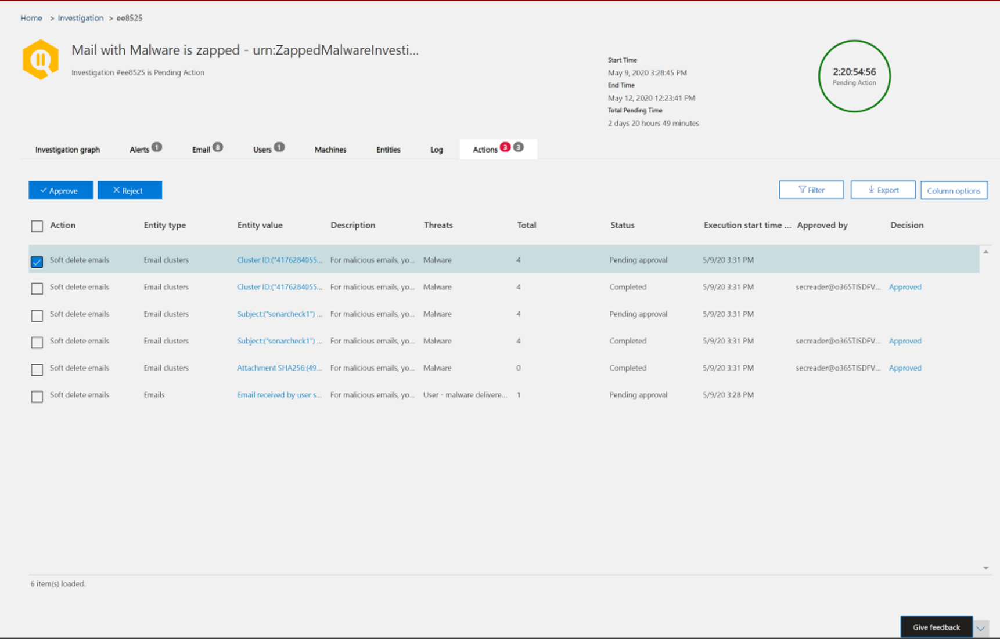

# 修復 Office 365 中傳遞的惡意電子郵件

修正是指對威脅採取 proscribed 動作。 傳送給您組織的惡意電子郵件可以由系統清除，不論是透過零小時自動清除 (ZAP) ，還是由安全小組透過修復動作（如 *移至 [收件*匣]、[ *移至垃圾*郵件]、[ *移至刪除的郵件*]、[ *虛刪除*] 或 [ *實刪除*]）來清除。 Office Advanced 威脅防護 (Office ATP) P2/E5 可讓安全小組透過手動和自動調查來修正電子郵件和共同作業功能的威脅。

> [!NOTE]
> 若要修正惡意電子郵件，安全性小組需要指派的 *搜尋和清除* 角色。 角色指派是透過安全性與合規性中心的許可權來完成。

## 開始之前所需注意的事項

若要執行類似 view message 標頭或下載電子郵件內容等動作，您必須要有一個名為 *preview* 的新角色，以新增至另一個適當的角色群組。 下表顯示必要的角色和許可權。

****

|活動|角色群組|需要*預覽*角色？|
|---|---|---|
|使用威脅瀏覽器 (和即時偵測) 來分析威脅 |全域系統管理員   安全性系統管理員   安全性讀取者|否|
|使用威脅瀏覽器 (和即時偵測) 來查看電子郵件訊息的標題，以及預覽及下載隔離的電子郵件|全域系統管理員   安全性系統管理員  安全性讀取者|否|
|使用威脅瀏覽器來查看標頭，並下載傳送至信箱的電子郵件|全域系統管理員  安全性系統管理員   安全性讀取者   預覽|是|

> [!NOTE]
> Preview 是 *角色*，不是 *角色群組*。 預覽角色必須新增至 Office 365 的現有角色群組。 *全域系統管理員角色*會指派于[Microsoft 365 系統管理中心](https://admin.microsoft.com)。 安全性管理員和安全性讀取者角色會指派在 [安全性與合規性中心](https://protection.office.com)。 若要深入瞭解角色和許可權，請參閱 [安全性與合規性中心的許可權](permissions-in-the-security-and-compliance-center.md)。

> [!NOTE]
> 系統管理員可以對電子郵件採取必要的動作，但若要取得那些已核准的動作，他們必須透過**安全性與合規性中心**許可權，將*搜尋和清除*角色指派給他們  >  ** **。

## 手動及自動修復

當安全性小組使用威脅瀏覽器中的搜尋和篩選功能手動識別威脅時，就會發生*手動搜尋*。 在您識別出一組需要補救的電子郵件之後，就可以透過任何電子郵件 view (*惡意*代碼、 *網路釣魚*或 *所有電子郵件*) 來觸發手動電子郵件修復。

安全小組可以使用威脅瀏覽器，以多種方式選取電子郵件：

- 手動選擇電子郵件：在不同的視圖中使用篩選器。 最多選取100封電子郵件進行修正。

- 查詢選取範圍：使用上方 **全選** 按鈕選取整個查詢。 同樣的查詢也會顯示在動作中心郵件提交詳細資料中。

- 具有排除的查詢選取專案：有時候，安全性作業小組可能會想要透過選取整個查詢，並從查詢手動排除特定電子郵件，以修正電子郵件。 若要這樣做，系統管理員可以使用 [ **全選** ] 核取方塊，然後向下滾動以手動排除電子郵件。 查詢最多可保留1000封電子郵件。 排除數目上限為100。

透過威脅瀏覽器選取電子郵件之後，您可以採取直接動作或將電子郵件排隊以執行動作，以啟動修復：

- 直接核准：當具有適當許可權的安全性人員，移至 [ *收件*匣]、[ *移至垃圾*郵件]、[ *移至刪除的專案*]、[ *虛刪除*] 或 [ *實刪除* ] 動作時，修正程式會開始執行選取的動作。 暫時飛入顯示進行中的修復。

- 兩個步驟的核准：系統管理員可以採取「新增至修正」動作，讓系統管理員沒有適當的許可權，或需要等候執行該動作。 在此情況下，會將目標電子郵件新增至修復容器。 需要核准，才能執行修復。

**自動調查和回應** 動作會由警示或由威脅瀏覽器的安全性作業小組觸發。 這可能包括安全操作小組必須核准的建議修正動作。 這些動作會包含在自動調查的 [ **動作** ] 索引標籤中。

所有 remediations (在威脅瀏覽器中建立的直接核准或兩步驟核准) ，以及來自自動調查的核准動作都會顯示在重要中心。 透過「**審閱**」  >  **動作中心**下的左導覽面板存取這些功能。

「行動中心」顯示過去30天的所有修復動作。 透過威脅瀏覽器所採取的動作會以安全操作小組在建立修復時所提供的名稱列出。 透過「自動化調查」採取的動作，其標題是以觸發調查的相關警示開始，例如「Zap 電子郵件叢集 ...」。 ."

開啟任何修復專案以查看其詳細資料，包括其名稱、建立日期、描述、威脅嚴重性及狀態。 它也會顯示下列兩個選項卡。

- [**郵件提交**] 索引標籤：顯示透過威脅瀏覽器提交的電子郵件數目，或要補救的自動調查。 這些電子郵件可能可操作或無法採取行動。  

   - **可行**：下列雲端信箱位置中的電子郵件可以進行處理及移動：

     - 收件匣
     - 垃圾
     - 已刪除資料夾
     - 虛刪除資料夾

     > [!NOTE]
     > 目前只有具有信箱存取權的使用者可以從虛刪除的資料夾復原專案。

   - **不可行**：下列位置中的電子郵件無法在修正動作中處理或移動：

     - 隔離
     - 實刪除資料夾
     - 內部部署/外部
     - 失敗/丟棄

   可疑郵件會分類為 remediable 或 nonremediable。 在大多數情況下，remediable 和 nonremediable 郵件會結合為已提交的郵件總數。 但在極少的情況下，這可能不是 true。 這可能是因為系統延遲、超時或過期的郵件而發生。 郵件會根據組織的威脅瀏覽器保留期間而過期。

   除非您在組織的威脅瀏覽器保留期間修正舊郵件，否則建議您在發現數位不一致時，重新嘗試補救專案。 針對系統延遲，修正更新通常會在幾個小時內重新整理。

   如果組織在威脅瀏覽器中的電子郵件保留期間是30天，而您修正電子郵件會追溯29-30 天，則郵件提交數目可能不會總增加。 電子郵件可能已開始從保留期間內移出。

   如果 remediations 在一段時間內停滯為「進行中」狀態，可能是因為系統延遲。 修正會花幾小時的時間。 您可能會看到郵件提交計數中的變化，因為某些電子郵件可能由於系統延遲而不會包含在修正開始時的查詢。 在這種情況下，最好重新嘗試補救。

  >[!Note]
  >為了獲得最佳結果，修正應以50000或更少的批次完成。

   修復期間只會處理 remediable 電子郵件。 Office 365 電子郵件系統無法修正 Nonremediable 電子郵件，因為它們不是儲存在雲端信箱中。

   系統管理員可以在隔離的電子郵件上採取動作（如有必要），但是如果不是手動清除，則這些電子郵件會因隔離區而過期。 使用者無法存取因惡意內容而隔離的電子郵件，因此安全性人員不需要採取任何動作來消除隔離威脅。 如果電子郵件是內部部署或外部電子郵件，則可以聯繫使用者來處理可疑的電子郵件。 或者，系統管理員可以使用個別的電子郵件伺服器/安全性工具來進行移除。 您可以在威脅瀏覽器中套用 *傳遞位置 = 部署* 外部篩選，以識別這些電子郵件。 若失敗或丟的電子郵件，或是使用者無法存取的電子郵件，就不會有任何電子郵件可遭到緩解，因為這些郵件不會到達信箱。

   下圖顯示提交在重要訊息中心中的外觀。 修正可包含多個提交。 如果透過一次自動調查取得多個動作，則每個電子郵件或電子郵件叢集動作都會以不同提交的修復方式出現。

   

   選取 [郵件提交專案] 以顯示該修復程式的詳細資料，例如，在透過自動調查或威脅瀏覽器觸發修正時所進行的查詢 (，只要選取查詢) 以及修正的開始和結束時間。 它也會顯示已送出以進行修正的郵寄清單。 當郵件移出威脅瀏覽器保留期間時，郵件會從此清單消失。 清單中也會顯示 remediable 的個別郵件。

- **動作記錄**：此索引標籤會顯示修正的郵件，包括核准的日期、核准動作的系統管理員、動作、狀態及計數。

   狀態可以是：

     - **已啟動**：已觸發修復。
     - 已**排入佇列**：修復會排隊等候電子郵件的緩解。
     - **進行中**：緩解正在進行中。
     - **已完成**：所有 remediable 電子郵件的緩解動作都已成功完成或發生某些失敗。
     - **失敗**：沒有 remediations 成功。

   因為只有 remediable 電子郵件可以處理，所以每封電子郵件的清除都會顯示為成功或失敗。 在 remediable 的電子郵件總數中，會報告成功和失敗的緩解。

   - **成功**：對 remediable 電子郵件所需的動作已完成。 例如：系統管理員想要移除信箱中的電子郵件，讓系統管理員採取虛刪除電子郵件的動作。 如果在採取動作後原始檔案夾中找不到 remediable 電子郵件，則狀態會顯示為 [成功]。

   - **失敗**：對 remediable 電子郵件所需的動作失敗。 例如：系統管理員想要移除信箱中的電子郵件，讓系統管理員採取虛刪除電子郵件的動作。 如果在採取動作後，在信箱中仍然會找到 remediable 電子郵件，則狀態會顯示為 [失敗]。

   選取動作記錄檔中的任何專案，以顯示修正詳細資料。 如果詳細資料說「成功」或「在信箱中找不到」，表示該專案已經從信箱中移除。 有時候，修復期間發生系統性錯誤。 在這種情況下，重試修正是一個不錯的做法。

 修正是一種強大的工具，可減輕威脅，並處理可疑的電子郵件。 這有助於維護組織的安全。

