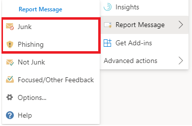
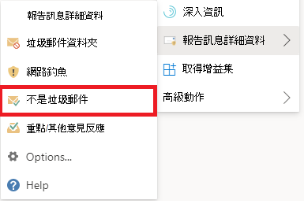

# 在 Outlook 中報告誤判和漏報

[!INCLUDE [Microsoft 365 Defender rebranding](../includes/microsoft-defender-for-office.md)]

**適用於**
- [Exchange Online Protection](exchange-online-protection-overview.md)
- [適用於 Office 365 的 Microsoft Defender 方案 1 和方案 2](defender-for-office-365.md)
- [Microsoft 365 Defender](../defender/microsoft-365-defender.md)

> [!NOTE]
> 如果您是具有 Exchange Online 信箱的 Microsoft 365 組織中的系統管理員，建議您在 Microsoft 365 Defender 入口網站中使用 [**提交**] 頁面。 如需詳細資訊，請參閱 [使用系統管理員提交將可疑的垃圾郵件、網路釣魚、URLs 和檔案提交給 Microsoft](admin-submission.md)。

在使用混合式新式驗證的 Exchange Online 或內部部署信箱中使用信箱的 Microsoft 365 組織中，您可以提交 (誤報) 的電子郵件，或傳送至 [垃圾郵件] 資料夾的錯誤電子郵件， (已傳遞至 [收件匣]) 的有害電子郵件或網路釣魚 Exchange Online Protection () EOP。

## 開始之前有哪些須知？

- 為了獲得最佳的使用者提交經驗，請使用報告訊息增益集或報告網路釣魚增益集。

  > [!IMPORTANT]
  > 在 Outlook 中報告垃圾郵件或網路釣魚的內建經驗，無法使用[使用者提交原則](./user-submission.md)。 建議您改為使用報表訊息增益集或報表網路釣魚增益集。

- 在所有平臺中 Outlook (Outlook 網頁版、iOS、Android 和桌面) 的報告訊息增益集和報告網路釣魚增益集均可運作。

- 如果您是組織中 Exchange Online 信箱的系統管理員，請使用 Microsoft 365 Defender 入口網站中的提交入口網站。 如需詳細資訊，請參閱 [使用系統管理員提交將可疑的垃圾郵件、網路釣魚、URLs 和檔案提交給 Microsoft](admin-submission.md)。

- 您可以設定為將郵件直接傳送到 Microsoft、您指定的信箱，或兩者皆傳送。 如需詳細資訊，請參閱 [使用者報送原則](user-submission.md)。

- 如需如何取得及啟用報告訊息或報告網路釣魚增益集的詳細資訊，請參閱 [enable The Report message or The Report 仿冒增益集](enable-the-report-message-add-in.md)。

- 如需將郵件報告給 Microsoft 的詳細資訊，請參閱 [將郵件和檔案報告給 microsoft](report-junk-email-messages-to-microsoft.md)。

## 使用報告郵件功能

### 報告垃圾郵件和網路釣魚郵件

對於收件匣或任何其他電子郵件資料夾（除了垃圾郵件）以外的郵件，請使用下列方法來報告垃圾郵件和網路釣魚郵件：

1. 選取所選郵件右上角的 [ **其他動作** ] 省略號，從下拉式功能表選取 [ **報告訊息** ]，然後選取 [ **垃圾** 郵件] 或 [ **網路釣魚**]。

   

   

2. 選取的郵件會傳送至 Microsoft 進行分析，並：
   - 移至 [垃圾郵件] 資料夾（如果他們已舉報為垃圾郵件）。
   - 會在報告為網路釣魚時刪除。

### 報告非垃圾郵件

1. 選取所選郵件右上角的 [ **其他動作** ] 省略號，選取下拉式功能表中的 [ **報告訊息** ]，然後選取 [不是 **垃圾** 郵件]。

   

   

2. 選取的郵件會傳送至 Microsoft 進行分析，然後移至 [收件匣] 或任何其他指定的資料夾。

## 查看和審閱報告的郵件

若要查看使用者向 Microsoft 報告的郵件，您可以使用下列選項：

- 使用 Microsoft 365 Defender 入口網站中的 [**提交**] 頁面。 如需詳細資訊，請參閱 [View user 報送 To Microsoft](admin-submission.md#view-user-submissions-to-microsoft)。
- 建立郵件流程規則 (也稱為傳輸規則) 傳送報告郵件的副本。 如需相關指示，請參閱 [使用郵件流程規則來查看向 Microsoft 報告的使用者](/exchange/security-and-compliance/mail-flow-rules/use-rules-to-see-what-users-are-reporting-to-microsoft)。
