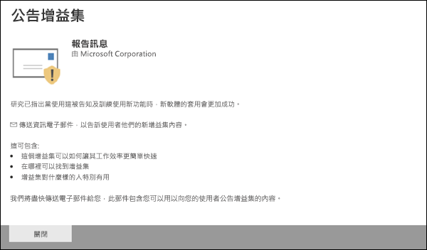
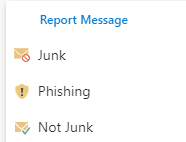

# 報告 Outlook 中的誤報和漏報Report false positives and false negatives in Outlook

[!INCLUDE [Microsoft 365 Defender rebranding](../includes/microsoft-defender-for-office.md)]

**適用於****Applies to**
- [Exchange Online ProtectionExchange Online Protection](exchange-online-protection-overview.md)
- [適用於 Office 365 的 Microsoft Defender 方案 1 和方案 2Microsoft Defender for Office 365 plan 1 and plan 2](defender-for-office-365.md)
- [Microsoft 365 DefenderMicrosoft 365 Defender](../defender/microsoft-365-defender.md)

> [!NOTE]
> 如果您是使用 Exchange Online 信箱的 Microsoft 365 組織中的系統管理員，建議您在安全性 & 合規性中心使用提交入口網站。If you're an admin in a Microsoft 365 organization with Exchange Online mailboxes, we recommend that you use the Submissions portal in the Security & Compliance Center. 如需詳細資訊，請參閱 [使用系統管理員提交將可疑的垃圾郵件、網路釣魚、URLs 和檔案提交給 Microsoft](admin-submission.md)。For more information, see [Use Admin Submission to submit suspected spam, phish, URLs, and files to Microsoft](admin-submission.md).

在使用混合式新式驗證的 Exchange Online 或內部部署信箱中具有信箱的 Microsoft 365 組織中，您可以提交誤報 (已標示為垃圾郵件的良好電子郵件) 和 false 負片 () Exchange Online Protection (EOP) 的電子郵件和網路釣魚。In Microsoft 365 organizations with mailboxes in Exchange Online or on-premises mailboxes using hybrid modern authentication, you can submit false positives (good email marked as spam) and false negatives (bad email and phish allowed) to Exchange Online Protection (EOP).

## 使用報告郵件功能之前需要記住的事項Things to remember before you use the Report Message feature

- 為了獲得最佳的使用者提交經驗，請使用報告訊息增益集或報告網路釣魚增益集。For the best user submission experience, use the Report Message add-in or the Report Phishing add-in.

- 請注意，此增益集適用于所有平臺上的 Outlook：在網頁、iOS、Android 和桌面。Note that this add-in works for Outlook in all platforms—on the web, iOS, Android, and Desktop.

- 如果您是 Exchange Online 信箱組織中的系統管理員，請使用安全性 & 規範中心中的提交入口網站。If you're an admin in an organization with Exchange Online mailboxes, use the Submissions portal in the Security & Compliance Center. 如需詳細資訊，請參閱 [使用系統管理員提交將可疑的垃圾郵件、網路釣魚、URLs 和檔案提交給 Microsoft](admin-submission.md)。For more information, see [Use Admin Submission to submit suspected spam, phish, URLs, and files to Microsoft](admin-submission.md).

- 您可以設定為將郵件直接傳送到 Microsoft、您指定的信箱，或兩者皆傳送。You can configure to send messages directly to Microsoft, a mailbox you specify, or both. 如需詳細資訊，請參閱 [使用者報送原則](user-submission.md)。For more information, see [User submissions policies](user-submission.md).

- 如需將郵件報告給 Microsoft 的詳細資訊，請參閱 [將郵件和檔案報告給 microsoft](report-junk-email-messages-to-microsoft.md)。For more information about reporting messages to Microsoft, see [Report messages and files to Microsoft](report-junk-email-messages-to-microsoft.md).

## 使用報告郵件功能Use the Report Message feature

### 報告垃圾郵件和網路釣魚郵件Report junk and phishing messages

對於收件匣或任何其他電子郵件資料夾（除了垃圾郵件）以外的郵件，請使用下列方法來報告垃圾郵件和網路釣魚郵件：For messages in the Inbox or any other email folder except Junk Email, use the following method to report spam and phishing messages:

1. 按一下所選郵件右上角的 [ **其他動作** ] 省略號，按一下下拉式功能表中的 [ **報告郵件** ]，然後選取 [ **垃圾** 郵件] 或 [ **網路釣魚**]。Click the **More actions** ellipses on the top-right corner of the selected message, click **Report message** from the dropdown menu, and then select **Junk** or **Phishing**.
  
   > [!div class="mx-imgBorder"]
   > 

   > [!div class="mx-imgBorder"]
   > 

2. 選取的郵件會傳送至 Microsoft 進行分析，並：The selected messages will be sent to Microsoft for analysis and:

   - 移至 [垃圾郵件] 資料夾（如果已舉報為垃圾郵件）。Moved to the Junk Email folder if it was reported as spam.

   - 已刪除，如果已報告為網路釣魚。Deleted if it was reported as phishing.
   
### 報告非垃圾郵件Report messages that are not junk

1. 按一下所選郵件右上角的 [ **其他動作** ] 省略號，按一下下拉式功能表中的 [ **報告郵件** ]，然後按一下 [ **非垃圾** 郵件]。Click the **More actions** ellipses on the top-right corner of the selected message, click **Report message** from the dropdown menu, and then click **Not Junk**.  

   > [!div class="mx-imgBorder"]
   > 

   > [!div class="mx-imgBorder"]
   > 

2. 選取的郵件會傳送至 Microsoft 進行分析，然後移至 [收件匣] 或任何其他指定的資料夾。The selected message will be sent to Microsoft for analysis and moved to Inbox or any other specified folder.

## 啟用報告訊息和報告網路釣魚增益集Enable the Report Message and Report Phishing add-ins

「Outlook」和「Outlook」 (上的「outlook」和「Outlook」的報告訊息和報告網路增益集（以前稱為 Outlook Web App）) 可讓使用者輕鬆報告誤報， (正確的電子郵件會標示為壞的) 或 false 的電子郵件， (錯誤的電子郵件可供 Microsoft 及其公司的分析使用。The Report Message and Report Phishing add-ins for Outlook and Outlook on the web (formerly known as Outlook Web App) enable people to easily report false positives (good email marked as bad) or false negatives (bad email allowed) to Microsoft and its affiliates for analysis. 

Microsoft 會使用這些提交來改善電子郵件防護技術的有效性。Microsoft uses these submissions to improve the effectiveness of email protection technologies. 例如，假設有人使用「報告網路釣魚增益集」報告許多郵件。For example, suppose that people are reporting many messages using the Report Phishing add-in. 此資訊會顯示在安全性儀表板及其他報告中。This information surfaces in the Security Dashboard and other reports. 貴組織的安全性小組可以使用此資訊來表示可能需要更新防網路釣魚原則。Your organization's security team can use this information as an indication that anti-phishing policies might need to be updated. 

您可以安裝報告訊息或報告網路釣魚增益集。You can install either the Report Message or Report Phishing add-in. 如果您想要讓使用者報告垃圾郵件和網路釣魚郵件，請在您的組織中部署報告訊息增益集。If you want your users to report both spam and phishing messages, deploy the Report Message add-in in your organization. 如需詳細資訊，請參閱 Enable the Report Message 增益集。For more information, see Enable the Report Message add-in. 

報告郵件增益集提供的選項可報告垃圾郵件和網路釣魚郵件。The Report Message add-in provides the option to report both spam and phishing messages. 系統管理員可以為組織啟用「報告訊息增益集」，個別使用者可以自行自行安裝。Admins can enable the Report Message add-in for the organization, and individual users can install it for themselves. 

報告網路釣魚增益集提供的選項可報告僅網路釣魚郵件。The Report Phishing add-in provides the option to report only phishing messages. 系統管理員可以為組織啟用「報告網路釣魚增益集」，個別使用者可以自行自行安裝。Admins can enable the Report Phishing add-in for the organization, and individual users can install it for themselves. 

如果您是個別的使用者，您可以為自己啟用增益集。If you're an individual user, you can enable both the add-ins for yourself.

f 您是全域系統管理員或 Exchange Online 系統管理員，且 Exchange 設定成使用 OAuth 驗證，您可以為組織啟用報告訊息增益集和報告網路釣魚增益集。f you're a global administrator or an Exchange Online administrator, and Exchange is configured to use OAuth authentication, you can enable the Report Message add-in and the Report Phishing add-in for your organization. 這兩個增益集現在均可透過 [集中式部署](../../admin/manage/centralized-deployment-of-add-ins.md)使用。Both add-ins are now available through [Centralized Deployment](../../admin/manage/centralized-deployment-of-add-ins.md).

## 開始之前有哪些須知？What do you need to know before you begin?

- 報告訊息增益集和報告網路釣魚增益集均可搭配大多數 Microsoft 365 訂閱和下列產品使用：Both the Report Message add-in and the Report Phishing add-in works with most Microsoft 365 subscriptions and the following products:

  - Outlook 網頁版Outlook on the web
  - Outlook 2013 SP1 或更新版本Outlook 2013 SP1 or later
  - Mac 版 Outlook 2016Outlook 2016 for Mac
  - Outlook 隨附于適用于企業的 Microsoft 365 應用程式Outlook included with Microsoft 365 apps for Enterprise
  - 適用于 iOS 和 Android 的 Outlook 應用程式Outlook app for iOS and Android

- 在內部部署 Exchange 組織中，這兩種增益集不能用於共用信箱或信箱。Both add-ins are not available for shared mailboxes or mailboxes in on-premises Exchange organizations.

- 您的現有網頁瀏覽器應該同時搭配報告訊息和報告網路釣魚增益集。不過，如果您注意到增益集無法使用或如預期般運作，請嘗試其他瀏覽器。Your existing web browser should work with both the Report Message and Report Phishing add-ins. But, if you notice the add-in is not available or not working as expected, try a different browser.

- 若為組織安裝，必須設定組織使用 OAuth 驗證。For organizational installs, the organization needs to be configured to use OAuth authentication. 如需詳細資訊，請參閱 [判斷是否集中式部署的增益集可為您的組織運作](../../admin/manage/centralized-deployment-of-add-ins.md)。For more information, see [Determine if Centralized Deployment of add-ins works for your organization](../../admin/manage/centralized-deployment-of-add-ins.md).

- 管理員必須是全域系統管理員角色群組的成員。Admins need to be a member of the Global admins role group. 如需詳細資訊，請參閱[安全性與合規性中心中的權限](permissions-in-the-security-and-compliance-center.md)。For more information, see [Permissions in the Security & Compliance Center](permissions-in-the-security-and-compliance-center.md).

## 取得報告訊息增益集Get the Report Message add-in

### 取得您自己的增益集Get the add-in for yourself

1. 移至 Microsoft AppSource <https://appsource.microsoft.com/marketplace/apps> ，並搜尋報告訊息增益集。Go to the Microsoft AppSource at <https://appsource.microsoft.com/marketplace/apps> and search for the Report Message add-in. 若要直接移至報告訊息增益集，請移至 <https://appsource.microsoft.com/product/office/wa104381180> 。To go directly to the Report Message add-in, go to <https://appsource.microsoft.com/product/office/wa104381180>.

2. 按一下 [ **立即取得**]。Click **GET IT NOW**.

   

3. 在出現的對話方塊中，複查使用條款和隱私權原則，然後按一下 [ **繼續**]。In the dialog that appears, review the terms of use and privacy policy, and then click **Continue**.

4. 使用您的工作或學校帳戶登入 (商務用) 或您的 Microsoft 帳戶 (個人用途) 。Sign in using your work or school account (for business use) or your Microsoft account (for personal use).

安裝並啟用增益集之後，您會看到下列圖示：After the add-in is installed and enabled, you'll see the following icons:

- 在 Outlook 中，圖示如下所示：In Outlook, the icon looks like this:

  > [!div class="mx-imgBorder"]
  > 

- 在 Outlook 網頁版中，圖示如下所示：In Outlook on the web, the icon looks like this:

  > [!div class="mx-imgBorder"]
  > 

### 取得組織的增益集Get the add-in for your organization

> [!NOTE]
> 在您的組織中顯示增益集可能需要長達12小時。It could take up to 12 hours for the add-in to appear in your organization.

1. 在 Microsoft 365 系統管理中心中，移至 [ **設定** \> **增益集** ] 頁面，網址為 <https://admin.microsoft.com/AdminPortal/Home#/Settings/AddIns> 。In the Microsoft 365 admin center, go to the go to the **Settings** \> **Add-ins** page at <https://admin.microsoft.com/AdminPortal/Home#/Settings/AddIns>. 如果您看不到 [**增益集**] 頁面，請移至 [整合式應用程式] 頁面頂端的 [**設定** \> **整合式應用程式** \> **增益集**] 連結。 If you don't see the **Add-in** Page, go to the **Settings** \> **Integrated apps** \> **Add-ins** link on the top of the **Integrated apps** page.

2. 選取頁面頂端的 [ **部署增益集** ]，然後選取 **[下一步]**。Select **Deploy Add-in** at the top of the page, and then select **Next**.

   ![Microsoft 365 系統管理中心的 [服務和增益集] 頁面](../../media/ServicesAddInsPageNewM365AdminCenter.png)

3. 在出現的 **新增益集** 浮出視窗中，複查資訊，然後按 **[下一步]**。In the **Deploy a new add-in** flyout that appears, review the information, and then click **Next**.

4. 在下一個頁面上，按一下 **[從儲存區選擇**]。On the next page, click **Choose from the Store**.

   

5. 在出現的 [ **選取增益集** ] 頁面上，按一下 [ **搜尋** ] 方塊，輸入 **報告訊息**，然後按一下 [ **搜尋** ![ 搜尋] 圖示 ](../../media/search-icon.png) 。In the **Select add-in** page that appears, click in the **Search** box, enter **Report Message**, and then click **Search** . 在結果清單中，尋找 [ **報告訊息** ]，然後按一下 [ **新增**]。In the list of results, find **Report Message** and then click **Add**.

   

6. 在出現的對話方塊中，複查授權和隱私權資訊，然後按一下 [ **繼續**]。In the dialog that appears, review the licensing and privacy information, and then click **Continue**.

7. 在出現的 [ **設定增益集** ] 頁面中，設定下列設定：In the **Configure add-in** page that appears, configure the following settings:

   - **指派的使用者**：選取下列其中一個值：**Assigned users**: Select one of the following values:

     - **所有人** (預設) **Everyone** (default)
     - **特定使用者/群組****Specific users / groups**
     - **就我自己****Just me**

   - **部署方法**：選取下列其中一個值：**Deployment method**: Select one of the following values:

     - **Fixed (預設)**：增益集會自動部署至指定的使用者，且無法加以移除。**Fixed (Default)**: The add-in is automatically deployed to the specified users and they can't remove it.
     - **可用**：使用者可以在 **Home** \> **Get 增益集** \> **管理管理** 的位置安裝增益集。**Available**: Users can install the add-in at **Home** \> **Get add-ins** \> **Admin-managed**.
     - **選用**：增益集會自動部署至指定的使用者，但是可以選擇加以移除。**Optional**: The add-in is automatically deployed to the specified users, but they can choose to remove it.

   

   當您完成時，按一下 [ **部署**]。When you're finished, click **Deploy**.

8. 在出現的 [ **部署報告郵件** ] 頁面中，您會看到進度報告，接著會出現部署增益集的確認。In the **Deploy Report Message** page that appears, you'll see a progress report followed by a confirmation that the add-in was deployed. 閱讀資訊後，請按 **[下一步]**。After you read the information, click **Next**.

   

9. 在出現的 **宣告增益集** 頁面上，複查資訊，然後按一下 [ **關閉**]。On the **Announce add-in** page that appears, review the information, and then click **Close**.

   

## 檢閱或編輯報告訊息增益集的設定Review or edit settings for the Report Message add-in

1. 在 Microsoft 365 系統管理中心中，移至 [ **設定** \> **增益集** ] 頁面，網址為 <https://admin.microsoft.com/AdminPortal/Home#/Settings/AddIns> 。In the Microsoft 365 admin center, go to the go to the **Settings** \> **Add-ins** page at <https://admin.microsoft.com/AdminPortal/Home#/Settings/AddIns>. 如果您看不到 [**增益集**] 頁面，請移至 [整合式應用程式] 頁面頂端的 [**設定** \> **整合式應用程式** \> **增益集**] 連結。 If you don't see the **Add-in** Page, go to the **Settings** \> **Integrated apps** \> **Add-ins** link on the top of the **Integrated apps** page.

   

2. 尋找並選取 **報告訊息** 增益集。Find and select the **Report Message** add-in.

3. 在顯示的 [ **編輯報告訊息** ] 浮出視窗中，視組織的需要複查及編輯設定。In the **Edit Report Message** flyout that appears, review and edit settings as appropriate for your organization. 完成後，點擊 **[儲存]**。When you're finished, click **Save**.

   

## 取得報告網路釣魚增益集Get the Report Phishing add-in

### 取得您自己的增益集Get the add-in for yourself

1. 移至 Microsoft AppSource <https://appsource.microsoft.com/marketplace/apps> ，並搜尋報表網路釣魚增益集。Go to the Microsoft AppSource at <https://appsource.microsoft.com/marketplace/apps> and search for the Report Phishing add-in.

2. 按一下 [ **立即取得**]。Click **GET IT NOW**.

3. 在出現的對話方塊中，複查使用條款和隱私權原則，然後按一下 [ **繼續**]。In the dialog that appears, review the terms of use and privacy policy, and then click **Continue**.

4. 使用您的工作或學校帳戶登入 (商務用) 或您的 Microsoft 帳戶 (個人用途) 。Sign in using your work or school account (for business use) or your Microsoft account (for personal use).

安裝並啟用增益集之後，您會看到下列圖示：After the add-in is installed and enabled, you'll see the following icons:

- 在 Outlook 中，圖示如下所示：In Outlook, the icon looks like this:

  

- 在 Outlook 網頁版中，圖示如下所示：In Outlook on the web, the icon looks like this:

  > [!div class="mx-imgBorder"]
  > 

### 取得組織的增益集Get the add-in for your organization

> [!NOTE]
> 在您的組織中顯示增益集可能需要長達12小時。It could take up to 12 hours for the add-in to appear in your organization.

1. 在 Microsoft 365 系統管理中心中，移至 [ **設定** \> **增益集** ] 頁面，網址為 <https://admin.microsoft.com/AdminPortal/Home#/Settings/AddIns> 。In the Microsoft 365 admin center, go to the go to the **Settings** \> **Add-ins** page at <https://admin.microsoft.com/AdminPortal/Home#/Settings/AddIns>. 如果您看不到 [**增益集**] 頁面，請移至 [整合式應用程式] 頁面頂端的 [**設定** \> **整合式應用程式** \> **增益集**] 連結。 If you don't see the **Add-in** Page, go to the **Settings** \> **Integrated apps** \> **Add-ins** link on the top of the **Integrated apps** page.

2. 選取頁面頂端的 [ **部署增益集** ]，然後選取 **[下一步]**。Select **Deploy Add-in** at the top of the page, and then select **Next**.

   ![Microsoft 365 系統管理中心的 [服務和增益集] 頁面](../../media/ServicesAddInsPageNewM365AdminCenter.png)

3. 在出現的 **新增益集** 浮出視窗中，複查資訊，然後按 **[下一步]**。In the **Deploy a new add-in** flyout that appears, review the information, and then click **Next**.

4. 在下一個頁面上，按一下 **[從儲存區選擇**]。On the next page, click **Choose from the Store**.

   

5. 在出現的 [ **選取增益集** ] 頁面上，按一下 [ **搜尋** ] 方塊中的 [ **報告網路釣魚**]，然後按一下 [ **搜尋** ![ 搜尋] 圖示 ](../../media/search-icon.png) 。In the **Select add-in** page that appears, click in the **Search** box, enter **Report Phishing**, and then click **Search** . 在結果清單中，尋找 [ **報告網路釣魚** ]，然後按一下 [ **新增**]。In the list of results, find **Report Phishing** and then click **Add**.

6. 在出現的對話方塊中，複查授權和隱私權資訊，然後按一下 [ **繼續**]。In the dialog that appears, review the licensing and privacy information, and then click **Continue**.

7. 在出現的 [ **設定增益集** ] 頁面中，設定下列設定：In the **Configure add-in** page that appears, configure the following settings:

   - **指派的使用者**：選取下列其中一個值：**Assigned users**: Select one of the following values:

     - **所有人** (預設) **Everyone** (default)
     - **特定使用者/群組****Specific users / groups**
     - **就我自己****Just me**

   - **部署方法**：選取下列其中一個值：**Deployment method**: Select one of the following values:

     - **Fixed (預設)**：增益集會自動部署至指定的使用者，且無法加以移除。**Fixed (Default)**: The add-in is automatically deployed to the specified users and they can't remove it.
     - **可用**：使用者可以在 **Home** \> **Get 增益集** \> **管理管理** 的位置安裝增益集。**Available**: Users can install the add-in at **Home** \> **Get add-ins** \> **Admin-managed**.
     - **選用**：增益集會自動部署至指定的使用者，但是可以選擇加以移除。**Optional**: The add-in is automatically deployed to the specified users, but they can choose to remove it.

   當您完成時，按一下 [ **部署**]。When you're finished, click **Deploy**.

8. 在出現的 [ **部署報告網路釣魚** ] 頁面中，您會看到進度報告，接著會出現部署增益集的確認。In the **Deploy Report Phishing** page that appears, you'll see a progress report followed by a confirmation that the add-in was deployed. 閱讀資訊後，請按 **[下一步]**。After you read the information, click **Next**.

9. 在出現的 **宣告增益集** 頁面上，複查資訊，然後按一下 [ **關閉**]。On the **Announce add-in** page that appears, review the information, and then click **Close**.

## 查看或編輯報表網路釣魚增益集的設定Review or edit settings for the Report Phishing add-in

1. 在 Microsoft 365 系統管理中心中，移至 [ **設定** \> **增益集** ] 頁面，網址為 <https://admin.microsoft.com/AdminPortal/Home#/Settings/AddIns> 。In the Microsoft 365 admin center, go to the go to the **Settings** \> **Add-ins** page at <https://admin.microsoft.com/AdminPortal/Home#/Settings/AddIns>. 如果您看不到 [**增益集**] 頁面，請移至 [整合式應用程式] 頁面頂端的 [**設定** \> **整合式應用程式** \> **增益集**] 連結。 If you don't see the **Add-in** Page, go to the **Settings** \> **Integrated apps** \> **Add-ins** link on the top of the **Integrated apps** page.

2. 尋找並選取 **報告網路釣魚** 增益集。Find and select the **Report Phishing** add-in.

3. 在 [ **編輯報告的網路釣魚** ] 浮出控制項中，視您的組織而定，會顯示、審閱及編輯設定。In the **Edit Report Phishing** flyout that appears, review, and edit settings as appropriate for your organization. 完成後，點擊 **[儲存]**。When you're finished, click **Save**.

## 查看和審閱報告的郵件View and review reported messages

若要查看使用者向 Microsoft 報告的郵件，您可以使用下列選項：To review messages that users report to Microsoft, you have these options:

- 使用系統管理提交入口網站。Use the Admin Submissions portal. 如需詳細資訊，請參閱 [View user 報送 To Microsoft](admin-submission.md#view-user-submissions-to-microsoft)。For more information, see [View user submissions to Microsoft](admin-submission.md#view-user-submissions-to-microsoft).

- 建立郵件流程規則 (也稱為傳輸規則) 傳送報告郵件的副本。Create a mail flow rule (also known as a transport rule) to send copies of reported messages. 如需相關指示，請參閱 [使用郵件流程規則來查看您的使用者向 Microsoft 報告的內容](use-mail-flow-rules-to-see-what-your-users-are-reporting-to-microsoft.md)。For instructions, see [Use mail flow rules to see what your users are reporting to Microsoft](use-mail-flow-rules-to-see-what-your-users-are-reporting-to-microsoft.md).