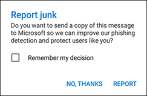

# 在適用于 Exchange Online 的 iOS 和 Android 的 Outlook 中報告垃圾郵件和網路釣魚電子郵件

[!INCLUDE [Microsoft 365 Defender rebranding](../includes/microsoft-defender-for-office.md)]

**適用於**
- [Exchange Online Protection](https://go.microsoft.com/fwlink/?linkid=2148611)
- [適用於 Office 365 的 Microsoft Defender 方案 1 和方案 2](https://go.microsoft.com/fwlink/?linkid=2148715)
- [Microsoft 365 Defender](https://go.microsoft.com/fwlink/?linkid=2118804)

在使用 [混合式新式驗證](https://docs.microsoft.com/microsoft-365/enterprise/hybrid-modern-auth-overview)的 Exchange Online 或內部部署信箱中有信箱的 Microsoft 365 組織中，您可以使用內建的報告選項，在 Outlook 中 IOS 和 Android 提交誤報 (正常電子郵件標示為垃圾郵件) 、false 負片 (不良電子郵件允許) ，以及網路釣魚郵件至 Exchange Online PROTECTION (EOP) 。

## 開始之前，您必須瞭解哪些事項

- 如果您是 Exchange Online 信箱組織中的系統管理員，建議您在安全性 & 規範中心內使用提交入口網站。 如需詳細資訊，請參閱 [使用系統管理員提交將可疑的垃圾郵件、網路釣魚、URLs 和檔案提交給 Microsoft](admin-submission.md)。

- 您可以設定報告的郵件以複製或重新導向至您指定的信箱。 如需詳細資訊，請參閱 [使用者報送原則](user-submission.md)。

- 如需將郵件報告給 Microsoft 的詳細資訊，請參閱 [將郵件和檔案報告給 microsoft](report-junk-email-messages-to-microsoft.md)。

  > [!NOTE]
  > 如果在使用者提交原則中停用 Outlook 的垃圾郵件報告，則垃圾郵件或網路釣魚郵件會移至 [垃圾郵件] 資料夾，而不會向您的系統管理員或 Microsoft 報告。

## 在 Outlook 中報告 iOS 和 Android 的垃圾郵件和網路釣魚郵件

對於收件匣中的郵件，或任何其他電子郵件資料夾（除垃圾郵件之外），請使用下列步驟來報告 iOS 和 Android 的垃圾郵件和網路釣魚郵件：

1. 選取一或多封郵件。
2. 在右上角敲擊三個垂直點。 [動作] 功能表隨即開啟。

   ![從 [動作] 功能表報告垃圾郵件或網路釣魚電子郵件](../../media/Android-report-as-junk-dialog.png)

3. 點擊 [ **報告垃圾郵件** ]，然後選取 [ **垃圾郵件** 或 **網路釣魚**]。

   

4. 在出現的對話方塊中，您可以選擇 [ **報告** ] 或 [ **不是致謝**]。 在選擇 [ **不謝謝**] 的情況下，如果您已攻入 **垃圾** 郵件，則會將郵件移至 [垃圾郵件] 資料夾，如果您對郵件進行 **網路釣魚** 。 選取 [ **報告** ]，也可以將郵件複本傳送給 Microsoft。

   

如果您變更主意，請在出現的 toast 通知上選取 [ **撤銷** ]。 郵件會保留在 [收件匣] 資料夾中。

## 在 Outlook 的 [垃圾郵件] 資料夾中報告 iOS 和 Android 的非垃圾郵件

在 [垃圾郵件] 資料夾中，使用下列步驟來報告垃圾郵件誤報：

1. 選取一或多封郵件。
2. 在右上角敲擊三個垂直點。 [動作] 功能表隨即開啟。

   ![從 [動作] 功能表報告非垃圾郵件](../../media/Android-not-junk-email.png)

3. 點擊 [ **非垃圾郵件**]。

Toast 通知會顯示電子郵件已移至您的收件匣。 如果您變更主意，請選取 toast 通知上的 [ **復原** ]。 電子郵件仍會保留在 [垃圾郵件] 資料夾中。
