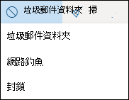
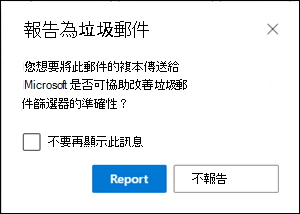
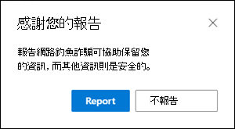
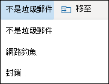

# <a name="report-junk-and-phishing-email-in-outlook-on-the-web-in-office-365"></a><span data-ttu-id="d4652-103">在 Office 365 的 Outlook 網頁版中報告垃圾郵件和網路釣魚電子郵件</span><span class="sxs-lookup"><span data-stu-id="d4652-103">Report junk and phishing email in Outlook on the web in Office 365</span></span>

<span data-ttu-id="d4652-104">如果您是具有 Exchange Online 信箱的 Microsoft 365 客戶，您可以使用網頁型 Outlook （先前稱為 Outlook Web App）中的內建報告選項，送出誤報（良好的電子郵件，允許錯誤的電子郵件）和網路釣魚郵件至 Exchange Online Protection （EOP）。</span><span class="sxs-lookup"><span data-stu-id="d4652-104">If you're a Microsoft 365 customer with Exchange Online mailboxes, you can use the built-in reporting options in Outlook on the web (formerly known as Outlook Web App) to submit false positives (good email marked as spam), false negatives (bad email allowed) and phishing messages to Exchange Online Protection (EOP).</span></span>

## <a name="what-do-you-need-to-know-before-you-begin"></a><span data-ttu-id="d4652-105">開始之前有哪些須知？</span><span class="sxs-lookup"><span data-stu-id="d4652-105">What do you need to know before you begin?</span></span>

- <span data-ttu-id="d4652-106">如果您是 Exchange Online 信箱組織中的系統管理員，建議您在安全性 & 規範中心內使用提交入口網站。</span><span class="sxs-lookup"><span data-stu-id="d4652-106">If you're an admin in an organization with Exchange Online mailboxes, we recommend that you use the Submissions portal in the Security & Compliance Center.</span></span> <span data-ttu-id="d4652-107">如需詳細資訊，請參閱[使用系統管理員提交將可疑的垃圾郵件、網路釣魚、URLs 和檔案提交給 Microsoft](admin-submission.md)。</span><span class="sxs-lookup"><span data-stu-id="d4652-107">For more information, see [Use Admin Submission to submit suspected spam, phish, URLs, and files to Microsoft](admin-submission.md).</span></span>

- <span data-ttu-id="d4652-108">系統管理員可以停用或啟用使用者在 Outlook 網頁版中將郵件報告給 Microsoft 的功能。</span><span class="sxs-lookup"><span data-stu-id="d4652-108">Admins can disable or enable the ability for users to report messages to Microsoft in Outlook on the web.</span></span> <span data-ttu-id="d4652-109">如需詳細資訊，請參閱本主題稍後的在[Outlook 網頁版中停用或啟用垃圾郵件報告](#disable-or-enable-junk-email-reporting-in-outlook-on-the-web)一節。</span><span class="sxs-lookup"><span data-stu-id="d4652-109">For details, see the [Disable or enable junk email reporting in Outlook on the web](#disable-or-enable-junk-email-reporting-in-outlook-on-the-web) section later in this topic.</span></span>

- <span data-ttu-id="d4652-110">如需向 Microsoft 報告訊息的詳細資訊，請參閱[在 Office 365 中報告訊息和檔案至 microsoft](report-junk-email-messages-to-microsoft.md)。</span><span class="sxs-lookup"><span data-stu-id="d4652-110">For more information about reporting messages to Microsoft, see [Report messages and files to Microsoft in Office 365](report-junk-email-messages-to-microsoft.md).</span></span>

## <a name="report-spam-and-phishing-messages-in-outlook-on-the-web"></a><span data-ttu-id="d4652-111">在 Outlook 網頁版中報告垃圾郵件和網路釣魚郵件</span><span class="sxs-lookup"><span data-stu-id="d4652-111">Report spam and phishing messages in Outlook on the web</span></span>

1. <span data-ttu-id="d4652-112">對於收件匣或任何其他電子郵件資料夾（除了垃圾郵件）以外的郵件，請使用下列其中一種方法來報告垃圾郵件和網路釣魚郵件：</span><span class="sxs-lookup"><span data-stu-id="d4652-112">For messages in the Inbox or any other email folder except Junk Email, use either of the following methods to report spam and phishing messages:</span></span>

   - <span data-ttu-id="d4652-113">選取郵件，按一下工具列上的 [**垃圾**郵件]，然後選取 [**垃圾**郵件] 或 [**網路釣魚**]。</span><span class="sxs-lookup"><span data-stu-id="d4652-113">Select the message, click **Junk** on the toolbar, and then select **Junk** or **Phishing**.</span></span>

     

   - <span data-ttu-id="d4652-115">選取一或多封郵件、按一下滑鼠右鍵，然後選取 [**標記為垃圾**郵件]。</span><span class="sxs-lookup"><span data-stu-id="d4652-115">Select one or more messages, right-click, and then select **Mark as junk**.</span></span>

2. <span data-ttu-id="d4652-116">在出現的對話方塊中，按一下 [**報表**]。</span><span class="sxs-lookup"><span data-stu-id="d4652-116">In the dialog that appears, click **Report**.</span></span> <span data-ttu-id="d4652-117">如果您變更主意，請按一下 [**不報告**]。</span><span class="sxs-lookup"><span data-stu-id="d4652-117">If you change your mind, click **Don't Report**.</span></span>

   

   

3. <span data-ttu-id="d4652-120">選取的郵件會傳送給 Microsoft 進行分析。</span><span class="sxs-lookup"><span data-stu-id="d4652-120">The selected messages will be sent to Microsoft for analysis.</span></span> <span data-ttu-id="d4652-121">若要確認郵件已提交，請開啟 **[寄件備份]** 資料夾，以檢視已提交的郵件。</span><span class="sxs-lookup"><span data-stu-id="d4652-121">To confirm that the messages have been submitted, open your **Sent Items** folder to view the submitted messages.</span></span>

## <a name="report-non-spam-and-phishing-messages-from-the-junk-email-folder-in-outlook-on-the-web"></a><span data-ttu-id="d4652-122">從網頁型 Outlook 中的 [垃圾郵件] 資料夾報告非垃圾郵件和網路釣魚郵件</span><span class="sxs-lookup"><span data-stu-id="d4652-122">Report non-spam and phishing messages from the Junk Email folder in Outlook on the web</span></span>

1. <span data-ttu-id="d4652-123">在 [垃圾郵件] 資料夾中，使用下列其中一種方法來報告垃圾郵件誤報或網路釣魚郵件：</span><span class="sxs-lookup"><span data-stu-id="d4652-123">In the Junk Email folder, use either of the following methods to report spam false positives or phishing messages:</span></span>

   - <span data-ttu-id="d4652-124">選取郵件，按一下工具列上的 [**非垃圾**郵件]，然後選取 [**不是垃圾**郵件或**網路釣魚**]。</span><span class="sxs-lookup"><span data-stu-id="d4652-124">Select the message, click **Not Junk** on the toolbar, and then select **Not Junk** or **Phishing**.</span></span>

     

   - <span data-ttu-id="d4652-126">選取一或多封郵件、按一下滑鼠右鍵，然後選取 [**標記為非垃圾**郵件]。</span><span class="sxs-lookup"><span data-stu-id="d4652-126">Select one or more messages, right-click, and then select **Mark as not junk**.</span></span>

2. <span data-ttu-id="d4652-127">在出現的對話方塊中，閱讀資訊，然後按一下 [**報告**]。</span><span class="sxs-lookup"><span data-stu-id="d4652-127">In the dialog that appears, read the information and click **Report**.</span></span> <span data-ttu-id="d4652-128">如果您變更主意，請按一下 [**不報告**]。</span><span class="sxs-lookup"><span data-stu-id="d4652-128">If you change your mind, click **Don't Report**.</span></span>

   ![[報告為非垃圾郵件] 對話方塊](../../media/owa-report-as-not-junk-dialog.png)

   

3. <span data-ttu-id="d4652-131">選取的郵件會傳送給 Microsoft 進行分析。</span><span class="sxs-lookup"><span data-stu-id="d4652-131">The selected messages will be sent to Microsoft for analysis.</span></span> <span data-ttu-id="d4652-132">若要確認郵件已提交，請開啟 **[寄件備份]** 資料夾，以檢視已提交的郵件。</span><span class="sxs-lookup"><span data-stu-id="d4652-132">To confirm that the messages have been submitted, open your **Sent Items** folder to view the submitted messages.</span></span>

## <a name="disable-or-enable-junk-email-reporting-in-outlook-on-the-web"></a><span data-ttu-id="d4652-133">在 web 上的 Outlook 中停用或啟用垃圾郵件報告</span><span class="sxs-lookup"><span data-stu-id="d4652-133">Disable or enable junk email reporting in Outlook on the web</span></span>

<span data-ttu-id="d4652-134">根據預設，使用者可以在網頁上的 Outlook 中，將垃圾郵件誤報、錯誤否定和網路釣魚郵件報告給 Microsoft 進行分析。</span><span class="sxs-lookup"><span data-stu-id="d4652-134">By default, users can report spam false positives, false negatives, and phishing messages to Microsoft for analysis in Outlook on the web.</span></span> <span data-ttu-id="d4652-135">系統管理員可以在 Exchange Online PowerShell 中設定 web 信箱原則上的 Outlook，以防止使用者向 Microsoft 報告垃圾郵件誤報和垃圾郵件漏報。</span><span class="sxs-lookup"><span data-stu-id="d4652-135">Admins can configure Outlook on the web mailbox policies in Exchange Online PowerShell to prevent users from reporting spam false positives and spam false negatives to Microsoft.</span></span> <span data-ttu-id="d4652-136">您無法停用使用者將網路釣魚郵件報告給 Microsoft 的功能。</span><span class="sxs-lookup"><span data-stu-id="d4652-136">You can't disable the ability for users to report phishing messages to Microsoft.</span></span>

### <a name="what-do-you-need-to-know-before-you-begin"></a><span data-ttu-id="d4652-137">開始之前有哪些須知？</span><span class="sxs-lookup"><span data-stu-id="d4652-137">What do you need to know before you begin?</span></span>

- <span data-ttu-id="d4652-138">若要連線至 Exchange Online PowerShell，請參閱[連線至 Exchange Online PowerShell](https://docs.microsoft.com/powershell/exchange/exchange-online/connect-to-exchange-online-powershell/connect-to-exchange-online-powershell)。</span><span class="sxs-lookup"><span data-stu-id="d4652-138">To connect to Exchange Online PowerShell, see [Connect to Exchange Online PowerShell](https://docs.microsoft.com/powershell/exchange/exchange-online/connect-to-exchange-online-powershell/connect-to-exchange-online-powershell).</span></span>

- <span data-ttu-id="d4652-139">您必須已獲指派權限，才能執行這些程序。</span><span class="sxs-lookup"><span data-stu-id="d4652-139">You need to be assigned permissions before you can perform these procedures.</span></span> <span data-ttu-id="d4652-140">具體說來，您需要 Exchange Online 中的**收件者原則**或**郵件**收件者角色（預設會指派給**組織管理**和**收件者管理**角色群組）。</span><span class="sxs-lookup"><span data-stu-id="d4652-140">Specifically you need the **Recipient Policies** or **Mail Recipients** roles in Exchange Online, which are assigned to the **Organization Management** and **Recipient Management** role groups by default.</span></span> <span data-ttu-id="d4652-141">如需有關 Exchange Online 中角色群組的詳細資訊，請參閱[Modify role groups In Exchange online](https://docs.microsoft.com/Exchange/permissions-exo/role-groups#modify-role-groups)。</span><span class="sxs-lookup"><span data-stu-id="d4652-141">For more information about role groups in Exchange Online, see [Modify role groups in Exchange Online](https://docs.microsoft.com/Exchange/permissions-exo/role-groups#modify-role-groups).</span></span>

- <span data-ttu-id="d4652-142">每個組織都有一個名為 OwaMailboxPolicy-Default 的預設原則，但您可以建立自訂原則。</span><span class="sxs-lookup"><span data-stu-id="d4652-142">Every organization has a default policy named OwaMailboxPolicy-Default, but you can create custom policies.</span></span> <span data-ttu-id="d4652-143">在預設原則之前，自訂原則會套用至範圍的使用者。</span><span class="sxs-lookup"><span data-stu-id="d4652-143">Custom policies are applied to scoped users before the default policy.</span></span> <span data-ttu-id="d4652-144">如需有關 Outlook 網頁信箱原則的詳細資訊，請參閱[outlook On Exchange Online 中的 web 信箱原則](https://docs.microsoft.com/Exchange/clients-and-mobile-in-exchange-online/outlook-on-the-web/outlook-web-app-mailbox-policies)。</span><span class="sxs-lookup"><span data-stu-id="d4652-144">For more information about Outlook on the web mailbox policies, see [Outlook on the web mailbox policies in Exchange Online](https://docs.microsoft.com/Exchange/clients-and-mobile-in-exchange-online/outlook-on-the-web/outlook-web-app-mailbox-policies).</span></span>

- <span data-ttu-id="d4652-145">停用垃圾郵件報告時，並不會移除將郵件標示為垃圾郵件的功能，也不會移除 Outlook 網頁版中的垃圾郵件。</span><span class="sxs-lookup"><span data-stu-id="d4652-145">Disabling junk email reporting doesn't remove the ability to mark a message as junk or not junk in Outlook on the web.</span></span> <span data-ttu-id="d4652-146">選取 [垃圾郵件] 資料夾中的郵件，然後按一下 [**不** \>是垃圾郵件] 中的 [不是垃圾郵件 **] 會將**郵件傳回收件匣</span><span class="sxs-lookup"><span data-stu-id="d4652-146">Selecting a message in the Junk email folder and clicking **Not junk** \> **Not junk** still moves the message back into the Inbox.</span></span> <span data-ttu-id="d4652-147">在任何其他電子郵件資料夾中選取郵件，然後按一下 [**垃圾** \> **郵件]，仍然會**將郵件移至 [垃圾郵件] 資料夾。</span><span class="sxs-lookup"><span data-stu-id="d4652-147">Selecting a message in any other email folder and clicking **Junk** \> **Junk** still moves the message into the Junk Email folder.</span></span> <span data-ttu-id="d4652-148">您無法再使用的是將郵件報告給 Microsoft 的選項。</span><span class="sxs-lookup"><span data-stu-id="d4652-148">What's no longer available is the option to report the message to Microsoft.</span></span>

### <a name="use-exchange-online-powershell-to-disable-or-enable-junk-email-reporting-in-outlook-on-the-web"></a><span data-ttu-id="d4652-149">使用 Exchange Online PowerShell 在 web 上的 Outlook 中停用或啟用垃圾郵件報告</span><span class="sxs-lookup"><span data-stu-id="d4652-149">Use Exchange Online PowerShell to disable or enable junk email reporting in Outlook on the web</span></span>

1. <span data-ttu-id="d4652-150">若要尋找您的現有 Outlook 信箱原則及垃圾郵件報告狀態，請執行下列命令：</span><span class="sxs-lookup"><span data-stu-id="d4652-150">To find your existing Outlook on the web mailbox policies and the status of junk email reporting, run the following command:</span></span>

   ```powershell
   Get-OwaMailboxPolicy | Format-Table Name,ReportJunkEmailEnabled
   ```

2. <span data-ttu-id="d4652-151">若要在 Outlook 網頁版中停用或啟用垃圾郵件報告，請使用下列語法：</span><span class="sxs-lookup"><span data-stu-id="d4652-151">To disable or enable junk email reporting in Outlook on the web, use the following syntax:</span></span>

   ```powershell
   Set-OwaMailboxPolicy -Identity "<OWAMailboxPolicyName>" -ReportJunkEmailEnabled <$true | $false>
   ```

   <span data-ttu-id="d4652-152">本範例會停用預設原則中的垃圾郵件報告。</span><span class="sxs-lookup"><span data-stu-id="d4652-152">This example disables junk email reporting in the default policy.</span></span>

   ```powershell
   Set-OwaMailboxPolicy -Identity "OwaMailboxPolicy-Default" -ReportJunkEmailEnabled $false
   ```

   <span data-ttu-id="d4652-153">此範例會在名為 Contoso 管理員的自訂原則中，啟用垃圾郵件報告。</span><span class="sxs-lookup"><span data-stu-id="d4652-153">This example enables junk email reporting in the custom policy named Contoso Managers.</span></span>

   ```powershell
   Set-OwaMailboxPolicy -Identity "Contoso Managers" -ReportJunkEmailEnabled $true
   ```

<span data-ttu-id="d4652-154">如需詳細的語法及參數資訊，請參閱[Get-OwaMailboxPolicy](https://docs.microsoft.com/powershell/module/exchange/client-access/get-owamailboxpolicy)和[Set-OwaMailboxPolicy](https://docs.microsoft.com/powershell/module/exchange/client-access/set-owamailboxpolicy)。</span><span class="sxs-lookup"><span data-stu-id="d4652-154">For detailed syntax and parameter information, see [Get-OwaMailboxPolicy](https://docs.microsoft.com/powershell/module/exchange/client-access/get-owamailboxpolicy) and [Set-OwaMailboxPolicy](https://docs.microsoft.com/powershell/module/exchange/client-access/set-owamailboxpolicy).</span></span>

### <a name="how-do-you-know-this-worked"></a><span data-ttu-id="d4652-155">如何知道這是否正常運作？</span><span class="sxs-lookup"><span data-stu-id="d4652-155">How do you know this worked?</span></span>

<span data-ttu-id="d4652-156">若要確認您是否已成功啟用或停用 Outlook 網頁版中的垃圾郵件報告，請使用下列任何一項步驟：</span><span class="sxs-lookup"><span data-stu-id="d4652-156">To verify that you've successfully enabled or disabled junk email reporting in Outlook on the web, use any of the following steps:</span></span>

- <span data-ttu-id="d4652-157">在 Exchange Online PowerShell 中，執行下列命令，並確認**ReportJunkEmailEnabled**屬性值：</span><span class="sxs-lookup"><span data-stu-id="d4652-157">In Exchange Online PowerShell, run the following command and verify the **ReportJunkEmailEnabled** property value:</span></span>

  ```powershell
  Get-OwaMailboxPolicy | Format-Table Name,ReportJunkEmailEnabled
  ```

- <span data-ttu-id="d4652-158">在網頁上的 Outlook 中開啟受影響使用者的信箱，在 [收件匣] 中選取一封郵件，按一下 [**垃圾** \> **郵件]，然後確認**提示您將郵件報告給 Microsoft （或不會顯示）。<sup>\*</sup></span><span class="sxs-lookup"><span data-stu-id="d4652-158">Open an affected user's mailbox in Outlook on the web, select a message in the Inbox, click **Junk** \> **Junk** and verify the prompt to report the message to Microsoft is or is not displayed.<sup>\*</sup></span></span>

- <span data-ttu-id="d4652-159">在 web 上的 Outlook 中開啟受影響使用者的信箱，選取 [垃圾郵件] 資料夾中的郵件，按一下 [**垃圾** \> **郵件]，然後確認**提示您將郵件報告給 Microsoft （或不會顯示）。<sup>\*</sup></span><span class="sxs-lookup"><span data-stu-id="d4652-159">Open an affected user's mailbox in Outlook on the web, select a message in the Junk Email folder, click **Junk** \> **Junk** and verify the prompt to report the message to Microsoft is or is not displayed.<sup>\*</sup></span></span>

<span data-ttu-id="d4652-160"><sup>\*</sup>使用者可以在仍報告郵件時隱藏提示來報告郵件。</span><span class="sxs-lookup"><span data-stu-id="d4652-160"><sup>\*</sup> Users can hide the prompt to report the message while still reporting the message.</span></span> <span data-ttu-id="d4652-161">若要在 Outlook 網頁版中檢查此設定：</span><span class="sxs-lookup"><span data-stu-id="d4652-161">To check this setting in Outlook on the web:</span></span>

1. <span data-ttu-id="d4652-162">按一下 **[設定\*\* ![網頁上的 outlook]](../../media/owa-settings-icon.png) \>圖示，以**查看所有 outlook 設定\*\* \> **垃圾郵件**。</span><span class="sxs-lookup"><span data-stu-id="d4652-162">Click **Settings**  \> **View all Outlook settings** \> **Junk email**.</span></span>
2. <span data-ttu-id="d4652-163">在 [**報告**] 區段中，確認值： [傳送**報告前請先詢問我**]。</span><span class="sxs-lookup"><span data-stu-id="d4652-163">In the **Reporting** section, verify the value: **Ask me before sending a report**.</span></span>

   
