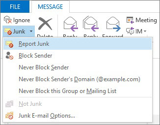

# 向 Microsoft 回報垃圾郵件Report junk email messages to Microsoft

「Microsoft Office Outlook 的 Microsoft 垃圾郵件回報增益集」提供多種方式回報垃圾郵件：The Microsoft Junk Email Reporting Add-in for Microsoft Office Outlook offers several ways for you to report junk email messages:

- 從 Outlook 功能區From the Outlook ribbon

- 從收件匣From your Inbox

- 從開啟的電子郵件內From within an opened email message

垃圾電子郵件回報增益集可以幫助您提交報告給 Microsoft Exchange Online Protection (EOP) 服務。The Junk Email Reporting Add-in helps you submit reports to the Microsoft Exchange Online Protection (EOP) service. 如果此服務不保護您的信箱，您的垃圾電子郵件報告提交不會影響您的垃圾郵件篩選器。If your mailbox is not protected by the service, your junk email report submission will not affect your spam filters. 系統管理員可以了解更多適用於在[如何防止良好的電子郵件被標示為在 Office 365 中的垃圾郵件](prevent-email-from-being-marked-as-spam.md)或[如何減少 Office 365 中的垃圾郵件](reduce-spam-email.md)的整個組織的垃圾郵件設定。Administrators can learn about more spam settings that apply to a whole organization at [How to prevent good email from being marked as spam in Office 365](prevent-email-from-being-marked-as-spam.md) or [How to reduce spam email in Office 365](reduce-spam-email.md). 如果您有系統管理員層級的控制權，且您想要避免誤判或漏報，這些內容很有幫助。These are helpful if you have administrator-level control and you want to prevent false positives or false negatives.

> [!TIP]
> 您也可以使用[not_junk@office365.microsoft.com](mailto:not_junk@office365.microsoft.com)電子郵件地址，提交垃圾郵件給 Microsoft，請使用[junk@office365.microsoft.com](mailto:junk@office365.microsoft.com)電子郵件地址，直接和誤判 （非垃圾郵件） 郵件。You can also submit spam messages directly to Microsoft by using the [junk@office365.microsoft.com](mailto:junk@office365.microsoft.com) email address, and false positive (non-spam) messages by using the [not_junk@office365.microsoft.com](mailto:not_junk@office365.microsoft.com) email address. 如需詳細資訊，請參閱[將垃圾郵件、非垃圾郵件與網路釣魚詐騙郵件提交給 Microsoft 進行分析](submit-spam-non-spam-and-phishing-scam-messages-to-microsoft-for-analysis.md)。For more information, see [Submit spam, non-spam, and phishing scam messages to Microsoft for analysis](submit-spam-non-spam-and-phishing-scam-messages-to-microsoft-for-analysis.md).

### 從 Outlook 的垃圾郵件回報To report junk email messages from Outlook

[使用報告訊息增益集Use the Report Message add-in](https://support.office.com/article/b5caa9f1-cdf3-4443-af8c-ff724ea719d2)

### 從收件匣回報垃圾郵件To report junk email messages from your Inbox

1. 以滑鼠右鍵按一下郵件或要回報為垃圾郵件的郵件。Right-click the message or messages that you want to report as junk.

2. 選取 **[垃圾郵件]**，然後按一下 **[回報垃圾郵件]**。Select **Junk** and then click **Report Junk**.
    

3. [ **Microsoft 垃圾電子郵件回報增益集**] 會隨即開啟。The **Microsoft Junk E-mail Reporting Add-in** dialog box opens. 如果您確定要提交您選取為垃圾郵件的郵件，請按一下 [ **是**]。If you're sure that you want to submit the messages you selected as junk, click **Yes**.
    

    > [!NOTE]
    > 如果您不想在提交垃圾郵件時看見此確認訊息，請勾選 [ **不要再顯示此訊息**]。If you don't want to receive this confirmation message when submitting junk messages, check **Do not show this message again**.

選取的郵件會傳送至 Microsoft 進行分析，然後移至 [垃圾郵件] 資料夾。若要確認郵件已提交，請開啟 **[寄件備份]** 資料夾，以檢視已提交的郵件。The selected messages will be sent to Microsoft for analysis and moved to the Junk Email folder. To confirm that the messages have been submitted, open your **Sent Items** folder to view the submitted messages.

### 從已開啟的郵件內回報垃圾郵件To report a junk email message from within an opened message

1. 在開啟的郵件內，按一下郵件功能區上的 **[回報垃圾郵件]** 按鈕。From within an opened message, click the **Report Junk** button on the message ribbon. 例如，按一下 [**垃圾郵件** \> **回報垃圾郵件**For example, click **Junk** \> **Report Junk** 

2. [ **Microsoft 垃圾電子郵件回報增益集**] 會隨即開啟。The **Microsoft Junk E-mail Reporting Add-in** dialog box opens. 如果您確定要提交您選取為垃圾郵件的郵件，請按一下 [ **是**]。If you're sure that you want to submit the message you selected as junk, click **Yes**.
    

    > [!NOTE]
    > 如果您不想在提交垃圾郵件時看見此確認訊息，請勾選 [ **不要再顯示此訊息**]。If you don't want to receive this confirmation message when submitting junk messages, check **Do not show this message again**.

選取的郵件會傳送至 Microsoft 進行分析，然後移至 [垃圾郵件] 資料夾。若要確認郵件已提交，請開啟 **[寄件備份]** 資料夾，以檢視已提交的郵件。The selected message will be sent to Microsoft for analysis and moved to the Junk Email folder. To confirm that the message has been submitted, open your **Sent Items** folder to view the submitted message.

## 如需詳細資訊For more information

[啟用報告訊息增益集Enable the Report Message add-in](enable-the-report-message-add-in.md)

[疑難排解與支援資訊Troubleshooting and support information](troubleshooting-and-support-information.md)

[如何在 Office 365 中防止好的電子郵件被標示為垃圾郵件How to prevent good email from being marked as spam in Office 365](prevent-email-from-being-marked-as-spam.md)

[如何減少 Office 365 中的垃圾郵件How to reduce spam email in Office 365](reduce-spam-email.md)
