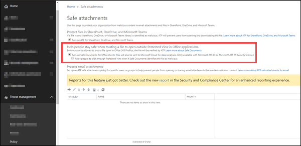

# <a name="safe-documents-in-microsoft-365-e5"></a><span data-ttu-id="94f96-103">Microsoft 365 E5 中的安全檔</span><span class="sxs-lookup"><span data-stu-id="94f96-103">Safe Documents in Microsoft 365 E5</span></span>

<span data-ttu-id="94f96-104">安全檔是 Microsoft 365 E5 或 Microsoft 365 E5 安全性中的一項功能，可使用 [Microsoft Defender 高級威脅防護](https://docs.microsoft.com/windows/security/threat-protection/microsoft-defender-atp/microsoft-defender-advanced-threat-protection) 來掃描在 [受保護的檢視](https://support.microsoft.com/office/d6f09ac7-e6b9-4495-8e43-2bbcdbcb6653)中開啟的檔和檔案。</span><span class="sxs-lookup"><span data-stu-id="94f96-104">Safe Documents is a feature in Microsoft 365 E5 or Microsoft 365 E5 Security that uses [Microsoft Defender Advanced Threat Protection](https://docs.microsoft.com/windows/security/threat-protection/microsoft-defender-atp/microsoft-defender-advanced-threat-protection) to scan documents and files that are opened in [Protected View](https://support.microsoft.com/office/d6f09ac7-e6b9-4495-8e43-2bbcdbcb6653).</span></span>

## <a name="what-do-you-need-to-know-before-you-begin"></a><span data-ttu-id="94f96-105">開始之前有哪些須知？</span><span class="sxs-lookup"><span data-stu-id="94f96-105">What do you need to know before you begin?</span></span>

- <span data-ttu-id="94f96-106">12730 Office 版本2004的使用者通常可使用安全檔， () 或更高！</span><span class="sxs-lookup"><span data-stu-id="94f96-106">Safe Documents is now generally available to users with Office Version 2004 (12730.x) or greater!</span></span> <span data-ttu-id="94f96-107">此功能預設為關閉，必須由安全性管理員啟用。</span><span class="sxs-lookup"><span data-stu-id="94f96-107">This feature is off by default and will need to be enabled by the Security Administrator.</span></span>

- <span data-ttu-id="94f96-108">此功能僅適用于使用 *Microsoft 365 e5* 或 *Microsoft 365 e5 安全性* 授權 (未包含在 Office 365 ATP 計畫) 中的使用者。</span><span class="sxs-lookup"><span data-stu-id="94f96-108">This feature is only available to users with the *Microsoft 365 E5* or *Microsoft 365 E5 Security* license (not included in Office 365 ATP plans).</span></span>

- <span data-ttu-id="94f96-109">若要連線至 Exchange Online PowerShell，請參閱[連線至 Exchange Online PowerShell](https://docs.microsoft.com/powershell/exchange/connect-to-exchange-online-powershell)。</span><span class="sxs-lookup"><span data-stu-id="94f96-109">To connect to Exchange Online PowerShell, see [Connect to Exchange Online PowerShell](https://docs.microsoft.com/powershell/exchange/connect-to-exchange-online-powershell).</span></span> <span data-ttu-id="94f96-110">若要連接至獨立版 EOP PowerShell，請參閱[連線到 Exchange Online Protection PowerShell](https://docs.microsoft.com/powershell/exchange/connect-to-exchange-online-protection-powershell)。</span><span class="sxs-lookup"><span data-stu-id="94f96-110">To connect to standalone EOP PowerShell, see [Connect to Exchange Online Protection PowerShell](https://docs.microsoft.com/powershell/exchange/connect-to-exchange-online-protection-powershell).</span></span>

- <span data-ttu-id="94f96-111">您必須已獲指派許可權，才能執行本主題中的程式。</span><span class="sxs-lookup"><span data-stu-id="94f96-111">You need to be assigned permissions before you can perform the procedures in this topic.</span></span> <span data-ttu-id="94f96-112">若要啟用及設定安全檔，您必須是「 **組織管理** 」或「 **安全性管理員** 」角色群組的成員。</span><span class="sxs-lookup"><span data-stu-id="94f96-112">To enable and configure Safe Documents, you need to be a member of the **Organization Management** or **Security Administrator** role groups.</span></span> <span data-ttu-id="94f96-113">如需有關安全性與合規性中心中角色群組的詳細資訊，請參閱[安全性與合規性中心裡的權限](permissions-in-the-security-and-compliance-center.md)。</span><span class="sxs-lookup"><span data-stu-id="94f96-113">For more information about role groups in the Security & Compliance Center, see [Permissions in the Security & Compliance Center](permissions-in-the-security-and-compliance-center.md).</span></span>

## <a name="how-does-microsoft-handle-your-data"></a><span data-ttu-id="94f96-114">Microsoft 如何處理您的資料？</span><span class="sxs-lookup"><span data-stu-id="94f96-114">How does Microsoft handle your data?</span></span>

<span data-ttu-id="94f96-115">為了讓您受到保護，安全檔會將檔案傳送至 [Microsoft Defender 高級威脅防護](https://docs.microsoft.com/windows/security/threat-protection/microsoft-defender-atp/microsoft-defender-advanced-threat-protection) 雲端，以進行分析。</span><span class="sxs-lookup"><span data-stu-id="94f96-115">To keep you protected, Safe Documents sends files to the [Microsoft Defender Advanced Threat Protection](https://docs.microsoft.com/windows/security/threat-protection/microsoft-defender-atp/microsoft-defender-advanced-threat-protection) cloud for analysis.</span></span>

- <span data-ttu-id="94f96-116">您可以在[這裡](https://docs.microsoft.com/windows/security/threat-protection/microsoft-defender-atp/data-storage-privacy)找到 Microsoft Defender 高級威脅防護如何處理資料的詳細資料</span><span class="sxs-lookup"><span data-stu-id="94f96-116">Details on how Microsoft Defender Advanced Threat Protection handles your data can be found [here](https://docs.microsoft.com/windows/security/threat-protection/microsoft-defender-atp/data-storage-privacy)</span></span>
- <span data-ttu-id="94f96-117">除了上述指導之外，由安全檔所傳送的檔案不會保留在進行分析所需的時間（通常是小於24小時）。</span><span class="sxs-lookup"><span data-stu-id="94f96-117">In addition to the guidelines above, files sent by Safe Documents are not retained in Defender beyond the time needed for analysis, which is typically less than 24 hours</span></span>

## <a name="use-the-security--compliance-center-to-configure-safe-documents"></a><span data-ttu-id="94f96-118">使用安全性 & 規範中心設定安全檔</span><span class="sxs-lookup"><span data-stu-id="94f96-118">Use the Security & Compliance Center to configure Safe Documents</span></span>

1. <span data-ttu-id="94f96-119">開啟安全性 & 規範中心，網址為 <https://protection.office.com> 。</span><span class="sxs-lookup"><span data-stu-id="94f96-119">Open the Security & Compliance Center at <https://protection.office.com>.</span></span>

2. <span data-ttu-id="94f96-120">移至 **威脅管理** \> **原則** \> **ATP 安全附件**。</span><span class="sxs-lookup"><span data-stu-id="94f96-120">Go to **Threat management** \> **Policy** \> **ATP Safe Attachments**.</span></span>

3. <span data-ttu-id="94f96-121">在 [ **信任檔案以在 Office 應用程式中開啟受保護的檢視** ] 區段中，在 [協助人員保持安全]] 中，設定下列其中一個設定：</span><span class="sxs-lookup"><span data-stu-id="94f96-121">In the **Help people stay safe when trusting a file to open outside Protected View in Office applications** section, configure either of the following settings:</span></span>

   - <span data-ttu-id="94f96-122">**開啟 Office 用戶端的安全檔**</span><span class="sxs-lookup"><span data-stu-id="94f96-122">**Turn on Safe Documents for Office clients**</span></span>

   - <span data-ttu-id="94f96-123">**即使安全檔將檔案識別為惡意，允許人員按一下受保護的檢視**：我們建議您不要啟用此選項。</span><span class="sxs-lookup"><span data-stu-id="94f96-123">**Allow people to click through Protected View even if Safe Documents identifies the file as malicious**: We recommend that you don't enable this option.</span></span>

4. <span data-ttu-id="94f96-124">完成後，按一下 [儲存]\*\*\*\*。</span><span class="sxs-lookup"><span data-stu-id="94f96-124">When you're finished, click **Save**.</span></span>



### <a name="use-exchange-online-powershell-or-standalone-eop-powershell-to-configure-safe-documents"></a><span data-ttu-id="94f96-126">使用 Exchange Online PowerShell 或獨立 EOP PowerShell 設定安全檔</span><span class="sxs-lookup"><span data-stu-id="94f96-126">Use Exchange Online PowerShell or standalone EOP PowerShell to configure Safe Documents</span></span>

<span data-ttu-id="94f96-127">使用下列語法：</span><span class="sxs-lookup"><span data-stu-id="94f96-127">Use the following syntax:</span></span>

```powershell
Set-AtpPolicyForO365 -EnableSafeDocs <$true | $false> -AllowSafeDocsOpen <$true | $false>
```

- <span data-ttu-id="94f96-128">_EnableSafeDocs_參數會啟用或停用整個組織的安全檔。</span><span class="sxs-lookup"><span data-stu-id="94f96-128">The _EnableSafeDocs_ parameter enables or disables Safe Documents for the entire organization.</span></span>

- <span data-ttu-id="94f96-129">_AllowSafeDocsOpen_參數可允許或禁止使用者保留受保護的檢視 (也就是說，開啟檔) 如果檔已識別為惡意。</span><span class="sxs-lookup"><span data-stu-id="94f96-129">The _AllowSafeDocsOpen_ parameter allows or prevents users from leaving Protected View (that is, opening the document) if the document has been identified as malicious.</span></span>

<span data-ttu-id="94f96-130">本範例會為整個組織啟用安全檔，並防止使用者開啟已從受保護的檢視識別為惡意的檔。</span><span class="sxs-lookup"><span data-stu-id="94f96-130">This example enables Safe Documents for the entire organization, and prevents users from opening documents that have been identified as malicious from Protected View.</span></span>

```powershell
Set-AtpPolicyForO365 -EnableSafeDocs $true -AllowSafeDocsOpen $false
```

<span data-ttu-id="94f96-131">如需詳細的語法及參數資訊，請參閱 [Set-AtpPolicyForO365](https://docs.microsoft.com/powershell/module/exchange/set-atppolicyforo365)。</span><span class="sxs-lookup"><span data-stu-id="94f96-131">For detailed syntax and parameter information, see [Set-AtpPolicyForO365](https://docs.microsoft.com/powershell/module/exchange/set-atppolicyforo365).</span></span>

### <a name="how-do-i-know-this-worked"></a><span data-ttu-id="94f96-132">如何知道這是否正常運作？</span><span class="sxs-lookup"><span data-stu-id="94f96-132">How do I know this worked?</span></span>

<span data-ttu-id="94f96-133">若要確認您已啟用並設定安全檔，請執行下列任一步驟：</span><span class="sxs-lookup"><span data-stu-id="94f96-133">To verify that you've enabled and configured Safe Documents, do any of the following steps:</span></span>

- <span data-ttu-id="94f96-134">在安全性 & 合規性中心移至 **威脅管理** \> **原則** \> **ATP 安全附件**，並確認 **當信任檔案以在 Office 應用程式中開啟受保護的檢視時，協助** 中的選項將保持安全。</span><span class="sxs-lookup"><span data-stu-id="94f96-134">In the Security & Compliance Center go to **Threat management** \> **Policy** \> **ATP Safe Attachments**, and verify the selections in the **Help people stay safe when trusting a file to open outside Protected View in Office applications** section.</span></span>

- <span data-ttu-id="94f96-135">在 Exchange Online PowerShell 中執行下列命令，並確認屬性值：</span><span class="sxs-lookup"><span data-stu-id="94f96-135">Run the following command in Exchange Online PowerShell and verify the property values:</span></span>

  ```powershell
  Get-AtpPolicyForO365 | Format-List *SafeDocs*
  ```
