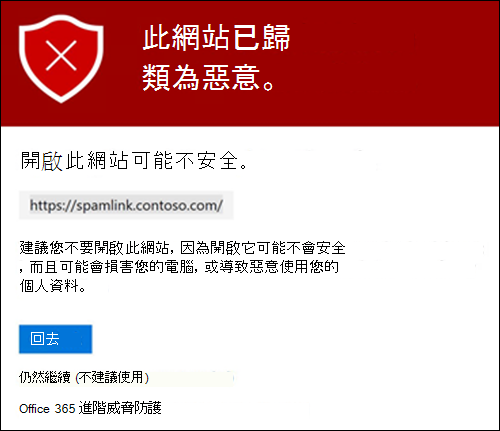
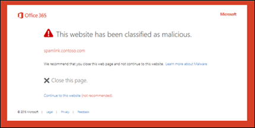
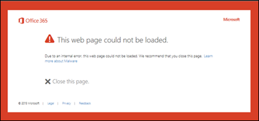

# Microsoft Defender 中 Office 365 的安全連結Safe Links in Microsoft Defender for Office 365

[!INCLUDE [Microsoft 365 Defender rebranding](../includes/microsoft-defender-for-office.md)]

**適用於****Applies to**
- [適用於 Office 365 的 Microsoft Defender 方案 1 和方案 2Microsoft Defender for Office 365 plan 1 and plan 2](defender-for-office-365.md)
- [Microsoft 365 DefenderMicrosoft 365 Defender](../defender/microsoft-365-defender.md)

> [!IMPORTANT]
> 本文適用於擁有[適用於 Office 365 的 Microsoft Defender](defender-for-office-365.md) 的商務客戶。This article is intended for business customers who have [Microsoft Defender for Office 365](defender-for-office-365.md). 如果您正在使用 Outlook .com、Microsoft 365 家用版或 Microsoft 365 個人版，而且您正在尋找 Outlook 的 Safelinks 相關資訊，請參閱[Advanced Outlook .com security](https://support.microsoft.com/office/882d2243-eab9-4545-a58a-b36fee4a46e2)。If you're using Outlook.com, Microsoft 365 Family, or Microsoft 365 Personal, and you're looking for information about Safelinks in Outlook, see [Advanced Outlook.com security](https://support.microsoft.com/office/882d2243-eab9-4545-a58a-b36fee4a46e2).

安全連結是[Office 365](defender-for-office-365.md)中的功能，可提供郵件流程的 URL 掃描和修正輸入電子郵件，以及電子郵件和其他位置中的 URLs 和連結的時間驗證。Safe Links is a feature in [Defender for Office 365](defender-for-office-365.md) that provides URL scanning and rewriting of inbound email messages in mail flow, and time-of-click verification of URLs and links in email messages and other locations. 除了 Exchange Online Protection (EOP) 的輸入電子郵件中的一般[反垃圾郵件和反惡意程式碼保護](anti-spam-and-anti-malware-protection.md)之外，也會進行安全連結掃描。Safe Links scanning occurs in addition to the regular [anti-spam and anti-malware protection](anti-spam-and-anti-malware-protection.md) in inbound email messages in Exchange Online Protection (EOP). 安全連結掃描可協助保護您的組織免受網路釣魚和其他攻擊中所用的惡意連結。Safe Links scanning can help protect your organization from malicious links that are used in phishing and other attacks.

在下列位置可取得安全連結保護：Safe Links protection is available in the following locations:

- **電子郵件訊息**：安全連結保護電子郵件訊息中的連結是由安全連結原則所控制。**Email messages**: Safe Links protection for links in email messages is controlled by Safe Links policies. 沒有預設的安全連結原則， **因此若要在電子郵件中取得安全連結的保護，您必須建立一或多個安全連結原則**。There is no default Safe Links policy, **so to get the protection of Safe Links in email messages, you need to create one or more Safe Links policies**. 如需相關指示，請參閱[為 Office 365 設定 Microsoft Defender 中的安全連結原則](set-up-safe-links-policies.md)。For instructions, see [Set up Safe Links policies in Microsoft Defender for Office 365](set-up-safe-links-policies.md).

  如需電子郵件安全連結保護的詳細資訊，請參閱本文稍後的 [ [電子郵件的安全連結設定](#safe-links-settings-for-email-messages) ] 區段。For more information about Safe Links protection for email messages, see the [Safe Links settings for email messages](#safe-links-settings-for-email-messages) section later in this article.
  
  > [!NOTE]
  > 安全連結無法在具有郵件功能的公用資料夾上運作。Safe Links does not work on mail-enabled public folders.

- **Microsoft Teams** (目前在點擊預覽) ： Teams 交談、群組聊天或頻道中的連結的安全連結保護也是由安全連結原則所控制。**Microsoft Teams** (currently in TAP Preview): Safe Links protection for links in Teams conversations, group chats, or from channels is also controlled by Safe Links policies. 沒有預設的安全連結原則，**因此若要在 Teams 中取得安全連結的保護，您必須建立一或多個安全連結原則**。There is no default Safe Links policy, **so to get the protection of Safe Links in Teams, you need to create one or more Safe Links policies**.

  如需 Teams 中安全連結保護的詳細資訊，請參閱本文稍後的「Microsoft Teams」區段的 [[安全連結] 設定](#safe-links-settings-for-microsoft-teams)。For more information about Safe Links protection in Teams, see the [Safe Links settings for Microsoft Teams](#safe-links-settings-for-microsoft-teams) section later in this article.

- **Office 365 應用程式**： Office 365 應用程式的安全連結保護可在支援的桌面、行動裝置和 web 應用程式中取得。**Office 365 apps**: Safe Links protection for Office 365 apps is available in supported desktop, mobile, and web apps. 您可以在安全連結原則 **以外** 的全域設定中，**設定** Office 365 應用程式的安全連結保護。You **configure** Safe Links protection for Office 365 apps in the global setting that are **outside** of Safe Links policies. 如需相關指示，請參閱[設定 Microsoft Defender 中安全連結設定的通用設定 Office 365](configure-global-settings-for-safe-links.md)。For instructions, see [Configure global settings for Safe Links settings in Microsoft Defender for Office 365](configure-global-settings-for-safe-links.md).

  Office 365 應用程式的安全連結保護會套用至組織中所有授權使用 Defender Office 365 的使用者，不論使用者是否包含在 active 安全連結原則中。Safe Links protection for Office 365 apps is applied to all users in the organization who are licensed for Defender for Office 365, regardless of whether the users are included in active Safe Links policies or not.

  如需 Office 365 應用程式中安全連結保護的詳細資訊，請參閱本文稍後的「Office 365 app」區段的 [[安全連結] 設定](#safe-links-settings-for-office-365-apps)。For more information about Safe Links protection in Office 365 apps, see the [Safe Links settings for Office 365 apps](#safe-links-settings-for-office-365-apps) section later in this article.

本文包含下列安全連結設定類型的詳細描述：This article includes detailed descriptions of the following types of Safe Links settings:

- **在安全連結原則中設定**：這些設定只會套用至特定原則中所包含的使用者，而且各原則的設定可能會不同。**Settings in Safe Links policies**: These settings apply only to the users who are included in the specific policies, and the settings might be different between policies. 這些設定包含：These settings include:

  - [電子郵件訊息的安全連結設定Safe Links settings for email messages](#safe-links-settings-for-email-messages)
  - [Microsoft Teams 的安全連結設定Safe Links settings for Microsoft Teams](#safe-links-settings-for-microsoft-teams)
  - [安全連結原則中的「不要重新寫入下列 URLs」清單"Do not rewrite the following URLs" lists in Safe Links policies](#do-not-rewrite-the-following-urls-lists-in-safe-links-policies)

- **全域安全連結設定**：這些設定會全域設定，而不是在安全連結原則中。**Global Safe Links settings**: These settings are configured globally, not in Safe Links policies. 這些設定包含：These settings include:

  - [Office 365 應用程式的安全連結設定Safe Links settings for Office 365 apps](#safe-links-settings-for-office-365-apps)
  - [安全連結的「封鎖下列 URLs」清單"Block the following URLs" list for Safe Links](#block-the-following-urls-list-for-safe-links)

下表說明 Microsoft 365 和 Office 365 組織中的安全連結案例，也就是包含 Office 365 (的 Defender，也就是說，缺乏授權不是範例) 中的問題。The following table describes scenarios for Safe Links in Microsoft 365 and Office 365 organizations that include Defender for Office 365 (in other words, lack of licensing is never an issue in the examples).

 

****

|案例Scenario|結果Result|
|---|---|
|Jean-francois 是行銷部門的成員。Jean is a member of the marketing department. Office 365 應用程式的安全連結保護會在安全連結的通用設定中開啟，而且會存在套用至行銷部門成員的安全連結原則。Safe Links protection for Office 365 apps is turned on in the global settings for Safe Links, and a Safe Links policy that applies to members of the marketing department exists. jean-francois 會在電子郵件訊息中開啟 PowerPoint 簡報，然後按一下簡報中的 URL。Jean opens a PowerPoint presentation in an email message, and then clicks a URL in the presentation.|Jean-francois 受到安全連結的保護。Jean is protected by Safe Links. 
 jean-francois 包含在安全連結原則中，且已開啟 Office 365 應用程式的安全連結保護。Jean is included in a Safe Links policy, and Safe Links protection for Office 365 apps is turned on. 
 如需 Office 365 應用程式中安全連結保護需求的詳細資訊，請參閱本文稍後的「Office 365 app」區段的 [[安全連結] 設定](#safe-links-settings-for-office-365-apps)。For more information about the requirements for Safe Links protection in Office 365 apps, see the [Safe Links settings for Office 365 apps](#safe-links-settings-for-office-365-apps) section later in this article.|
|Chris 的 Microsoft 365 E5 組織未設定安全連結原則。Chris's Microsoft 365 E5 organization has no Safe Links policies configured. Chris 會接收來自外部寄件者的電子郵件，該寄件者包含的 URL 指向他最後按一下的惡意網站。Chris receives an email from an external sender that contains a URL to a malicious website that he ultimately clicks.|Chris 未受到安全連結的保護。Chris is not protected by Safe Links. 
 管理員至少必須建立一個安全連結原則，以供任何人取得輸入電子郵件訊息中的安全連結保護。An admin must create at least one Safe Links policy for anyone to get Safe Links protection in inbound email messages. 在原則的條件中必須包含 Chris，才可取得安全連結保護。Chris must be included in the conditions of policy to get Safe Links protection.|
|在 Pat 的組織中，沒有系統管理員已建立任何安全連結原則，但已開啟 Office 365 應用程式的安全連結保護。In Pat's organization, no admins have created any Safe Links policies, but Safe Links protection for Office 365 apps is turned on. Pat 開啟 Word 檔，然後按一下檔案中的 URL。Pat opens a Word document and clicks a URL in the file.|Pat 未受到安全連結的保護。Pat is not protected by Safe Links. 
 雖然 Office 365 應用程式的安全連結保護已全域開啟，但 Pat 並未包含在任何使用中的安全連結原則中，因此無法套用保護。Although Safe Links protection for Office 365 apps is turned on globally, Pat is not included in any active Safe Links policies, so the protection can't be applied.|
|在「企業版的組織」中，于 [ `https://tailspintoys.com` 安全連結的全域設定] 中的 [ **封鎖下列 URLs** ] 清單中設定。In Lee's organization, `https://tailspintoys.com` is configured in the **Block the following URLs** list in the global settings for Safe Links. 包含「擁有先生」的安全連結原則已存在。A Safe Links policy that includes Lee already exists. 「電子郵件」會收到包含 URL 的電子郵件 `https://tailspintoys.com/aboutus/trythispage` 。Lee receives an email message that contains the URL `https://tailspintoys.com/aboutus/trythispage`. Lee 按下該 URL。Lee clicks the URL.|您可以自動封鎖此 URL。這取決於清單中的 URL 專案和使用的電子郵件用戶端。The URL might be automatically blocked for Lee; it depends on the URL entry in the list and the email client Lee used. 如需詳細資訊，請參閱本文稍後的「 [阻止下列 URLs 的安全連結」清單](#block-the-following-urls-list-for-safe-links) 一節。For more information, see the ["Block the following URLs" list for Safe Links](#block-the-following-urls-list-for-safe-links) section later in this article.|
|曉明和 Julia 這兩個 contoso.com 的工作。Jamie and Julia both work for contoso.com. 很久之前，系統管理員設定了同時適用于曉明和 Julia 的安全連結原則。A long time ago, admins configured Safe Links policies that apply to both of Jamie and Julia. 曉明會將電子郵件傳送至 Julia，而不知道電子郵件中包含惡意 URL。Jamie sends an email to Julia, not knowing that the email contains a malicious URL.|**如果** 套用至她的安全連結原則設定為套用至內部收件者之間的郵件，則安全連結會保護 Julia。Julia is protected by Safe Links **if** the Safe Links policy that applies to her is configured to apply to messages between internal recipients. 如需詳細資訊，請參閱本文稍後的「 [電子郵件的安全連結設定](#safe-links-settings-for-email-messages) 」一節。For more information, see the [Safe Links settings for email messages](#safe-links-settings-for-email-messages) section later in this article.|
|

## 電子郵件訊息的安全連結設定Safe Links settings for email messages

安全連結會掃描內送電子郵件中的已知惡意超連結。Safe Links scans incoming email for known malicious hyperlinks. 掃描的 URLs 會使用 Microsoft standard URL 前置詞來重新寫入： `https://nam01.safelinks.protection.outlook.com` 。Scanned URLs are rewritten using the Microsoft standard URL prefix: `https://nam01.safelinks.protection.outlook.com`. 在重新寫入連結之後，它會針對潛在的惡意內容進行分析。After the link is rewritten, it's analyzed for potentially malicious content.

安全連結會重新寫入 URL 後，即使郵件是 *手動* 轉寄或回復 (給內部及外部收件者) ，該 url 仍會保持重新寫入狀態。After Safe Links rewrites a URL, the URL remains rewritten even if the message is *manually* forwarded or replied to (both to internal and external recipients). 新增至轉寄或回復郵件的其他連結不會被重新寫入。Additional links that are added to the forwarded or replied to message are not rewritten. 不過，如果是透過收件匣規則或 SMTP 轉寄進行 *自動* 轉寄，將不會在預期的收件者的郵件中重新寫入此 url， *除非* 該收件者也是由安全連結所保護，或是 URL 已在先前的通訊中重新寫入。However, in the case of *automatic* forwarding by Inbox rules or SMTP forwarding, the URL will not be rewritten in the message that's intended for the final recipient *unless* that recipient is also protected by Safe Links or the URL had already been rewritten in a previous communication. 

下列清單說明適用于電子郵件訊息的安全連結原則中的設定：The settings in Safe Links policies that apply to email messages are described in the following list:

- **選取郵件中不明的潛在惡意 URLs 動作**：啟用或停用電子郵件中的安全連結掃描。**Select the action for unknown potentially malicious URLs in messages**: Enables or disables Safe Links scanning in email messages. 建議值為 **On**。The recommended value is **On**. 開啟此設定會產生下列動作。Turning on this setting results in the following actions.

  - Outlook (C2R) 上的 Windows 上啟用安全連結掃描。Safe Links scanning is enabled in Outlook (C2R) on Windows.
  - URLs 會在郵件中按一下 [URLs] 中的 [安全連結保護]，以重新寫入。URLs are rewritten and users are routed through Safe Links protection when they click URLs in messages.
  - 按一下時，會針對已知的惡意 URLs 清單及「 [封鎖下列 URLs」清單](#block-the-following-urls-list-for-safe-links)，檢查 URLs。When clicked, URLs are checked against a list of known malicious URLs and the ["Block the following URLs" list](#block-the-following-urls-list-for-safe-links).
  - 不具備有效信譽的 URLs 會在背景中以非同步方式引爆。URLs that don't have a valid reputation are detonated asynchronously in the background.

- **對指向檔案的可疑連結和連結套用即時 URL 掃描**：可即時掃描連結，包含指向可下載內容的電子郵件訊息中的連結。**Apply real-time URL scanning for suspicious links and links that point to files**: Enables real-time scanning of links, including links in email messages that point to downloadable content. 建議的值為 enabled。The recommended value is enabled.
  - **等候 URL 掃描完成之後，才會傳遞郵件**：**Wait for URL scanning to complete before delivering the message**:
    - 已啟用：包含 URLs 的郵件會一直保留，直到完成掃描為止。Enabled: Messages that contain URLs are held until scanning is finished. 只有在 URLs 確認為安全後，才會傳遞郵件。Messages are delivered only after the URLs are confirmed to be safe. 此為建議值。This is the recommended value.
    - Disabled：如果無法完成 URL 掃描，請傳送郵件。Disabled: If URL scanning can't complete, deliver the message anyway.

- 套用 **安全連結至組織內傳送的電子郵件**：啟用或停用在相同 Exchange Online 組織內的內部寄件者和內部收件者之間所傳送的郵件上，啟用或停用安全連結掃描。**Apply Safe Links to email messages sent within the organization**: Enables or disables Safe Links scanning on messages sent between internal senders and internal recipients within the same Exchange Online organization. 建議的值為 enabled。The recommended value is enabled.

- **請勿追蹤使用者點擊**：啟用或停用儲存安全連結按一下 [電子郵件訊息] 中的 [URLs 的資料]。**Do not track user clicks**: Enables or disables storing Safe Links click data for URLs clicked in email messages. 建議值為將此設定保留未選取狀態 (以追蹤使用者點擊) 。The recommend value is to leave this setting unselected (to track user clicks).

  URL 按一下 [追蹤] 以取得內部寄件者和內部收件者之間所傳送的電子郵件中的連結目前不支援。URL click tracking for links in email messages sent between internal senders and internal recipients is currently not supported.

- **不允許使用者依序按一下原始 url**：允許或封鎖使用者按一下 [ [警告] 頁面](#warning-pages-from-safe-links) 至原始 url。**Do not allow users to click through to original URL**: Allows or blocks users from clicking through the [warning page](#warning-pages-from-safe-links) to the original URL. 建議值已啟用。The recommend value is enabled.

- **在通知和警告頁面上顯示組織商標**：此選項會在警告頁面上顯示組織的署名。**Display the organization branding on notification and warning pages**: This option shows your organization's branding on warning pages. 署名可協助使用者識別合法的警告，因為攻擊者經常會使用預設的 Microsoft 警告頁面。Branding helps users identify legitimate warnings, because default Microsoft warning pages are often used by attackers. 如需自訂商標的詳細資訊，請參閱[自訂群組織的 Microsoft 365 主題](../../admin/setup/customize-your-organization-theme.md)。For more information about customized branding, see [Customize the Microsoft 365 theme for your organization](../../admin/setup/customize-your-organization-theme.md).

- **請勿重新寫入下列 URLs**：保留 URLs。**Do not rewrite the following URLs**: Leaves URLs as they are. 保留不需要掃描之安全 URLs 的自訂清單。Keeps a custom list of safe URLs that don't need scanning. 每個安全連結原則的清單都是唯一的。The list is unique for each Safe Links policy. 如需 [不要重新 **寫入下列 URLs** ] 清單的詳細資訊，請參閱本文稍後的「 [安全連結原則中的「不要重新寫入下列 URLs」清單](#do-not-rewrite-the-following-urls-lists-in-safe-links-policies) 」一節。For more information about the **Do not rewrite the following URLs** list, see the ["Do not rewrite the following URLs" lists in Safe Links policies](#do-not-rewrite-the-following-urls-lists-in-safe-links-policies) section later in this article.

  如需安全連結原則之標準和嚴格原則設定的建議值的詳細資訊，請參閱 [安全連結原則設定](recommended-settings-for-eop-and-office365.md#safe-links-policy-settings)。For more information about the recommended values for Standard and Strict policy settings for Safe Links policies, see [Safe Links policy settings](recommended-settings-for-eop-and-office365.md#safe-links-policy-settings).

- **收件者篩選器**：您必須指定收件者條件和例外狀況，以決定要套用的原則。**Recipient filters**: You need to specify the recipient conditions and exceptions that determine who the policy applies to. 您可以使用這些屬性做為條件和例外狀況：You can use these properties for conditions and exceptions:
  - **收件者是****The recipient is**
  - **收件者網域是****The recipient domain is**
  - **收件者是以下的成員****The recipient is a member of**

  您只可以使用條件或例外狀況，但條件或例外狀況可以包含多個值。You can only use a condition or exception once, but the condition or exception can contain multiple values. 相同條件或例外狀況的多個值使用 OR 邏輯 (例如，_\<recipient1\>_ 或 _\<recipient2\>_)。Multiple values of the same condition or exception use OR logic (for example, _\<recipient1\>_ or _\<recipient2\>_). 不同的條件或例外狀況則使用 AND 邏輯 (例如，_\<recipient1\>_ 和 _\<member of group 1\>_)。Different conditions or exceptions use AND logic (for example, _\<recipient1\>_ and _\<member of group 1\>_).

- **Priority**：如果您建立多個原則，您可以指定要套用的順序。**Priority**: If you create multiple policies, you can specify the order that they're applied. 不論有幾個原則，都不會具有相同的優先順序，且在套用第一個原則之後，原則處理就會停止。No two policies can have the same priority, and policy processing stops after the first policy is applied.

  如需更多有關優先的排序及如何評估和應用多項原則，請參照 [電子郵件保護的順序和優先順序](how-policies-and-protections-are-combined.md)。For more information about the order of precedence and how multiple policies are evaluated and applied, see [Order and precedence of email protection](how-policies-and-protections-are-combined.md).
  
### 安全連結在電子郵件訊息中的運作方式How Safe Links works in email messages

在較高的層次，以下是在電子郵件訊息中 URLs 安全連結保護的運作方式：At a high level, here's how Safe Links protection works on URLs in email messages:

1. 所有電子郵件都會透過 EOP，網際網路通訊協定 (IP) 和信封篩選器，簽章型惡意程式碼保護，反垃圾郵件和反惡意程式碼篩選，然後將郵件傳遞至收件者的信箱。All email goes through EOP, where internet protocol (IP) and envelope filters, signature-based malware protection, anti-spam and anti-malware filters before the message is delivered to the recipient's mailbox.

2. 使用者在其信箱中開啟郵件，然後按一下郵件中的 URL。The user opens the message in their mailbox and clicks on a URL in the message.

3. 安全連結會在開啟網站之前，立即檢查 URL：Safe Links immediately checks the URL before opening the website:

   - 如果此 URL 包含在 [ **封鎖下列 URLs** ] 清單中，則會開啟 [封鎖的 URL 警告](#blocked-url-warning) 。If the URL is included in the **Block the following URLs** list, a [blocked URL warning](#blocked-url-warning) opens.

   - 如果 URL 指向已確定為惡意的網站，則會開啟 [惡意的網站警告](#malicious-website-warning) 頁面 (或不同的警告頁面) 。If the URL points to a website that has been determined to be malicious, a [malicious website warning](#malicious-website-warning) page (or a different warning page) opens.

   - 如果 URL 指向可供下載的檔案，而且在套用至該使用者的原則中，[套用 **即時 URL 掃描（指向檔** ] 設定已啟用），則會檢查下載的檔案。If the URL points to a downloadable file, and the **Apply real-time URL scanning for suspicious links and links that point to files** setting is enabled in the policy that applies to the user, the downloadable file is checked.

   - 如果此 URL 確定為安全，網站會開啟。If the URL is determined to be safe, the website opens.

## Microsoft Teams 的安全連結設定Safe Links settings for Microsoft Teams

> [!IMPORTANT]
> 到2020年3月為止，這項功能只是在預覽中，僅供 Microsoft Teams 技術採用計畫的成員 (點擊) 。As of March 2020, this feature is in Preview and is available only to members of the Microsoft Teams Technology Adoption Program (TAP). 如需發行排程的相關資訊，請參閱[Microsoft 365 藍圖](https://www.microsoft.com/microsoft-365/roadmap?rtc=1&filters=&searchterms=Safe%2CLinks%2CProtection%2Cfor%2CMicrosoft%2CTeams)。For information about the release schedule, check out the [Microsoft 365 roadmap](https://www.microsoft.com/microsoft-365/roadmap?rtc=1&filters=&searchterms=Safe%2CLinks%2CProtection%2Cfor%2CMicrosoft%2CTeams).

您可以在安全連結原則中啟用或停用 Microsoft Teams 的安全連結保護。You enable or disable Safe Links protection for Microsoft Teams in Safe Links policies. 具體說來，您可以在 **Microsoft Teams 設定內，針對未知或可能惡意的 URLs** ，使用 [選取] 動作。Specifically, you use the **Select the action for unknown or potentially malicious URLs within Microsoft Teams** setting. 建議值為 **On**。The recommended value is **On**.

在 [安全連結原則] 中，套用至電子郵件中連結的下列設定也適用于 Teams 中的連結：The following settings in Safe Links policies that apply to links in email messages also apply to links in Teams:

- **針對可疑的連結和指向檔案的連結套用即時 URL 掃描****Apply real-time URL scanning for suspicious links and links that point to files**
- **不要追蹤使用者點選****Do not track user clicks**
- **不允許使用者點選原始 URL****Do not allow users to click through to original URL**

這些設定會在電子郵件 [的安全連結設定中對](#safe-links-settings-for-email-messages)先前的說明。These settings are explained previously in [Safe Links settings for email messages](#safe-links-settings-for-email-messages).

在您開啟 Microsoft Teams 的安全連結保護之後，當受保護的使用者按一下連結時，Teams 中的 URLs 會檢查中的已知惡意連結， ([保護]) 。After you turn on Safe Links protection for Microsoft Teams, URLs in Teams are checked against a list of known malicious links when the protected user clicks the link (time-of-click protection). 不會重寫 URLs。URLs are not rewritten. 若發現有惡意的連結，使用者將有下列經驗：If a link is found to be malicious, users will have the following experiences:

- 如果在 Teams 交談、群組聊天或從通道中按一下連結，則會在預設網頁瀏覽器中顯示 [警告] 頁面（如下列螢幕擷取畫面所示）。If the link was clicked in a Teams conversation, group chat, or from channels, the warning page as shown in the screenshot below will appear in the default web browser.
- 如果從釘選的索引標籤按一下連結，則 [警告] 頁面會出現在該索引標籤的 Teams 介面中。出於安全性原因，在網頁瀏覽器中開啟連結的選項已停用。If the link was clicked from a pinned tab, the warning page will appear in the Teams interface within that tab. The option to open the link in a web browser is disabled for security reasons.
- 根據已設定原則中 [ **不允許使用者點擊至原始 url** ] 設定的方式，使用者將不允許按一下原始 Url (**繼續 (不建議** 在螢幕擷取畫面) 中) 。Depending on how the **Do not allow users to click through to original URL** setting in the policy is configured, the user will or will not be allowed to click through to the original URL (**Continue anyway (not recommended)** in the screenshot). 建議您啟用 [ **不允許使用者點擊至原始 url** ] 設定，讓使用者無法按一下原始 url。We recommend that you enable the **Do not allow users to click through to original URL** setting so users can't click through to the original URL.

如果傳送連結的使用者不包含在啟用 Teams 保護的安全連結原則中，使用者可以隨意按一下其電腦或裝置上的原始 URL。If the user who sent the link isn't included in a Safe Links policy where Teams protection is enabled, the user is free to click through to the original URL on their computer or device.

按一下 [警告] 頁面上的 [ **後退** ] 按鈕，會將使用者傳回其原始的內容或 URL 位置。Clicking the **Go Back** button on the warning page will return the user to their original context or URL location. 不過，再次按一下原始連結會導致安全的連結重新掃描 URL，因此會重新顯示 [警告] 頁面。However, clicking on the original link again will cause Safe Links to rescan the URL, so the warning page will reappear.

### 安全連結在 Teams 中的運作方式How Safe Links works in Teams

在較高的層次，以下是 Microsoft Teams 中 URLs 的安全連結保護的運作方式：At a high level, here's how Safe Links protection works for URLs in Microsoft Teams:

1. 使用者啟動 Teams 應用程式。A user starts the Teams app.

2. Microsoft 365 驗證使用者的組織包含 Office 365 的 Microsoft Defender，且使用者已包含在啟用 Microsoft Teams 保護功能的使用中安全連結原則中。Microsoft 365 verifies that the user's organization includes Microsoft Defender for Office 365, and that the user is included in an active Safe Links policy where protection for Microsoft Teams is enabled.

3. 在聊天、群組聊天、頻道及標籤式中按一下使用者時，會驗證 URLs。URLs are validated at the time of click for the user in chats, group chats, channels, and tabs.

## Office 365 應用程式的安全連結設定Safe Links settings for Office 365 apps

Office 365 應用程式的安全連結保護會檢查 Office 檔中的連結，但不會檢查電子郵件中的連結 (但是可以在開啟檔後，檢查電子郵件中附加的 Office 檔中的連結) 。Safe Links protection for Office 365 apps checks links in Office documents, not links in email messages (but it can check links in attached Office documents in email messages after the document is opened).

Office 365 應用程式的安全連結保護具有下列用戶端需求：Safe Links protection for Office 365 apps has the following client requirements:

- Microsoft 365 Apps 或 Microsoft 365 商務進階版。Microsoft 365 Apps or Microsoft 365 Business Premium.
  - Windows、Mac 或網頁瀏覽器中的目前 Word、Excel 及 PowerPoint 的版本。Current versions of Word, Excel, and PowerPoint on Windows, Mac, or in a web browser.
  - Office iOS 或 Android 裝置上的應用程式。Office apps on iOS or Android devices.
  - Windows 上的 Visio。Visio on Windows.
  - 在網頁瀏覽器中 OneNote。OneNote in a web browser.

- Office 365 應用程式設定為使用新式驗證。Office 365 apps are configured to use modern authentication. 如需詳細資訊，請參閱[如何處理 Office 2013、Office 2016 及 Office 2019 用戶端應用程式的新式驗證](../../enterprise/modern-auth-for-office-2013-and-2016.md)。For more information, see [How modern authentication works for Office 2013, Office 2016, and Office 2019 client apps](../../enterprise/modern-auth-for-office-2013-and-2016.md).

- 使用者已使用其工作或學校帳戶登入。Users are signed in using their work or school accounts. 如需詳細資訊，請參閱登[入 Office](https://support.microsoft.com/office/b9582171-fd1f-4284-9846-bdd72bb28426)。For more information, see [Sign in to Office](https://support.microsoft.com/office/b9582171-fd1f-4284-9846-bdd72bb28426).

您可以在安全連結的全域設定中，設定 Office 365 應用程式的安全連結保護，而不是在安全連結原則中。You configure Safe Links protection for Office 365 apps in the global settings for Safe Links, not in Safe Links policies. 不管使用者是否包含在使用中的安全連結原則中，均會將保護套用至組織中所有授權 Office 365 的使用者。The protection is applied to all users in the organization who are licensed for Defender for Office 365, regardless of whether the users are included in active Safe Links policies or not.

Office 365 應用程式可使用下列安全連結設定：The following Safe Links settings are available for Office 365 apps:

- **Office 365 應用程式**：啟用或停用支援的 Office 365 應用程式中的安全連結掃描。**Office 365 applications**: Enables or disables Safe Links scanning in supported Office 365 apps. 預設值和建議值為 [ **開啟**]。The default and recommended value is **On**.

- **當使用者按一下 [安全連結] 時，請勿追蹤**：啟用或停用儲存安全連結：在桌上出版本 Word、Excel、PowerPoint 及 Visio 中，按一下 [URLs 的資料]。**Do not track when users click Safe Links**: Enables or disables storing Safe Links click data for URLs clicked in the desktop versions Word, Excel, PowerPoint, and Visio. 建議的值為 **Off**，這表示會追蹤使用者按一下。The recommended value is **Off**, which means user clicks are tracked.

- **不要讓使用者點擊 [安全連結至原始 url**]：允許或封鎖使用者在桌上出版本 Word、Excel、PowerPoint 及 Visio 中，按一下 [[警告] 頁面](#warning-pages-from-safe-links)中的原始 url。**Do not let users click through safe links to original URL**: Allows or blocks users from clicking through the [warning page](#warning-pages-from-safe-links) to the original URL in in the desktop versions Word, Excel, PowerPoint, and Visio. 預設值和建議值為 [ **開啟**]。The default and recommended value is **On**.

若要設定 Office 365 應用程式的安全連結設定，請參閱[設定 Office 365 應用程式的安全連結保護](configure-global-settings-for-safe-links.md#configure-safe-links-protection-for-office-365-apps-in-the-security--compliance-center)。To configure the Safe Links settings for Office 365 apps, see [Configure Safe Links protection for Office 365 apps](configure-global-settings-for-safe-links.md#configure-safe-links-protection-for-office-365-apps-in-the-security--compliance-center).

如需標準和嚴格原則設定之建議值的詳細資訊，請參閱 [通用連結的通用設定](recommended-settings-for-eop-and-office365.md#global-settings-for-safe-links)。For more information about the recommended values for Standard and Strict policy settings, see [Global settings for Safe Links](recommended-settings-for-eop-and-office365.md#global-settings-for-safe-links).

### 安全連結在 Office 365 應用程式中的運作方式How Safe Links works in Office 365 apps

在較高的層次，以下是 Office 365 應用程式中 URLs 的安全連結保護的運作方式。At a high level, here's how Safe Links protection works for URLs in Office 365 apps. 上一節將說明支援的 Office 365 應用程式。The supported Office 365 apps are described in the previous section.

1. 使用者在包含 Microsoft 365 Apps 或 Microsoft 365 商務進階版的組織中，使用其工作或學校帳戶登入。A user signs in using their work or school account in an organization that includes Microsoft 365 Apps or Microsoft 365 Business Premium.

2. 使用者開啟並按一下連結 Office 檔的支援 Office 應用程式中。The user opens and clicks on a link an Office document in a supported Office app.

3. 安全連結會在開啟目標網站之前，立即檢查 URL：Safe Links immediately checks the URL before opening the target website:

   - 如果此 URL 包含在跳過安全連結的清單中 (**封鎖下列 URLs** 清單) [封鎖的 URL 警告](#blocked-url-warning) ] 頁面隨即開啟。If the URL is included in the list that skips Safe Links scanning (the **Block the following URLs** list) a [blocked URL warning](#blocked-url-warning) page opens.

   - 如果 URL 指向已確定為惡意的網站，則會開啟 [惡意的網站警告](#malicious-website-warning) 頁面 (或不同的警告頁面) 。If the URL points to a website that has been determined to be malicious, a [malicious website warning](#malicious-website-warning) page (or a different warning page) opens.

   - 如果 URL 指向可供下載的檔案，而且套用至使用者的安全連結原則已設定為可掃描可下載內容的連結 (會 **將即時 URL 掃描套用至可疑連結的連結，並將指向** [檔案]) 的連結，則會檢查下載的檔案。If the URL points to a downloadable file, and the Safe Links policy that applies to the user is configured to scan links to downloadable content (**Apply real-time URL scanning for suspicious links and links that point to files**), the downloadable file is checked.

   - 如果此 URL 被視為安全的，使用者會進入網站。If the URL is considered safe, the user is taken to the website.

   - 如果安全連結掃描無法完成，則安全連結保護不會觸發。If Safe Links scanning is unable to complete, Safe Links protection does not trigger. 在 Office 桌面用戶端中，使用者會先收到警告，再繼續進行目的地網站。In Office desktop clients, the user will be warned before they proceed to the destination website.

> [!NOTE]
> 在每個會話開始時可能需要幾秒鐘，以確認使用者是否有 Office 已啟用的安全連結。It may take several seconds at the beginning of each session to verify that the user has Safe Links for Office enabled.

## 安全連結的「封鎖下列 URLs」清單"Block the following URLs" list for Safe Links

**Block 下列 URLs** 清單會定義在下列位置中，以安全連結掃描時，永遠封鎖的連結：The **Block the following URLs** list defines the links that are always blocked by Safe Links scanning in the following locations:

- 電子郵件。Email messages.
- Windows 和 Mac 的 Office 365 應用程式中的檔。Documents in Office 365 apps in Windows and Mac.
- iOS 和 Android Office 中的檔。Documents in Office for iOS and Android.

當使用中安全連結原則中的使用者在支援的應用程式中按一下封鎖的連結時，會移至 [ [封鎖的 URL 警告](#blocked-url-warning) ] 頁面。When a user in an active Safe Links policy clicks a blocked link in a supported app, they're taken to the [Blocked URL warning](#blocked-url-warning) page.

您可以在 [安全連結] 的 [通用設定] 中設定 URLs 清單。You configure the list of URLs in the global settings for Safe Links. 如需相關指示，請參閱 Configure the the 「 [Block the URLs」清單](configure-global-settings-for-safe-links.md#configure-the-block-the-following-urls-list-in-the-security--compliance-center)。For instructions, see [Configure the "Block the following URLs" list](configure-global-settings-for-safe-links.md#configure-the-block-the-following-urls-list-in-the-security--compliance-center).

**附註**：**Notes**:

- 如需在所有位置封鎖的真正通用 URLs 清單，請參閱 [Manage The 承租人 Allow/封鎖清單](tenant-allow-block-list.md)。For a truly universal list of URLs that are blocked everywhere, see [Manage the Tenant Allow/Block List](tenant-allow-block-list.md).
- **封鎖下列 URLs** 清單的限制：Limits for the **Block the following URLs** list:
  - 專案的數目上限為500。The maximum number of entries is 500.
  - 專案的長度上限為128個字元。The maximum length of an entry is 128 characters.
  - 所有專案都不得超過10000個字元。All of the entries can't exceed 10,000 characters.
- 請勿在 URL 的結尾加入正斜線 (`/`) 。Don't include a forward slash (`/`) at the end of the URL. 例如，使用 `https://www.contoso.com` ，not `https://www.contoso.com/` 。For example, use `https://www.contoso.com`, not `https://www.contoso.com/`.
- 例如，僅限網域的 URL (例如 `contoso.com` 或 `tailspintoys.com`) 會封鎖任何包含網域的 url。A domain only-URL (for example `contoso.com` or `tailspintoys.com`) will block any URL that contains the domain.
- 您可以封鎖子域，但不封鎖整個網域。You can block a subdomain without blocking the full domain. 例如， `toys.contoso.com*` 封鎖包含子域的任何 URL，但它不會封鎖包含完整網域的 URLs `contoso.com` 。For example, `toys.contoso.com*` blocks any URL that contains the subdomain, but it doesn't block URLs that contain the full domain `contoso.com`.
- 每個 URL 專案最多可以包含三個萬用字元 (`*`) 。You can include up to three wildcards (`*`) per URL entry.

### 「封鎖下列 URLs 的專案語法」清單Entry syntax for the "Block the following URLs" list

下表說明您可以輸入的值及其結果的範例：Examples of the values that you can enter and their results are described in the following table:

 

****

|值Value|結果Result|
|---|---|
|`contoso.com` 
 或or 
 `*contoso.com*`|封鎖網域、子域及路徑。Blocks the domain, subdomains, and paths. 例如，， `https://www.contoso.com` `https://sub.contoso.com` 及 `https://contoso.com/abc` 會封鎖。For example, `https://www.contoso.com`, `https://sub.contoso.com`, and `https://contoso.com/abc` are blocked.|
|`https://contoso.com/a`|封鎖 `https://contoso.com/a` 但不其他類似的子路徑 `https://contoso.com/a/b` 。Blocks `https://contoso.com/a` but not additional subpaths like `https://contoso.com/a/b`.|
|`https://contoso.com/a*`|區塊 `https://contoso.com/a` 及其他類似的子路徑 `https://contoso.com/a/b` 。Blocks `https://contoso.com/a` and additional subpaths like `https://contoso.com/a/b`.|
|`https://toys.contoso.com*`|`toys`在此範例中封鎖子域 () 但是允許按一下其他網域 URLs (如 `https://contoso.com` 或 `https://home.contoso.com`) 。Blocks a subdomain (`toys` in this example) but allow clicks to other domain URLs (like `https://contoso.com` or `https://home.contoso.com`).|
|

## 安全連結原則中的「不要重新寫入下列 URLs」清單"Do not rewrite the following URLs" lists in Safe Links policies

> [!NOTE]
> 如果您的組織使用安全連結原則， **請勿重新寫入下列 URLs** 清單是協力廠商網路釣魚測試唯一支援的方法。If your organization use Safe Links policies, the **Do not rewrite the following URLs** lists are the only supported method for third party phishing tests.

每個安全連結原則都包含 **[不要重新寫入下列 URLs** 清單，您可以使用此清單來指定不會以安全連結掃描來重新寫入 URLs。Each Safe Links policy contains a **Do not rewrite the following URLs** list that you can use to specify URLs that are not rewritten by Safe Links scanning. 換句話說，此清單允許包含在原則中的使用者存取指定的 URLs，否則會受到安全連結的封鎖。In other words, the list allows users who are included in the policy to access the specified URLs that would otherwise be blocked by Safe Links. 您可以在不同的安全連結原則中設定不同的清單。You can configure different lists in different Safe Links policies. 原則處理會在第一 (後停止，最高優先順序) 原則會套用至使用者。Policy processing stops after the first (likely, the highest priority) policy is applied to the user. 因此，只有一個不重新 **寫入下列 URLs** 清單會套用至包含在多個作用中安全連結原則中的使用者。So, only one **Do not rewrite the following URLs** list is applied to a user who is included in multiple active Safe Links policies.

若要將專案新增至新的或現有的安全連結原則中的清單，請參閱 [建立安全連結原則](set-up-safe-links-policies.md#use-the-security--compliance-center-to-create-safe-links-policies) 或 [修改安全連結原則](set-up-safe-links-policies.md#use-the-security--compliance-center-to-modify-safe-links-policies)。To add entries to the list in new or existing Safe Links policies, see [Create Safe Links policies](set-up-safe-links-policies.md#use-the-security--compliance-center-to-create-safe-links-policies) or [Modify Safe Links policies](set-up-safe-links-policies.md#use-the-security--compliance-center-to-modify-safe-links-policies).

**附註**：**Notes**:

- 下列用戶端無法辨識安全連結原則中的 [ **不要重新寫入下列 URLs** 清單。The following clients don't recognize the **Do not rewrite the following URLs** lists in Safe Links policies. 您可以根據這些用戶端中的安全連結掃描的結果，URLs 封鎖原則中所含的使用者：Users included in the polices can be blocked from accessing the URLs based on the results of Safe Links scanning in these clients:
  - Microsoft TeamsMicrosoft Teams
  - Office web 應用程式Office web apps

  如需真實通用的 URLs 允許任何地方使用的清單，請參閱 [Manage The 承租人 Allow/封鎖清單](tenant-allow-block-list.md)。For a truly universal list of URLs that are allowed everywhere, see [Manage the Tenant Allow/Block List](tenant-allow-block-list.md).

- 考慮在清單中新增常用的內部 URLs，以提升使用者體驗。Consider adding commonly used internal URLs to the list to improve the user experience. 例如，如果您有內部部署服務（例如商務用 Skype 或 SharePoint），您可以將這些服務新增 URLs 排除掃描。For example, if you have on-premises services, such as Skype for Business or SharePoint, you can add those URLs to exclude them from scanning.
- 如果您已有 [安全連結原則] 中 **的 [不要重新寫入下列 URLs** 專案]，請務必查看清單，並視需要新增萬用字元。If you already have **Do not rewrite the following URLs** entries in your Safe Links policies, be sure to review the lists and add wildcards as required. 例如，您的清單有類似的專案， `https://contoso.com/a` 而您後來決定包含類似的子路徑 `https://contoso.com/a/b` 。For example, your list has an entry like `https://contoso.com/a` and you later decide to include subpaths like `https://contoso.com/a/b`. 除了新增專案之外，將萬用字元新增至現有專案，使其變成 `https://contoso.com/a/*` 。Instead of adding a new entry, add a wildcard to the existing entry so it becomes `https://contoso.com/a/*`.
- 每個 URL 專案最多可以包含三個萬用字元 (`*`) 。You can include up to three wildcards (`*`) per URL entry. 萬用字元會明確包含首碼或子域。Wildcards explicitly include prefixes or subdomains. 例如，該專案與 `contoso.com` 不同的專案不同 `*.contoso.com/*` ，因為 `*.contoso.com/*` 允許人員造訪指定網域中的子域和路徑。For example, the entry `contoso.com` is not the same as `*.contoso.com/*`, because `*.contoso.com/*` allows people to visit subdomains and paths in the specified domain.
- 如果 URL 使用 HTTP to HTTPS 的自動重新導向 (例如， `http://www.contoso.com` 若為進行) 的 302 `https://www.contoso.com` 重新導向，而且嘗試在清單中輸入相同 URL 的 HTTP 和 HTTPS 專案，您可能會注意到第二個 url 專案會取代第一個 url 專案。If a URL uses automatic redirection for HTTP to HTTPS (for example, 302 redirection for `http://www.contoso.com` to `https://www.contoso.com`), and you try to enter both HTTP and HTTPS entries for the same URL to the list, you might notice that the second URL entry replaces the first URL entry. 如果 URL 的 HTTP 和 HTTPS 版本完全不同，則不會發生此行為。This behavior does not occur if the HTTP and HTTPS versions of the URL are completely separate.

### [不要重新寫入下列 URLs] 清單的專案語法Entry syntax for the "Do not rewrite the following URLs" list

下表說明您可以輸入的值及其結果的範例：Examples of the values that you can enter and their results are described in the following table:

 

****

|值Value|結果Result|
|---|---|
|`contoso.com`|允許存取， `https://contoso.com` 但非子域或路徑。Allows access to `https://contoso.com` but not subdomains or paths.|
|`*.contoso.com/*`|允許存取網域、子域及路徑 (例如，、、 `https://www.contoso.com` `https://www.contoso.com` `https://maps.contoso.com` 或 `https://www.contoso.com/a`) 。Allows access to a domain, subdomains, and paths (for example, `https://www.contoso.com`, `https://www.contoso.com`, `https://maps.contoso.com`, or `https://www.contoso.com/a`). 
 此專案原本很好 `*contoso.com*` ，因為它不允許可能的詐騙網站，例如 `https://www.falsecontoso.com` 或 `https://www.false.contoso.completelyfalse.com`This entry is inherently better than `*contoso.com*`, because it doesn't allow potentially fraudulent sites, like `https://www.falsecontoso.com` or `https://www.false.contoso.completelyfalse.com`|
|`https://contoso.com/a`|允許存取 `https://contoso.com/a` ，但不允許像這樣的子路徑 `https://contoso.com/a/b`Allows access to `https://contoso.com/a`, but not subpaths like `https://contoso.com/a/b`|
|`https://contoso.com/a/*`|允許存取 `https://contoso.com/a` 和子路徑，如 `https://contoso.com/a/b`Allows access to `https://contoso.com/a` and subpaths like `https://contoso.com/a/b`|
|

## 安全連結的警告頁面Warning pages from Safe Links

本節包含當您按一下 URL 時，安全連結保護所觸發之各種警告頁面的範例。This section contains examples of the various warning pages that are triggered by Safe Links protection when you click a URL.

請注意，許多警告頁面已更新。Note that several warning pages have been updated. 如果您還沒有看到更新的頁面，您會很快。If you're not already seeing the updated pages, you will soon. 更新的頁面包含新的色彩配置、更詳細的資訊，以及在有指定的警告和建議下，可繼續前往網站的功能。The updated pages include a new color scheme, more detail, and the ability to proceed to a site despite the given warning and recommendations.

### 掃描進行中的通知Scan in progress notification

安全連結正在掃描按一下的 URL。The clicked URL is being scanned by Safe Links. 您可能需要稍等片刻，再重新嘗試連結。You might need to wait a few moments before trying the link again.

原始通知頁面如下所示：The original notification page looked like this:

### 可疑的郵件警告Suspicious message warning

按一下的 URL 位於類似其他可疑郵件的電子郵件中。The clicked URL was in an email message that's similar to other suspicious messages. 建議您先檢查電子郵件訊息，再繼續進行網站。We recommend that you double-check the email message before proceeding to the site.

### 網路釣魚嘗試警告Phishing attempt warning

按一下的 URL 位於已識別為網路釣魚攻擊的電子郵件中。The clicked URL was in an email message that has been identified as a phishing attack. 因此，電子郵件中的所有 URLs 都會遭到封鎖。As a result, all URLs in the email message are blocked. 建議您不要繼續進行網站。We recommend that you do not proceed to the site.

### 惡意網站警告Malicious website warning

已按一下的 URL 指向已識別為惡意的網站。The clicked URL points to a site that has been identified as malicious. 建議您不要繼續進行網站。We recommend that you do not proceed to the site.

原始的 [警告] 頁面如下所示：The original warning page looked like this:

### 封鎖的 URL 警告Blocked URL warning

您組織中的系統管理員已手動封鎖已按一下的 URL (在 [安全連結) ] 的 [全域設定] 中 **封鎖下列 URLs** 清單。The clicked URL has been manually blocked by an admin in your organization (the **Block the following URLs** list in the global settings for Safe Links). 因為安全連結已手動封鎖，所以無法掃描連結。The link was not scanned by Safe Links because it was manually blocked.

管理員手動封鎖特定 URLs 的原因有幾個。There are several reasons why an admin would manually block specific URLs. 如果您認為網站不應該封鎖，請與您的系統管理員聯繫。If you think the site should not be blocked, contact your admin.

原始的 [警告] 頁面如下所示：The original warning page looked like this:

### 錯誤警告Error warning

發生某種類型的錯誤，無法開啟此 URL。Some kind of error has occurred, and the URL can't be opened.

原始的 [警告] 頁面如下所示：The original warning page looked like this:

