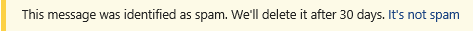

# 電子郵件訊息的安全提示

Exchange Online Protection （EOP）和 Microsoft 365 會保護您的垃圾郵件、網路釣魚和惡意程式碼防護。 如今，有些攻擊非常精心設計，看起來很合理。 將郵件傳送至 [垃圾郵件] 資料夾並不一定足夠。 現在，當您在 Outlook 或 Outlook 網頁版中檢查您的電子郵件時，EOP 會自動檢查寄件者，並將安全性秘訣加入至電子郵件的最上層。

安全提示（色彩編碼的訊息）會警告您可能有害的郵件。 您的收件匣中的大部分郵件都不會有安全性提示。 只有在 EOP 和 Microsoft 365 具有您所需的資訊，以協助防範垃圾郵件、網路釣魚和惡意程式碼攻擊時，您才會看到這些資訊。 如果在 [收件匣] 中顯示安全性秘訣，您可以使用下列範例深入瞭解每種安全提示類型。

- 可疑郵件（紅色的安全性提示）。

    

    電子郵件中的紅色安全性秘訣表示您收到的訊息包含可疑專案（例如網路釣魚詐騙）。 建議您從收件匣刪除這類電子郵件，而不需要開啟它。

- 垃圾郵件（黃色的人身安全提示）。

    

    電子郵件中的黃色安全提示表示郵件已標示為垃圾郵件。 如果您未辨識或不信任郵件的寄件者，請勿下載任何附件或圖片，不要按一下郵件中的任何連結。 在 web 上的 Outlook 中，您可以按一下 [垃圾郵件專案] 之黃色列中**的 [不是垃圾**郵件]，將郵件移至您的收件匣。 如果在傳送至您的收件匣的郵件上顯示黃色安全提示，這可能是因為您已停用將垃圾郵件移至 [垃圾郵件] 資料夾。

- 安全郵件（綠色的安全性提示）。

    

    除了不安全的郵件之外，我們也會告訴您來自我們信任的寄件者的有效郵件，並以綠色的安全性提示。 電子郵件中的綠色安全提示是指我們會檢查郵件的寄件者，並驗證它是安全的。 Microsoft 會維護此信任的寄件者清單，其中包含金融組織及經常哄騙或模仿的人。

- 未篩選的郵件（灰色安全提示）。

    

    我們也會告訴您，當我們略過檢查郵件時，因為郵件是來自您信任的 [安全寄件者] 清單上的寄件者，或是因為有郵件流程規則，而略過篩選。

    當外部圖像遭到封鎖時，灰色的安全性提示也會顯示出來，也就是說，郵件會在您的收件匣中，而且不會顯示為垃圾郵件，但是會包含您未選擇下載的外部圖像。

## 使用安全提示

即使並非每封郵件都會收到，安全性秘訣還是會針對網頁上的 Outlook 一直啟用。 系統管理員可以關閉其他電子郵件客戶程式（例如 Outlook）的安全性秘訣。 如需詳細資訊，請參閱[在 Office 365 中設定反垃圾郵件原則](configure-your-spam-filter-policies.md)。

如果您不同意 EOP 對郵件進行分類的方式（也就是說，郵件不是垃圾郵件或是已標示為垃圾郵件），您可以將郵件提交給 Microsoft 進行分析，以協助改善您的體驗。 如需相關指示，請參閱[將訊息和檔案報告給 Microsoft](report-junk-email-messages-to-microsoft.md)。 您也可以按一下安全提示中的 [意見反應] 連結，直接向 Microsoft 提交批註，以協助我們進行改進。
