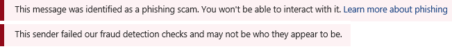

# 電子郵件訊息的安全提示Safety tips in email messages

Exchange Online Protection （EOP）和 Microsoft 365 會保護您的垃圾郵件、網路釣魚和惡意程式碼防護。Exchange Online Protection (EOP) and Microsoft 365 protect you with spam, phishing, and malware prevention. 如今，有些攻擊非常精心設計，看起來很合理。Today, some of these attacks are so well crafted that they look legitimate. 將郵件傳送至 [垃圾郵件] 資料夾並不一定足夠。Sending messages to the Junk Email folder isn't always enough. 現在，當您在 Outlook 或 Outlook 網頁版或任何電子郵件客戶程式中檢查您的電子郵件時，EOP 會自動檢查寄件者，並將安全性秘訣加入至電子郵件的最上層。Now, when you check your email in Outlook or Outlook on the web or any email client, EOP automatically checks the sender and adds a safety tip to the top of the email.

Outlook 中的安全性秘訣不一定取決於您所使用的 Outlook 版本，因為安全性秘訣會被破譯，並直接插入郵件內文。Safety tips in Outlook do not depend on what version of Outlook you're using because the safety tip is cracked open and inserted directly into the message body. 這表示安全提示會顯示在任何您使用的電子郵件客戶程式中。This means that the safety tip will show up in whatever email client you're using. 它會在電子郵件篩選層級進行，而不是在郵件客戶層級轉譯，所以不只會顯示在任何版本的 Outlook 中，也會顯示在任何電子郵件客戶程式中。It's done at the email filter level and not rendered at the mail client level, so not only does it show up in any version of Outlook, it also shows up in any email client.

安全提示（色彩編碼的訊息）會警告您可能有害的郵件。The safety tip—a color-coded message—will warn you about potentially harmful messages. 您的收件匣中的大部分郵件都不會有安全性提示。Most messages in your inbox won't have a safety tip. 只有在 EOP 和 Microsoft 365 具有您所需的資訊，以協助防範垃圾郵件、網路釣魚和惡意程式碼攻擊時，您才會看到這些資訊。You'll only see them when EOP and Microsoft 365 have information you need to help prevent spam, phishing, and malware attacks. 如果在 [收件匣] 中顯示安全性秘訣，您可以使用下列範例深入瞭解每種安全提示類型。If safety tips do show up on in your inbox, you can use the following examples to learn more about each type of safety tip.

- 可疑郵件（紅色的安全性提示）。Suspicious mail (red safety tip).

    

    電子郵件中的紅色安全性秘訣表示您收到的訊息包含可疑專案（例如網路釣魚詐騙）。A red safety tip in an email means that the message you received contains something suspicious, such as a phishing scam. 建議您從收件匣刪除這類電子郵件，而不需要開啟它。We recommend that you delete this kind of email message from your inbox without opening it.

- 垃圾郵件（黃色的人身安全提示）。Spam (yellow safety tip).

    

    電子郵件中的黃色安全提示表示郵件已標示為垃圾郵件。A yellow safety tip in an email means that the message has been marked as spam. 如果您未辨識或不信任郵件的寄件者，請勿下載任何附件或圖片，不要按一下郵件中的任何連結。If you don't recognize and trust the sender of the message, don't download any attachments or pictures and don't click any links in the message. 在 web 上的 Outlook 中，您可以按一下 [垃圾郵件專案] 之黃色列中**的 [不是垃圾**郵件]，將郵件移至您的收件匣。In Outlook on the web, you can click **It's not spam** in the yellow bar of a junk mail item to move the message to your inbox. 如果在傳送至您的收件匣的郵件上顯示黃色安全提示，這可能是因為您已停用將垃圾郵件移至 [垃圾郵件] 資料夾。If the yellow safety tip appears on a message that was delivered to your inbox, it's probably there because you've disabled moving spam to your Junk Email folder.

- 安全郵件（綠色的安全性提示）。Safe mail (green safety tip).

    

    除了不安全的郵件之外，我們也會告訴您來自我們信任的寄件者的有效郵件，並以綠色的安全性提示。In addition to unsafe messages, we'll also tell you about valid messages from senders we trust with a green safety tip. 電子郵件中的綠色安全提示是指我們會檢查郵件的寄件者，並驗證它是安全的。A green safety tip in an email means that we checked the sender of the message and verified that it's safe. Microsoft 會維護此信任的寄件者清單，其中包含金融組織及經常哄騙或模仿的人。Microsoft maintains this list of trusted senders which includes financial organizations and others that are frequently spoofed or impersonated.

- 未篩選的郵件（灰色安全提示）。Unfiltered mail (gray safety tip).

    

    我們也會告訴您，當我們略過檢查郵件時，因為郵件是來自您信任的 [安全寄件者] 清單上的寄件者，或是因為有郵件流程規則，而略過篩選。We'll also tell you when we skipped checking a mail because it's from a sender you trust on your Safe Senders list or if a mail flow rule exists to bypass filtering.

    當外部圖像遭到封鎖時，灰色的安全性提示也會顯示出來，也就是說，郵件會在您的收件匣中，而且不會顯示為垃圾郵件，但是會包含您未選擇下載的外部圖像。The gray safety tip also shows up when external images are blocked, that is, the message is in your inbox and doesn't appear to be spam, but contains external images that you haven't opted to download.
    

## 使用安全提示Working with safety tips

即使並非每封郵件都會收到，安全性秘訣還是會針對網頁上的 Outlook 一直啟用。Safety tips are always enabled for Outlook on the web, even though not every message will receive one. 系統管理員可以關閉其他電子郵件客戶程式（例如 Outlook）的安全性秘訣。Admins can turn safety tips off for other email clients such as Outlook. 如需詳細資訊，請參閱[在 Office 365 中設定反垃圾郵件原則](configure-your-spam-filter-policies.md)。For more information, see [Configure anti-spam policies in Office 365](configure-your-spam-filter-policies.md).

如果您不同意 EOP 對郵件進行分類的方式（也就是說，郵件不是垃圾郵件或是已標示為垃圾郵件），您可以將郵件提交給 Microsoft 進行分析，以協助改善您的體驗。If you disagree with how EOP categorized a message (that is, the message is not spam or it should have been marked as spam), you can submit the messages to Microsoft for analysis to help make your experience better. 如需相關指示，請參閱[將訊息和檔案報告給 Microsoft](report-junk-email-messages-to-microsoft.md)。For instructions, see [Report messages and files to Microsoft](report-junk-email-messages-to-microsoft.md). 您也可以按一下安全提示中的 [意見反應] 連結，直接向 Microsoft 提交批註，以協助我們進行改進。You can also click on the Feedback link in the safety tip to submit comments directly to Microsoft to help us improve.
