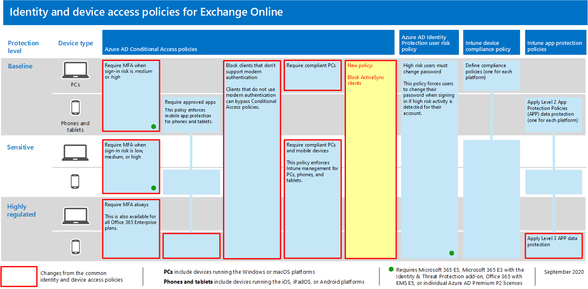

# <a name="policy-recommendations-for-securing-email"></a>保護電子郵件的原則建議

本文說明如何執行建議的身分識別和裝置存取原則，以保護支援新式驗證和條件式存取的組織電子郵件和電子郵件客戶程式。 本指南是以 [通用身分識別和裝置存取原則](identity-access-policies.md) 為基礎，也包含一些額外的建議。

這些建議是以三種不同的安全性和保護層級為基礎，可以根據您的需求細微性來套用： **基準**、 **機密**和 **高管制**。 您可以深入了解這些安全性層，以及[建議的安全性原則和設定簡介](microsoft-365-policies-configurations.md)中這些建議中所參考的建議用戶端作業系統。

這些建議要求您的使用者使用現代電子郵件客戶程式，包括行動裝置上的 Outlook iOS 和 Android。 適用于 iOS 和 Android 的 Outlook 提供 Office 365 的最佳功能支援。 這些行動性 Outlook 應用程式也會使用支援行動使用的安全性功能，以及與其他 Microsoft cloud 安全性功能共同運作。 如需詳細資訊，請參閱 [Outlook for iOS 和 ANDROID 常見問題](https://docs.microsoft.com/exchange/clients-and-mobile-in-exchange-online/outlook-for-ios-and-android/outlook-for-ios-and-android-faq)。

## <a name="update-common-policies-to-include-email"></a>更新常見原則以包含電子郵件

為了保護電子郵件，下列圖表說明從通用身分識別和裝置存取原則更新哪些原則。

[](https://github.com/MicrosoftDocs/microsoft-365-docs/raw/public/microsoft-365/media/microsoft-365-policies-configurations/identity-access-ruleset-mail.png)

[查看較大版本的此影像](https://github.com/MicrosoftDocs/microsoft-365-docs/raw/public/microsoft-365/media/microsoft-365-policies-configurations/identity-access-ruleset-mail.png)

請注意，新增 Exchange Online 的新原則，以封鎖 ActiveSync 用戶端。 這會強制使用 Outlook mobile。

當您設定 Exchange Online 和 Outlook 時，如果您已在設定原則的範圍內包含 Exchange Online 和 Outlook，您只需要建立新原則來封鎖 ActiveSync 用戶端。 請查看下表所列的原則，並進行建議的新增，或確認是否已包含這些原則。 每個原則都連結至 [共同身分識別和裝置存取原則](identity-access-policies.md)中相關的設定指示。

|保護層級|原則|其他相關資訊|
|:---------------|:-------|:----------------|
|**Baseline**|[當登入風險為*中*或*高*時，需要 MFA](identity-access-policies.md#require-mfa-based-on-sign-in-risk)|在雲應用程式的指派中包含 Exchange Online|
|        |[封鎖不支援新式驗證的用戶端](identity-access-policies.md#block-clients-that-dont-support-modern-authentication)|在雲應用程式的指派中包含 Exchange Online|
|        |[套用應用程式資料保護原則](identity-access-policies.md#apply-app-data-protection-policies)|請確定 Outlook 已包含在應用程式清單中。 請務必更新每個平臺 (iOS、Android、Windows) 的原則|
|        |[需要核准的應用程式和應用程式保護](identity-access-policies.md#require-approved-apps-and-app-protection)|在雲端應用程式清單中包含 Exchange Online|
|        |[需要相容的電腦](identity-access-policies.md#require-compliant-pcs-but-not-compliant-phones-and-tablets)|在雲端 app 清單中包含 Exchange Online|
|        |[封鎖 ActiveSync 用戶端](#block-activesync-clients)|新增此新原則| 
|**敏感度**|[當登入風險為*低*、*中*或*高*時，需要 MFA](identity-access-policies.md#require-mfa-based-on-sign-in-risk)| 在雲應用程式的指派中包含 Exchange Online|
|         |[需要相容 *的電腦和* 行動裝置](identity-access-policies.md#require-compliant-pcs-and-mobile-devices)|在雲端應用程式清單中包含 Exchange Online|
|**高管制**|[*永遠* 需要 MFA](identity-access-policies.md#require-mfa-based-on-sign-in-risk)|在雲應用程式的指派中包含 Exchange Online|

## <a name="block-activesync-clients"></a>封鎖 ActiveSync 用戶端

這個原則可防止 ActiveSync 用戶端略過其他條件式存取原則。 原則設定只適用于 ActiveSync 用戶端。 選取 [ **[要求應用程式保護原則](https://docs.microsoft.com/azure/active-directory/conditional-access/concept-conditional-access-grant#require-app-protection-policy)**]，此原則會封鎖 ActiveSync 用戶端。 若要瞭解如何建立此原則的詳細資料，請參閱 [使用條件式存取之 cloud app access 的應用程式保護原則](https://docs.microsoft.com/azure/active-directory/conditional-access/app-protection-based-conditional-access)。

- 在第 [365 1 種情形](https://docs.microsoft.com/azure/active-directory/conditional-access/app-protection-based-conditional-access#scenario-1-office-365-apps-require-approved-apps-with-app-protection-policies)中，請遵循「步驟2：使用 Exchange Online 設定 Azure AD 條件式存取原則 ACTIVESYNC (EAS) 」，以防止 exchange ActiveSync 用戶端利用基本驗證連線至 Exchange Online，以防止 exchange 用戶端使用基本驗證。

您也可以使用驗證原則 [停用基本身份](https://docs.microsoft.com/exchange/clients-and-mobile-in-exchange-online/disable-basic-authentication-in-exchange-online)驗證，以強制所有用戶端存取要求使用新式驗證。

## <a name="limit-access-to-exchange-online-from-outlook-on-the-web"></a>從網頁上的 Outlook 限制存取 Exchange Online

您可以在 umnanaged 裝置上限制使用者從 Outlook 網頁版下載附件的能力。 這些裝置上的使用者可以使用 Office Online 來查看及編輯這些檔案，而不需要在裝置上洩漏及儲存檔案。 您也可以封鎖使用者在未受管理的裝置上看到附件。

步驟如下：

1. [連接至 Exchange Online 遠端 PowerShell 會話](https://docs.microsoft.com/powershell/exchange/exchange-online/connect-to-exchange-online-powershell/connect-to-exchange-online-powershell)。
2. 如果您還沒有 OWA 信箱原則，請使用 [New-OwaMailboxPolicy](https://docs.microsoft.com/powershell/module/exchange/new-owamailboxpolicy) Cmdlet 建立一個。
3. 如果您想要允許查看附件，但無法下載，請使用此命令：

   ```powershell
   Set-OwaMailboxPolicy -Identity Default -ConditionalAccessPolicy ReadOnly
   ```

4. 如果您想要封鎖附件，請使用此命令：

   ```powershell
   Set-OwaMailboxPolicy -Identity Default -ConditionalAccessPolicy ReadOnlyPlusAttachmentsBlocked
   ```

4. 在 Azure 入口網站中，使用下列設定來建立新的條件式存取原則：

   **> 使用者和群組的工作分派**：選取適當的使用者和群組以包含及排除。

   **> 雲端應用程式或動作 > cloud app 的工作分派 > 包含 > 的選取應用程式**：選取 **Office 365 Exchange Online**

   **存取控制 > 會話**：選取 [**使用 app 強制限制**]

## <a name="require-that-ios-and-android-devices-must-use-outlook"></a>需要 iOS 和 Android 裝置必須使用 Outlook

為了確保 iOS 和 Android 裝置的使用者只能使用 Outlook for iOS 和 Android 來存取工作或學校內容，您需要針對那些潛在使用者的條件式存取原則。

若要 [使用 iOS 和 Android 的 Outlook 來管理通訊共同存取]( https://docs.microsoft.com/mem/intune/apps/app-configuration-policies-outlook#apply-conditional-access)，請參閱設定此原則的步驟。


## <a name="set-up-message-encryption"></a>設定郵件加密

使用新的 Office 365 郵件加密 (OME) 功能，利用 Azure 資訊保護中的保護功能，您的組織可以輕鬆地與任何設備上的任何人共用受保護的電子郵件。 使用者可以使用 Outlook.com、Gmail 及其他電子郵件服務，傳送及接收與其他 Microsoft 365 組織及非客戶的受保護郵件。

如需詳細資訊，請參閱 [設定新的 Office 365 郵件加密功能](https://docs.microsoft.com/microsoft-365/compliance/set-up-new-message-encryption-capabilities)。

## <a name="next-steps"></a>後續步驟


為下列專案設定條件式存取原則：

- [Microsoft Teams](teams-access-policies.md)
- [SharePoint](sharepoint-file-access-policies.md)
