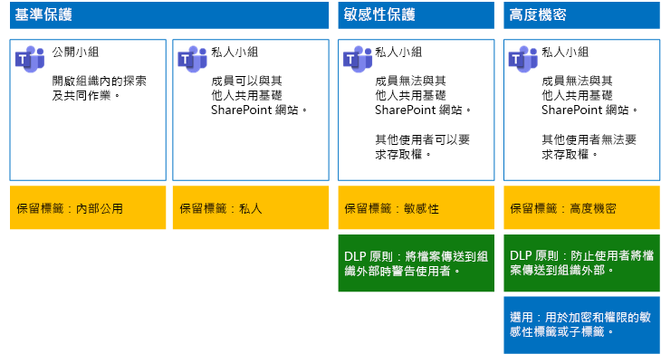

# 在 Microsoft Teams 中保護檔案Secure files in Microsoft Teams

本文提供在 Microsoft Teams 中設定小組及其基礎 SharePoint 網站，以在兼顧安全性與共同作業順暢性的前提下進行檔案保護的建議。This article provides recommendations for configuring teams in Microsoft Teams and their underlying SharePoint sites for file protection that balances security with ease of collaboration. 本文定義四種不同的設定，首先是組織內的公用網站，並搭配最開放的共用原則。This article defines four different configurations, starting with a public site within your organization with the most open sharing policies. 每項額外設定均代表有意識的保護升級，但對 Teams 內儲存的檔案進行存取和共同作業的能力，則會減少為僅限相關小組成員。Each additional configuration represents a meaningful step up in protection, but the ability to access and collaborate on files stored within Teams is reduced to the relevant set of team members. 您可以使用這些建議作為起點，並依據組織需求調整設定。Use these recommendations as a starting point and adjust the configurations to meet the needs of your organization.

本文的設定符合 Microsoft 針對資料、身分識別和裝置的下列三層保護建議：The configurations in this article align with Microsoft's recommendations for three tiers of protection for data, identities, and devices:

- 基準保護Baseline protection

- 敏感性保護Sensitive protection

- 高度機密保護Highly confidential protection

如需這些層級和每道層級的建議功能詳細資訊，請參閱下列資源。For more information about these tiers and capabilities recommended for each tier, see the following resources.

- [Office 365 的身分識別與裝置保護Identity and Device Protection for Office 365](https://docs.microsoft.com/office365/enterprise/microsoft-cloud-it-architecture-resources#identity-and-device-protection-for-office-365)

- [Office 365 的檔案保護方案File Protection Solutions in Office 365](https://docs.microsoft.com/office365/enterprise/microsoft-cloud-it-architecture-resources#file-protection-solutions-in-office-365)

## 功能概觀Capability overview

針對受保護的小組而提供的建議，依據各種不同 Microsoft 365 功能而定。Recommendations for secured teams draw on a variety of Microsoft 365 capabilities. 下圖顯示建議的設定。The following illustration shows the recommended configurations.

如圖例所示：As illustrated:

- 基準保護包含公開小組和私人小組。Baseline protection includes a public team and private team. 公開小組可供組織中的任何人探索及存取。Public teams can be discovered and accessed by anybody in the organization. 私人小組則僅供小組成員探索及存取。Private teams can only be discovered and accessed by members of the team. 這兩種設定都允許共用將檔案儲存在小組群組以外的基礎 SharePoint 網站。Both of these configurations allow for sharing of the underlying SharePoint site on which files are stored outside the team group.

- 敏感且受高度機密保護的小組是私人小組，此處會限制基礎網站的共用和存取要求。Teams for sensitive and highly confidential protection are private teams in which sharing and the requesting of access for the underlying site is limited.

- [保留標籤](../../compliance/labels.md)可用來分類基礎 SharePoint 網站內的檔案。[Retention labels](../../compliance/labels.md) provide a way to classify files within the underlying SharePoint sites. 每個基礎 SharePoint 網站都會設為自動替文件庫中的檔案加上預設保留標籤。Each of the underlying SharePoint sites are configured to automatically label files in document libraries with a default retention label. 此範例的標籤對應到四種小組網站設定，分別是「內部公開」、「私人」、「敏感性」與「高度機密」。Corresponding to the four team configurations, the labels in this example are Internal Public, Private, Sensitive, and Highly Confidential. 使用者可以變更個別檔案的標籤，但這種設定可確保所有檔案都收到預設標籤。Users can change the labels on the individual files, but this configuration ensures all files receive a default label.

- 系統會針對「敏感性」和「高度機密」的保留標籤設定[資料外洩防護](../../compliance/data-loss-prevention-policies.md) (DLP) 原則，以在使用者嘗試將這類檔案傳送到組織外部時，對他們發出警告或阻止此動作。[Data loss prevention](../../compliance/data-loss-prevention-policies.md) (DLP) policies are configured for the Sensitive and Highly Confidential retention labels to either warn or prevent users when they attempt to send these types of files outside the organization.

- 如果在您的案例中有需要，您可以使用[敏感度標籤](../../compliance/sensitivity-labels.md)以使用加密與權限來保護高度機密檔案。If needed for your scenario, you can use [sensitivity labels](../../compliance/sensitivity-labels.md) to protect highly confidential files with encryption and permissions. 針對 Azure 資訊保護客戶，您可以使用 Microsoft 365 合規性中心的 Azure 資訊保護標籤，而如果您選擇執行額外或進階組態，標籤就會與 Azure 入口網站同步處理。For Azure Information Protection customers, you can use your Azure Information Protection labels in the Microsoft 365 compliance center, and your labels will be synced with the Azure portal in case you choose to perform additional or advanced configuration. Azure 資訊保護標籤與 Office 365 敏感度標籤完全彼此相容。Azure Information Protection labels and Office 365 sensitivity labels are fully compatible with each other. 這表示，例如，如果您有使用 Azure 資訊保護加上標籤的內容，則不需將內容重新分類或重新加上標籤。This means, for example, if you have content labeled by Azure Information Protection, you won’t need to reclassify or relabel your content. 並非所有客戶都需要此層級的保護。Not all customers need this level of protection.

## SharePoint 和 OneDrive 的全組織設定Organization-wide settings for SharePoint and OneDrive

SharePoint 和 OneDrive 包含對所有網站與使用者皆有影響的全組織設定。SharePoint and OneDrive include organization-wide settings that affect all sites and users. 其中某些設定可以於網站層級進行調整，使其更加嚴格 (但不能更寬鬆)。Some of these settings can also be adjusted at the site level to be more restrictive (but not less). 本節說明會影響安全性與共同作業的租用戶整體設定。This section discusses tenant-wide settings that affect security and collaboration.

### 共用Sharing

針對這個解決方案，我們建議使用下列全組織設定：For this solution, we recommend the following organization-wide settings:

- 保留預設共用原則，以允許所有帳戶類型的共用作業，包括匿名共用。Keep the default sharing policy that allows all sharing with all account types, including anonymous sharing.

- 您可視需要將匿名的連結設為過期。Set anonymous links to expire, if desired.

- 將共用的預設連結類型變更為「內部」。 這有助於防止資料不慎洩漏到組織外部。Change the default link type for sharing to Internal. This helps prevent accidental data leakage outside your organization.

雖然允許外部共用似乎有悖常理，但相較於以電子郵件傳送檔案，此方法可以更充分地掌控檔案共用情況。While it might seem counterintuitive to allow external sharing, this approach provides more control over file sharing compared to sending files in email. SharePoint 與 Outlook 一起運作，以提供安全的檔案共同作業。SharePoint and Outlook work together to provide secure collaboration on files.

- 根據預設，Outlook 會共用檔案的連結，而非以電子郵件傳送檔案。By default, Outlook shares a link to a file instead of sending the file in email.

- SharePoint 和 OneDrive 可讓您輕易地與組織內外的參與者共用檔案連結SharePoint and OneDrive make it easy to share links to files with contributors who are both inside and outside your organization

您也可以使用相關控制來協助控管外部共用。 例如，您可以：You also have controls to help govern external sharing. For example, you can:

- 停用匿名訪客的連結。Disable an anonymous guest link.

- 撤銷使用者的網站存取權。Revoke user access to a site.

- 查看誰具有特定網站或文件的存取權。See who has access to a specific site or document.

- 將匿名共用連結設為過期 (租用戶設定)。Set anonymous sharing links to expire (tenant setting).

- 限制可在組織外部共用的人員 (租用戶設定)。Limit who can share outside your organization (tenant setting).

### 搭配使用外部共用與資料外洩防護 (DLP)Use external sharing together with data loss prevention (DLP)

如果您不允許外部共用，有業務需求的使用者就必須找到替代工具和方法。Microsoft 建議您結合外部共用與 DLP 原則來保護敏感性與高度機密檔案。If you don't allow external sharing, users with a business need will find alternate tools and methods. Microsoft recommends you combine external sharing with DLP policies to protect sensitive and highly confidential files.

### 裝置存取設定Device access settings

SharePoint 和 OneDrive 的裝置存取設定可讓您決定要僅限瀏覽器存取 (無法下載檔案)，或是封鎖存取。Device access settings for SharePoint and OneDrive let you determine whether access is limited to browser only (files can't be downloaded) or if access is blocked. 如需詳細資訊，請參閱[控制未受管理裝置的存取權](https://docs.microsoft.com/sharepoint/control-access-from-unmanaged-devices)。For more information, see [Control access from unmanaged devices](https://docs.microsoft.com/sharepoint/control-access-from-unmanaged-devices).

若要使用裝置存取設定搭配 Azure Active Directory 中建議的條件式存取原則，請參閱[保護 SharePoint 網站和檔案的原則建議](https://docs.microsoft.com/microsoft-365/enterprise/sharepoint-file-access-policies)。To use device access settings with recommended conditional access policies in Azure Active Directory, see [Policy recommendations for securing SharePoint sites and files](https://docs.microsoft.com/microsoft-365/enterprise/sharepoint-file-access-policies).

請瀏覽這些設定，以決定是否要變更 OneDrive 的網站預設設定。Visit these settings to decide if you want to change the default settings for OneDrive sites. 目前，會複製 SharePoint 系統管理中心的共用和裝置存取設定，並套用到這兩個環境。Currently, the sharing and device access settings are duplicated from the SharePoint admin center and apply to both environments.

## 小組和 SharePoint 網站設定Team and SharePoint site configuration

下表摘要說明本文先前所述的每個小組及其基礎 SharePoint 網站的設定。The following table summarizes the configuration for each of the teams and their underlying SharePoint site described earlier in this article. 您可以使用這些設定作為建議的起點，並依據組織需求調整網站類型與設定。Use these configurations as starting point recommendations and adjust the site types and configurations to meet the needs of your organization. 並非每個組織都需要所有類型的小組。Not every organization needs every type of team. 只有少數組織的小組會需要高度機密的保護。Only a small number of organizations require teams with highly confidential protection.

||||||
|:-----|:-----|:-----|:-----|:-----|
||**基準保護 #1****Baseline protection #1**|**基準保護 #2****Baseline protection #2**|**敏感性保護****Sensitive protection**|**高度機密****Highly confidential**|
|描述Description|開放給組織內部探索及共同作業的公開小組。Public team with open discovery and collaboration within the organization.|允許群組外部共用基礎 SharePoint 網站的私人小組。Private team with sharing of the underlying SharePoint site allowed outside the group.|僅允許網站成員共用基礎 SharePoint 網站的私人小組。Private team, but sharing of the underlying SharePoint site is only allowed to members of the site. 當使用者嘗試將檔案傳送到組織外部時，DLP 會對其發出警告。DLP warns users when attempting to send files outside the organization.|檔案會隨附敏感度標籤以進行加密和權限授與的私人小組。Private team with sensitivity labels for file encryption and permissions that travel with the file. DLP 可防止使用者將檔案傳送到組織外部。DLP prevents users from sending files outside the organization.|
|私用或公用的小組網站Private or public team site|公用Public|PrivatePrivate|PrivatePrivate|PrivatePrivate|
|誰可以存取？Who has access?|組織中所有人，包括 B2B 使用者。Everybody in the organization, including B2B users.|僅限網站的成員。Members of the site only. 其他人可以要求存取權。Others can request access.|僅限小組的成員。Members of the team only. 其他人可要求存取基礎網站，由小組擁有者核准。Others can request access to the underlying site, which is approved by a team owner.|僅限成員。Members only. 其他人無法要求存取基礎網站。Others cannot request access to the underlying site.|
|網站層級的共用控制Site-level sharing controls|允許與任何人共用。 預設設定。Sharing allowed with anybody. Default settings.|允許與任何人共用。 預設設定。Sharing allowed with anybody. Default settings.|成員無法共用網站的存取權。Members cannot share access to the site.   非成員可要求存取網站，但這些要求需由小組的群組擁有者處理。Non-members can request access to the site, but these requests need to be addressed by a group owner for the team.|成員無法共用網站的存取權。Members cannot share access to the site.   非成員無法要求存取網站或其內容。Non-members cannot request access to the site or its contents.|
|網站層級的裝置存取控制Site-level device access controls|無額外控制。No additional controls.|無額外控制。No additional controls.|防止使用者下載檔案到不相容或非加入網域的裝置。如此一來，所有其他裝置僅可進行瀏覽器存取。Prevents users from downloading files to non-compliant or non-domain joined devices. This allows browser-only access from all other devices.|封鎖將檔案下載至不相容或非加入網域的裝置。Block downloading of files to non-compliant or non-domain joined devices.|
|保留標籤Retention labels|內部公用Internal Public|PrivatePrivate|敏感性Sensitive|高度機密Highly Confidential|
|DLP 原則DLP policies|||當使用者將標記為「敏感性」的檔案傳送到組織外部時，會對其發出警告。Warn users when sending files that are labeled as Sensitive outside the organization.   若要封鎖敏感性資料類型的外部共用，例如信用卡號碼或其他個人資料，您可以為這些資料類型 (包括您設定的自訂資料類型) 設定額外的 DLP 原則。To block external sharing of sensitive data types, such as credit card numbers or other personal data, you can configure additional DLP policies for these data types (including custom data types you configure).|封鎖使用者，使其無法將標示為高度機密的檔案傳送到組織外部。 允許使用者提供理由來覆寫這項預設，包括共用檔案的對象。Block users from sending files that are labeled as highly confidential outside organization. Allow users to override this by providing justification, including who they are sharing the file with.|
|敏感度標籤Sensitivity labels||||使用敏感度標籤可為檔案加密並授與其權限。Use sensitivity labels to encrypt and grant permissions to files. 這項保護會隨附於檔案，以防檔案從基礎 SharePoint 網站中外洩。This protection travels with the files in case they are leaked from the underlying SharePoint site.|

如需此解決方案中四種不同小組類型的部署步驟，請參閱[部署三種檔案保護層級的小組](deploy-teams-three-tiers.md)。For the steps to deploy the four different types of teams in this solution, see [Deploy teams for three tiers of protection for files](deploy-teams-three-tiers.md).

## Office 365 保留標籤Office 365 retention labels

建議您在含有敏感性資料的環境中使用保留標籤。Using retention labels is recommended for environments with sensitive data. 設定並發佈保留標籤之後：After you configure and publish retention labels:

- 您可以將預設標籤套用至某小組的基礎 SharePoint 網站中的文件庫，讓該小組的 [檔案]\*\*\*\* 區段中所有的文件都具有預設標籤。You can apply a default label to a document library in the underlying SharePoint site for a team, so that all documents in the **Files** section of the team get the default label.

- 您可以自動將標籤套用到內容 (如果內容符合特定條件的話)。You can apply labels to content automatically if it matches specific conditions.

- 您可以套用以保留標籤為基礎的 DLP 原則。You can apply DLP policies that are based on retention labels.

- 組織中的人員可手動將標籤套用至 Outlook 網頁版、Outlook 2010 和更新版本、OneDrive、SharePoint 和 Office 365 群組中的內容。People in your organization can apply a label manually to content in Outlook on the web, Outlook 2010 and later, OneDrive, SharePoint, and Office 365 groups. 使用者通常最清楚自己使用的內容類型，因此可以對其分類並套用適當的 DLP 原則。Users often know best what type of content they're working with, so they can classify it and have the appropriate DLP policy applied.

如圖例所示，此解決方案包括建立下列保留標籤：As illustrated, this solution includes creating the following retention labels:

- 高度機密Highly Confidential

- 敏感性Sensitive

- PrivatePrivate

- 內部公用Internal Public

這些標籤會對應到本文稍早的圖例與圖表中的建議網站。此解決方案建議您設定 DLP 原則，以協助避免標示為「敏感性」和「高度機密」的檔案外洩。These labels are mapped to the recommended sites in the illustrations and charts earlier in this article. This solution recommends configuring DLP policies to help prevent the leakage of files labeled as Sensitive and Highly Confidential.

如需在此解決方案中設定保留標籤和 DLP 原則的步驟，請參閱[使用保留標籤與 DLP 來保護小組中的檔案](deploy-teams-retention-DLP.md)。For the steps to configure retention labels and DLP policies in this solution, see [Protect files in teams with retention labels and DLP](deploy-teams-retention-DLP.md).

## 敏感度標籤Sensitivity labels

若您的安全性案例有需要，您可以使用敏感度標籤來套用可隨時追蹤檔案的保護。If warranted for your security scenario, you can use sensitivity labels to apply protections that follow the files wherever they go. Microsoft 365 合規性中心的敏感度標籤和 Azure 資訊保護標籤是相同的。Sensitivity labels in the Microsoft 365 compliance center and Azure Information Protection labels are the same. 採用此解決方案時，建議您使用敏感度標籤或子標籤，來加密需要以最高安全性層級保護的檔案，和授與其權限。For this solution, we recommend you use a sensitivity label or sublabel to encrypt and grant permissions to files that need to be protected with the highest level of security.

如需詳細資訊，請參閱[敏感度標籤概觀](../../compliance/sensitivity-labels.md)。For more information, see [Overview of sensitivity labels](../../compliance/sensitivity-labels.md).

如需在此解決方案中設定敏感度標籤的步驟，請參閱[使用靈敏度標籤保護小組中的檔案](deploy-teams-sensitivity-labels.md)。For the steps to configure sensitivity labels in this solution, see [Protect files in teams with sensitivity labels](deploy-teams-sensitivity-labels.md).

## 另請參閱See also

[雲端採用和混合式解決方案Cloud adoption and hybrid solutions](https://docs.microsoft.com/office365/enterprise/cloud-adoption-and-hybrid-solutions)
