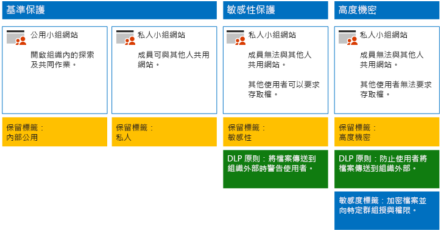
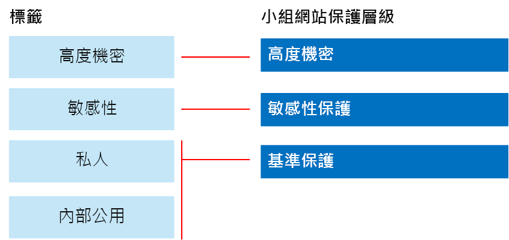

# 保護 SharePoint Online 網站與檔案

本文提供設定 SharePoint Online 小組網站和檔案保護的建議，以在安全性和順暢的共同作業間取得平衡。本文定義四種不同的設定，首先是組織內的公用網站，並搭配最開放的共用原則。每項額外設定均代表有意識的保護升級，但資源的存取和共同作業能力則會減少為只提供給相關使用者。使用建議作為起點，並且調整組態以符合您的組織的需求。

本文的設定符合 Microsoft 針對資料、身分識別和裝置的下列三層保護建議：

- 基準保護

- 敏感性保護

- 高度機密保護

如需這些層級和每道層級的建議功能詳細資訊，請參閱下列資源。

- [Office 365 的身分識別與裝置保護](https://docs.microsoft.com/office365/enterprise/microsoft-cloud-it-architecture-resources#identity-and-device-protection-for-office-365)

- [Office 365 的檔案保護方案](https://docs.microsoft.com/office365/enterprise/microsoft-cloud-it-architecture-resources#file-protection-solutions-in-office-365)

## 功能概觀

建議的 SharePoint Online 小組網站依據各種不同 Microsoft 365 功能而定。 下圖顯示四種 SharePoint Online 小組網站的建議設定。

如圖例所示：

- 基準保護包括公用網站與私用網站這兩個 SharePoint Online 小組網站的選項。 公用網站可供組織中的任何人探索及存取。 私用網站則僅供網站成員探索及存取。 這兩個網站的設定都允許群組外部共用。

- 設有敏感性與高度機密保護的網站為私用網站，其存取權僅限於特定群組的成員。

- [保留標籤](../../compliance/labels.md)提供一個方式來分類網站內的檔案。 系統會將每個 SharePoint Online 小組網站設為自動替文件庫中的檔案加上該網站的預設保留標籤。 此範例的標籤對應到這四種網站設定，分別是「內部公用」、「私用」、「敏感性」與「高度機密」。 使用者可以變更標籤，但這種設定可確保所有檔案都收到預設標籤。

- 系統會針對「敏感性」和「高度機密」的保留標籤設定[資料外洩防護](../../compliance/data-loss-prevention-policies.md) (DLP) 原則，以在使用者嘗試將這類檔案傳送到組織外部時，對他們發出警告或阻止此動作。

- 如果在您的案例中有需要，您可以使用[敏感度標籤](../../compliance/sensitivity-labels.md)以使用加密與權限來保護高度機密檔案。 針對 Azure 資訊保護客戶，您可以使用 Microsoft 365 合規性中心的 Azure 資訊保護標籤，而如果您選擇執行額外或進階組態，標籤就會與 Azure 入口網站同步處理。 Azure 資訊保護標籤與 Office 365 敏感度標籤完全彼此相容。 這表示，例如，如果您有使用 Azure 資訊保護加上標籤的內容，則不需將內容重新分類或重新加上標籤。 並非所有客戶都需要此層級的保護。

## SharePoint Online 和商務用 OneDrive 的租用戶整體設定

SharePoint Online 和商務用 OneDrive 包含的租用戶整體設定會影響所有網站與使用者。 其中某些設定可以於網站層級進行調整，使其更加嚴格 (但不能更寬鬆)。 本節說明會影響安全性與共同作業的租用戶整體設定。

### 共用

針對這個解決方案，我們建議下列的租用戶整體設定：

- 保留預設共用原則，以允許所有帳戶類型的共用作業，包括匿名共用。

- 您可視需要將匿名的連結設為過期。

- 將共用的預設連結類型變更為「內部」。 這有助於防止資料不慎洩漏到組織外部。

雖然允許外部共用似乎有悖常理，但相較於以電子郵件傳送檔案，此方法可以更充分地掌控檔案共用情況。 SharePoint Online 與 Outlook 一起運作，以提供安全的檔案共同作業。

- 根據預設，Outlook 會共用檔案的連結，而非以電子郵件傳送檔案。

- SharePoint Online 與商務用 OneDrive 可讓您輕易地與組織內外的參與者共用檔案連結

您也可以使用相關控制來協助控管外部共用。 例如，您可以：

- 停用匿名訪客的連結。

- 撤銷使用者的網站存取權。

- 查看誰具有特定網站或文件的存取權。

- 將匿名共用連結設為過期 (租用戶設定)。

- 限制可在組織外部共用的人員 (租用戶設定)。

### 搭配使用外部共用與資料外洩防護 (DLP)

如果您不允許外部共用，有業務需求的使用者就必須找到替代工具和方法。Microsoft 建議您結合外部共用與 DLP 原則來保護敏感性與高度機密檔案。

### 裝置存取設定

SharePoint Online 和商務用 OneDrive 的裝置存取設定可讓您決定要僅限瀏覽器存取 (無法下載檔案)，或是封鎖存取。 如需詳細資訊，請參閱[控制未受管理裝置的存取權](https://docs.microsoft.com/sharepoint/control-access-from-unmanaged-devices)。

若要使用裝置存取設定搭配 Azure Active Directory 中建議的條件式存取原則，請參閱[保護 SharePoint 網站和檔案的原則建議](https://docs.microsoft.com/microsoft-365/enterprise/sharepoint-file-access-policies)。

### 商務用 OneDrive

請瀏覽這些設定，以決定是否要變更商務用 OneDrive 的網站預設設定。 目前，會複製 SharePoint Online 系統管理中心的共用和裝置存取設定，並套用到這兩個環境。

## SharePoint 小組網站設定

下表摘要說明本文稍早所述之每個小組網站的設定。 您可以使用這些設定作為建議的起點，並依據組織需求調整網站類型與設定。 並非每個組織都需要所有類型的網站。 只有少數的組織需要高度機密的保護。

||||||
|:-----|:-----|:-----|:-----|:-----|
||**基準保護 #1**|**基準保護 #2**|**敏感性保護**|**高度機密**|
|描述|開啟組織內的探索及共同作業。|私用網站和群組，其可在群組外部共用。|僅允許網站成員共用的私用網站。嘗試將檔案傳送到組織外時，DLP 將會警告使用者。|帶有敏感度標籤的私用網站和檔案加密與權限。 DLP 可防止使用者將檔案傳送到組織外部。|
|私用或公用的小組網站|公用|Private|Private|Private|
|誰可以存取？|組織中所有人，包括 B2B 使用者和訪客使用者。|僅限網站的成員。 其他人可以要求存取權。|僅限網站的成員。 其他人可以要求存取權。|僅限成員。 其他人無法要求存取權。|
|網站層級的共用控制|允許與任何人共用。 預設設定。|允許與任何人共用。 預設設定。|成員無法共用網站的存取權。   非成員可以要求存取網站，但這些要求需要網站系統管理員處理。|成員無法共用網站的存取權。   非成員無法要求存取網站或內容。|
|網站層級的裝置存取控制|無額外控制。|無額外控制。|防止使用者下載檔案到不相容或非加入網域的裝置。如此一來，所有其他裝置僅可進行瀏覽器存取。|封鎖將檔案下載至不相容或非加入網域的裝置。|
|保留標籤|內部公用|Private|敏感性|高度機密|
|DLP 原則|||當使用者將標記為「敏感性」的檔案傳送到組織外部時，會對其發出警告。   若要封鎖敏感性資料類型的外部共用，例如信用卡號碼或其他個人資料，您可以為這些資料類型 (包括您設定的自訂資料類型) 設定額外的 DLP 原則。|封鎖使用者，使其無法將標示為高度機密的檔案傳送到組織外部。 允許使用者提供理由來覆寫這項預設，包括共用檔案的對象。|
|敏感度標籤||||使用敏感度標籤可自動加密並授與檔案權限。 這項保護會與檔案一起移動，以免檔案外洩。   Office 365 無法讀取以敏感度標籤加密的檔案。 此外，DLP 原則僅會使用中繼資料 (包括標籤)，而不會使用這些檔案的內容 (例如檔案中的信用卡號碼)。|

如需此解決方案中這四種不同類型 SharePoint Online 小組網站的部署步驟，請參閱[部署三層保護的 SharePoint Online 網站](../../compliance/deploy-sharepoint-online-sites-for-three-tiers-of-protection.md)。

## Office 365 保留標籤

若環境含有敏感性和高度機密資料，建議使用保留標籤。 設定並發佈保留標籤之後：

- 您可以將預設標籤套用至 SharePoint Online 小組網站的文件庫，以便讓該文件庫中的所有文件取得預設標籤。

- 您可以自動將標籤套用到內容 (如果內容符合特定條件的話)。

- 您可以套用以保留標籤為基礎的 DLP 原則。

- 組織的人員可以手動套用標籤至 Outlook 網頁版、Outlook 2010 及更新版本、商務用 OneDrive、SharePoint Online 以及 Office 365 群組中的內容。使用者通常最清楚自己使用的內容類型，因此可以對其分類並套用適當的 DLP 原則。

如圖例所示，此解決方案包括建立下列保留標籤：

- 高度機密

- 敏感性

- Private

- 內部公用

這些標籤會對應到本文稍早的圖例與圖表中的建議網站。此解決方案建議您設定 DLP 原則，以協助避免標示為「敏感性」和「高度機密」的檔案外洩。

如需在此解決方案中設定保留標籤和 DLP 原則的步驟，請參閱[使用保留標籤與 DLP 來保護 SharePoint Online 檔案](../../compliance/protect-sharepoint-online-files-with-office-365-labels-and-dlp.md)。

## 敏感度標籤

若您的安全性案例有需要，您可以使用敏感度標籤來套用可隨時追蹤檔案的保護。 Microsoft 365 合規性中心的敏感度標籤和 Azure 資訊保護標籤是相同的。 針對這個解決方案，建議您使用敏感度標籤或高度機密敏感度標籤的子標籤來加密並授與需要以最高層級安全性保護的檔案之權限。

如果貴組織未[在 SharePoint 和 OneDrive (公開預覽版) 中針對 Office 檔案啟用敏感度標籤](/microsoft-365/compliance/sensitivity-labels-sharepoint-onedrive-files)：請注意，當您將敏感度標籤加密套用到儲存在 Office 365 中的檔案時，服務無法處理這些檔案的內容。 共同撰寫、eDiscovery、搜尋、Delve 和其他共同作業功能無法運作。 此外，DLP 原則只可用於中繼資料 (包括保留標籤)，但不可用於這些檔案的內容 (例如檔案中的信用卡號碼)。

如需詳細資訊，請參閱[敏感度標籤概觀](../../compliance/sensitivity-labels.md)。

### 新增外部使用者的權限

您可以使用兩種方式，將敏感度標籤所保護的檔案存取權授與外部使用者。 在這兩種情況下，外部使用者皆必須擁有 Azure AD 帳戶。 如果外部使用者不屬於使用 Azure AD 的組織成員，可以使用 [https://aka.ms/aip-signup](https://aka.ms/aip-signup) 這個註冊頁面，以個人身分取得 Azure AD 帳戶。

- 將外部使用者新增至用來設定保護標籤的 Azure AD 群組

  您必須先將帳戶新增為目錄中的 B2B 使用者。當 [Azure 版權管理進行群組成員資格的快取](https://docs.microsoft.com/information-protection/plan-design/prepare)時，可能需要花費數小時的時間。使用此方法時，會授與所有受標籤保護的現有檔案權限 (包括將使用者新增至 Azure AD 群組之前即受保護的檔案)。

- 將外部使用者直接新增至標籤保護。

  您可以從組織 (例如 Fabrikam.com)、Azure AD 群組 (例如組織內的財務部門) 或個別使用者，新增所有使用者。例如，您可以將外部的監理人員小組新增至標籤保護。使用此方法時，僅會授與在外部實體新增至保護之後受標籤保護的檔案權限。

### 部署和使用敏感度標籤

如需在此解決方案中設定敏感度標籤的步驟，請參閱[使用敏感度標籤保護 SharePoint Online 檔案](../../compliance/protect-sharepoint-online-files-with-sensitivity-label.md)。

## 下一步

使用[開發/測試環境中保護 SharePoint Online 網站的安全](secure-sharepoint-online-sites-in-a-dev-test-environment.md)將其構建為概念驗證。

## 另請參閱

[適用於政治活動、非營利組織和其他彈性組織的 Microsoft 安全性指南](microsoft-security-guidance-for-political-campaigns-nonprofits-and-other-agile-o.md)

[雲端採用和混合式解決方案](https://docs.microsoft.com/office365/enterprise/cloud-adoption-and-hybrid-solutions)
