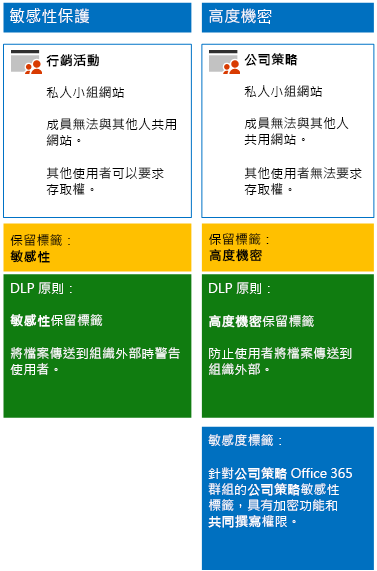

# <a name="secure-sharepoint-online-sites-in-a-devtest-environment"></a><span data-ttu-id="2d647-103">在開發/測試環境中保護 SharePoint Online 網站</span><span class="sxs-lookup"><span data-stu-id="2d647-103">Secure SharePoint Online sites in a dev/test environment</span></span>

<span data-ttu-id="2d647-104">本文提供建立開發/測試環境的逐步指示，其中包含 [保護 SharePoint Online 網站和檔案](secure-sharepoint-online-sites-and-files.md) 解決方案的敏感性和高度機密 SharePoint 網站。</span><span class="sxs-lookup"><span data-stu-id="2d647-104">This article provides step-by-step instructions to create a dev/test environment that includes the four different types of SharePoint Online team sites for the [Secure SharePoint Online sites and files](secure-sharepoint-online-sites-and-files.md) solution.</span></span>
  

  
<span data-ttu-id="2d647-106">在生產環境中部署這些類型的小組網站之前，可使用此開發/測試環境來試驗和微調設定，以符合您的特定需求。</span><span class="sxs-lookup"><span data-stu-id="2d647-106">Use this dev/test environment to experiment and fine-tune settings for your specific needs before deploying these types of teams in production.</span></span>
  
## <a name="phase-1-build-out-your-microsoft-365-enterprise-test-environment"></a><span data-ttu-id="2d647-107">階段 1：建置您的 Microsoft 365 企業版測試環境</span><span class="sxs-lookup"><span data-stu-id="2d647-107">Phase 1: Build out your Microsoft 365 Enterprise test environment</span></span>

<span data-ttu-id="2d647-108">如果只想要以最小的需求，透過輕量級方式測試敏感性和高度機密小組網站，請依照[輕量型基本組態](https://docs.microsoft.com/microsoft-365/enterprise/lightweight-base-configuration-microsoft-365-enterprise)中的指示進行。</span><span class="sxs-lookup"><span data-stu-id="2d647-108">If you just want to test sensitive and highly confidential teams in a lightweight way with the minimum requirements, follow the instructions in [Lightweight base configuration](https://docs.microsoft.com/microsoft-365/enterprise/lightweight-base-configuration-microsoft-365-enterprise).</span></span>

<span data-ttu-id="2d647-109">如果想要在模擬的企業中測試敏感性和高度機密小組網站，請依照[密碼雜湊同步處理](https://docs.microsoft.com/microsoft-365/enterprise/password-hash-sync-m365-ent-test-environment)中的指示進行。</span><span class="sxs-lookup"><span data-stu-id="2d647-109">If you want to test sensitive and highly confidential teams in a simulated enterprise, follow the instructions in [Password hash synchronization](https://docs.microsoft.com/microsoft-365/enterprise/password-hash-sync-m365-ent-test-environment).</span></span>

>[!Note]
><span data-ttu-id="2d647-110">測試敏感性和高度機密小組網站不需要模擬的企業測試環境，其中包括模擬的內部網路 (連線到網際網路) 與 Active Directory Domain Services (AD DS) 樹系中的目錄同步處理。</span><span class="sxs-lookup"><span data-stu-id="2d647-110">Testing sensitive and highly confidential teams does not require the simulated enterprise test environment, which includes a simulated intranet connected to the Internet and directory synchronization for an Active Directory Domain Services (AD DS) forest.</span></span> <span data-ttu-id="2d647-111">此處提供的選項可供您測試敏感性和組織的環境中進行試驗。</span><span class="sxs-lookup"><span data-stu-id="2d647-111">It is provided here as an option so that you can test sensitive and highly confidential teams and experiment with it in an environment that represents a typical organization.</span></span>
>
    
## <a name="phase-2-create-and-configure-your-azure-active-directory-ad-groups-and-users"></a><span data-ttu-id="2d647-112">階段 2：建立和設定 Azure Active Directory (AD) 群組和使用者</span><span class="sxs-lookup"><span data-stu-id="2d647-112">Phase 2: Create and configure your Azure Active Directory (AD) groups and users</span></span>

<span data-ttu-id="2d647-113">在這個階段中，您會為虛構組織建立和設定 Azure AD 群組和使用者。</span><span class="sxs-lookup"><span data-stu-id="2d647-113">In this phase, you create and configure the Azure AD groups and users for your fictional organization.</span></span>
  
<span data-ttu-id="2d647-114">首先，利用 Azure 入口網站建立兩個典型組織的群組。</span><span class="sxs-lookup"><span data-stu-id="2d647-114">First, create two groups for a typical organization with the Azure portal.</span></span>
  
1. <span data-ttu-id="2d647-115">在瀏覽器中建立個別索引標籤，然後移至 Azure 入口網站 (網址為 [https://portal.azure.com](https://portal.azure.com))。</span><span class="sxs-lookup"><span data-stu-id="2d647-115">Create a separate tab in your browser, and then go to the Azure portal at [https://portal.azure.com](https://portal.azure.com).</span></span> <span data-ttu-id="2d647-116">如果需要，請使用 Microsoft 365 E5 試用或付費訂閱的全域系統管理員帳戶認證登入。</span><span class="sxs-lookup"><span data-stu-id="2d647-116">If needed, sign in with the credentials of the global administrator account for your Microsoft 365 E5 trial or paid subscription.</span></span>
    
2. <span data-ttu-id="2d647-117">在 Azure 入口網站中，按一下 [Azure Active Directory] > [群組]\*\*\*\*。</span><span class="sxs-lookup"><span data-stu-id="2d647-117">In the Azure portal, click **Azure Active Directory > Groups**.</span></span>
    
3. <span data-ttu-id="2d647-118">在 [群組 - 所有群組]\*\*\*\* 刀鋒視窗中，按一下 [+ 新增群組]\*\*\*\*。</span><span class="sxs-lookup"><span data-stu-id="2d647-118">On the **Groups - All groups** blade, click **+ New group**.</span></span>
    
4. <span data-ttu-id="2d647-119">在 [群組]\*\*\*\* 刀鋒視窗中：</span><span class="sxs-lookup"><span data-stu-id="2d647-119">On the **Group** blade:</span></span>
    
  - <span data-ttu-id="2d647-120">在 [群組類型]\*\*\*\* 中選取 [安全性]\*\*\*\*。</span><span class="sxs-lookup"><span data-stu-id="2d647-120">Select **Security** in **Group type**.</span></span>
    
  - <span data-ttu-id="2d647-121">在 [名稱]\*\*\*\* 中輸入**高階主管**。</span><span class="sxs-lookup"><span data-stu-id="2d647-121">Type **C-Suite** in **Name**.</span></span>
    
  - <span data-ttu-id="2d647-122">在 [成員資格類型]\*\*\*\* 中選取 [已指派]\*\*\*\*。</span><span class="sxs-lookup"><span data-stu-id="2d647-122">Select **Assigned** in **Membership type**.</span></span>
      
5. <span data-ttu-id="2d647-123">按一下 [建立]\*\*\*\*，然後關閉 [群組]\*\*\*\* 刀鋒視窗。</span><span class="sxs-lookup"><span data-stu-id="2d647-123">Click **Create**, and then close the **Group** blade.</span></span>
    
6.  <span data-ttu-id="2d647-124">針對名為「行銷人員」\*\*\*\* 的新群組，重複步驟 3-5。</span><span class="sxs-lookup"><span data-stu-id="2d647-124">Repeat steps 3-5 for a new group named **Marketing staff**.</span></span>
    
<span data-ttu-id="2d647-125">接下來，設定自動授權，讓群組成員自動獲指派 Office 365 和 EMS 訂閱的授權。</span><span class="sxs-lookup"><span data-stu-id="2d647-125">Next, you configure automatic licensing so that members of your groups are automatically assigned licenses for your Office 365 and EMS subscriptions.</span></span>
  
1. <span data-ttu-id="2d647-126">在 Azure 入口網站中，按一下 [Azure Active Directory] > [授權] > [所有產品]\*\*\*\*。</span><span class="sxs-lookup"><span data-stu-id="2d647-126">In the Azure portal, click **Azure Active Directory > Licenses > All products**.</span></span>
    
2. <span data-ttu-id="2d647-127">在清單中，選取 [Microsoft 365 企業版 E5]\*\*\*\*，然後按一下 [指派]\*\*\*\*。</span><span class="sxs-lookup"><span data-stu-id="2d647-127">In the list, select **Microsoft 365 Enterprise E5**, and then click **Assign**.</span></span>
    
3. <span data-ttu-id="2d647-128">在 [指派授權]\*\*\*\* 刀鋒視窗中，按一下 [使用者和群組]\*\*\*\*。</span><span class="sxs-lookup"><span data-stu-id="2d647-128">In the **Assign license** blade, click **Users and groups**.</span></span>
    
4. <span data-ttu-id="2d647-129">在群組清單中，選取下列項目：</span><span class="sxs-lookup"><span data-stu-id="2d647-129">In the list of groups, select the following:</span></span>
    
  - <span data-ttu-id="2d647-130">高層主管</span><span class="sxs-lookup"><span data-stu-id="2d647-130">C-Suite</span></span>
    
  - <span data-ttu-id="2d647-131">行銷人員</span><span class="sxs-lookup"><span data-stu-id="2d647-131">Marketing staff</span></span>
    
5. <span data-ttu-id="2d647-132">按一下 [選取]\*\*\*\*，然後按一下 [指派]\*\*\*\*。</span><span class="sxs-lookup"><span data-stu-id="2d647-132">Click **Select**, and then click **Assign**.</span></span>
    
6. <span data-ttu-id="2d647-133">關閉瀏覽器的 Azure 入口網站索引標籤。</span><span class="sxs-lookup"><span data-stu-id="2d647-133">Close the Azure portal tab in your browser.</span></span>
    
<span data-ttu-id="2d647-134">接著，[與 Azure Active Directory PowerShell for Graph 模組連線](https://docs.microsoft.com/office365/enterprise/powershell/connect-to-office-365-powershell#connect-with-the-azure-active-directory-powershell-for-graph-module)。</span><span class="sxs-lookup"><span data-stu-id="2d647-134">Next, you [Connect with the Azure Active Directory PowerShell for Graph module ](https://docs.microsoft.com/office365/enterprise/powershell/connect-to-office-365-powershell#connect-with-the-azure-active-directory-powershell-for-graph-module).</span></span>
  
<span data-ttu-id="2d647-135">填寫組織名稱、位置和一般密碼，然後從 PowerShell 命令提示字元或整合指令碼環境 (ISE) 執行下列命令，以建立使用者帳戶，並將帳戶新增至其群組：</span><span class="sxs-lookup"><span data-stu-id="2d647-135">Fill in your organization name, your location, and a common password, and then run these commands from the PowerShell command prompt or Integrated Script Environment (ISE) to create user accounts and add them to their groups:</span></span>
  
```
$orgName="<organization name, such as contoso for the contoso.onmicrosoft.com trial subscription domain name>"
$location="<the ISO ALPHA2 country code, such as US for the United States>"
$commonPassword="<common password for all the new accounts>"

$PasswordProfile=New-Object -TypeName Microsoft.Open.AzureAD.Model.PasswordProfile
$PasswordProfile.Password=$commonPassword

$groupName="C-Suite"
$userNames=@("CEO","CFO","CIO") 
$groupID=(Get-AzureADGroup | Where { $_.DisplayName -eq $groupName }).ObjectID
ForEach ($element in $userNames){ 
New-AzureADUser -DisplayName $element -PasswordProfile $PasswordProfile -UserPrincipalName ($element + "@" + $orgName + ".onmicrosoft.com") -AccountEnabled $true -MailNickName $element -UsageLocation $location 
Add-AzureADGroupMember -RefObjectId (Get-AzureADUser | Where { $_.DisplayName -eq $element }).ObjectID -ObjectId $groupID
}
$groupName="Marketing staff"
$userNames=@("Marketing1", "Marketing2") 
$groupID=(Get-AzureADGroup | Where { $_.DisplayName -eq $groupName }).ObjectID
ForEach ($element in $userNames){ 
New-AzureADUser -DisplayName $element -PasswordProfile $PasswordProfile -UserPrincipalName ($element + "@" + $orgName + ".onmicrosoft.com") -AccountEnabled $true -MailNickName $element -UsageLocation $location 
Add-AzureADGroupMember -RefObjectId (Get-AzureADUser | Where { $_.DisplayName -eq $element }).ObjectID -ObjectId $groupID
}
```

> [!NOTE]
> <span data-ttu-id="2d647-136">這裡會使用常見密碼，以便在開發/測試環境中能自動化並輕鬆進行設定。</span><span class="sxs-lookup"><span data-stu-id="2d647-136">The use of a common password here is for automation and ease of configuration for a dev/test environment.</span></span> <span data-ttu-id="2d647-137">當然，對於生產訂閱，這是非常不鼓勵的。</span><span class="sxs-lookup"><span data-stu-id="2d647-137">Obviously, this is highly discouraged for production subscriptions.</span></span> 
  
<span data-ttu-id="2d647-138">使用下列步驟來確認群組授權運作正常。</span><span class="sxs-lookup"><span data-stu-id="2d647-138">Use these steps to verify that group-based licensing is working correctly.</span></span>
  
1. <span data-ttu-id="2d647-139">從瀏覽器的 [Microsoft Office 的首頁]\*\*\*\* 索引標籤中，按一下 [管理]\*\*\*\* 磚。</span><span class="sxs-lookup"><span data-stu-id="2d647-139">From the **Microsoft Office Home** tab of your browser, click the **Admin** tile.</span></span>
    
2. <span data-ttu-id="2d647-140">從瀏覽器的新 [Microsoft 365 系統管理中心]\*\*\*\* 索引標籤中，按一下 [使用者]\*\*\*\*。</span><span class="sxs-lookup"><span data-stu-id="2d647-140">From the new **Microsoft 365 admin center** tab of your browser, click **Users**.</span></span>
    
3. <span data-ttu-id="2d647-141">在使用者清單中，按一下 [CEO]\*\*\*\*。</span><span class="sxs-lookup"><span data-stu-id="2d647-141">In the list of users, click **CEO**.</span></span>
    
4. <span data-ttu-id="2d647-142">在列出 **CEO** 使用者帳戶內容的窗格中，確認已獲指派 [Microsoft 365 企業版 E5]\*\*\*\* 授權 (在 [產品授權]\*\*\*\* 中)。</span><span class="sxs-lookup"><span data-stu-id="2d647-142">In the pane that lists the properties of the **CEO** user account, verify that it has been assigned the **Microsoft 365 Enterprise E5** license (in **Product licenses**).</span></span>
    
## <a name="phase-3-create-office-365-retention-labels"></a><span data-ttu-id="2d647-143">階段 3：Office 365 保留標籤</span><span class="sxs-lookup"><span data-stu-id="2d647-143">Phase 3: Create Office 365 retention labels</span></span>

<span data-ttu-id="2d647-144">在此階段中為 SharePoint 小組網站的文件，建立保留標籤。</span><span class="sxs-lookup"><span data-stu-id="2d647-144">In this phase, you create the retention labels for documents in your SharePoint team sites.</span></span>

1. <span data-ttu-id="2d647-145">請使用您的全域系統管理員帳戶登入 [Microsoft 365 合規性入口網站](https://compliance.microsoft.com)。</span><span class="sxs-lookup"><span data-stu-id="2d647-145">Sign in to the [Microsoft 365 compliance portal](https://compliance.microsoft.com) with your global admin account.</span></span>
    
2. <span data-ttu-id="2d647-146">從瀏覽器的 [首頁 - Microsoft 365 合規性]\*\*\*\* 索引標籤，按一下 [分類] > [標籤]\*\*\*\*。</span><span class="sxs-lookup"><span data-stu-id="2d647-146">From the **Home - Microsoft 365 compliance** tab of your browser, click **Classifications > Labels**.</span></span>
    
3. <span data-ttu-id="2d647-147">按一下 [保留標籤] > [建立標籤]\*\*\*\*。</span><span class="sxs-lookup"><span data-stu-id="2d647-147">Click **Retention labels > Create a label**.</span></span>
    
4. <span data-ttu-id="2d647-148">在 [命名您的標籤]\*\*\*\* 窗格的 [命名您的標籤]\*\*\*\* 中輸入**敏感性**，然後按一下 [下一步]\*\*\*\*。</span><span class="sxs-lookup"><span data-stu-id="2d647-148">On the **Name your label** pane, type **Sensitive** in **Name your label**, and then click **Next**.</span></span>

5. <span data-ttu-id="2d647-149">在 [檔案計畫描述元]\*\*\*\* 窗格中，按一下 [下一步]\*\*\*\*。</span><span class="sxs-lookup"><span data-stu-id="2d647-149">On the **File plan descriptors** pane, click **Next**.</span></span>
    
6. <span data-ttu-id="2d647-150">在 [標籤設定]\*\*\*\* 窗格中，視需要將 [保留]\*\*\*\* 設定為 [開啟]\*\*\*\*，然後按一下 [下一步]\*\*\*\*。</span><span class="sxs-lookup"><span data-stu-id="2d647-150">On the **Label settings** pane, if needed, set **Retention** to **On**, and then click **Next**.</span></span>
    
7. <span data-ttu-id="2d647-151">在 [檢閱您的設定]\*\*\*\* 窗格中，按一下 [建立標籤]\*\*\*\*。</span><span class="sxs-lookup"><span data-stu-id="2d647-151">On the **Review your settings** pane, click **Create the label**.</span></span>
    
8. <span data-ttu-id="2d647-152">重複步驟 3-7，將其他保留標籤命名為**高度機密**。</span><span class="sxs-lookup"><span data-stu-id="2d647-152">Repeat steps 3-7 for an additional retention label named **Highly Confidential**.</span></span>
    
9. <span data-ttu-id="2d647-153">從 [首頁] > [標籤]\*\*\*\* 窗格中，按一下 [Publish labels]\(發佈標籤)\*\*\*\*。</span><span class="sxs-lookup"><span data-stu-id="2d647-153">From the **Home > Labels** pane, click **Publish labels**.</span></span>
    
10. <span data-ttu-id="2d647-154">在 [選擇要發佈的標籤]\*\*\*\* 窗格中，按一下 [選擇要發佈的標籤]\*\*\*\*。</span><span class="sxs-lookup"><span data-stu-id="2d647-154">On the **Choose labels to publish** pane, click **Choose labels to publish**.</span></span>
    
11. <span data-ttu-id="2d647-155">在 [Choose labels]\(選擇標籤)\*\*\*\* 窗格中，按一下 [新增]\*\*\*\* 並選取所有四個標籤。</span><span class="sxs-lookup"><span data-stu-id="2d647-155">On the **Choose labels** pane, click **Add** and select all four labels.</span></span>
    
12. <span data-ttu-id="2d647-156">按一下 [完成]\*\*\*\*。</span><span class="sxs-lookup"><span data-stu-id="2d647-156">Click **Done**.</span></span>
    
13. <span data-ttu-id="2d647-157">在 [選擇要發佈的標籤]\*\*\*\* 窗格上，按一下 [下一步]\*\*\*\*。</span><span class="sxs-lookup"><span data-stu-id="2d647-157">On the **Choose labels to publish** pane, click **Next**.</span></span>
    
14. <span data-ttu-id="2d647-158">在 [選擇位置]\*\*\*\* 窗格中，按一下 [下一步]\*\*\*\*。</span><span class="sxs-lookup"><span data-stu-id="2d647-158">On the **Choose locations** pane, click **Next**.</span></span>
    
15. <span data-ttu-id="2d647-159">在 [命名您的原則]\*\*\*\* 窗格上，於 [名稱]\*\*\*\* 中輸入 **範例組織**，然後按一下 [下一步]\*\*\*\*。</span><span class="sxs-lookup"><span data-stu-id="2d647-159">On the **Name your policy** pane, type **Example organization** in **Name**, and then click **Next**.</span></span>
    
16. <span data-ttu-id="2d647-160">在 [檢閱您的設定]\*\*\*\* 窗格中，按一下 [發佈標籤]\*\*\*\*，然後按一下 [關閉]\*\*\*\*。</span><span class="sxs-lookup"><span data-stu-id="2d647-160">On the **Review your settings** pane, click **Publish labels**, and then click **Close**.</span></span>
    
## <a name="phase-4-create-your-team-sites"></a><span data-ttu-id="2d647-161">階段 4：建立小組網站</span><span class="sxs-lookup"><span data-stu-id="2d647-161">Phase 4: Create your SharePoint Online team sites</span></span>

<span data-ttu-id="2d647-162">在此階段中，為範例組織建立並設定敏感性和高度機密小組網站。</span><span class="sxs-lookup"><span data-stu-id="2d647-162">In this phase, you create and configure sensitive and highly confidential teams for your example organization.</span></span>

### <a name="sensitive-team-site-for-marketing-campaigns"></a><span data-ttu-id="2d647-163">行銷活動的敏感性小組網站</span><span class="sxs-lookup"><span data-stu-id="2d647-163">Sensitive team for marketing campaigns</span></span>

<span data-ttu-id="2d647-164">首先，為行銷群組成員建立敏感性層級小組網站，以便共同處理持續中的行銷活動。</span><span class="sxs-lookup"><span data-stu-id="2d647-164">To create a sensitive-level team for members of the marketing group to collaborate on ongoing marketing campaigns:</span></span>

1. <span data-ttu-id="2d647-165">[建立新的私人小組網站](https://support.office.com/article/create-a-team-site-in-sharepoint-ef10c1e7-15f3-42a3-98aa-b5972711777d)，且名稱為**行銷活動**。</span><span class="sxs-lookup"><span data-stu-id="2d647-165">[Create a new private team](https://support.office.com/article/create-a-team-site-in-sharepoint-ef10c1e7-15f3-42a3-98aa-b5972711777d) with the name **Marketing Campaigns**.</span></span>
2.  <span data-ttu-id="2d647-166">在 SharePoint 小組網站的工具列中，按一下設定圖示，然後按一下 [網站權限]\*\*\*\*。</span><span class="sxs-lookup"><span data-stu-id="2d647-166">In the tool bar of the underlying SharePoint site, click the settings icon, and then click **Site permissions**.</span></span>
3.  <span data-ttu-id="2d647-167">在 [網站權限]\*\*\*\* 窗格的 [共用設定]\*\*\*\* 之下，按一下 [變更共用設定]\*\*\*\*。</span><span class="sxs-lookup"><span data-stu-id="2d647-167">In the **Site permissions** pane, under **Sharing Settings**, click **Change sharing settings**.</span></span>
4.  <span data-ttu-id="2d647-168">在 [共用權限]\*\*\*\* 之下，選擇 [只有網站擁有者可以共用檔案、資料夾及網站]\*\*\*\*，然後按一下 [儲存]\*\*\*\*。</span><span class="sxs-lookup"><span data-stu-id="2d647-168">Under **Sharing permissions**, choose **Only site owners can share files, folders, and the site**, and then click **Save**.</span></span>

<span data-ttu-id="2d647-169">接下來，為行銷活動 SharePoint 小組網站的文件資料夾設定敏感性保留標籤。</span><span class="sxs-lookup"><span data-stu-id="2d647-169">Next, configure the documents folder of the underlying Marketing Campaigns SharePoint site for the Sensitive label.</span></span>

1.  <span data-ttu-id="2d647-170">在瀏覽器的 [行銷活動 - 首頁]\*\*\*\* 索引標籤中，按一下 [文件]\*\*\*\*。</span><span class="sxs-lookup"><span data-stu-id="2d647-170">In the **Marketing Campaigns-Home** tab of your browser, click **Documents**.</span></span>
2.  <span data-ttu-id="2d647-171">按一下設定圖示，然後按一下 [文件庫設定]\*\*\*\*。</span><span class="sxs-lookup"><span data-stu-id="2d647-171">Click the settings icon, and then click **Library settings**.</span></span>
3.  <span data-ttu-id="2d647-172">在 [權限與管理]\*\*\*\* 下，按一下 [Apply label to items in this library]\(將標籤套用至此文件庫中的項目)\*\*\*\*。</span><span class="sxs-lookup"><span data-stu-id="2d647-172">Under **Permissions and Management**, click **Apply label to items in this library**.</span></span>
4.  <span data-ttu-id="2d647-173">在 [設定 - 套用標籤]\*\*\*\* 中，選取 [敏感性]\*\*\*\*，然後按一下 [儲存]\*\*\*\*。</span><span class="sxs-lookup"><span data-stu-id="2d647-173">In **Settings-Apply Label**, select **Sensitive**, and then click **Save**.</span></span> 

<span data-ttu-id="2d647-174">接下來，設定資料外洩防護 (DLP) 原則，當使用者在組織外部共用具「敏感性」標籤的文件 (包含「行銷活動」網站文件) 時，即會通知使用者。</span><span class="sxs-lookup"><span data-stu-id="2d647-174">Next, configure a data loss prevention (DLP) policy that notifies users when they share a document on the underlying SharePoint site with the Sensitive label, which includes the Marketing Campaigns site, outside the organization.</span></span>

1. <span data-ttu-id="2d647-175">請使用您的全域系統管理員帳戶登入 [Microsoft 365 合規性入口網站](https://compliance.microsoft.com/)。</span><span class="sxs-lookup"><span data-stu-id="2d647-175">Sign in to the [Microsoft 365 compliance portal](https://compliance.microsoft.com/) with your global admin account.</span></span>
    
2. <span data-ttu-id="2d647-176">在瀏覽器的新 [Microsoft 365 合規性]\*\*\*\* 索引標籤上，按一下 [原則] > [資料外洩防護]\*\*\*\*。</span><span class="sxs-lookup"><span data-stu-id="2d647-176">On the new **Microsoft 365 compliance** tab in your browser, click **Policies > Data loss prevention**.</span></span>
    
3. <span data-ttu-id="2d647-177">在 [首頁] > [資料外洩防護]\*\*\*\* 窗格中，按一下 [建立原則]\*\*\*\*。</span><span class="sxs-lookup"><span data-stu-id="2d647-177">In the **Home > Data loss prevention** pane, click **Create a policy**.</span></span>
    
4. <span data-ttu-id="2d647-178">在 [從範本開始或建立自訂原則]\*\*\*\* 窗格中，按一下 [自訂]\*\*\*\*，然後按一下 [下一步]\*\*\*\*。</span><span class="sxs-lookup"><span data-stu-id="2d647-178">In the **Start with a template or create a custom policy** pane, click **Custom**, and then click **Next**.</span></span>
    
5. <span data-ttu-id="2d647-179">在 [命名您的原則]\*\*\*\* 窗格的 [名稱]\*\*\*\* 中，輸入**敏感性標籤 SharePoint 網站**，然後按一下 [下一步]\*\*\*\*。</span><span class="sxs-lookup"><span data-stu-id="2d647-179">In the **Name your policy** pane, type **Sensitive label SharePoint sites** in **Name**, and then click **Next**.</span></span>
    
6. <span data-ttu-id="2d647-180">在 [選擇位置]\*\*\*\* 窗格中，按一下 [Let me choose specific locations]\(讓我選擇特定位置)\*\*\*\*，然後按一下 [下一步]\*\*\*\*。</span><span class="sxs-lookup"><span data-stu-id="2d647-180">In the **Choose locations** pane, click **Let me choose specific locations**, and then click **Next**.</span></span>
    
7. <span data-ttu-id="2d647-181">在位置清單中，停用 [Exchange 電子郵件]\*\*\*\*、[OneDrive 帳戶]\*\*\*\* 和 [Teams 聊天與通道訊息]\*\*\*\* 位置，然後按 [下一步]\*\*\*\*。</span><span class="sxs-lookup"><span data-stu-id="2d647-181">In the list of locations, disable the **Exchange email**, **OneDrive accounts**, and **Teams chat and channel messages** locations, and then click **Next**.</span></span>
    
8. <span data-ttu-id="2d647-182">在 [自訂您要保護的內容類型]\*\*\*\* 窗格中，按一下 [編輯]\*\*\*\*。</span><span class="sxs-lookup"><span data-stu-id="2d647-182">In the **Customize the type of content you want to protect** pane, click **Edit**.</span></span>
    
9. <span data-ttu-id="2d647-183">在 [選擇要保護的內容類型]\*\*\*\* 窗格中，從下拉式方塊按一下 [新增]\*\*\*\*，然後按一下 [保留標籤]\*\*\*\*。</span><span class="sxs-lookup"><span data-stu-id="2d647-183">In the **Choose the types of content to protect** pane, click **Add** in the drop-down box, and then click **Retention labels**.</span></span>
    
10. <span data-ttu-id="2d647-184">在 [保留標籤]\*\*\*\* 窗格中，按一下 [新增]\*\*\*\* 並選取 [敏感性]\*\*\*\* 標籤，然後依序按一下 [新增]\*\*\*\* 和 [完成]\*\*\*\*。</span><span class="sxs-lookup"><span data-stu-id="2d647-184">In the **Retention labels** pane, click **Add**, select the **Sensitive** label, click **Add**, and then click **Done**.</span></span>
    
11. <span data-ttu-id="2d647-185">在 [選擇要保護的內容類型]\*\*\*\* 窗格中，按一下 [儲存]\*\*\*\*。</span><span class="sxs-lookup"><span data-stu-id="2d647-185">In the **Choose the types of content to protect** pane, click **Save**.</span></span>
    
12. <span data-ttu-id="2d647-186">在 [Customize the type of content you want to protect] (自訂您要保護的內容類型)\*\*\*\* 窗格中，按一下 [下一步]\*\*\*\*。</span><span class="sxs-lookup"><span data-stu-id="2d647-186">In the **Customize the type of content you want to protect** pane, click **Next**.</span></span>

13. <span data-ttu-id="2d647-187">在 [What do you want to do if we detect sensitive info?]\(如果偵測到機密資訊要如何處理?)\*\*\*\* 窗格中，按一下 [Customize the tip and email]\(自訂提示和電子郵件)\*\*\*\*。</span><span class="sxs-lookup"><span data-stu-id="2d647-187">In the **What do you want to do if we detect sensitive info?** pane, click **Customize the tip and email**.</span></span>
    
14. <span data-ttu-id="2d647-188">在 [Customize policy tips and email notifications]\(自訂原則提示和電子郵件通知)\*\*\*\* 窗格中，按一下 [Customize the policy tip text]\(自訂原則提示文字)\*\*\*\*。</span><span class="sxs-lookup"><span data-stu-id="2d647-188">In the **Customize policy tips and email notifications** pane, click **Customize the policy tip text**.</span></span>
    
15. <span data-ttu-id="2d647-189">在文字方塊中，鍵入或貼上下列內容：</span><span class="sxs-lookup"><span data-stu-id="2d647-189">In the text box, type or paste in the following:</span></span>
    
  - <span data-ttu-id="2d647-p104">若要與組織外部的使用者共用，請下載檔案，然後將它開啟。 依序按一下 [檔案]、[保護文件] 和 [以密碼加密]，然後指定強式密碼。 以個別電子郵件或其他通訊方式傳送密碼。</span><span class="sxs-lookup"><span data-stu-id="2d647-p104">To share with a user outside the organization, download the file and then open it. Click File, then Protect Document, and then Encrypt with Password, and then specify a strong password. Send the password in a separate email or other means of communication.</span></span>
    
16. <span data-ttu-id="2d647-193">按一下 [確定]\*\*\*\*。</span><span class="sxs-lookup"><span data-stu-id="2d647-193">Click **OK**.</span></span>
    
17. <span data-ttu-id="2d647-194">在 [What do you want to do if we detect sensitive info?]\(如果偵測到機密資訊要如何處理?)\*\*\*\* 窗格中，按一下 [下一步]\*\*\*\*。</span><span class="sxs-lookup"><span data-stu-id="2d647-194">In the **What do you want to do if we detect sensitive info?** pane, click **Next**.</span></span>
    
18. <span data-ttu-id="2d647-195">在 [要先開啟原則或測試內容嗎?]\*\*\*\* 窗格中，按一下 [是]\*\*\*\* 立即將它開啟，然後按一下 [下一步]\*\*\*\*。</span><span class="sxs-lookup"><span data-stu-id="2d647-195">In the **Do you want to turn on the policy or test things out first?** pane, click **Yes, turn it on right away**, and then click **Next**.</span></span>
    
19. <span data-ttu-id="2d647-196">在 [檢閱您的設定]\*\*\*\* 窗格中，按一下 [建立]\*\*\*\*，然後按一下 [關閉]\*\*\*\*。</span><span class="sxs-lookup"><span data-stu-id="2d647-196">In the **Review your settings** pane, click **Create**, and then click **Close**.</span></span>

### <a name="company-strategy-team-site"></a><span data-ttu-id="2d647-197">公司策略小組網站</span><span class="sxs-lookup"><span data-stu-id="2d647-197">Company strategy team site</span></span>

<span data-ttu-id="2d647-198">首先，為資深領導小組建立高度機密層級小組網站，以共同處理公司策略。</span><span class="sxs-lookup"><span data-stu-id="2d647-198">To create a highly confidential-level team for members of the senior leadership team to collaborate on company strategy:</span></span>

1. <span data-ttu-id="2d647-199">[建立新的私人小組網站](https://support.office.com/article/create-a-team-site-in-sharepoint-ef10c1e7-15f3-42a3-98aa-b5972711777d)，且名稱為**公司策略**。</span><span class="sxs-lookup"><span data-stu-id="2d647-199">[Create a new private team](https://support.office.com/article/create-a-team-site-in-sharepoint-ef10c1e7-15f3-42a3-98aa-b5972711777d) with the name **Company Strategy**.</span></span>
2.  <span data-ttu-id="2d647-200">在 SharePoint 小組網站的工具列中，按一下設定圖示，然後按一下 [網站權限]\*\*\*\*。</span><span class="sxs-lookup"><span data-stu-id="2d647-200">In the tool bar of the underlying SharePoint site, click the settings icon, and then click **Site permissions**.</span></span>
3.  <span data-ttu-id="2d647-201">在 [網站權限]\*\*\*\* 窗格的 [共用設定]\*\*\*\* 之下，按一下 [變更共用設定]\*\*\*\*。</span><span class="sxs-lookup"><span data-stu-id="2d647-201">In the **Site permissions** pane, under **Sharing Settings**, click **Change sharing settings**.</span></span>
4.  <span data-ttu-id="2d647-202">在 [共用權限]\*\*\*\* 之下，選擇 [只有網站擁有者可以共用檔案、資料夾及網站]\*\*\*\*。</span><span class="sxs-lookup"><span data-stu-id="2d647-202">Under **Sharing permissions**, choose **Only site owners can share files, folders, and the site**.</span></span>
5.  <span data-ttu-id="2d647-203">關閉 [允許存取要求]\*\*\*\*，然後按一下 [儲存]\*\*\*\*。</span><span class="sxs-lookup"><span data-stu-id="2d647-203">Turn off **Allow access requests**, and then click **Save**.</span></span>

<span data-ttu-id="2d647-204">接下來，為「公司策略」 SharePoint 小組網站的文件資料夾設定「高度機密」標籤。</span><span class="sxs-lookup"><span data-stu-id="2d647-204">Next, configure the documents folder of the underlying Company Strategy SharePoint site for the Highly Confidential label.</span></span>

1.  <span data-ttu-id="2d647-205">在瀏覽器的 [公司策略 - 首頁]\*\*\*\* 索引標籤中，按一下 [文件]\*\*\*\*。</span><span class="sxs-lookup"><span data-stu-id="2d647-205">In the **Company Strategy-Home** tab of your browser, click **Documents**.</span></span>
2.  <span data-ttu-id="2d647-206">按一下設定圖示，然後按一下 [文件庫設定]\*\*\*\*。</span><span class="sxs-lookup"><span data-stu-id="2d647-206">Click the settings icon, and then click **Library settings**.</span></span>
3.  <span data-ttu-id="2d647-207">在 [權限與管理]\*\*\*\* 下，按一下 [Apply label to items in this library]\(將標籤套用至此文件庫中的項目)\*\*\*\*。</span><span class="sxs-lookup"><span data-stu-id="2d647-207">Under **Permissions and Management**, click **Apply label to items in this library**.</span></span>
4.  <span data-ttu-id="2d647-208">在 [設定 - 套用標籤]\*\*\*\* 中，選取 [高度機密]\*\*\*\*，然後按一下 [儲存]\*\*\*\*。</span><span class="sxs-lookup"><span data-stu-id="2d647-208">In **Settings-Apply Label**, select **Highly Confidential**, and then click **Save**.</span></span> 

<span data-ttu-id="2d647-209">接下來，設定 DLP 原則，當使用者在組織外部共用具「高度機密」標籤之文件 (包含「公司策略」網站文件) 時，即會封鎖使用者。</span><span class="sxs-lookup"><span data-stu-id="2d647-209">Next, configure a DLP policy that blocks users when they share a document on an underlying SharePoint site with the Highly Confidential label, which includes the Company Strategy site, outside the organization.</span></span>
  
1. <span data-ttu-id="2d647-210">請使用您的全域系統管理員帳戶登入 [Microsoft 365 合規性入口網站](https://compliance.microsoft.com/)。</span><span class="sxs-lookup"><span data-stu-id="2d647-210">Sign in to the [Microsoft 365 compliance portal](https://compliance.microsoft.com/) with your global admin.</span></span>
    
2. <span data-ttu-id="2d647-211">在瀏覽器的新 [Microsoft 365 合規性]\*\*\*\* 索引標籤上，按一下 [原則] > [資料外洩防護]\*\*\*\*。</span><span class="sxs-lookup"><span data-stu-id="2d647-211">On the new **Microsoft 365 compliance** tab in your browser, click **Policies > Data loss prevention**.</span></span>
    
3. <span data-ttu-id="2d647-212">在 [首頁] > [資料外洩防護]\*\*\*\* 窗格中，按一下 [建立原則]\*\*\*\*。</span><span class="sxs-lookup"><span data-stu-id="2d647-212">In the **Home > Data loss prevention** pane, click **Create a policy**.</span></span>
    
4. <span data-ttu-id="2d647-213">在 [從範本開始或建立自訂原則]\*\*\*\* 窗格中，按一下 [自訂]\*\*\*\*，然後按一下 [下一步]\*\*\*\*。</span><span class="sxs-lookup"><span data-stu-id="2d647-213">In the **Start with a template or create a custom policy** pane, click **Custom**, and then click **Next**.</span></span>
    
5. <span data-ttu-id="2d647-214">在 [命名您的原則]\*\*\*\* 窗格的 [名稱]\*\*\*\* 中，輸入**高度機密標籤 SharePoint 網站**，然後按一下 [下一步]\*\*\*\*。</span><span class="sxs-lookup"><span data-stu-id="2d647-214">In the **Name your policy** pane, type **Highly Confidential label SharePoint sites** in **Name**, and then click **Next**.</span></span>
    
6. <span data-ttu-id="2d647-215">在 [選擇位置]\*\*\*\* 窗格中，按一下 [Let me choose specific locations]\(讓我選擇特定位置)\*\*\*\*，然後按一下 [下一步]\*\*\*\*。</span><span class="sxs-lookup"><span data-stu-id="2d647-215">In the **Choose locations** pane, click **Let me choose specific locations**, and then click **Next**.</span></span>
    
7. <span data-ttu-id="2d647-216">在位置清單中，停用 [Exchange 電子郵件]\*\*\*\*、[OneDrive 帳戶]\*\*\*\* 和 [Teams 聊天與通道訊息]\*\*\*\* 位置，然後按 [下一步]\*\*\*\*。</span><span class="sxs-lookup"><span data-stu-id="2d647-216">In the list of locations, disable the **Exchange email**, **OneDrive accounts**, and **Teams chat and channel messages** locations, and then click **Next**.</span></span>
    
8. <span data-ttu-id="2d647-217">在 [自訂您要保護的內容類型]\*\*\*\* 窗格中，按一下 [編輯]\*\*\*\*。</span><span class="sxs-lookup"><span data-stu-id="2d647-217">In the **Customize the type of content you want to protect** pane, click **Edit**.</span></span>
    
9. <span data-ttu-id="2d647-218">在 [選擇要保護的內容類型]\*\*\*\* 窗格中，從下拉式方塊按一下 [新增]\*\*\*\*，然後按一下 [保留標籤]\*\*\*\*。</span><span class="sxs-lookup"><span data-stu-id="2d647-218">In the **Choose the types of content to protect** pane, click **Add** in the drop-down box, and then click **Retention labels**.</span></span>
    
10. <span data-ttu-id="2d647-219">在 [保留標籤]\*\*\*\* 窗格中，按一下 [新增]\*\*\*\*，並選取 [高度機密性]\*\*\*\* 標籤，然後依序按一下 [新增]\*\*\*\* 和 [完成]\*\*\*\*。</span><span class="sxs-lookup"><span data-stu-id="2d647-219">In the **Retention labels** pane, click **Add**, select the **Highly Confidential** label, click **Add**, and then click **Done**.</span></span>
    
11. <span data-ttu-id="2d647-220">在 [Choose the types of content to protect]\(選擇要保護的內容類型)\*\*\*\* 窗格中，按一下 [儲存]\*\*\*\*。</span><span class="sxs-lookup"><span data-stu-id="2d647-220">In the **Choose the types of content to protect** pane, click **Save**.</span></span>
    
12. <span data-ttu-id="2d647-221">在 [Customize the type of content you want to protect] (自訂您要保護的內容類型)\*\*\*\* 窗格中，按一下 [下一步]\*\*\*\*。</span><span class="sxs-lookup"><span data-stu-id="2d647-221">In the **Customize the type of content you want to protect** pane, click **Next**.</span></span>

13. <span data-ttu-id="2d647-222">在 [What do you want to do if we detect sensitive info?]\(如果偵測到機密資訊要如何處理?)\*\*\*\* 窗格中，按一下 [Customize the tip and email]\(自訂提示和電子郵件)\*\*\*\*。</span><span class="sxs-lookup"><span data-stu-id="2d647-222">In the **What do you want to do if we detect sensitive info?** pane, click **Customize the tip and email**.</span></span>
    
14. <span data-ttu-id="2d647-223">在 [Customize policy tips and email notifications]\(自訂原則提示和電子郵件通知)\*\*\*\* 窗格中，按一下 [Customize the policy tip text]\(自訂原則提示文字)\*\*\*\*。</span><span class="sxs-lookup"><span data-stu-id="2d647-223">In the **Customize policy tips and email notifications** pane, click **Customize the policy tip text**.</span></span>
    
15. <span data-ttu-id="2d647-224">在文字方塊中，鍵入或貼上下列內容：</span><span class="sxs-lookup"><span data-stu-id="2d647-224">In the text box, type or paste in the following:</span></span>
    
  - <span data-ttu-id="2d647-p105">若要與組織外部的使用者共用，請下載檔案，然後將它開啟。 依序按一下 [檔案]、[保護文件] 和 [以密碼加密]，然後指定強式密碼。 以個別電子郵件或其他通訊方式傳送密碼。</span><span class="sxs-lookup"><span data-stu-id="2d647-p105">To share with a user outside the organization, download the file and then open it. Click File, then Protect Document, and then Encrypt with Password, and then specify a strong password. Send the password in a separate email or other means of communication.</span></span>
    
16. <span data-ttu-id="2d647-228">按一下 [確定]\*\*\*\*。</span><span class="sxs-lookup"><span data-stu-id="2d647-228">Click **OK**.</span></span>
    
17. <span data-ttu-id="2d647-229">在 [要先開啟原則或測試內容嗎?]\*\*\*\* 窗格中，按一下 [是]\*\*\*\* 立即將它開啟，然後按一下 [下一步]\*\*\*\*。</span><span class="sxs-lookup"><span data-stu-id="2d647-229">In the **Do you want to turn on the policy or test things out first?** pane, click **Yes, turn it on right away**, and then click **Next**.</span></span>

18. <span data-ttu-id="2d647-230">在 [要先開啟原則或測試內容嗎?]\*\*\*\* 窗格中，按一下 [是]\*\*\*\* 立即將它開啟，然後按一下 [下一步]\*\*\*\*。</span><span class="sxs-lookup"><span data-stu-id="2d647-230">In the **Do you want to turn on the policy or test things out first?** pane, click **Yes, turn it on right away**, and then click **Next**.</span></span>
    
19. <span data-ttu-id="2d647-231">在 [檢閱您的設定]\*\*\*\* 窗格中，按一下 [建立]\*\*\*\*，然後按一下 [關閉]\*\*\*\*。</span><span class="sxs-lookup"><span data-stu-id="2d647-231">In the **Review your settings** pane, click **Create**, and then click **Close**.</span></span>

<span data-ttu-id="2d647-232">使用[下列指示](https://docs.microsoft.com/microsoft-365/compliance/encryption-sensitivity-labels)設定包含下列設定的敏感性標籤：</span><span class="sxs-lookup"><span data-stu-id="2d647-232">Use [these instructions](https://docs.microsoft.com/microsoft-365/compliance/encryption-sensitivity-labels) to configure a sensitivity label with the following settings:</span></span>

- <span data-ttu-id="2d647-233">標籤的名稱是「公司策略」</span><span class="sxs-lookup"><span data-stu-id="2d647-233">The name of the label is Company Strategy</span></span>
- <span data-ttu-id="2d647-234">已啟用加密</span><span class="sxs-lookup"><span data-stu-id="2d647-234">Encryption is enabled</span></span>
- <span data-ttu-id="2d647-235">公司策略群組具有共同撰寫權限</span><span class="sxs-lookup"><span data-stu-id="2d647-235">The Company Strategy group has Co-Author permissions</span></span>

<span data-ttu-id="2d647-236">建立之後，發佈新標籤。</span><span class="sxs-lookup"><span data-stu-id="2d647-236">After creating, publish the new label.</span></span> <span data-ttu-id="2d647-237">如果您以公司策略群組的成員身分登入，您會在 Word、Excel 和 PowerPoint 的 [常用] 工具列中看到 [敏感性] 選項中的新標籤。</span><span class="sxs-lookup"><span data-stu-id="2d647-237">If you sign in as a member of the Company Strategy group, you will see the new label in the Sensitivity option in the Home toolbar of Word, Excel, and PowerPoint.</span></span> <span data-ttu-id="2d647-238">從 [靈敏性] 選項中選取 [公司策略] 標籤，將標籤指派給檔案。</span><span class="sxs-lookup"><span data-stu-id="2d647-238">Select the Company Strategy label from the Sensitivity option to assign the label to a file.</span></span>

<span data-ttu-id="2d647-239">在「公司策略」 SharePoint 網站文件區段中的檔案，會獲指派「高度機密」保留標籤，而且受限於設定的 DLP 原則。</span><span class="sxs-lookup"><span data-stu-id="2d647-239">Files in the documents section of the underlying Company Strategy SharePoint site are assigned the Highly confidential retention label and are subject to the configured DLP policy.</span></span> <span data-ttu-id="2d647-240">也可以將公司策略敏感度標籤指派給檔案。</span><span class="sxs-lookup"><span data-stu-id="2d647-240">Files can also have the Company Strategy sensitivity label assigned.</span></span>    

<span data-ttu-id="2d647-241">以下是「行銷活動」和「公司策略」小組網站產生的設定。</span><span class="sxs-lookup"><span data-stu-id="2d647-241">Here is the resulting configuration for the Company Strategy team.</span></span>


  
## <a name="next-step"></a><span data-ttu-id="2d647-243">下一步</span><span class="sxs-lookup"><span data-stu-id="2d647-243">Next step</span></span>

<span data-ttu-id="2d647-244">當您準備好進行安全的 SharePoint Online 網站的生產環境部署時，請參閱[保護 SharePoint Online 網站與檔案](secure-sharepoint-online-sites-and-files.md)，以取得詳細資訊及逐步部署文章的連結。</span><span class="sxs-lookup"><span data-stu-id="2d647-244">When you are ready for production deployment of secure SharePoint Online sites, see [Secure SharePoint Online sites and files](secure-sharepoint-online-sites-and-files.md) for detailed information and links to step-by-step deployment articles.</span></span>
  
## <a name="see-also"></a><span data-ttu-id="2d647-245">另請參閱</span><span class="sxs-lookup"><span data-stu-id="2d647-245">See Also</span></span>

[<span data-ttu-id="2d647-246">保護 SharePoint Online 網站與檔案</span><span class="sxs-lookup"><span data-stu-id="2d647-246">Secure SharePoint Online sites and files</span></span>](secure-sharepoint-online-sites-and-files.md)
  
[<span data-ttu-id="2d647-247">雲端採用和混合式解決方案</span><span class="sxs-lookup"><span data-stu-id="2d647-247">Cloud adoption and hybrid solutions</span></span>](https://docs.microsoft.com/office365/enterprise/cloud-adoption-and-hybrid-solutions)
  
[<span data-ttu-id="2d647-248">適用於政治活動、非營利組織和其他彈性組織的 Microsoft 安全性指南</span><span class="sxs-lookup"><span data-stu-id="2d647-248">Microsoft Security Guidance for Political Campaigns, Nonprofits, and Other Agile Organizations</span></span>](microsoft-security-guidance-for-political-campaigns-nonprofits-and-other-agile-o.md)


