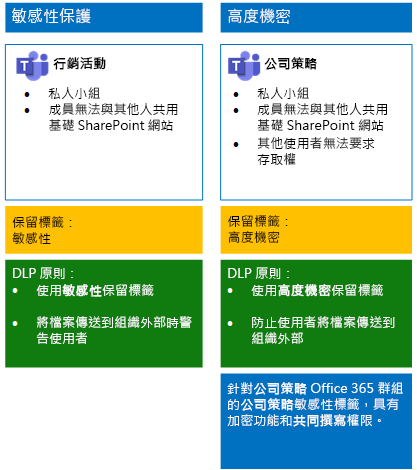
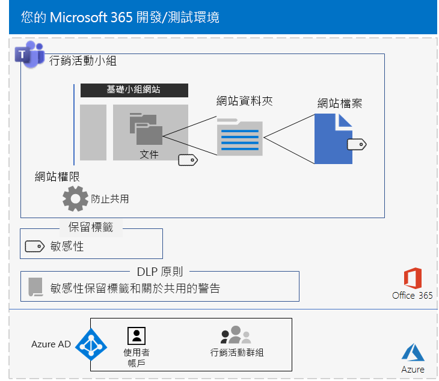
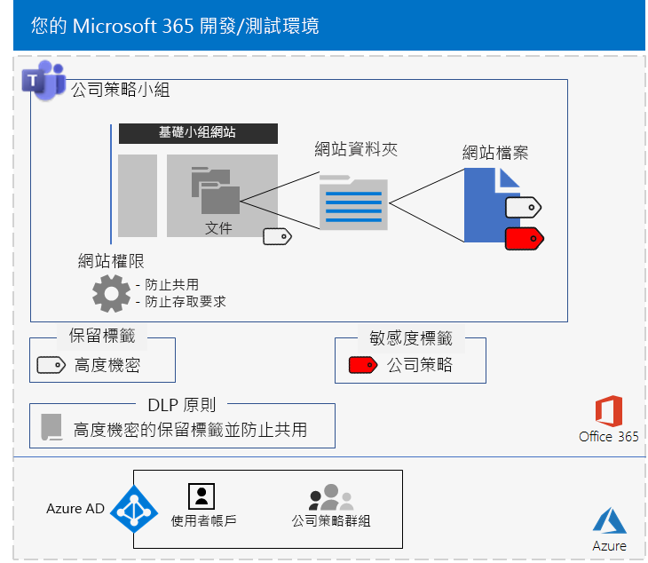

# <a name="secure-teams-for-files-in-a-devtest-environment"></a>在開發/測試環境中保護 Teams 檔案

本文提供建立開發/測試環境的逐步指示，其中包含適用於[保護 Microsoft Teams 中的檔案安全](secure-files-in-teams.md)解決方案的敏感性和高度機密小組。
  

  
在生產環境中部署這些類型的小組之前，您可以使用此開發/測試環境來試驗和微調設定，以符合您的特定需求。
  
## <a name="phase-1-build-out-your-microsoft-365-enterprise-test-environment"></a>階段 1：建置您的 Microsoft 365 企業版測試環境

如果您只想要以最小的需求，透過輕量級方式測試敏感性和高度機密小組，請依照[輕量型基本組態](https://docs.microsoft.com/microsoft-365/enterprise/lightweight-base-configuration-microsoft-365-enterprise)中的指示進行。

如果您想要在模擬的企業中測試敏感性和高度機密小組，請依照[密碼雜湊同步處理](https://docs.microsoft.com/microsoft-365/enterprise/password-hash-sync-m365-ent-test-environment)中的指示進行。

>[!Note]
>測試敏感性和高度機密小組不需要模擬的企業測試環境，其中包括模擬的內部網路 (連線到網際網路) 與 Active Directory 網域服務 (AD DS) 樹系中的目錄同步處理。 它在這裡提供作為選項，讓您可以在代表典型組織的環境中測試敏感性和高度機密小組並且進行試驗。
>
    
## <a name="phase-2-create-and-configure-your-azure-active-directory-ad-groups-and-users"></a>階段 2：建立和設定 Azure Active Directory (AD) 群組和使用者

在這個階段中，您會為虛構組織建立和設定 Azure AD 群組和使用者。
  
首先，利用 Azure 入口網站建立兩個典型組織的群組。
  
1. 在瀏覽器中建立個別索引標籤，然後移至 Azure 入口網站 (網址為 [https://portal.azure.com](https://portal.azure.com))。 如果需要，請使用 Microsoft 365 E5 試用或付費訂閱的全域系統管理員帳戶認證登入。
    
2. 在 Azure 入口網站中，按一下 [Azure Active Directory] > [群組]****。
    
3. 在 [群組 - 所有群組]**** 刀鋒視窗中，按一下 [+ 新增群組]****。
    
4. 在 [群組]**** 刀鋒視窗中：
    
  - 在 [群組類型]**** 中選取 [安全性]****。
    
  - 在 [名稱]**** 中輸入**高階主管**。
    
  - 在 [成員資格類型]**** 中選取 [已指派]****。
      
5. 按一下 [建立]****，然後關閉 [群組]**** 刀鋒視窗。
    
6.    針對名為「行銷人員」**** 的新群組，重複步驟 3-5。
    
接下來，設定自動授權，讓群組成員自動獲指派 Microsoft 365 和 EMS 訂閱的授權。
  
1. 在 Azure 入口網站中，按一下 [Azure Active Directory] > [授權] > [所有產品]****。
    
2. 在清單中，選取 [Microsoft 365 企業版 E5]****，然後按一下 [指派]****。
    
3. 在 [指派授權]**** 刀鋒視窗中，按一下 [使用者和群組]****。
    
4. 在群組清單中，選取下列項目：
    
  - 高層主管
    
  - 行銷人員
    
5. 按一下 [選取]****，然後按一下 [指派]****。
    
6. 關閉瀏覽器的 Azure 入口網站索引標籤。
    
接著，[與 Azure Active Directory PowerShell for Graph 模組連線](https://docs.microsoft.com/office365/enterprise/powershell/connect-to-office-365-powershell#connect-with-the-azure-active-directory-powershell-for-graph-module)。
  
填寫組織名稱、位置和一般密碼，然後從 PowerShell 命令提示字元或整合指令碼環境 (ISE) 執行下列命令，以建立使用者帳戶，並將帳戶新增至其群組：
  
```powershell
$orgName="<organization name, such as contoso for the contoso.onmicrosoft.com trial subscription domain name>"
$location="<the ISO ALPHA2 country code, such as US for the United States>"
$commonPassword="<common password for all the new accounts>"

$PasswordProfile=New-Object -TypeName Microsoft.Open.AzureAD.Model.PasswordProfile
$PasswordProfile.Password=$commonPassword

$groupName="C-Suite"
$userNames=@("CEO","CFO","CIO") 
$groupID=(Get-AzureADGroup | Where { $_.DisplayName -eq $groupName }).ObjectID
ForEach ($element in $userNames){ 
New-AzureADUser -DisplayName $element -PasswordProfile $PasswordProfile -UserPrincipalName ($element + "@" + $orgName + ".onmicrosoft.com") -AccountEnabled $true -MailNickName $element -UsageLocation $location 
Add-AzureADGroupMember -RefObjectId (Get-AzureADUser | Where { $_.DisplayName -eq $element }).ObjectID -ObjectId $groupID
}
$groupName="Marketing staff"
$userNames=@("Marketing1", "Marketing2") 
$groupID=(Get-AzureADGroup | Where { $_.DisplayName -eq $groupName }).ObjectID
ForEach ($element in $userNames){ 
New-AzureADUser -DisplayName $element -PasswordProfile $PasswordProfile -UserPrincipalName ($element + "@" + $orgName + ".onmicrosoft.com") -AccountEnabled $true -MailNickName $element -UsageLocation $location 
Add-AzureADGroupMember -RefObjectId (Get-AzureADUser | Where { $_.DisplayName -eq $element }).ObjectID -ObjectId $groupID
}
```

> [!NOTE]
> 這裡會使用常見密碼，以便在開發/測試環境中能自動化並輕鬆進行設定。 當然，對於生產訂閱，這是非常不鼓勵的。 
  
使用下列步驟來確認群組授權運作正常。
  
1. 從瀏覽器的 [Microsoft Office 的首頁]**** 索引標籤中，按一下 [管理]**** 磚。
    
2. 從瀏覽器的新 [Microsoft 365 系統管理中心]**** 索引標籤中，按一下 [使用者]****。
    
3. 在使用者清單中，按一下 [CEO]****。
    
4. 在列出 **CEO** 使用者帳戶內容的窗格中，確認已獲指派 [Microsoft 365 企業版 E5]**** 授權 (在 [產品授權]**** 中)。
    
## <a name="phase-3-create-retention-labels"></a>階段 3：建立保留標籤

在這個階段中，您要為基礎 SharePoint 網站文件資料夾，建立不同安全性層級的保留標籤。

1. 請使用您的全域系統管理員帳戶登入 [Microsoft 365 合規性入口網站](https://compliance.microsoft.com)。
    
2. 從瀏覽器的 [首頁 - Microsoft 365 合規性]**** 索引標籤，按一下 [分類] > [標籤]****。
    
3. 按一下 [保留標籤] > [建立標籤]****。
    
4. 在 [命名您的標籤]**** 窗格的 [命名您的標籤]**** 中輸入**敏感性**，然後按一下 [下一步]****。

5. 在 [檔案計畫描述元]**** 窗格中，按一下 [下一步]****。
    
6. 在 [標籤設定]**** 窗格中，視需要將 [保留]**** 設定為 [開啟]****，然後按一下 [下一步]****。
    
7. 在 [檢閱您的設定]**** 窗格中，按一下 [建立標籤]****。
    
8. 重複步驟 3-7，將其他保留標籤命名為**高度機密**。
    
9. 從 [首頁] > [標籤]**** 窗格中，按一下 [Publish labels]\(發佈標籤)****。
    
10. 在 [選擇要發佈的標籤]**** 窗格中，按一下 [選擇要發佈的標籤]****。
    
11. 在 [Choose labels]\(選擇標籤)**** 窗格中，按一下 [新增]**** 並選取所有四個標籤。
    
12. 按一下 [完成]****。
    
13. 在 [選擇要發佈的標籤]**** 窗格上，按一下 [下一步]****。
    
14. 在 [選擇位置]**** 窗格中，按一下 [下一步]****。
    
15. 在 [命名您的原則]**** 窗格上，於 [名稱]**** 中輸入 **範例組織**，然後按一下 [下一步]****。
    
16. 在 [檢閱您的設定]**** 窗格中，按一下 [發佈標籤]****，然後按一下 [關閉]****。
    
## <a name="phase-4-create-your-teams"></a>階段 4：建立小組

在此階段中，您要為您的範例組織建立並設定敏感性和高度機密小組。

### <a name="sensitive-team-for-marketing-campaigns"></a>行銷活動的機密性小組

若要為行銷群組成員建立敏感性層級小組，以便共同處理持續的行銷活動：

1. [建立新的私人小組](https://support.office.com/article/174adf5f-846b-4780-b765-de1a0a737e2b)，且名稱為**行銷活動**。
2. 開啟 [行銷活動]**** 小組。
3.    在小組的工具列中，按一下 [檔案]****。
4.    按一下省略符號，然後按一下 [在 SharePoint 中開啟]****。
5.    在基礎 SharePoint 網站的工具列中，按一下設定圖示，然後按一下 [網站權限]****。
6.    在 [網站權限]**** 窗格的 [共用設定]**** 之下，按一下 [變更共用設定]****。
7.    在 [共用權限]**** 之下，選擇 [只有網站擁有者可以共用檔案、資料夾及網站]****，然後按一下 [儲存]****。

接下來，為基礎行銷活動 SharePoint 網站的文件資料夾設定「敏感性」標籤。

1.    在瀏覽器的 [行銷活動 - 首頁]**** 索引標籤中，按一下 [文件]****。
2.    按一下設定圖示，然後按一下 [文件庫設定]****。
3.    在 [權限與管理]**** 下，按一下 [Apply label to items in this library]\(將標籤套用至此文件庫中的項目)****。
4.    在 [設定 - 套用標籤]**** 中，選取 [敏感性]****，然後按一下 [儲存]****。 

接下來，設定資料外洩防護 (DLP) 原則；當使用者在組織外部共用具「敏感性」標籤之基礎 SharePoint 網站 (包含「行銷活動」網站) 上的文件時，即會通知使用者。

1. 請使用您的全域系統管理員帳戶登入 [Microsoft 365 合規性入口網站](https://compliance.microsoft.com/)。
    
2. 在瀏覽器的新 [Microsoft 365 合規性]**** 索引標籤上，按一下 [原則] > [資料外洩防護]****。
    
3. 在 [首頁] > [資料外洩防護]**** 窗格中，按一下 [建立原則]****。
    
4. 在 [從範本開始或建立自訂原則]**** 窗格中，按一下 [自訂]****，然後按一下 [下一步]****。
    
5. 在 [命名您的原則]**** 窗格的 [名稱]**** 中，輸入**敏感性標籤 SharePoint 網站**，然後按一下 [下一步]****。
    
6. 在 [選擇位置]**** 窗格中，按一下 [Let me choose specific locations]\(讓我選擇特定位置)****，然後按一下 [下一步]****。
    
7. 在位置清單中，停用 [Exchange 電子郵件]****、[OneDrive 帳戶]**** 和 [Teams 聊天與通道訊息]**** 位置，然後按 [下一步]****。
    
8. 在 [自訂您要保護的內容類型]**** 窗格中，按一下 [編輯]****。
    
9. 在 [選擇要保護的內容類型]**** 窗格中，從下拉式方塊按一下 [新增]****，然後按一下 [保留標籤]****。
    
10. 在 [保留標籤]**** 窗格中，按一下 [新增]**** 並選取 [敏感性]**** 標籤，然後依序按一下 [新增]**** 和 [完成]****。
    
11. 在 [選擇要保護的內容類型]**** 窗格中，按一下 [儲存]****。
    
12. 在 [Customize the type of content you want to protect] (自訂您要保護的內容類型)**** 窗格中，按一下 [下一步]****。

13. 在 [What do you want to do if we detect sensitive info?]\(如果偵測到機密資訊要如何處理?)**** 窗格中，按一下 [Customize the tip and email]\(自訂提示和電子郵件)****。
    
14. 在 [Customize policy tips and email notifications]\(自訂原則提示和電子郵件通知)**** 窗格中，按一下 [Customize the policy tip text]\(自訂原則提示文字)****。
    
15. 在文字方塊中，鍵入或貼上下列內容：
    
  - 若要與組織外部的使用者共用，請下載檔案，然後將它開啟。 依序按一下 [檔案]、[保護文件] 和 [以密碼加密]，然後指定強式密碼。 以個別電子郵件或其他通訊方式傳送密碼。
    
16. 按一下 [確定]****。
    
17. 在 [What do you want to do if we detect sensitive info?]\(如果偵測到機密資訊要如何處理?)**** 窗格中，按一下 [下一步]****。
    
18. 在 [要先開啟原則或測試內容嗎?]**** 窗格中，按一下 [是]**** 立即將它開啟，然後按一下 [下一步]****。
    
19. 在 [檢閱您的設定]**** 窗格中，按一下 [建立]****，然後按一下 [關閉]****。

以下是行銷活動小組產生的設定。


  
### <a name="company-strategy-team-site"></a>公司策略小組網站

若要為資深領導小組成員建立高度機密層級小組，以共同處理公司策略：

1. [建立新的私人小組](https://support.office.com/article/174adf5f-846b-4780-b765-de1a0a737e2b)，且名稱為**公司策略**。
2. 開啟 [公司策略]**** 小組。
3.    在小組的工具列中，按一下 [檔案]****。
4.    按一下省略符號，然後按一下 [在 SharePoint 中開啟]****。
5.    在基礎 SharePoint 網站的工具列中，按一下設定圖示，然後按一下 [網站權限]****。
6.    在 [網站權限]**** 窗格的 [共用設定]**** 之下，按一下 [變更共用設定]****。
7.    在 [共用權限]**** 之下，選擇 [只有網站擁有者可以共用檔案、資料夾及網站]****。
8.    關閉 [允許存取要求]****，然後按一下 [儲存]****。

接下來，為基礎公司策略 SharePoint 網站的文件資料夾設定「高度機密」標籤。

1.    在瀏覽器的 [公司策略 - 首頁]**** 索引標籤中，按一下 [文件]****。
2.    按一下設定圖示，然後按一下 [文件庫設定]****。
3.    在 [權限與管理]**** 下，按一下 [Apply label to items in this library]\(將標籤套用至此文件庫中的項目)****。
4.    在 [設定 - 套用標籤]**** 中，選取 [高度機密]****，然後按一下 [儲存]****。 

接下來，設定 DLP 原則；當使用者在組織外部共用具「高度機密」標籤之基礎 SharePoint Online 網站 (包含「公司策略」網站) 上的文件時，即會封鎖使用者。
  
1. 請使用您的全域系統管理員帳戶登入 [Microsoft 365 合規性入口網站](https://compliance.microsoft.com/)。
    
2. 在瀏覽器的新 [Microsoft 365 合規性]**** 索引標籤上，按一下 [原則] > [資料外洩防護]****。
    
3. 在 [首頁] > [資料外洩防護]**** 窗格中，按一下 [建立原則]****。
    
4. 在 [從範本開始或建立自訂原則]**** 窗格中，按一下 [自訂]****，然後按一下 [下一步]****。
    
5. 在 [命名您的原則]**** 窗格的 [名稱]**** 中，輸入**高度機密標籤 SharePoint 網站**，然後按一下 [下一步]****。
    
6. 在 [選擇位置]**** 窗格中，按一下 [Let me choose specific locations]\(讓我選擇特定位置)****，然後按一下 [下一步]****。
    
7. 在位置清單中，停用 [Exchange 電子郵件]****、[OneDrive 帳戶]**** 和 [Teams 聊天與通道訊息]**** 位置，然後按 [下一步]****。
    
8. 在 [自訂您要保護的內容類型]**** 窗格中，按一下 [編輯]****。
    
9. 在 [選擇要保護的內容類型]**** 窗格中，從下拉式方塊按一下 [新增]****，然後按一下 [保留標籤]****。
    
10. 在 [保留標籤]**** 窗格中，按一下 [新增]****，並選取 [高度機密性]**** 標籤，然後依序按一下 [新增]**** 和 [完成]****。
    
11. 在 [Choose the types of content to protect]\(選擇要保護的內容類型)**** 窗格中，按一下 [儲存]****。
    
12. 在 [Customize the type of content you want to protect] (自訂您要保護的內容類型)**** 窗格中，按一下 [下一步]****。

13. 在 [What do you want to do if we detect sensitive info?]\(如果偵測到機密資訊要如何處理?)**** 窗格中，按一下 [Customize the tip and email]\(自訂提示和電子郵件)****。
    
14. 在 [Customize policy tips and email notifications]\(自訂原則提示和電子郵件通知)**** 窗格中，按一下 [Customize the policy tip text]\(自訂原則提示文字)****。
    
15. 在文字方塊中，鍵入或貼上下列內容：
    
  - 若要與組織外部的使用者共用，請下載檔案，然後將它開啟。 依序按一下 [檔案]、[保護文件] 和 [以密碼加密]，然後指定強式密碼。 以個別電子郵件或其他通訊方式傳送密碼。
    
16. 按一下 [確定]****。
    
17. 在 [要先開啟原則或測試內容嗎?]**** 窗格中，按一下 [是]**** 立即將它開啟，然後按一下 [下一步]****。

18. 在 [要先開啟原則或測試內容嗎?]**** 窗格中，按一下 [是]**** 立即將它開啟，然後按一下 [下一步]****。
    
19. 在 [檢閱您的設定]**** 窗格中，按一下 [建立]****，然後按一下 [關閉]****。

使用[下列指示](https://docs.microsoft.com/microsoft-365/compliance/encryption-sensitivity-labels)設定包含下列設定的敏感性標籤：

- 標籤的名稱是「公司策略」
- 已啟用加密
- 公司策略群組具有共同撰寫權限

建立之後，發佈新標籤。 如果您以公司策略群組的成員身分登入，您會在 Word、Excel 和 PowerPoint 的 [常用] 工具列中看到 [敏感性] 選項中的新標籤。 從 [靈敏性] 選項中選取 [公司策略] 標籤，將標籤指派給檔案。

以下是公司策略小組產生的設定。

 

在基礎公司策略 SharePoint 網站文件區段中的檔案會獲指派「高度機密」保留標籤，而且受限於設定的 DLP 原則。 檔案也可以獲指派「公司策略敏感性」標籤。    
  
## <a name="next-step"></a>後續步驟

當您準備好進行生產環境部署時，請參閱[保護 Microsoft Teams 中的檔案](secure-files-in-teams.md)，以取得詳細資訊及逐步部署文章的連結。
  
## <a name="see-also"></a>另請參閱

[雲端採用和混合式解決方案](https://docs.microsoft.com/office365/enterprise/cloud-adoption-and-hybrid-solutions)
