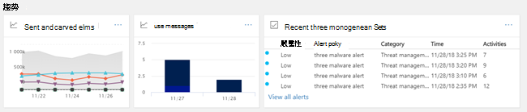

# 安全性儀表板Security Dashboard

## 概觀Overview

[安全性 & 合規性中心](../../compliance/go-to-the-securitycompliance-center.md)可讓您的組織管理資料保護和符合性。The [Security & Compliance Center](../../compliance/go-to-the-securitycompliance-center.md) enables your organization to manage data protection and compliance. 假設您有必要的許可權，安全性儀表板可讓您檢查威脅防護狀態，以及查看和處理安全性警示。Assuming you have the necessary permissions, the Security Dashboard enables you to review your Threat Protection Status, as well as view and act on security alerts.

觀賞影片以取得概要，然後閱讀本文以深入瞭解。Watch the video to get an overview, and then read this article to learn more.

> [!VIDEO https://www.microsoft.com/videoplayer/embed/RE1VV3o]

根據您組織的訂閱內容，安全性儀表板包含數個小元件，例如威脅管理摘要、威脅防護狀態、全球每週威脅偵測、惡意程式碼等，如下列各節所述。Depending on what your organization's subscription includes, the Security Dashboard includes several widgets, such as Threat Management Summary, Threat Protection Status, Global Weekly Threat Detections, Malware, and more, as described in the following sections.

若要查看安全性儀表板，請在[安全性 & 合規性中心](../../compliance/go-to-the-securitycompliance-center.md)，移至 [**威脅管理**] \> **儀表板**。To view the Security Dashboard, in the [Security & Compliance Center](../../compliance/go-to-the-securitycompliance-center.md), go to **Threat management** \> **Dashboard**.

> [!NOTE]
> 您必須是全域系統管理員、安全性管理員或安全性讀者，才可查看安全性儀表板。You must be a global administrator, a security administrator, or a security reader to view the Security Dashboard. 有些小元件需要其他許可權才能進行查看。Some widgets require additional permissions to view. 若要深入瞭解，請參閱[安全性 & 合規性中心的許可權](permissions-in-the-security-and-compliance-center.md)。To learn more, see [Permissions in the Security & Compliance Center](permissions-in-the-security-and-compliance-center.md).

## 威脅管理摘要Threat Management Summary

「威脅管理」摘要構件會告訴您組織如何抵禦過去七天（7）天的威脅。The Threat Management Summary widget tells you at a glance how your organization was protected from threats over the past seven (7) days.

威脅管理摘要中所看到的資訊取決於您訂閱所包含的內容。The information you'll see in the Threat Management Summary depends on what you subscription includes. 下表說明 Office 365 E3 和 Office 365 E5 所包含的資訊。The following table describes what information is included for Office 365 E3 and Office 365 E5.

|Office 365 E3Office 365 E3|Office 365 E5Office 365 E5|
|---|---|
|封鎖惡意程式碼郵件Malware messages blocked 封鎖網路釣魚郵件Phishing messages blocked 使用者所報告的郵件Messages reported by users    |封鎖惡意程式碼郵件Malware messages blocked 封鎖網路釣魚郵件Phishing messages blocked 使用者所報告的郵件Messages reported by users 已封鎖零天惡意程式碼Zero-day malware blocked 偵測到的高級網路釣魚郵件Advanced phishing messages detected 封鎖惡意 URLsMalicious URLs blocked|

若要查看或存取威脅管理摘要小工具，您必須具有查看高級威脅防護報告的許可權。To view or access the Threat Management Summary widget, you must have permissions to view Advanced Threat Protection reports. 若要深入瞭解，請參閱[查看 ATP 報表所需的許可權為何？](view-reports-for-atp.md#what-permissions-are-needed-to-view-the-atp-reports)To learn more, see [What permissions are needed to view the ATP reports?](view-reports-for-atp.md#what-permissions-are-needed-to-view-the-atp-reports)

## 威脅防護狀態Threat Protection Status

「威脅防護狀態」構件會透過網路釣魚和惡意程式碼的趨勢和詳細觀點，顯示威脅防護的有效性。The Threat Protection Status widget shows threat protection effectiveness with a trending and detailed view of phish and malware.

詳細資料取決於您的 Microsoft 365 訂閱是否包含[Exchange Online Protection](exchange-online-protection-overview.md) （EOP），具有或沒有[Office 365 的高級威脅防護](office-365-atp.md)（ATP）。The details depend on whether your Microsoft 365 subscription includes [Exchange Online Protection](exchange-online-protection-overview.md) (EOP) with or without [Office 365 Advanced Threat Protection](office-365-atp.md) (ATP).

|如果您的訂閱包括 .。。If your subscription includes...|您將會看到這些詳細資料You'll see these details|
|---|---|
|EOP，但不是 Office 365 ATPEOP but not Office 365 ATP|EOP 所偵測到並封鎖的惡意電子郵件。Malicious email that was detected and blocked by EOP.   請參閱[威脅防護狀態報表（EOP）](view-email-security-reports.md#threat-protection-status-report)。See [Threat Protection Status report (EOP)](view-email-security-reports.md#threat-protection-status-report).|
|Office 365 ATPOffice 365 ATP|EOP 和 Office 365 ATP 偵測到並封鎖的惡意內容和惡意電子郵件Malicious content and malicious email detected and blocked by EOP and Office 365 ATP  反惡意程式碼引擎、[零小時自動清除](zero-hour-auto-purge.md)和 atp 功能（包括[安全連結](atp-safe-links.md)、[安全附件](atp-safe-attachments.md)及[atp 反網路釣魚](set-up-anti-phishing-policies.md#exclusive-settings-in-atp-anti-phishing-policies)）封鎖的獨特電子郵件的匯總計數。Aggregated count of unique email messages with malicious content blocked by the anti-malware engine, [zero-hour auto purge](zero-hour-auto-purge.md), and ATP features (including [Safe Links](atp-safe-links.md), [Safe Attachments](atp-safe-attachments.md), and [ATP anti-phishing](set-up-anti-phishing-policies.md#exclusive-settings-in-atp-anti-phishing-policies)).  請參閱[威脅防護狀態報表（ATP）](view-reports-for-atp.md#threat-protection-status-report)。See [Threat Protection Status report (ATP)](view-reports-for-atp.md#threat-protection-status-report).|

若要查看或存取威脅防護狀態構件，您必須具有查看「高級威脅防護」報告的許可權。To view or access the Threat Protection Status widget, you must have permissions to view Advanced Threat Protection reports. 若要深入瞭解，請參閱[查看 ATP 報表所需的許可權為何？](view-reports-for-atp.md#what-permissions-are-needed-to-view-the-atp-reports)To learn more, see [What permissions are needed to view the ATP reports?](view-reports-for-atp.md#what-permissions-are-needed-to-view-the-atp-reports)

## 全球每週威脅偵測Global Weekly Threat Detections

「全球每週威脅偵測」構件會顯示電子郵件中偵測到超過7天的威脅數目。The Global Weekly Threat Detections widget shows how many threats were detected in email messages over the past seven (7) days.

度量單位如下表所述進行計算：The metrics are calculated as described in the following table:

|計量Metric|計算方式How it's calculated|
|---|---|
|掃描的郵件Messages scanned|已掃描的電子郵件數目乘以收件者數目Number of email messages scanned multiplied by the number of recipients|
|威脅已停止Threats stopped|識別為包含惡意軟體的電子郵件數目乘以收件者數目Number of email messages identified as containing malware multiplied by the number of recipients|
|由[ATP](office-365-atp.md)封鎖Blocked by [ATP](office-365-atp.md)|ATP 所封鎖的電子郵件數目乘以收件者數目Number of email messages blocked by ATP multiplied by the number of recipients|
|傳遞後移除Removed after delivery|以[零小時自動清除](zero-hour-auto-purge.md)乘以的收件者人數所移除的郵件數目Number of messages removed by [zero-hour auto purge](zero-hour-auto-purge.md) multiplied by the number of recipients|

## 惡意程式碼Malware

惡意程式碼小元件會顯示過去七（7）天內惡意程式碼趨勢和惡意程式碼系列類型的詳細資料。Malware widgets show details about malware trends and malware family types over the past seven (7) days.

## 深入資訊Insights

不只是深入瞭解應該檢查的 surface key 問題，也包括要考慮的建議和動作。Insights not only surface key issues you should review, they also include recommendations and actions to consider.

例如，您可能會發現網路釣魚電子郵件已傳遞，因為某些使用者已停用其垃圾郵件選項。For example, you might see that phishing email messages are being delivered because some users have disabled their junk mail options. 若要深入瞭解真知灼見的運作方式，請參閱[安全性 & 規範中心中的報告與深入](reports-and-insights-in-security-and-compliance.md)瞭解。To learn more about how insights work, see [Reports and insights in the Security & Compliance Center](reports-and-insights-in-security-and-compliance.md).

## 威脅調查及回應Threat investigation and response

如果貴組織的訂閱包含[Office 365 Advanced 威脅防護方案 2](office-365-ti.md)，則您的安全性儀表板中有一個區段，其中包含高級威脅調查和回應工具。If your organization's subscription includes  [Office 365 Advanced Threat Protection Plan 2](office-365-ti.md), your Security Dashboard has a section that includes advanced threat investigation and response tools. 這些工具組括[自動調查和回應功能](automated-investigation-response-office.md)。These tools include [automated investigation and response capabilities](automated-investigation-response-office.md). 自動調查和回應可能會非常有用，例如，[快速定址已遭破壞的使用者帳戶](address-compromised-users-quickly.md)。Automated investigation and response can be helpful in scenarios such as [addressing compromised user accounts quickly](address-compromised-users-quickly.md).

若要深入瞭解，請參閱[開始使用 Office 365 中的自動調查和回應（AIR）](office-365-air.md)。To learn more, see [Get started using Automated investigation and response (AIR) in Office 365](office-365-air.md).

## 趨勢Trends

靠近安全性儀表板底部的趨勢區段是一個**趨勢**區段，它會摘要組織的電子郵件流程趨勢。Near the bottom of the Security Dashboard is a **Trends** section, which summarizes email flow trends for your organization. 報告提供有關歸類為垃圾郵件、惡意程式碼、網路釣魚企圖及良好電子郵件的電子郵件資訊。Reports provide information about email categorized as spam, malware, phishing attempts, and good email. 按一下拼貼，以查看報告中的詳細資訊。Click a tile to view more detailed information in the report.

此外，如果貴組織的訂閱包含[Office 365 Advanced 威脅防護方案 2](office-365-ti.md)，您也會在此區段中有一個**最近的威脅管理警示**報告，讓您的安全性小組能夠查看並對高優先順序的安全性警示採取行動。And, if your organization's subscription includes [Office 365 Advanced Threat Protection Plan 2](office-365-ti.md), you will also have a **Recent threat management alerts** report in this section that enables your security team to view and take action on high-priority security alerts.

若要查看或存取已傳送及已接收的電子郵件小工具，您必須具有查看高級威脅防護報告的許可權。To view or access the Sent and Received Email widget, you must have permissions to view Advanced Threat Protection reports. 若要深入瞭解，請參閱[查看 ATP 報表所需的許可權為何？](view-reports-for-atp.md#what-permissions-are-needed-to-view-the-atp-reports)。To learn more, see [What permissions are needed to view the ATP reports?](view-reports-for-atp.md#what-permissions-are-needed-to-view-the-atp-reports).

若要查看或存取最近的威脅管理提醒小工具，您必須具有查看提醒的許可權。To view or access the Recent Threat Management Alerts widget, you must have permissions to view alerts. 若要深入瞭解，請參閱[查看提醒所需的 RBAC 許可權](../../compliance/alert-policies.md#rbac-permissions-required-to-view-alerts)。To learn more, see [RBAC permissions required to view alerts](../../compliance/alert-policies.md#rbac-permissions-required-to-view-alerts).

## 相關主題Related topics

[檢視安全性與合規性中心內的電子郵件安全性報告View email security reports in the Security & Compliance Center](view-email-security-reports.md)

[檢視 Office 365 進階威脅防護的報告View reports for Office 365 Advanced Threat Protection](view-reports-for-atp.md)

[Office 365 進階威脅防護Office 365 Advanced Threat Protection](office-365-atp.md)

[Office 365 威脅調查和回應Office 365 Threat investigation and response](office-365-ti.md)
