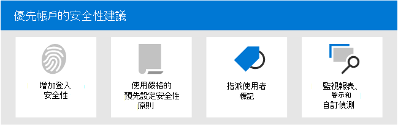

# Microsoft 365 中優先順序帳戶的安全性建議

並非所有的使用者帳戶都可以存取相同的公司資訊。 有些帳戶可以存取機密資訊，例如財務資料、產品開發資訊、合作夥伴對重要組建系統的存取等等。 若遭到損害，具有高度機密資訊存取權的帳戶會帶來嚴重威脅。 我們呼叫這些類型的帳戶 _優先順序帳戶_。 優先順序帳戶包括 (但不限於) Ceo、CISOs、CFOs、基礎結構管理員帳戶、組建系統帳戶等等。

針對攻擊者，針對一般或未知使用者強制轉換隨機網路的一般網路釣魚攻擊，效率低下。 另一方面， _spear 的網路釣魚_ 或 _whaling_ 攻擊會以攻擊者為目標，取得優先順序的帳戶。 所以，優先順序帳戶需要比一般保護更強，以協助防止帳戶損損。

Microsoft 365 和 Microsoft Defender for Office 365 包含數個主要功能，可為優先順序帳戶提供額外的安全性層級。 本文說明這些功能及其用法。

****

|工作|所有 Office 365 企業版方案|Microsoft 365 E3|Microsoft 365 E5|
|---|:---:|:---:|:---:|
|[增加優先順序帳戶的登入安全性](#increase-sign-in-security-for-priority-accounts)||||
|[對優先順序帳戶使用嚴格的預先設定安全性原則](#use-strict-preset-security-policies-for-priority-accounts)||||
|[將使用者標記套用至優先順序帳戶](#apply-user-tags-to-priority-accounts)||||
|[監視警示、報告和偵測中的優先順序帳戶](#monitor-priority-accounts-in-alerts-reports-and-detections)||||
|[訓練使用者](#train-users)||||
|

> [!NOTE]
> 如需 (系統管理員帳戶) 保護 _特權帳戶_ 的詳細資訊，請參閱 [本主題](/azure/architecture/framework/security/critical-impact-accounts)。

## 增加優先順序帳戶的登入安全性

優先順序帳戶需要增加的登入安全性。 您可以要求多重要素驗證 (MFA) 並停用舊版驗證通訊協定，以提升其登入安全性。

如需相關指示，請參閱 [步驟1。增加具有 MFA 的遠端工作者的登入安全性](../../solutions/empower-people-to-work-remotely-secure-sign-in.md)。 雖然本文是有關遠端工作者的資訊，但相同的概念也適用于優先順序使用者。

**附注**：強烈建議您全域停用所有優先順序使用者的舊版驗證通訊協定，如先前的文章所述。 如果您的業務需求可防止您這樣做，Exchange Online 會提供下列控制項，以協助限制舊版驗證通訊協定的範圍：

- 您可以使用 Exchange Online 中的[驗證原則](/exchange/clients-and-mobile-in-exchange-online/disable-basic-authentication-in-exchange-online)和[用戶端存取規則](/exchange/clients-and-mobile-in-exchange-online/client-access-rules/client-access-rules)，封鎖或允許特定使用者的基本驗證和舊版驗證通訊協定，例如 POP3、IMAP4 和已驗證的 SMTP。

- 您可以停用個別信箱上的 POP3 和 IMAP4 存取權。 您可以在組織層級停用已驗證的 SMTP，並在仍需要該 SMTP 的特定信箱上啟用該 SMTP。 如需相關指示，請參閱下列主題：
  - [啟用或停用使用者 POP3 或 IMAP4 存取權](/exchange/clients-and-mobile-in-exchange-online/pop3-and-imap4/enable-or-disable-pop3-or-imap4-access)
  - [啟用或停用已驗證的用戶端 SMTP 提交 (SMTP 驗證) ](/exchange/clients-and-mobile-in-exchange-online/authenticated-client-smtp-submission)

也值得注意的是，基本驗證在 Exchange Online 中已被取代 Exchange Web 服務 (EWS) 、Exchange ActiveSync、POP3、IMAP4 和遠端 PowerShell。 如需詳細資訊，請參閱此 [博客文章](https://developer.microsoft.com/office/blogs/deferred-end-of-support-date-for-basic-authentication-in-exchange-online/)。

## 對優先順序帳戶使用嚴格的預先設定安全性原則

優先順序使用者需要更嚴格的動作，以用於 Exchange Online Protection (EOP) 和 Defender for Office 365 中提供的各種保護。

例如，若要將歸類為垃圾郵件的郵件傳送至 [垃圾郵件] 資料夾，您應該隔離這些相同的郵件（如果它們是用於優先順序帳戶）。

您可以使用預先設定的安全性原則中的 Strict 設定檔，為優先順序帳戶執行此嚴格的方法。

「預設」安全性原則是一個方便且集中的位置，可將建議的嚴格原則設定套用至 EOP 和 Defender for Office 365 中的所有保護。 如需詳細資訊，請參閱[EOP 和 Microsoft Defender for Office 365 中的預先設定安全性原則](preset-security-policies.md)。

如需有關嚴格原則設定如何與預設和標準原則設定不同的詳細資訊，請參閱[EOP 和 Microsoft Defender 的建議設定，以 Office 365 安全性](recommended-settings-for-eop-and-office365.md)。

## 將使用者標記套用至優先順序帳戶

Microsoft Defender 中 Office 365 方案 2 (Microsoft 365 E5 或附加元件訂閱) 的使用者標記，是一種快速識別和分類報告和事件調查中的特定使用者或使用者群組的方式。

「**優先順序帳戶**」是一種內建的使用者標記， (稱為 _系統_ 標籤) ，可供您用來識別涉及優先順序帳戶的事件及警示。 如需 **優先順序帳戶** 的詳細資訊，請參閱 [Manage and monitor priority accounts](../../admin/setup/priority-accounts.md)。

您也可以建立自訂標記，進一步識別和分類您的優先順序帳戶。 如需詳細資訊，請參閱 [User tags](user-tags.md)。 請注意，您可以在與自訂使用者標籤位於相同介面中 (系統標記) 管理 **優先順序帳戶** 。

## 監視警示、報告和偵測中的優先順序帳戶

在您保護優先順序的使用者並進行標記之後，您可以使用 EOP 和 Defender for Office 365 中的可用報告、警示和調查，以快速識別涉及優先順序帳戶的事件或偵測。 下表說明支援使用者標記的功能。

 

****

|功能|描述|
|---|---|
|警示|受影響使用者的使用者標記是可見的，而且在安全性 & 合規性中心的 [ **View alerts** ] 頁面上以篩選器形式提供。 如需詳細資訊，請參閱 [查看提醒](../../compliance/alert-policies.md#viewing-alerts)。|
|威脅總管 
 即時偵測|在 **威脅瀏覽器** 中 (microsoft defender for Office 365 plan 2) 或 **即時** 偵測 (microsoft defender for Office 365 Plan 1) ，使用者標記會顯示在 [電子郵件格線] 視圖和 [電子郵件詳細資料] 浮出視窗中。 使用者標記也可以做為可篩選的屬性。 如需詳細資訊，請參閱  [威脅資源管理器中的標記](threat-explorer.md#tags-in-threat-explorer)。|
|行銷活動檢視|使用者標記是 Microsoft Defender 的 [市場即時檢視] 中的眾多可篩選屬性之一，用於 Office 365 方案2。 如需詳細資訊，請參閱 [即時檢視](campaigns.md)。|
|威脅防護狀態報告|在實際 **威脅防護狀態報表** 中的所有 views 和詳細資料表格中，您可以依 **優先順序帳戶** 來篩選結果。 如需詳細資訊，請參閱 [威脅防護狀態報表](view-email-security-reports.md#threat-protection-status-report)。|
|優先順序帳戶報告的電子郵件問題|Exchange 系統管理中心的優先順序帳戶報告 (EAC) 的 **電子郵件問題**，包含 **優先順序帳戶** 之未傳遞和延遲郵件的相關資訊。 如需詳細資訊，請參閱 [優先順序帳戶報告的電子郵件問題](/exchange/monitoring/mail-flow-reports/mfr-email-issues-for-priority-accounts-report)。|
|

## 訓練使用者

訓練具有優先順序帳戶的使用者，可協助儲存這些使用者和安全性作業小組的時間和不滿。 聰明的使用者不太可能開啟附件或按一下可疑電子郵件訊息中的連結，也很可能避免可疑的網站。

Harvard 甘迺迪 School [Cybersecurity 活動手冊](https://www.belfercenter.org/CyberPlaybook) 為您的組織內的安全性感知建立強文化，提供了極佳的指導方針，包括訓練使用者來識別網路釣魚攻擊。

Microsoft 365 提供下列資源，協助您在組織中告知使用者：

 

****

|概念|資源|描述|
|---|---|---|
|Microsoft 365|[可自訂的教學路徑](/office365/customlearning/)|這些資源可協助您將組織中使用者的訓練放在一起。|
|Microsoft 365 安全性|[學習模組：利用內建的內建、智慧的安全性來保護您的組織 Microsoft 365](/learn/modules/security-with-microsoft-365)|此模組可讓您描述 Microsoft 365 安全性功能如何協同運作，並闡明這些安全性功能的優點。|
|多重要素驗證|[雙步驟驗證：其他驗證頁面為何？](/azure/active-directory/user-help/multi-factor-authentication-end-user-first-time)|本文可協助使用者瞭解哪些多重要素驗證，以及如何在您的組織中使用它。|
|攻擊模擬訓練|[開始使用攻擊模擬訓練](attack-simulation-training-get-started.md)|Office 365 方案2的 Microsoft Defender 中的攻擊模擬訓練，可讓系統管理員針對特定使用者群組設定、啟動和追蹤模擬網路釣魚攻擊。|

此外，Microsoft 建議使用者採取本文所述的動作： [保護您的帳戶和裝置免受駭客和惡意](https://support.microsoft.com/office/066d6216-a56b-4f90-9af3-b3a1e9a327d6)代碼的攻擊。 這些動作包括：

- 使用強式密碼
- 保護裝置
- 啟用非管理裝置的 Windows 10 和 Mac 電腦 (上的安全性功能) 

## 另請參閱

[宣佈 Office 365 的 Microsoft Defender 優先順序帳戶保護](https://techcommunity.microsoft.com/t5/microsoft-defender-for-office/announcing-priority-account-protection-in-microsoft-defender-for/ba-p/1696385)