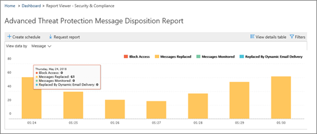

# 在安全性&amp;與合規性中心內設定及下載自訂報告Set up and download a custom report in the Security &amp; Compliance Center

在[安全性&amp;與合規性中心](https://protection.office.com)中，有數個[報告和洞察力](reports-and-insights-in-security-and-compliance.md)可協助您的組織的安全性小組緩解並解決組織面臨的威脅。In the [Security &amp; Compliance Center](https://protection.office.com), several [reports and insights](reports-and-insights-in-security-and-compliance.md) are available to help your organization's security team mitigate and address threats to your organization. 如果您是組織的安全性小組成員，您可以設定具有自訂日期範圍和篩選器的報表，然後下載您的自訂報告。If you're a member of your organization's security team, you can configure a report with custom date ranges and filters, and then download your custom report. 
  
## 下載自訂報告Download a custom report

> [!IMPORTANT]
> 確定您具備[安全性&amp;與合規性中心](permissions-in-the-security-and-compliance-center.md)的必要許可權。Make sure that you have the necessary [permissions for the Security &amp; Compliance Center](permissions-in-the-security-and-compliance-center.md). 一般說來，全域管理員、安全性管理員及安全性讀者可以存取安全&amp;規範中心內的報告。In general, global administrators, security administrators, and security readers can access reports in the Security &amp; Compliance Center. 
  
1. 在[安全性&amp;與合規性中心](https://protection.office.com)，移至 [**報告** \> ]**儀表板**。In the [Security &amp; Compliance Center](https://protection.office.com), go to **Reports** \> **Dashboard**.
    
2. 選擇報表。Choose a report. （在此範例中，我們將使用「郵件處理」報告。）(For this example, we'll use the Message Disposition Report.) 
  
3. 在報表的左上角，選擇 [**要求報告**]。In the upper left corner of the report, choose **Request report**.
    
4. 在 [**要求報告**] 對話方塊中，指定報表的名稱、開始日期和結束日期。In the **Request report** dialog box, specify a name, start date, and end date for the report. 然後選擇 **[下一步]**。Then choose **Next**. ![在 [安全性&amp;與合規性中心] \>中，選擇要下載的報告報告](../../media/65e625f5-c98c-49fc-9c1f-8c80ec8308fd.png)
  
5. 指定您要用於報表的任何篩選器。Specify any filters you want to use for the report. （例如，您可以指定郵件處理報告的用戶端 IP 位址。）然後選擇 **[下一步]**。(For example, you might specify a client IP address for the Message Disposition Report.) Then choose **Next**.
    
6. 指定報表的電子郵件收件者，然後選擇 [**儲存**]。Specify email recipients for the report, and then choose **Save**.
    
## 相關主題Related topics

[安全性&amp;與合規性中心內的報告與深入瞭解Reports and insights in the Security &amp; Compliance Center](reports-and-insights-in-security-and-compliance.md)
  
[在安全性&amp;與合規性中心建立報表的排程Create a schedule for a report in the Security &amp; Compliance Center](create-a-schedule-for-a-report.md)
  
[在安全性&amp;與合規性中心管理報告的計畫Manage schedules for reports in the Security &amp; Compliance Center](manage-schedules-for-multiple-reports.md)
  
[在安全性&amp;與合規性中心下載現有報告Download existing reports in the Security &amp; Compliance Center](download-existing-reports.md)
  

