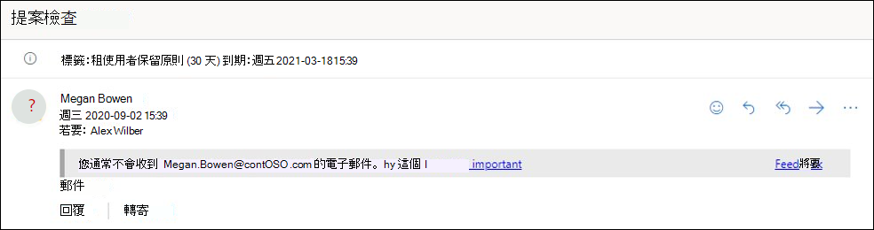
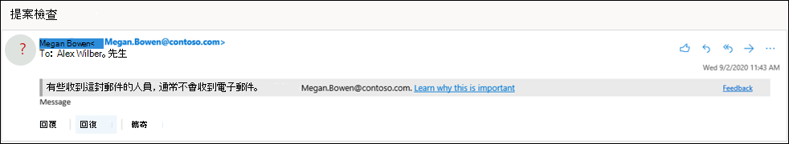

# Microsoft 365 中的反網路釣魚原則Anti-phishing policies in Microsoft 365

[!INCLUDE [Microsoft 365 Defender rebranding](../includes/microsoft-defender-for-office.md)]

**適用於****Applies to**
- [Exchange Online ProtectionExchange Online Protection](exchange-online-protection-overview.md)
- [適用於 Office 365 的 Microsoft Defender 方案 1 和方案 2Microsoft Defender for Office 365 plan 1 and plan 2](defender-for-office-365.md)
- [Microsoft 365 DefenderMicrosoft 365 Defender](../defender/microsoft-365-defender.md)

使用 Exchange Online 信箱、獨立 Exchange Online Protection (EOP) 組織但不 Exchange Online 信箱的組織，以及 Office 365 組織的 Microsoft Defender，可在 Microsoft 365 組織中使用設定反網路釣魚防護設定的原則。Policies to configure anti-phishing protection settings are available in Microsoft 365 organizations with Exchange Online mailboxes, standalone Exchange Online Protection (EOP) organizations without Exchange Online mailboxes, and Microsoft Defender for Office 365 organizations.

Office 365 組織的 Microsoft Defender 範例包括：Examples of Microsoft Defender for Office 365 organizations include:

- Microsoft 365 企業版E5、Microsoft 365 教育版 A5 等等。Microsoft 365 Enterprise E5, Microsoft 365 Education A5, etc.
- [Microsoft 365 企業版Microsoft 365 Enterprise](https://www.microsoft.com/microsoft-365/enterprise/home)
- [Microsoft 365 商務版Microsoft 365 Business](https://www.microsoft.com/microsoft-365/business)
- [以附加元件 Office 365 的 Microsoft Defender （適用于）Microsoft Defender for Office 365 as an add-on](https://products.office.com/exchange/advance-threat-protection)

下表說明 EOP 中 Office 365 和反網路釣魚原則中的反網路釣魚原則之間的高層級差異：The high-level differences between anti-phishing policies in EOP and anti-phishing policies in Defender for Office 365 are described in the following table:

 

****

|功能Feature|EOP 中的反網路釣魚原則Anti-phishing policies in EOP|Office 365 的 Defender 中的反網路釣魚原則Anti-phishing policies in Defender for Office 365|
|---|:---:|:---:|
|自動建立的預設原則Automatically created default policy|||
|建立自訂原則Create custom policies|||
|一般原則設定\*Common policy settings\*|||
|欺騙設定Spoof settings|||
|第一個連絡人安全提示First contact safety tip|||
|類比設定Impersonation settings|||
|高級網路釣魚臨界值Advanced phishing thresholds|||
|

\* 在 [預設原則] 中，[原則名稱] 和 [描述] 是唯讀的 (描述是空白的) ，而且您不能指定原則套用至所有收件者) 的 (。\* In the default policy, the policy name, and description are read-only (the description is blank), and you can't specify who the policy applies to (the default policy applies to all recipients).

若要設定反網路釣魚原則，請參閱下列文章：To configure anti-phishing policies, see the following articles:

- [在 EOP 中設定反網路釣魚原則Configure anti-phishing policies in EOP](configure-anti-phishing-policies-eop.md)
- [在 Microsoft Defender 中設定 Office 365 的反網路釣魚原則Configure anti-phishing policies in Microsoft Defender for Office 365](configure-mdo-anti-phishing-policies.md)

本文的其餘部分將說明 EOP 和 Defender for Office 365 中的反網路釣魚原則中可用的設定。The rest of this article describes the settings that are available in anti-phishing policies in EOP and Defender for Office 365.

## 一般原則設定Common policy settings

下列原則設定可用於 EOP 和 Defender for Office 365 中的反網路釣魚原則：The following policy settings are available in anti-phishing policies in EOP and Defender for Office 365:

- **名稱**：您無法重新命名預設的反網路釣魚原則。**Name**: You can't rename the default anti-phishing policy. 在您建立自訂的反網路釣魚原則之後，就無法在 Microsoft 365 Defender 入口網站中重新命名原則。After you create a custom anti-phishing policy, you can't rename the policy in the Microsoft 365 Defender portal.

- **描述** 您無法將描述新增至預設的反網路釣魚原則，但您可以新增及變更所建立之自訂原則的描述。**Description** You can't add a description to the default anti-phishing policy, but you can add and change the description for custom policies that you create.

- **使用者、群組及網域**：識別反網路釣魚原則套用的內部收件者。**Users, groups, and domains**: Identifies internal recipients that the anti-phishing policy applies to. 此值是自訂原則中的必要條件，在預設原則中不可使用 (預設原則會套用至所有收件者) 。This value is required in custom policies, and not available in the default policy (the default policy applies to all recipients).

  您只能使用一個條件或一個例外狀況，但可以為條件或例外狀況指定多個值。You can only use a condition or exception once, but you can specify multiple values for the condition or exception. 相同條件或例外狀況的多個值使用 OR 邏輯 (例如，_\<recipient1\>_ 或 _\<recipient2\>_)。Multiple values of the same condition or exception use OR logic (for example, _\<recipient1\>_ or _\<recipient2\>_). 不同的條件或例外狀況則使用 AND 邏輯 (例如，_\<recipient1\>_ 和 _\<member of group 1\>_)。Different conditions or exceptions use AND logic (for example, _\<recipient1\>_ and _\<member of group 1\>_).

  - **使用者**：組織中的一或多個信箱、郵件使用者或郵件連絡人。**Users**: One or more mailboxes, mail users, or mail contacts in your organization.
  - **群組**：您組織中的一或多個群組。**Groups**: One or more groups in your organization.
  - **網域**： Microsoft 365 中的一或多個已設定 [公認的網域](/exchange/mail-flow-best-practices/manage-accepted-domains/manage-accepted-domains)。**Domains**: One or more of the configured [accepted domains](/exchange/mail-flow-best-practices/manage-accepted-domains/manage-accepted-domains) in Microsoft 365.

  - **排除這些使用者、群組和網域**：原則例外。**Exclude these users, groups, and domains**: Exceptions for the policy. 設定和行為完全像是條件：The settings and behavior are exactly like the conditions:
    - **使用者****Users**
    - **群組****Groups**
    - **網域****Domains**

  > [!NOTE]
  > 在自訂的反網路釣魚原則中，至少需要有一個 **使用者、群組和網域** 的選取專案，以識別 <u>原則所套用</u>**的郵件收** 件者。At least one selection in the **Users, groups, and domains** settings is required in custom anti-phishing policies to identify the message **recipients** <u>that the policy applies to</u>. Office 365 的 Defender 中的反網路釣魚原則也有[類比設定](#impersonation-settings-in-anti-phishing-policies-in-microsoft-defender-for-office-365)，您可以在其中指定個別寄件者的電子郵件地址或寄件者網域，以供本文稍後所述<u>接收模擬保護</u>。Anti-phishing policies in Defender for Office 365 also have [impersonation settings](#impersonation-settings-in-anti-phishing-policies-in-microsoft-defender-for-office-365) where you can specify individual sender email addresses or sender domains <u>that will receive impersonation protection</u> as described later in this article.

## 欺騙設定Spoof settings

哄騙是指電子郵件中的寄件者位址 (電子郵件客戶程式中顯示的寄件者位址) 不符合電子郵件來源的網域。Spoofing is when the From address in an email message (the sender address that's shown in email clients) doesn't match the domain of the email source. 如需有關欺騙的詳細資訊，請參閱[Microsoft 365 中的反欺騙防護](anti-spoofing-protection.md)。For more information about spoofing, see [Anti-spoofing protection in Microsoft 365](anti-spoofing-protection.md).

下列欺騙設定可用於 EOP 和 Defender for Office 365 中的反網路釣魚原則：The following spoof settings are available in anti-phishing policies in EOP and Defender for Office 365:

- **啟用欺騙情報**：開啟或關閉欺騙智慧。**Enable spoof intelligence**: Turns spoof intelligence on or off. 建議您讓它保持開啟狀態。We recommend that you leave it turned on.

  啟用欺騙智慧功能時，欺騙性的 **智慧洞察力** 會顯示欺騙性寄件者，該寄件者會自動偵測到並允許或封鎖欺騙情報。When spoof intelligence is enabled, the **spoof intelligence insight** shows spoofed senders that were automatically detected and allowed or blocked by spoof intelligence. 您可以手動覆寫欺騙性智慧結論，以允許或封鎖偵測中偵測到的欺騙寄件者。You can manually override the spoof intelligence verdict to allow or block the detected spoofed senders from within the insight. 但是當您這樣做時，欺騙的寄件者會從欺詐智慧洞察力中消失，而且現在只會在 [租使用者允許/封鎖] 清單的 [ **哄騙** ] 索引標籤上顯示。But when you do, the spoofed sender disappears from the spoof intelligence insight, and is now visible only on the **Spoof** tab in the Tenant Allow/Block List. 您也可以在承租人允許/封鎖清單中為欺騙寄件者手動建立允許或封鎖專案。You can also manually create allow or block entries for spoofed senders in the Tenant Allow/Block List. 如需詳細資訊，請參閱下列文章：For more information, see the following articles:

  - [EOP 中的欺騙智慧洞察力Spoof intelligence insight in EOP](learn-about-spoof-intelligence.md)
  - [在 EOP 中管理承租人允許/封鎖清單Manage the Tenant Allow/Block List in EOP](tenant-allow-block-list.md)

  > [!NOTE]
  >
  > - 預設的反網路釣魚原則和您建立的任何新自訂反網路釣魚原則中，預設會啟用反欺騙保護。Anti-spoofing protection is enabled by default in the default anti-phishing policy and in any new custom anti-phishing policies that you create.
  > - 如果您的 MX 記錄未指向 Microsoft 365，您不需要停用反欺騙保護;請改為啟用連接器的增強篩選。You don't need to disable anti-spoofing protection if your MX record doesn't point to Microsoft 365; you enable Enhanced Filtering for Connectors instead. 如需相關指示，請參閱[強化篩選的 Exchange Online 中的連接器](/Exchange/mail-flow-best-practices/use-connectors-to-configure-mail-flow/enhanced-filtering-for-connectors)。For instructions, see [Enhanced Filtering for Connectors in Exchange Online](/Exchange/mail-flow-best-practices/use-connectors-to-configure-mail-flow/enhanced-filtering-for-connectors).
  > - 停用反欺騙保護只會停用 [複合驗證](email-validation-and-authentication.md#composite-authentication)檢查的 _隱含_ 欺騙保護。Disabling anti-spoofing protection only disables _implicit_ spoofing protection from [composite authentication](email-validation-and-authentication.md#composite-authentication) checks. 如果寄件者失敗 _明確_ 的 [DMARC](use-dmarc-to-validate-email.md) 檢查（原則設定為 [隔離] 或 [拒絕]），則郵件仍會被隔離或拒絕。If the sender fails _explicit_ [DMARC](use-dmarc-to-validate-email.md) checks where the policy is set to quarantine or reject, the message is still quarantined or rejected.

- 未 **驗證寄件者通知**：只有在開啟欺騙智慧功能時，才可以使用這些通知。**Unauthenticated sender notifications**: These notifications are available only when spoof intelligence is turned on. 請參閱下一節中的資訊。See the information in the next section.
- **動作**：針對封鎖的欺騙寄件者的郵件 (會在租使用者允許/封鎖清單) 中自動封鎖，您也可以指定要對郵件採取的動作：**Actions**: For messages from blocked spoofed senders (automatically blocked by spoof intelligence or manually blocked in the Tenant Allow/Block list), you can also specify the action to take on the messages:
  - **將郵件移至收件者的 [垃圾郵件] 資料夾**：此為預設值。**Move messages to the recipients' Junk Email folders**: This is the default value. 郵件會傳遞至信箱，並移至 [垃圾郵件] 資料夾。The message is delivered to the mailbox and moved to the Junk Email folder. 在 Exchange Online 中，郵件會移至 [垃圾郵件] 資料夾，如果信箱上已啟用垃圾郵件規則 (預設會啟用) 。In Exchange Online, the message is moved to the Junk Email folder if the junk email rule is enabled on the mailbox (it's enabled by default). 如需詳細資訊，請參閱在[Microsoft 365 中的 Exchange Online 信箱上設定垃圾郵件設定](configure-junk-email-settings-on-exo-mailboxes.md)。For more information, see [Configure junk email settings on Exchange Online mailboxes in Microsoft 365](configure-junk-email-settings-on-exo-mailboxes.md).
  - **隔離郵件**：將郵件傳送至隔離區，而不是預定的收件者。**Quarantine the message**: Sends the message to quarantine instead of the intended recipients. 如需隔離的相關資訊，請參閱下列文章：For information about quarantine, see the following articles:
    - [Microsoft 365 中的隔離Quarantine in Microsoft 365](quarantine-email-messages.md)
    - [在 Microsoft 365 中管理被隔離的郵件和檔案成為系統管理員Manage quarantined messages and files as an admin in Microsoft 365](manage-quarantined-messages-and-files.md)
    - [以 Microsoft 365 中的使用者身分找到和發行被隔離的郵件Find and release quarantined messages as a user in Microsoft 365](find-and-release-quarantined-messages-as-a-user.md)

### 未驗證寄件者Unauthenticated sender

未經驗證的寄件者通知是 EOP 和 Defender for Office 365 中的反網路釣魚原則中可用的[欺騙設定](#spoof-settings)的一部分，如前一節所述。The unauthenticated sender notifications are part of the [Spoof settings](#spoof-settings) that are available in anti-phishing policies in EOP and Defender for Office 365 as described in the previous section. 只有在開啟欺騙智慧功能時，才可使用下列設定：The following settings are available only when spoof intelligence is turned on:

- **顯示 (？ ) 針對哄騙未驗證的寄件者**：如果郵件未通過 SPF 或 DKIM 檢查 **，且** 郵件未通過 DMARC 或 [複合驗證](email-validation-and-authentication.md#composite-authentication)，則會在寄件者的相片的 [寄件者] 方塊中新增一個問號。**Show (?) for unauthenticated senders for spoof**: This notification adds a question mark is added to the sender's photo in the From box if the message does not pass SPF or DKIM checks **and** the message does not pass DMARC or [composite authentication](email-validation-and-authentication.md#composite-authentication). 關閉此設定時，不會將問號新增到寄件者的相片。When this setting is turned off, the question mark isn't added to the sender's photo.

- **顯示「透過**」標籤？：如果寄件者位址中的網域 (電子郵件客戶程式中顯示的郵件寄件者，) 與 DKIM 簽章中的網域或 **郵件** 的寄件者位址不同，便會在 [寄件者] 方塊中 <u>新增 via 標記 (chris@contoso.com 透過</u>fabrikam.com) 。**Show "via" tag?**: This notification adds the via tag (chris@contoso.com <u>via</u> fabrikam.com) in the From box if the domain in the From address (the message sender that's displayed in email clients) is different from the domain in the DKIM signature or the **MAIL FROM** address. 如需這些位址的詳細資訊，請參閱 [電子郵件標準的概述](how-office-365-validates-the-from-address.md#an-overview-of-email-message-standards)。For more information about these addresses, see [An overview of email message standards](how-office-365-validates-the-from-address.md#an-overview-of-email-message-standards).

若要防止問號或 via 標記新增至特定寄件者的郵件，您可以使用下列選項：To prevent the question mark or via tag from being added to messages from specific senders, you have the following options:

- 在 [[租使用者允許/封鎖] 清單](tenant-allow-block-list.md)中，允許哄騙寄件者在[欺騙性智慧洞察力](learn-about-spoof-intelligence.md)或手動。Allow the spoofed sender in the [spoof intelligence insight](learn-about-spoof-intelligence.md) or manually in the [Tenant Allow/Block List](tenant-allow-block-list.md). 當停用未經驗證的寄件者識別時，允許欺騙的寄件者會防止從寄件者的郵件中顯示透過標記。Allowing the spoofed sender will prevent the via tag from appearing in messages from the sender when unauthenticated sender identification is disabled.
- 設定寄件者網域的[電子郵件驗證](email-validation-and-authentication.md#configure-email-authentication-for-domains-you-own)。[Configure email authentication](email-validation-and-authentication.md#configure-email-authentication-for-domains-you-own) for the sender domain.
  - 針對寄件者相片中的問號，SPF 或 DKIM 最為重要。For the question mark in the sender's photo, SPF or DKIM are the most important.
  - 在 [via] 標籤上，確認 DKIM 簽章中的網域，或 [ **郵件發件** 人位址相符 (] 或 [寄件者] 位址中) 網域的子域。For the via tag, confirm the domain in the DKIM signature or the **MAIL FROM** address matches (or is a subdomain of) the domain in the From address.

如需詳細資訊，請參閱[識別 Outlook .com 中的可疑郵件和 Outlook 網頁版](https://support.microsoft.com/office/3d44102b-6ce3-4f7c-a359-b623bec82206)For more information, see [Identify suspicious messages in Outlook.com and Outlook on the web](https://support.microsoft.com/office/3d44102b-6ce3-4f7c-a359-b623bec82206)

## 第一個連絡人安全提示First contact safety tip

在 Office 365 組織的 EOP 和 Defender 中，可以使用 [**顯示第一個連絡人安全提示** 設定]，但對哄騙智慧或模擬保護設定沒有任何相依的依賴性。The **Show first contact safety tip** settings is available in EOP and Defender for Office 365 organizations, and has no dependency on spoof intelligence or impersonation protection settings. 在下列情況下，收件者會顯示安全提示：The safety tip is shown to recipients in the following scenarios:

- 他們第一次從寄件者收到郵件時The first time they get a message from a sender
- 他們通常不會收到來自寄件者的郵件。They don't often get messages from the sender.

這項功能新增額外的安全性保護層，以防範潛在的模仿攻擊，因此我們建議您將其開啟。This capability adds an extra layer of security protection against potential impersonation attacks, so we recommend that you turn it on.

第一個連絡人安全提示也會取代建立郵件流程規則的需求 (也稱為傳輸規則，該) 使用值來新增名為 **X-毫秒 Exchange EnableFirstContactSafetyTip** 的標頭，而這項功能仍 **可用於郵件** (雖然仍可使用此功能) 。The first contact safety tip also replaces the need to create mail flow rules (also known as transport rules) that add the header named **X-MS-Exchange-EnableFirstContactSafetyTip** with the value **Enable** to messages (although this capability is still available).

## Microsoft Defender 中 Office 365 的反網路釣魚原則中的獨佔設定Exclusive settings in anti-phishing policies in Microsoft Defender for Office 365

本節說明僅可用於 Office 365 的 Defender 中的反網路釣魚原則中的原則設定。This section describes the policy settings that are only available in anti-phishing policies in Defender for Office 365.

> [!NOTE]
> Office 365 的 Defender 中的預設反網路釣魚原則為所有收件者提供[欺騙保護](set-up-anti-phishing-policies.md#spoof-settings)和信箱智慧。The default anti-phishing policy in Defender for Office 365 provides [spoof protection](set-up-anti-phishing-policies.md#spoof-settings) and mailbox intelligence for all recipients. 不過，預設原則中並未設定或啟用其他可用的模擬 [保護](#impersonation-settings-in-anti-phishing-policies-in-microsoft-defender-for-office-365) 功能和 [高級設定](set-up-anti-phishing-policies.md#advanced-phishing-thresholds-in-anti-phishing-policies-in-microsoft-defender-for-office-365) 。However, the other available [impersonation protection](#impersonation-settings-in-anti-phishing-policies-in-microsoft-defender-for-office-365) features and [advanced settings](set-up-anti-phishing-policies.md#advanced-phishing-thresholds-in-anti-phishing-policies-in-microsoft-defender-for-office-365) are not configured or enabled in the default policy. 若要啟用所有保護功能，請修改預設的反網路釣魚原則，或建立其他的反網路釣魚原則。To enable all protection features, modify the default anti-phishing policy or create additional anti-phishing policies.

### Microsoft Defender 中 Office 365 的反網路釣魚原則中的模擬設定Impersonation settings in anti-phishing policies in Microsoft Defender for Office 365

模仿是指寄件者或寄件者的電子郵件網域與實際寄件者或網域類似的位置：Impersonation is where the sender or the sender's email domain in a message looks similar to a real sender or domain:

- contoso.com 這個網域的網域模擬例子是 ćóntoso.com。An example impersonation of the domain contoso.com is ćóntoso.com.
- 使用者 michelle@contoso.com 的模擬例子是 michele@contoso.com。An example impersonation of the user michelle@contoso.com is michele@contoso.com.

另外，模擬網域可能被視為合法 (註冊網域、設定的電子郵件驗證記錄等)，惟其目的是欺騙收件者。An impersonated domain might otherwise be considered legitimate (registered domain, configured email authentication records, etc.), except its intent is to deceive recipients.

下列模擬設定僅適用于 Office 365 的 Defender 中的反網路釣魚原則：The following impersonation settings are only available in anti-phishing policies in Defender for Office 365:

- **讓使用者能夠加以保護**：防止指定的內部或外部電子郵件地址被類比 **為郵件寄件者**。**Enable users to protect**: Prevents the specified internal or external email addresses from being impersonated **as message senders**. 例如，您會收到來自公司副總裁的電子郵件訊息，要求您傳送給她的部分內部公司資訊。For example, you receive an email message from the Vice President of your company asking you to send her some internal company information. 您會這麼做嗎？Would you do it? 許多人員會在不想要的情況下傳送回復。Many people would send the reply without thinking.

  您可以使用受保護的使用者加入內部和外部寄件者電子郵件地址，以防止模擬。You can use protected users to add internal and external sender email addresses to protect from impersonation. 從使用者模擬中保護的 **寄件者** 清單，與原則所 **套用的收** 件者清單不同， (預設原則的所有收件者;在 [[一般原則設定](#common-policy-settings)] 區段的 [**使用者、群組及網域**] 中設定的特定收件者) 。This list of **senders** that are protected from user impersonation is different from the list of **recipients** that the policy applies to (all recipients for the default policy; specific recipients as configured in the **Users, groups, and domains** setting in the [Common policy settings](#common-policy-settings) section).

  > [!NOTE]
  >
  > - 在每個反網路釣魚原則中，您可以指定最多60個受保護的使用者 (寄件者的電子郵件地址) 。In each anti-phishing policy, you can specify a maximum of 60 protected users (sender email addresses). 您無法在多個原則中指定同一個受保護的使用者。You can't specify the same protected user in multiple policies. 因此，不論對收件者套用多少個原則，各位收件者的受保護的使用者數目 () 每個個別的收件者的郵寄地址上限為60。So, regardless of how many policies apply to a recipient, the maximum number of protected users (sender email addresses) for each individual recipient is 60. 如需原則優先順序的詳細資訊，以及在套用第一個原則之後，如何處理原則，請參閱 [電子郵件保護的順序和優先順序](how-policies-and-protections-are-combined.md)。For more information about policy priority and how policy processing stops after the first policy is applied, see [Order and precedence of email protection](how-policies-and-protections-are-combined.md).
  > - 如果寄件者和收件者先前透過電子郵件進行通訊，使用者模擬保護便無法運作。User impersonation protection does not work if the sender and recipient have previously communicated via email. 如果寄件者和收件者永不透過電子郵件進行通訊，郵件會被識別為類比嘗試。If the sender and recipient have never communicated via email, the message will be identified as an impersonation attempt.

  根據預設，不會將寄件者電子郵件地址設定為 **要保護的使用者** 類比保護。By default, no sender email addresses are configured for impersonation protection in **Users to protect**. 因此，根據預設，在 [預設原則] 或 [自訂原則] 中，模擬保護不會涵蓋任何寄件者電子郵件地址。Therefore, by default, no sender email addresses are covered by impersonation protection, either in the default policy or in custom policies.

  當您將內部或外部電子郵件地址新增至 **要保護的使用者** 清單時，來自這些 **寄件者** 的郵件會受到模仿保護檢查的制約。When you add internal or external email addresses to the **Users to protect** list, messages from those **senders** are subject to impersonation protection checks. **如果** 郵件傳送給收件者的郵件是套用至預設原則的所有 **收件** 者，則會檢查郵件，以進行模擬 (;在自訂原則) 中的 **使用者、群組及網域** 收件者。The message is checked for impersonation **if** the message is sent to a **recipient** that the policy applies to (all recipients for the default policy; **Users, groups, and domains** recipients in custom policies). 如果在寄件者的電子郵件地址中偵測到模擬，使用者的類比保護動作會套用至郵件 (如何處理該郵件、是否顯示類比的使用者安全提示等等 ) 。If impersonation is detected in the sender's email address, the impersonation protections actions for users are applied to the message (what to do with the message, whether to show impersonated users safety tips, etc.).

- **啟用網域保護**：防止 **在郵件寄件者的網域中** 類比指定的網域。**Enable domains to protect**: Prevents the specified domains from being impersonated **in the message sender's domain**. 例如，您擁有的所有網域 ([公認的網域](/exchange/mail-flow-best-practices/manage-accepted-domains/manage-accepted-domains)) 或特定的自訂網域 (您擁有的網域或夥伴網域) 。For example, all domains that you own ([accepted domains](/exchange/mail-flow-best-practices/manage-accepted-domains/manage-accepted-domains)) or specific custom domains (domains you own or partner domains). 保護自模擬的 **寄件者網域** 清單不同于原則所 **套用的收** 件者清單，以 (預設原則的所有收件者;在 [[一般原則設定](#common-policy-settings)] 區段的 [**使用者、群組及網域**] 中設定的特定收件者) 。This list of **sender domains** that are protected from impersonation is different from the list of **recipients** that the policy applies to (all recipients for the default policy; specific recipients as configured in the **Users, groups, and domains** setting in the [Common policy settings](#common-policy-settings) section).

  > [!NOTE]
  > 您可以在所有反網路釣魚原則中定義的受保護網域數目上限為50。The maximum number of protected domains that you can define in all anti-phishing policies is 50.

  根據預設，沒有任何寄件者網域會設定為 **啟用網域以加以保護** 的模擬保護。By default, no sender domains are configured for impersonation protection in **Enable domains to protect**. 因此，根據預設，在 [預設原則] 或 [自訂原則] 中，模擬保護不會涵蓋任何寄件者網域。Therefore, by default, no sender domains are covered by impersonation protection, either in the default policy or in custom policies.

  當您將網域新增至 [ **啟用受保護的網域** ] 清單時，來自 **這些網域中寄件者** 的郵件會受到類比保護檢查。When you add domains to the **Enable domains to protect** list, messages from **senders in those domains** are subject to impersonation protection checks. **如果** 郵件傳送給收件者的郵件是套用至預設原則的所有 **收件** 者，則會檢查郵件，以進行模擬 (;在自訂原則) 中的 **使用者、群組及網域** 收件者。The message is checked for impersonation **if** the message is sent to a **recipient** that the policy applies to (all recipients for the default policy; **Users, groups, and domains** recipients in custom policies). 如果在寄件者的網域中偵測到模擬，就會將網域的模仿保護動作套用至郵件 (應如何處理該郵件、是否顯示類比的使用者安全提示等等 ) 。If impersonation is detected in the sender's domain, the impersonation protection actions for domains are applied to the message (what to do with the message, whether to show impersonated users safety tips, etc.).

- **動作**：選擇要對輸入郵件採取的動作，該郵件包含對原則中受保護的使用者與受保護的網域的模仿嘗試。**Actions**: Choose the action to take on inbound messages that contain impersonation attempts against the protected users and protected domains in the policy. 您可以指定不同的使用者模擬，以類比受保護的使用者與模擬受保護的網域：You can specify different actions for impersonation of protected users vs. impersonation of protected domains:
  - **不要套用任何動作****Don't apply any action**
  - 將 **郵件重新導向至其他電子郵件地址**：將郵件傳送給指定的收件者，而不是預定的收件者。**Redirect message to other email addresses**: Sends the message to the specified recipients instead of the intended recipients.
  - **將郵件移至收件者的 [垃圾郵件] 資料夾**：郵件會傳遞至信箱，並移至 [垃圾郵件] 資料夾。**Move messages to the recipients' Junk Email folders**: The message is delivered to the mailbox and moved to the Junk Email folder. 在 Exchange Online 中，郵件會移至 [垃圾郵件] 資料夾，如果信箱上已啟用垃圾郵件規則 (預設會啟用) 。In Exchange Online, the message is moved to the Junk Email folder if the junk email rule is enabled on the mailbox (it's enabled by default). 如需詳細資訊，請參閱在[Microsoft 365 中的 Exchange Online 信箱上設定垃圾郵件設定](configure-junk-email-settings-on-exo-mailboxes.md)。For more information, see [Configure junk email settings on Exchange Online mailboxes in Microsoft 365](configure-junk-email-settings-on-exo-mailboxes.md).
  - **隔離郵件**：將郵件傳送至隔離區，而不是預定的收件者。**Quarantine the message**: Sends the message to quarantine instead of the intended recipients. 如需隔離的相關資訊，請參閱下列文章：For information about quarantine, see the following articles:
    - [Microsoft 365 中的隔離Quarantine in Microsoft 365](quarantine-email-messages.md)
    - [在 Microsoft 365 中管理被隔離的郵件和檔案成為系統管理員Manage quarantined messages and files as an admin in Microsoft 365](manage-quarantined-messages-and-files.md)
    - [以 Microsoft 365 中的使用者身分找到和發行被隔離的郵件Find and release quarantined messages as a user in Microsoft 365](find-and-release-quarantined-messages-as-a-user.md)
  - **傳遞郵件並將其他位址新增至 Bcc 行**：將郵件傳遞給預定的收件者，並以無訊息方式將郵件傳遞給指定的收件者。**Deliver the message and add other addresses to the Bcc line**: Deliver the message to the intended recipients and silently deliver the message to the specified recipients.
  - **傳遞郵件之前將其刪除**：無訊息地刪除整個郵件，包括所有附件。**Delete the message before it's delivered**: Silently deletes the entire message, including all attachments.

- **類比安全性秘訣**：開啟或關閉下列會顯示失敗模擬檢查之訊息的模擬安全性秘訣：**Impersonation safety tips**: Turn on or turn off the following impersonation safety tips that will appear messages that fail impersonation checks:
  - **顯示類比使用者的提示**：寄件者位址包含 **可讓使用者保護** 使用者的使用者。**Show tip for impersonated users**: The From address contains an **Enable users to protect** user. 僅適用 **于 [啟用要保護的使用者** 已開啟並設定]。Available only if **Enable users to protect** is turned on and configured.
  - **顯示類比網域的提示**：「寄件者」位址包含 **啟用網域來保護** 網域的功能。**Show tip for impersonated domains**: The From address contains an **Enable domains to protect** domain. 只有在開啟和設定 [ **啟用要保護的網域** ] 時才可用。Available only if **Enable domains to protect** is turned on and configured.
  - **顯示不尋常字元的提示**：寄件者位址包含不尋常的字元集，例如數學符號和文字，或混合使用大寫和小寫字母) 在 **允許使用者保護** 寄件者或 **啟用網域以保護** 寄件者網域的情況下 (。**Show tip for unusual characters**: The From address contains unusual character sets (for example, mathematical symbols and text or a mix of uppercase and lowercase letters) in an **Enable users to protect** sender or an **Enable domains to protect** sender domain.  只有在 [**允許使用者保護**_或_**啟用要保護的網域**] 開啟及設定時才可用。Available only if **Enable users to protect** _or_ **Enable domains to protect** is turned on and configured.

- **啟用信箱智慧**：啟用或停用使用者的智慧 (AI) ，可決定使用者的電子郵件模式與經常的連絡人。**Enable mailbox intelligence**: Enables or disables artificial intelligence (AI) that determines user email patterns with their frequent contacts. 此設定可協助 AI 辨別來自合法和模擬寄件者的郵件。This setting helps the AI distinguish between messages from legitimate and impersonated senders.

  例如，Gabriela Laureano (glaureano@contoso.com) 是公司的 CEO，所以您可以在 [ **允許使用者保護** 原則] 設定中將其新增為受保護的寄件者。For example, Gabriela Laureano (glaureano@contoso.com) is the CEO of your company, so you add her as a protected sender in the **Enable users to protect** settings of the policy. 不過，原則所套用的某些收件者會定期與另一個名為 Gabriela Laureano 的廠商進行通訊，)  (glaureano@fabrikam.com。But, some of the recipients that the policy applies to communicate regularly with a vendor who is also named Gabriela Laureano (glaureano@fabrikam.com). 因為這些收件者有 glaureano@fabrikam.com 的通訊歷程記錄，所以信箱智慧不會將 glaureano@fabrikam.com 的郵件識別為對這些收件者進行 glaureano@contoso.com 的模仿嘗試。Because those recipients have a communication history with glaureano@fabrikam.com, mailbox intelligence will not identify messages from glaureano@fabrikam.com as an impersonation attempt of glaureano@contoso.com for those recipients.

  若要使用由信箱智慧所學到的常用連絡人 (，但缺乏其) 來協助保護使用者不會受到模擬攻擊，您可以在開啟 [**啟用信箱智慧**] 後，開啟 **啟用智慧類比保護**。To use frequent contacts that were learned by mailbox intelligence (and lack thereof) to help protect users from impersonation attacks, you can turn on **Enable intelligence impersonation protection** after you turn on **Enable mailbox intelligence**.

- **啟用智慧模擬保護**：開啟此設定可指定要針對來自信箱智慧結果之類比偵測的郵件採取的動作：**Enable intelligence impersonation protection**: Turn on this setting to specify the action to take on messages for impersonation detections from mailbox intelligence results:
  - **請勿套用任何動作**：請注意，此值的結果與開啟 **信箱智慧** ，但是關閉「 **啟用智慧模擬防護**」。**Don't apply any action**: Note that this value has the same result as turning on **Mailbox intelligence** but turning off **Enable intelligence impersonation protection**.
  - **將郵件重新導向至其他電子郵件地址****Redirect message to other email addresses**
  - **將郵件移至收件者的 [垃圾郵件] 資料夾****Move message to the recipients' Junk Email folders**
  - **隔離郵件****Quarantine the message**
  - **傳遞郵件並將其他位址新增至 Bcc 行****Deliver the message and add other addresses to the Bcc line**
  - **在傳遞郵件之前將其刪除****Delete the message before it's delivered**

- **新增信任的寄件者和網域**：模仿保護設定的例外狀況。**Add trusted senders and domains**: Exceptions to the impersonation protection settings. 來自指定寄件者和寄件者網域的郵件，永遠不會分類為以模仿為模擬的受原則攻擊。Messages from the specified senders and sender domains are never classified as impersonation-based attacks by the policy. 換句話說，受保護寄件者、受保護的網域或信箱智慧保護的動作不會套用到這些受信任的寄件者或寄件者網域。In other words, the action for protected senders, protected domains, or mailbox intelligence protection aren't applied to these trusted senders or sender domains. 這兩個清單的上限大約是1000個專案。The maximum limit for these lists is approximately 1000 entries.

### Microsoft Defender 中 Office 365 的反網路釣魚原則中的高級網路釣魚臨界值Advanced phishing thresholds in anti-phishing policies in Microsoft Defender for Office 365

下列高級網路釣魚臨界值僅可用於 Office 365 的 Defender 中的反網路釣魚原則。The following advanced phishing thresholds are only available in anti-phishing policies in Defender for Office 365. 這些臨界值可控制將機器學習模型套用至郵件的靈敏度，以判斷網路釣魚的判定：These thresholds control the sensitivity for applying machine learning models to messages to determine a phishing verdict:

- **1-Standard**：此為預設值。**1 - Standard**: This is the default value. 針對郵件採取的動作嚴重性，取決於郵件為網路釣魚 (低、中、高或非常高的信賴度) 的置信度。The severity of the action that's taken on the message depends on the degree of confidence that the message is phishing (low, medium, high, or very high confidence). 例如，以非常高的信賴程度識別為網路釣魚的郵件會套用最嚴重的動作，而識別為低信任程度之網路釣魚的郵件，則會套用較低的嚴重動作。For example, messages that are identified as phishing with a very high degree of confidence have the most severe actions applied, while messages that are identified as phishing with a low degree of confidence have less severe actions applied.
- **2-嚴格**：識別為具有高可信度之網路釣魚的郵件，就像是以非常高的信賴程度加以識別一樣加以對待。**2 - Aggressive**: Messages that are identified as phishing with a high degree of confidence are treated as if they were identified with a very high degree of confidence.
- **3-更嚴格**：辨識為具有中等或高置信度之網路釣魚的郵件，視為以極高的信賴程度加以識別。**3 - More aggressive**: Messages that are identified as phishing with a medium or high degree of confidence are treated as if they were identified with a very high degree of confidence.
- **4-最主動**：以低、中或高置信度識別為網路釣魚的郵件，視為以極高的置信度識別。**4 - Most aggressive**: Messages that are identified as phishing with a low, medium, or high degree of confidence are treated as if they were identified with a very high degree of confidence.

誤報的機率 (，標記為壞) 會隨著您增加此設定而增加。The chance of false positives (good messages marked as bad) increases as you increase this setting. 如需建議設定的詳細資訊，請參閱[Microsoft Defender 中的反網路釣魚原則，以取得 Office 365 設定](recommended-settings-for-eop-and-office365.md#anti-phishing-policy-settings-in-microsoft-defender-for-office-365)。For information about the recommended settings, see [anti-phishing policy in Microsoft Defender for Office 365 settings](recommended-settings-for-eop-and-office365.md#anti-phishing-policy-settings-in-microsoft-defender-for-office-365).
