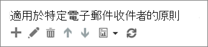

# 設定 Office 365 ATP 安全連結原則Set up Office 365 ATP Safe Links policies

> [!IMPORTANT]
> 本文適用於擁有 [Office 365 進階威脅防護](office-365-atp.md)的企業客戶。This article is intended for business customers who have [Office 365 Advanced Threat Protection](office-365-atp.md). 如果您是家用版使用者且正在尋找 Outlook 中安全連結的相關資訊，請參閱[進階 Outlook.com 安全性](https://support.microsoft.com/office/882d2243-eab9-4545-a58a-b36fee4a46e2)。If you are a home user looking for information about Safe Links in Outlook, see [Advanced Outlook.com security](https://support.microsoft.com/office/882d2243-eab9-4545-a58a-b36fee4a46e2).

[ATP 安全連結](atp-safe-links.md)([Office 365 進階威脅防護](office-365-atp.md) (ATP) 的功能) 可協助貴組織防範網路釣魚和其他攻擊中使用的惡意連結。[ATP Safe Links](atp-safe-links.md), a feature of [Office 365 Advanced Threat Protection](office-365-atp.md) (ATP), can help protect your organization from malicious links used in phishing and other attacks. 如果您具有[安全性與 &amp; 合規性中心](permissions-in-the-security-and-compliance-center.md)的必要許可權，您可以設定 ATP 安全連結原則，以協助確保當使用者按一下網址（URLs）時，您的組織受到保護。If you have the necessary [permissions for the Security &amp; Compliance Center](permissions-in-the-security-and-compliance-center.md), you can set up ATP Safe Links policies to help ensure that when people click web addresses (URLs), your organization is protected. 您可以將 ATP 安全連結原則設定為掃描電子郵件中的 URL 和 Office 文件中的 URL。Your ATP Safe Links policies can be configured to scan URLs in email and URLs in Office documents.

啟用 ATP 安全連結後，如果使用者按一下電子郵件中的連結，且該 URL 已被組織的自訂封鎖 URL 清單封鎖，或是該 URL 已確定為惡意的，就會開啟警告頁面。With ATP Safe Links enabled, if a user clicks on a link in an email and the URL has been blocked by your organization's custom blocked URL list or if the URL is determined to be malicious, a warning page will open.
  
[我們會持續將新功能新增至 ATP](office-365-atp.md#new-features-in-office-365-atp)。[New features are continually being added to ATP](office-365-atp.md#new-features-in-office-365-atp). 新增新功能後，您可能需要調整現有的 ATP 安全連結原則。As new features are added, you may need to make adjustments to your existing ATP Safe Links policies.

## 處理方式What to do 
  
1. 檢閱必要條件。Review the prerequisites.
    
2. 檢閱和編輯每個人都適用的預設 ATP 安全連結原則。Review and edit the default ATP Safe Links policy that applies to everyone. 例如，您可以[設定 ATP 安全連結的自訂封鎖 URL 清單](set-up-a-custom-blocked-urls-list-atp.md)。For example, you can [set up your custom blocked URLs list for ATP Safe Links](set-up-a-custom-blocked-urls-list-atp.md).
    
3. 新增或編輯特定電子郵件收件者的原則，包括[針對 ATP 安全連結設定自訂「不要重寫」URL 清單](set-up-a-custom-do-not-rewrite-urls-list-with-atp.md)。Add or edit policies for specific email recipients, including [setting up your custom "Do not rewrite" URLs list for ATP Safe Links](set-up-a-custom-do-not-rewrite-urls-list-with-atp.md).
    
4. 了解 ATP 安全連結原則選項 (在本文中)，包括最近變更的設定。Learn about ATP Safe Links policy options (in this article), including settings for recent changes.
    
## 步驟 1：檢閱必要條件Step 1: Review the prerequisites

- 請確認您組織有 [Office 365 進階威脅防護](office-365-atp.md)。Make sure that your organization has [Office 365 Advanced Threat Protection](office-365-atp.md).
    
- 請確定您具有必要權限。Make sure that you have the necessary permissions. 若要定義 (或編輯) ATP 原則，您必須獲派適當的角色。To define (or edit) ATP policies, you must be assigned an appropriate role. 下表中有一些範例描述：Some examples are described in the following table:  

    |角色Role  |指派位置/條件Where/how assigned  |
    |---------|---------|
    |全域管理員global administrator |簽署購買 Microsoft 365 的人員預設為全域系統管理員。The person who signs up to buy Microsoft 365 is a global admin by default. （請參閱[關於 Microsoft 365 系統管理員角色](https://docs.microsoft.com/microsoft-365/admin/add-users/about-admin-roles)以深入瞭解。）(See [About Microsoft 365 admin roles](https://docs.microsoft.com/microsoft-365/admin/add-users/about-admin-roles) to learn more.)         |
    |安全性系統管理員Security Administrator |Azure Active Directory 系統管理中心 ([https://aad.portal.azure.com](https://aad.portal.azure.com))Azure Active Directory admin center ([https://aad.portal.azure.com](https://aad.portal.azure.com))|
    |Exchange Online 組織管理Exchange Online Organization Management |Exchange 系統管理中心 ([https://outlook.office365.com/ecp](https://outlook.office365.com/ecp))Exchange admin center ([https://outlook.office365.com/ecp](https://outlook.office365.com/ecp))  或or    PowerShell Cmdlet (請參閱 [Exchange Online PowerShell](https://docs.microsoft.com/powershell/exchange/exchange-online-powershell))PowerShell cmdlets (See [Exchange Online PowerShell](https://docs.microsoft.com/powershell/exchange/exchange-online-powershell)) |

    若要深入瞭解角色和許可權，請參閱[安全性與 &amp; 合規性中心的許可權](permissions-in-the-security-and-compliance-center.md)。To learn more about roles and permissions, see [Permissions in the Security &amp; Compliance Center](permissions-in-the-security-and-compliance-center.md).

- 確定 Office 用戶端已設定為使用[新式驗證](https://docs.microsoft.com/office365/enterprise/modern-auth-for-office-2013-and-2016) (這會用於 Office 文件中的 ATP 安全連結保護)。Make sure that Office clients are configured to use [Modern Authentication](https://docs.microsoft.com/office365/enterprise/modern-auth-for-office-2013-and-2016) (this is for ATP Safe Links protection in Office documents).
    
- [了解 ATP 安全連結原則選項](#step-4-learn-about-atp-safe-links-policy-options) (在本文中)。[Learn about ATP Safe Links policy options](#step-4-learn-about-atp-safe-links-policy-options) (in this article). 

- 最多可允許30分鐘，以將新的或更新的原則散佈至所有 Microsoft 365 資料中心。Allow up to 30 minutes for your new or updated policy to spread to all Microsoft 365 datacenters.
    
## 步驟2：定義 (或檢閱) 每個人都適用的 ATP 安全連結原則Step 2: Define (or review) the ATP Safe Links policy that applies to everyone

當您擁有 [Office 365 進階威脅防護](office-365-atp.md)時，您會有貴組織中每個人都適用的預設 ATP 安全連結原則。When you have [Office 365 Advanced Threat Protection](office-365-atp.md), you will have a default ATP Safe Links policy that applies to everyone in your organization. 請務必檢閱，並視需要編輯預設原則。Make sure to review, and if needed, edit your default policy.
  
1. 移至 [https://protection.office.com](https://protection.office.com) 然後以您的公司或學校帳戶當入。Go to [https://protection.office.com](https://protection.office.com) and sign in with your work or school account. 
    
2. 在左側導覽中，選擇 [威脅管理]\*\*\*\* 下方的 [原則]\*\* \> [安全連結]\*\*\*\*\*\*。In the left navigation, under **Threat management**, choose **Policy \>** **Safe Links**.
    
3. 在 **套用於整個組織的原則**區段中，選取 [預設] \*\*\*\*，然後選擇 [編輯] \*\*\*\* (編輯按鈕類似鉛筆)。In the **Policies that apply to the entire organization** section, select **Default**, and then choose **Edit** (the Edit button resembles a pencil). ![按一下 [編輯] 已編輯安全連結防護預設原則](../../media/d08f9615-d947-4033-813a-d310ec2c8cca.png)
  
4. 在 [封鎖下列 URL]\*\*\*\* 區段中，指定您想要防止貴組織中的人員造訪的一或多個 URL。In the **Block the following URLs** section, specify one or more URLs that you want to prevent people in your organization from visiting. (請參閱[使用 ATP 安全連結來設定自訂的封鎖 URL 清單](set-up-a-custom-blocked-urls-list-atp.md)。)(See [Set up a custom blocked URLs list using ATP Safe Links](set-up-a-custom-blocked-urls-list-atp.md).)
    
5. 在 [套用到電子郵件以外內容的設定]\*\*\*\* 區段中，選取 (或清除) 您要使用的選項。In the **Settings that apply to content except email** section, select (or clear) the options you want to use. (建議您選取所有選項。)(We recommend that you select all the options.) 
    
6. 選擇 [儲存]\*\*\*\*。Choose **Save**.
    
## 步驟3：新增 (或編輯) 適用於特定電子郵件收件者的 ATP 安全連結原則Step 3: Add (or edit) ATP Safe Links policies that apply to specific email recipients

在您檢閱 (或編輯) 每個人都適用的預設 ATP 安全連結原則之後，下一個步驟是定義您會套用到特定收件者的其他原則。After you have reviewed (or edited) the default ATP Safe Links policy that applies to everyone, your next step is to define additional policies that would apply to specific recipients. 例如，您可定義其他原則，以指定預設原則的例外狀況。For example, you can specify exceptions to your default policy by defining an additional policy. 
  
1. 移至 [https://protection.office.com](https://protection.office.com) 然後以您的公司或學校帳戶當入。Go to [https://protection.office.com](https://protection.office.com) and sign in with your work or school account. 
    
2. 在左側導覽中，選擇 [威脅管理]\*\*\*\* 下方的 [原則]\*\*\*\*。In the left navigation, under **Threat management**, choose **Policy**.
    
3. 選擇 [安全連結]\*\*\*\*。Choose **Safe Links**.
    
4. 在 [適用於特定收件者的原則]\*\*\*\* 區段中，選擇 [新增]\*\*\*\* ([新增] 按鈕類似加號 (**+**))。In the **Policies that apply to specific recipients** section, choose **New** (the New button resembles a plus sign ( **+**)). ![選擇 [新增] 以新增特定電子郵件收件者的安全連結原則](../../media/01073f42-3cec-4ddb-8c10-4d33ec434676.png)
  
5. 指定原則的名稱、描述及設定。Specify the name, description, and settings for your policy. **範例：** 若要設定名為「禁止直接點選」的原則，該原則不允許貴組織中特定群組的人員在沒有 ATP 安全連結保護的情況下點選特定網站，您可以指定下列建議設定：**Example:** To set up a policy called "no direct click through" that does not allow people in a certain group in your organization to click through to a specific website without ATP Safe Links protection, you might specify the following recommended settings: 
    
    - 在 [名稱]\*\*\*\* 方塊中，鍵入「禁止直接點選」。In the **Name** box, type no direct click through.

    - 在 [描述]\*\*\*\* 方塊中，鍵入類似以下的描述：禁止特定群組中的人員在未經 ATP 安全連結驗證的情況下點選網站。In the **Description** box, type a description like, Prevents people in certain groups from clicking through to a website without ATP Safe Links verification.

    - 在 [選取動作]\*\*\*\* 區段中，選擇 [開啟]\*\*\*\*。In the **Select the action** section, choose **On**.

    - 如果您想要為可疑和指向檔案的 URL 啟用 URL 引爆功能 (建議使用)，請選取 [針對可疑的連結和指向檔案的連結套用即時 URL 掃描]\*\*\*\*。Select **Apply real-time URL scanning for suspicious links and links that point to files** if you would like to enable URL detonation for suspicious and file-pointing URLs (recommended). 如果您希望只有在完全掃描 URL 之後才讓使用者接收郵件，則選取 [等到 URL 掃描完成再傳遞郵件]\*\*\*\*。And select **Wait for URL scanning to complete before delivering the message** if you wish to only have users receive messages after the URLs have been fully scanned.

    - 如果您想要針對在組織內使用者間傳送的郵件啟用安全連結 (建議使用)，請選取 [將安全連結套用至組織內傳送的郵件]\*\*\*\*。Select **Apply Safe Links to messages sent within the organization** if you would like to enable Safe Links for messages sent between users within your organization (recommended).

    - 如果您不希望個別使用者覆寫「進行中的掃描」\*\* 或「已封鎖 URL」\*\* 通知頁面，請選取 [不允許使用者點選原始 URL]\*\*\*\*。Select **Do not allow user to click through to original URL** if you do not wish the individual users to override a *scan in progress* or *URL blocked* notification pages.

    - (選用) 在 [不要重寫下列 URL]\*\*\*\* 區段中，指定一或多個被認為對貴組織很安全的 URL。(This is optional) In the **Do not rewrite the following URLs** section, specify one or more URLs that are considered to be safe for your organization. (請參閱[使用 ATP 安全連結來設定自訂「不要重寫」URL 清單](set-up-a-custom-do-not-rewrite-urls-list-with-atp.md))(See [Set up a custom "Do not rewrite" URLs list using ATP Safe Links](set-up-a-custom-do-not-rewrite-urls-list-with-atp.md))

    - 在 [套用至]\*\*\*\* 區段中，選擇 [收件者是以下的成員]\*\*\*\*，然後選擇您想要包含在原則中的群組。In the **Applied To** section, choose **The recipient is a member of**, and then choose the group(s) you want to include in your policy. 選擇 [新增]\*\*\*\*，然後選擇 [確認]\*\*\*\*。Choose **Add**, and then choose **OK**.
    
6. 選擇 [儲存]\*\*\*\*。Choose **Save**.

> [!NOTE]
> 具有較高優先順序的 ATP 安全連結原則將優先執行。ATP Safe Links policies with higher priority will take precedence. 如果使用者受制于兩個或多個原則，則只有較高優先順序的原則才能生效。If a user is subject to two or more polices, only the higher priority policy will take effect.
    
## 步驟 4：了解 ATP 安全連結原則選項Step 4: Learn about ATP Safe Links policy options

當您設定或編輯 ATP 安全連結原則時，會看到幾個可用的選項。As you set up or edit your ATP Safe Links policies, will see several options available. 如果您想知道這些選項的功能，下表會說明有每個選項及其效用。In case you are wondering what these options are, the following table describes each one and its effect. 請記住，要定義或編輯的主要 ATP 安全連結原則有兩種：Remember that there are two main kinds of ATP Safe Links policies to define or edit:
- 每個人都適用的[預設原則](#default-policy-options)；以及a [default policy](#default-policy-options) that applies to everyone; and  
- [特定收件者的其他原則](#policies-that-apply-to-specific-email-recipients)additional [policies for specific recipients](#policies-that-apply-to-specific-email-recipients) 

### 預設原則選項Default policy options

預設原則選項適用於貴組織中的每個人。Default policy options apply to everyone in your organization.

|此選項This option  |執行此動作Does this  |
|---------|---------|
| **封鎖下列 URL****Block the following URLs**      | 可讓貴組織擁有自動封鎖的自訂 URL 清單。Enables your organization to have a custom list of URLs that are automatically blocked. 使用者按一下此清單中的 URL 後，就會前往說明 URL 為何遭到封鎖的[警告頁面](atp-safe-links-warning-pages.md)。When users click a URL in this list, they'll be taken to a [warning page](atp-safe-links-warning-pages.md) that explains why the URL is blocked. 若要深入了解，請參閱[使用 Office 365 ATP 安全連結來設定自訂封鎖的 URL 清單](set-up-a-custom-blocked-urls-list-atp.md)。To learn more, see [Set up a custom blocked URLs list using Office 365 ATP Safe Links](set-up-a-custom-blocked-urls-list-atp.md). |
| **適用于企業的 Microsoft 365 應用程式、Office for iOS 和 Android****Microsoft 365 Apps for enterprise, Office for iOS and Android**      | 選取此選項時，ATP 安全連結保護適用于 Word、Excel URLs 及 PowerPoint 檔案中的 Windows 或 Mac 作業系統、Outlook 中的電子郵件、iOS 或 Android 裝置上的 Office 檔、Windows 上的 Visio 2016 檔案，以及在 Office 應用程式的 web 版本（Word、PowerPoint、Excel、Outlook 及 OneNote）中開啟的檔案，只要使用者已登入 Office 365。When this option is selected, ATP Safe Links protection is applied to URLs in Word, Excel, and PowerPoint files on Windows or Mac OS, email messages in Outlook, Office documents on iOS or Android devices, Visio 2016 files on Windows, and files open in the web versions of Office apps (Word, PowerPoint, Excel, Outlook, and OneNote), provided the user has signed in to Office 365. |
| **當使用者按一下 ATP 安全連結時不要追蹤****Don't track when users click ATP Safe Links**    | 選取此選項時，不會儲存 [Word]、[Excel]、[PowerPoint]、[Visio 檔] 及 [Outlook 電子郵件訊息] 中 URLs 的資料。When this option is selected, click data for URLs in Word, Excel, PowerPoint, Visio documents, and Outlook email messages is not stored.    |
|**不要讓使用者點選原始 URL 的 ATP 安全連結****Don't let users click through ATP Safe Links to original URL**   |若選取此選項，使用者就無法繼續將[警告頁面](atp-safe-links-warning-pages.md)傳送到被判定是惡意的 URL。When this option is selected, users cannot proceed past a [warning page](atp-safe-links-warning-pages.md) to a URL that is determined to be malicious.    |

### 適用於特定電子郵件收件者的原則Policies that apply to specific email recipients

|此選項This option  |執行此動作Does this  |
|---------|---------|
|**關閉****Off**   |不要掃描電子郵件中的 URL。Does not scan URLs in email messages.    可讓您定義例外狀況規則，例如以下規則：不要掃描特定收件者群組的電子郵件中的 URL。Enables you to define an exception rule, such as a rule that does not scan URLs in email messages for a specific group of recipients.    |
|**開啟****On**   |當使用者按一下電子郵件中的 URL 並啟用 Windows 上 Outlook (C2R) 中的 ATP 安全連結時，重寫 URL 以透過 ATP 安全連結防護路由傳送使用者。Rewrites URLs to route users through ATP Safe Links protection when the users click URLs in email messages and enables ATP Safe Links within Outlook (C2R) on Windows.    如果 URL 沒有令人信服的信譽，則在點選已封鎖或惡意的 URL 清單時檢查 URL，並以非同步方式在背景觸發 URL 引爆。Checks a URL when clicked against a list of blocked or malicious URLs and triggers a detonation of the URL in the background asynchronously if the URL does not have a valid reputation.    |
|**針對可疑的連結和指向檔案的連結套用即時 URL 掃描****Apply real-time URL scanning for suspicious links and links that point to files**   |若選取此選項，則會掃描指向可下載內容的可疑 URL 和連結。When this option is selected, suspicious URLs and links that point to downloadable content are scanned.    |
|**等待 URL 掃描完成再傳遞郵件****Wait for URL scanning to complete before delivering the message**   |若選取此選項，則會保留包含要掃描 URL 的郵件，直到 URL 完成掃描且確認是安全的，才會傳遞這些郵件。When this option is selected, messages that contain URLs to be scanned will be held until the URLs finish scanning and are confirmed to be safe before the messages are delivered.    |
|**將安全連結套用至組織內傳送的郵件****Apply Safe Links to messages sent within the organization**   | 此選項若可使用並已選取，假設電子郵件帳戶託管於 Office 365，則 ATP 安全連結保護就會套用至在貴組織中的人員間傳送的電子郵件。When this option is available and selected, ATP Safe Links protection is applied to email messages sent between people in your organization, provided the email accounts are hosted in Office 365.    |
|**不要追蹤使用者點選****Do not track user clicks**   |若選取此選項，則不會儲存來自外部寄件者的電子郵件中 URL 的點選資料。When this option is selected, click data for URLs in email from external senders is not stored. 目前不支援追蹤組織內傳送的電子郵件中連結的 URL 點選。URL click tracking for links within email messages sent within the organization is currently not supported.    |
|**不允許使用者點選原始 URL****Do not allow users to click through to original URL**   |若選取此選項，使用者就無法繼續將[警告頁面](atp-safe-links-warning-pages.md)傳送到被判定是惡意的 URL。When this option is selected, users cannot proceed past a [warning page](atp-safe-links-warning-pages.md) to a URL that is determined to be malicious.    |
|**不要重寫下列 URL****Do not rewrite the following URLs**   |將 URL 保留原樣。Leaves URLs as they are. 保留不需要掃描貴組織中特定電子郵件收件者群組的自訂安全 URL 清單。Keeps a custom list of safe URLs that don't need scanning for a specific group of email recipients in your organization.  如需詳細資料 (包括支援萬用字元星號 (\*) 的近期變更)，請參閱[使用 ATP 安全連結來設定自訂「不要重寫」URL 清單](set-up-a-custom-do-not-rewrite-urls-list-with-atp.md)。See [Set up a custom "Do not rewrite" URLs list using ATP Safe Links](set-up-a-custom-do-not-rewrite-urls-list-with-atp.md) for more details, including recent changes to support for wildcard asterisks (\*).    |
   
## 後續步驟Next steps

在您的 ATP 安全連結原則就緒後，您就可以透過查看報告，查看 ATP 對您的組織的運作方式。Once your ATP Safe Links policies are in place, you can see how ATP is working for your organization by viewing reports. 請參閱下列資源，以深入了解詳細資訊：See the following resources to learn more:

- [檢視 Office 365 進階威脅防護的報告View reports for Office 365 Advanced Threat Protection](view-reports-for-atp.md)

- [使用安全性與合規性中心的總管Use Explorer in the Security &amp; Compliance Center](threat-explorer.md)

隨時掌握最新的 ATP 功能。Stay on top of new features coming to ATP. 瀏覽 [Microsoft 365 藍圖](https://www.microsoft.com/microsoft-365/roadmap?filters=O365)。visit the [Microsoft 365 Roadmap](https://www.microsoft.com/microsoft-365/roadmap?filters=O365).
