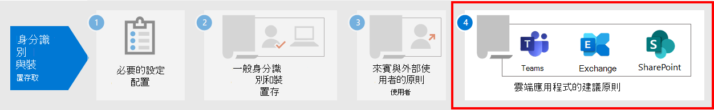

# 保護 SharePoint 網站和檔案的原則建議Policy recommendations for securing SharePoint sites and files

**適用於****Applies to**
- [Exchange Online ProtectionExchange Online Protection](exchange-online-protection-overview.md)
- [適用於 Office 365 的 Microsoft Defender 方案 1 和方案 2Microsoft Defender for Office 365 plan 1 and plan 2](office-365-atp.md)
- SharePoint OnlineSharePoint Online 

本文說明如何執行建議的身分識別和裝置存取原則，以保護 SharePoint 和 OneDrive 商務。This article describes how to implement the recommended identity and device-access policies to protect SharePoint and OneDrive for Business. 本指南是以 [通用身分識別和裝置存取原則](identity-access-policies.md)為基礎。This guidance builds on the [common identity and device access policies](identity-access-policies.md).

這些建議是根據您的需求細微性，以三種不同的安全性和保護層級來保護 SharePoint 檔案： **基準**、 **機密** 和 **高管制**。These recommendations are based on three different tiers of security and protection for SharePoint files that can be applied based on the granularity of your needs: **baseline**, **sensitive**, and **highly regulated**. 您可以在 [ [概述](microsoft-365-policies-configurations.md)] 中深入瞭解這些安全性層，以及建議的用戶端作業系統。You can learn more about these security tiers, and the recommended client operating systems, referenced by these recommendations in [the overview](microsoft-365-policies-configurations.md).

除了執行這項指導之外，請務必設定具有適當保護的 SharePoint 網站，包括為敏感和高管制內容設定適當的許可權。In addition to implementing this guidance, be sure to configure SharePoint sites with the right amount of protection, including setting appropriate permissions for sensitive and highly-regulated content.

## 更新常見原則，以納入 SharePoint 和 OneDrive 商務Updating common policies to include SharePoint and OneDrive for Business

為了保護 SharePoint 和 OneDrive 中的檔案，下圖說明要從一般身分識別和裝置存取原則更新哪些原則。To protect files in SharePoint and OneDrive, the following diagram illustrates which policies to update from the the common identity and device access policies.

[查看較大版本的此影像See a larger version of this image](https://github.com/MicrosoftDocs/microsoft-365-docs/raw/public/microsoft-365/media/microsoft-365-policies-configurations/identity-access-ruleset-sharepoint.png)

如果您在建立通用原則時包含 SharePoint，您只需要建立新的原則。If you included SharePoint when you created the common policies, you only need to create the new policies. 針對條件式存取原則，SharePoint 包含 OneDrive。For Conditional Access policies, SharePoint includes OneDrive.

新的原則會將特定存取需求套用至指定的 SharePoint 網站，以實現敏感和高管制內容的裝置保護。The new policies implement device protection for sensitive and highly-regulated content by applying specific access requirements to SharePoint sites that you specify.

下表列出您需要複查和更新或為 SharePoint 建立新的原則。The following table lists the policies you either need to review and update or create new for SharePoint. 通用身分 [識別與裝置存取原則](identity-access-policies.md) 文章中相關之設定指示的常見原則連結。The common policies link to the associated configuration instructions in the [Common identity and device access policies](identity-access-policies.md) article.

|保護層級Protection level|原則Policies|詳細資訊More information|
|---|---|---|
|**Baseline****Baseline**|[當登入風險為 *中* 或 *高* 時，需要 MFARequire MFA when sign-in risk is *medium* or *high*](identity-access-policies.md#require-mfa-based-on-sign-in-risk)|在雲端應用程式的指派中包含 SharePoint。Include SharePoint in the assignment of cloud apps.|
||[封鎖不支援新式驗證的用戶端Block clients that don't support modern authentication](identity-access-policies.md#block-clients-that-dont-support-multi-factor)|在雲端應用程式的指派中包含 SharePoint。Include SharePoint in the assignment of cloud apps.|
||[套用應用程式資料保護原則Apply APP data protection policies](identity-access-policies.md#apply-app-data-protection-policies)|請確定所有建議的應用程式都包含在應用程式清單中。Be sure all recommended apps are included in the list of apps. 請務必更新每個平臺 (iOS、Android、Windows) 的原則。Be sure to update the policy for each platform (iOS, Android, Windows).|
||[需要相容的電腦Require compliant PCs](identity-access-policies.md#require-compliant-pcs-but-not-compliant-phones-and-tablets)|在雲端應用程式的清單中包含 SharePoint。Include SharePoint in list of cloud apps.|
||[在 SharePoint 中使用應用程式強制限制Use app enforced restrictions in SharePoint](#use-app-enforced-restrictions-in-sharepoint)|新增此新原則。Add this new policy. 這會告訴 Azure Active Directory (Azure AD) 使用 SharePoint 中指定的設定。This tells Azure Active Directory (Azure AD) to use the settings specified in SharePoint. 這個原則會套用至所有使用者，但是只會影響 SharePoint 存取原則中所包含之網站的存取權。This policy applies to all users, but only affects access to sites included in SharePoint access policies.|
|**敏感度****Sensitive**|[當登入風險為 *低*、*中* 或 *高* 時，需要 MFARequire MFA when sign-in risk is *low*, *medium* or *high*](identity-access-policies.md#require-mfa-based-on-sign-in-risk)|在雲端應用程式的指派中包含 SharePoint。Include SharePoint in the assignments of cloud apps.|
||[需要相容 *的電腦和* 行動裝置Require compliant PCs *and* mobile devices](identity-access-policies.md#require-compliant-pcs-and-mobile-devices)|在雲端 app 清單中包含 SharePoint。Include SharePoint in the list of cloud apps.|
||[SharePoint 存取控制原則](#sharepoint-access-control-policies)：允許來自未受管理裝置之特定 SharePoint 網站的瀏覽器存取權。[SharePoint access control policy](#sharepoint-access-control-policies): Allow browser-only access to specific SharePoint sites from unmanaged devices.|這可避免檔案的編輯和下載。This prevents edit and download of files. 使用 PowerShell 來指定網站。Use PowerShell to specify sites.|
|**高管制****Highly regulated**|[*永遠* 需要 MFA*Always* require MFA](identity-access-policies.md#require-mfa-based-on-sign-in-risk)|在雲端應用程式的指派中包含 SharePoint。Include SharePoint in the assignment of cloud apps.|
||[SharePoint 存取控制原則](#use-app-enforced-restrictions-in-sharepoint)：封鎖非管理裝置對特定 SharePoint 網站的存取權。[SharePoint access control policy](#use-app-enforced-restrictions-in-sharepoint): Block access to specific SharePoint sites from unmanaged devices.|使用 PowerShell 來指定網站。Use PowerShell to specify sites.|
|

## 在 SharePoint 中使用應用程式強制限制Use app-enforced restrictions in SharePoint

如果您在 SharePoint 中執行存取控制，您必須在 Azure AD 中建立此條件式存取原則，以通知 Azure AD 強制執行您在 SharePoint 中設定的原則。If you implement access controls in SharePoint, you must create this Conditional Access policy in Azure AD to tell Azure AD to enforce the policies you configure in SharePoint. 這個原則會套用至所有使用者，但是只會影響您在 SharePoint 中建立存取控制時使用 PowerShell 所指定之網站的存取權。This policy applies to all users, but only affects access to the sites you specify using PowerShell when you create the access controls in SharePoint.

若要設定此原則，請參閱 [控制存取非管理裝置](https://docs.microsoft.com/sharepoint/control-access-from-unmanaged-devices)中的「封鎖或限制存取特定 SharePoint 網站集合或 OneDrive 帳戶」。To configure this policy see "Block or limit access to specific SharePoint site collections or OneDrive accounts" in [Control access from unmanaged devices](https://docs.microsoft.com/sharepoint/control-access-from-unmanaged-devices).

## SharePoint 的存取控制原則SharePoint access control policies

Microsoft 建議您使用裝置存取控制，以機密和高管制內容來保護 SharePoint 網站中的內容。Microsoft recommends you protect content in SharePoint sites with sensitive and highly-regulated content with device access controls. 您可以建立原則，以指定保護的層級，以及要套用保護的網站。You do this by creating a policy that specifies the level of protection and the sites to apply the protection to.

- 機密網站：允許僅供瀏覽器存取。Sensitive sites: Allow browser-only access. 這會防止使用者編輯及下載檔案。This prevents users from editing and downloading files.
- 高度管制網站：封鎖非管理裝置的存取。Highly regulated sites: Block access from unmanaged devices.

請參閱「阻止或限制存取特定 SharePoint 網站集合或 OneDrive 帳戶」，以 [控制來自非管理裝置的存取](https://docs.microsoft.com/sharepoint/control-access-from-unmanaged-devices)。See "Block or limit access to specific SharePoint site collections or OneDrive accounts" in [Control access from unmanaged devices](https://docs.microsoft.com/sharepoint/control-access-from-unmanaged-devices).

## 這些原則共同運作的方式How these policies work together

請務必瞭解，SharePoint 網站許可權通常是以網站存取權的業務需求為基礎。It's important to understand that SharePoint site permissions are typically based on business need for access to sites. 這些許可權是由網站擁有者管理，而且可以是高動態的。These permissions are managed by site owners and can be highly dynamic. 使用 SharePoint 裝置存取原則可確保對這些網站的保護，不論是否將使用者指派至與基線、敏感或高度管制保護相關聯的 Azure AD 群組。Using SharePoint device access policies ensures protection to these sites, regardless of whether users are assigned to an Azure AD group associated with baseline, sensitive, or highly regulated protection.

下圖提供 SharePoint 裝置存取原則如何保護使用者對網站存取的範例。The following illustration provides an example of how SharePoint device access policies protect access to sites for a user.

[查看較大版本的此影像See a larger version of this image](https://github.com/MicrosoftDocs/microsoft-365-docs/raw/public/microsoft-365/media/microsoft-365-policies-configurations/SharePoint-rules-scenario.png)

James 具有指派的基準條件式存取原則，但可獲得對具有敏感或高管制保護之 SharePoint 網站的存取權。James has baseline Conditional Access policies assigned, but he can be given access to SharePoint sites with sensitive or highly-regulated protection.

- 如果 James 存取敏感或高管制的網站，他是使用自己電腦的成員，只要其電腦符合規範，就會授與其存取權。If James accesses a sensitive or highly-regulated site he is a member of using his PC, his access is granted as long as his PC is compliant.
- 如果 James 存取機密的網站，他是使用未受管理的電話的成員（允許基準使用者使用），他只會收到對機密網站的瀏覽器存取權（由於為此網站設定的裝置存取原則）。If James accesses a sensitive site he is a member of using his unmanaged phone, which is allowed for baseline users, he will receive browser-only access to the sensitive site due to the device access policy configured for this site.
- 如果 James 存取高管制網站，他是使用非管理電話的成員，則會因此網站設定的存取原則而封鎖。If James accesses a highly regulated site he is a member of using his unmanaged phone, he will be blocked due to the access policy configured for this site. 他只能使用受管理和相容的電腦來存取此網站。He can only access this site using his managed and compliant PC.

## 下一步Next step

為下列專案設定條件式存取原則：Configure Conditional Access policies for:

- [Microsoft TeamsMicrosoft Teams](teams-access-policies.md)
- [Exchange OnlineExchange Online](secure-email-recommended-policies.md)
