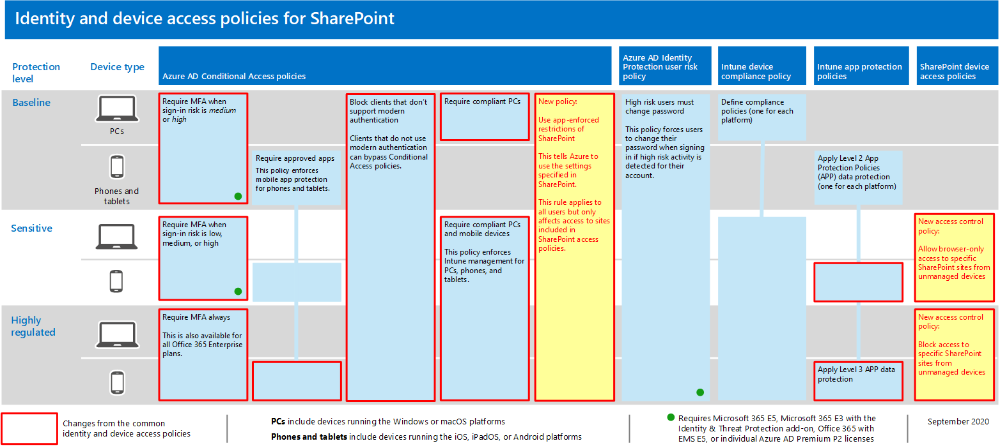

# 保護 SharePoint 網站和檔案安全的政策建議

本文說明如何執行建議的身分識別與裝置存取策略，以保護 SharePoint 和商務用 OneDrive。 本指引以一 [般身分識別與裝置存取策略為根據](identity-access-policies.md)。

這些建議是以三種不同的 SharePoint 檔案安全性和保護層級為基礎，可根據您的需求細微度來加以應用程式：比較基準、敏感性及 **高度規範**。   您可以進一步瞭解這些安全性層級，以及建議的用戶端作業系統，這些在概觀中的建議是 [參照的](microsoft-365-policies-configurations.md)。

除了執行此指引外，務必將 SharePoint 網站設定為適當的保護量，包括針對敏感和高度規範的內容設定適當許可權。

## 更新一般策略以包含 SharePoint 和商務用 OneDrive

若要保護 SharePoint 和 OneDrive 中的檔案，下圖說明要從一般身分識別與裝置存取策略更新哪些策略。

[查看此影像的較大版本](https://github.com/MicrosoftDocs/microsoft-365-docs/raw/public/microsoft-365/media/microsoft-365-policies-configurations/identity-access-ruleset-sharepoint.png)

如果您在建立共同策略時包含了 SharePoint，則只需要建立新策略。 針對條件式存取策略，SharePoint 會包含 OneDrive。

新原則會針對敏感和受到高度規範的內容，將特定的存取需求，針對您指定的 SharePoint 網站，來實施裝置保護。

下表列出您需要檢查及更新，或為 SharePoint 建立新設定時需要執行之策略。 共同策略會連結至共同身分識別與裝置存取策略文章中的相關 [組組](identity-access-policies.md) 指示。

|保護層級|原則|其他相關資訊|
|---|---|---|
|**Baseline**|[當登錄風險中或高 *時需要* MFA](identity-access-policies.md#require-mfa-based-on-sign-in-risk)|在指派雲端 App 中納入 SharePoint。|
||[封鎖不支援新式驗證的用戶端](identity-access-policies.md#block-clients-that-dont-support-modern-authentication)|在指派雲端 App 中納入 SharePoint。|
||[Apply APP 資料保護原則](identity-access-policies.md#apply-app-data-protection-policies)|請確定所有建議的應用程式都包含在應用程式清單中。 請務必針對 iOS、Android、Windows (每個平臺更新) 。|
||[需要相容的電腦](identity-access-policies.md#require-compliant-pcs-but-not-compliant-phones-and-tablets)|在雲端應用程式清單中納入 SharePoint。|
||[在 SharePoint 使用應用程式強制限制](#use-app-enforced-restrictions-in-sharepoint)|新增此新政策。 這告訴 Azure Active Directory (Azure AD) 使用 SharePoint 中指定的設定。 此原則會適用于所有使用者，但只會影響 SharePoint 存取原則中包含的網站的存取權。|
|**敏感度**|[當登錄風險低、中或高時 *需要*  MFA](identity-access-policies.md#require-mfa-based-on-sign-in-risk)|在雲端應用程式的指派中納入 SharePoint。|
||[需要符合規範的 PC *及* 行動裝置](identity-access-policies.md#require-compliant-pcs-and-mobile-devices)|在雲端應用程式清單中納入 SharePoint。|
||[SharePoint 存取控制政策](#sharepoint-access-control-policies)：允許瀏覽器僅從未管理裝置存取特定 SharePoint 網站。|這可防止編輯和下載檔案。 使用 PowerShell 指定網站。|
|**高管制**|[*一* 直需要 MFA](identity-access-policies.md#require-mfa-based-on-sign-in-risk)|在指派雲端 App 中納入 SharePoint。|
||[SharePoint 存取控制政策](#use-app-enforced-restrictions-in-sharepoint)：封鎖未管理裝置對特定 SharePoint 網站的存取。|使用 PowerShell 指定網站。|
|

## 在 SharePoint 中使用應用程式強制限制

如果您在 SharePoint 中實施存取控制，您必須在 Azure AD 中建立此條件式存取策略，以告訴 Azure AD 要強制執行您于 SharePoint 中設定的政策。 此原則會適用于所有使用者，但只會影響當您在 SharePoint 中建立存取控制時，對使用 PowerShell 所指定網站的存取權。

若要設定此策略，請參閱「封鎖或限制特定 SharePoint 網站集合或 OneDrive 帳戶的存取權」，瞭解未管理裝置存取權 [中的「封鎖或限制存取特定 SharePoint 網站集合或](https://docs.microsoft.com/sharepoint/control-access-from-unmanaged-devices)OneDrive 帳戶」。

## SharePoint 存取控制策略

Microsoft 建議您使用裝置存取控制，以敏感且受到高度規範的內容來保護 SharePoint 網站中的內容。 若要這麼做，請建立原則，指定保護層級和要保護的網站。

- 機密網站：允許瀏覽器存取。 這可防止使用者編輯和下載檔案。
- 受到高度規範的網站：封鎖未受管理裝置的存取權限。

請參閱未管理裝置在 Control 存取中的「封鎖或限制特定 SharePoint 網站集合或 OneDrive 帳戶的[存取」。](https://docs.microsoft.com/sharepoint/control-access-from-unmanaged-devices)

## 那些政策如何共同作業

請注意，SharePoint 網站許可權通常是以存取網站的業務需求為基礎。 這些許可權是由網站擁有者管理，而且可能是高度動態的。 使用 SharePoint 裝置存取策略可確保這些網站的保護，不論使用者被指派給與比較基準、機密或高度受規範保護相關聯的 Azure AD 群組。

下圖提供 SharePoint 裝置存取策略如何保護使用者存取網站的範例。

[查看此影像的較大版本](https://github.com/MicrosoftDocs/microsoft-365-docs/raw/public/microsoft-365/media/microsoft-365-policies-configurations/SharePoint-rules-scenario.png)

James 已指派比較基準條件式存取策略，但具有敏感或高度規範保護的 SharePoint 網站存取權。

- 如果 James 存取其使用電腦的成員之敏感或受到高度規範的網站，只要他的電腦符合規範，即會授予其存取權。
- 如果 James 存取一個機密網站，而他就是其未受管理電話的成員之一 ，而比較基準使用者是允許的，由於針對這個網站設定了裝置存取策略，他會收到機密網站的瀏覽器存取權。
- 如果 James 存取受到高度規範的網站，而他就是使用未受管理電話的成員，他將會因為此網站的存取策略而被封鎖。 他只能使用自己受管理且相容的電腦來存取這個網站。

## 下一步

設定條件式存取策略：

- [Microsoft Teams](teams-access-policies.md)
- [Exchange Online](secure-email-recommended-policies.md)
