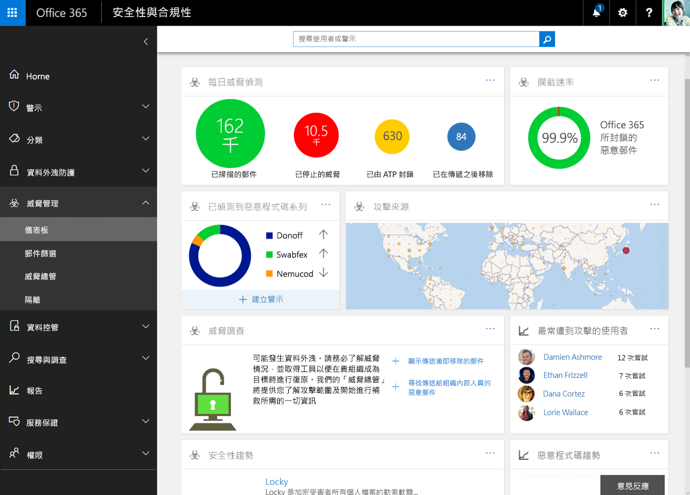
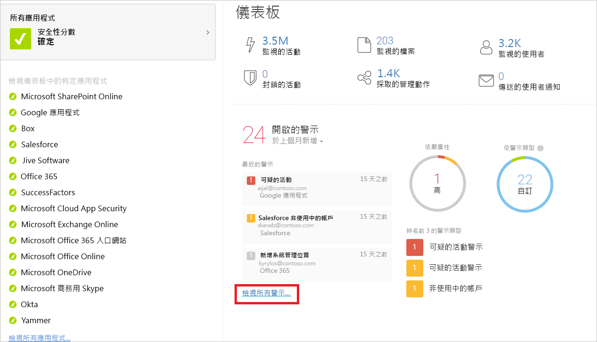

# 設定 Office 365 租用戶以提高安全性

本主題將逐步引導您完成會影響 Office 365 環境安全性的全租用戶建議設定。 您的安全性需求可能會高於或低於建議設定， 請使用這些建議做為調整的起始點。

## 檢查 Office 365 安全分數

Office 365 安全分數會根據您的一般性活動與安全性設定來分析 Office 365 組織的安全性，並指派分數。 請先記下您目前的分數。 調整某些全租用戶將能提高您的分數。 您的目標不是達到滿分，而是要留意能保護您的環境，又不會對使用者的生產力造成負面影響的機會。 請參閱 [Microsoft 安全分數](../mtp/microsoft-secure-score.md)。

## 調整 Microsoft 365 安全性中心的威脅管理原則

Microsoft 365 安全性中心包含的功能能夠保護您的環境。 同時，您也可以使用其中的報告和儀表板來進行監控並採取行動。 其中某些區域擁有預設的原則設定， 某些區域則不包含預設原則或規則。 請在威脅管理底下瀏覽以下原則，來調整威脅管理設定以營造更安全的環境。

|****適用範圍****|****包含預設原則****|****建議****|
|:-----|:-----|:-----|
|**防網路釣魚**|是| 如果您擁有自訂網域，請建立防網路釣魚原則來保護您最有價值之使用者 (例如 CEO) 的電子郵件帳戶，也保護您的網域。 請檢閱[設定防網路釣魚原則](set-up-anti-phishing-policies.md)，並以範例為指南來建立原則：「範例：保護使用者與網域的防網路釣魚原則。」|
|**反惡意程式碼引擎**|是| 編輯預設原則：    &ensp;&ensp;•   常見的附件類型篩選 - 選取 [開啟]      您也可以建立自訂的惡意程式碼篩選原則，並將其套用至貴組織中的指定使用者、群組或網域。      詳細資訊：    &ensp;&ensp;•   [反惡意程式碼保護](anti-malware-protection.md)   &ensp;&ensp;•   [設定反惡意程式碼原則](configure-anti-malware-policies.md)|
|**ATP 安全附件**|否| 請在安全附件的主要頁面上，選取此方塊來保護 SharePoint、OneDrive 和 Microsoft Teams 中的檔案：     &ensp;&ensp;•   開啟適用於 SharePoint、OneDrive 及 Microsoft Teams 的 ATP      使用這些設定來新增新的安全附件原則：     &ensp;&ensp;•   封鎖 - 封鎖現在和未來偵測到惡意程式碼的電子郵件與附件 (請選擇此選項)     &ensp;&ensp;•   啟用重新導向 - (請選取此方塊並輸入電子郵件地址，例如系統管理員或隔離帳戶)     &ensp;&ensp;•   如果附件的惡意程式碼掃描逾時或發生錯誤，套用上面的選取範圍 (請選取此方塊)     &ensp;&ensp;•   套用至 - 收件者網域為 (請選取您的網域)      其他資訊：[設定 Office 365 ATP 安全附件原則](set-up-atp-safe-attachments-policies.md)|
|**ATP 安全連結**|是| 新增此設定至整個組織的預設原則：    &ensp;&ensp;•    使用安全連結：Office 365 專業增強版、iOS 版與 Android 版 Office (請選取此選項)。     特定收件者的建議原則：     &ensp;&ensp;•   使用者按下連結時將重寫 URL，並根據已知的惡意連結清單檢查 URL (請選取此選項)。     &ensp;&ensp;•   使用安全附件來掃描可下載的內容 (請選取此選項)。     &ensp;&ensp;•   套用至 - 收件者網域為 (請選取您的網域)。      其他資訊：[Office 365 ATP 安全連結](atp-safe-links.md)。|
|**反垃圾郵件 (郵件篩選)**|是| 想要處理的情況：     &ensp;&ensp;•   太多垃圾郵件 - 請選擇 [自訂] 設定，並編輯 [預設垃圾郵件篩選原則]。     &ensp;&ensp;•   詐騙防護智慧 - 檢閱偽造網域的寄件者。 封鎖或允許這些寄件者。      其他資訊：[Office 365 電子郵件反垃圾郵件防護機制](anti-spam-protection.md)。|
|***電子郵件驗證***|是|電子郵件驗證使用網域名稱系統 (DNS) 將可驗證的資訊新增到某電子郵件寄件者的電子郵件。 Office 365 為其預設網域 (onmicrosoft.com) 設定電子郵件驗證，但是 Office 365 系統管理員也可以為自訂網域使用電子郵件驗證。 使用的三種驗證方法：     &ensp;&ensp;•   寄件者原則架構 (或 SPF)。 &ensp;&ensp;&ensp;&ensp;- 若要設定，請參閱[在 Office 365 中設定 SPF 以協助防止詐騙](set-up-spf-in-office-365-to-help-prevent-spoofing.md)。   &ensp;&ensp;•   網域金鑰識別郵件  (DKIM)。   &ensp;&ensp;&ensp;&ensp;- 請參閱[在 Office 365 中將 DKIM 用於自訂網域中的電子郵件](https://docs.microsoft.com/office365/SecurityCompliance/use-dkim-to-validate-outbound-email)。  &ensp;&ensp;&ensp;&ensp;- 設定完成 DKIM 後，請在安全性中心中啟用。  &ensp;&ensp;•   以網域為基礎的訊息認證、報告與一致性 (DMARC)。   &ensp;&ensp;&ensp;&ensp;- 針對 DMARC 設定[在 Office 365 中使用 DMARC 來驗證電子郵件](use-dmarc-to-validate-email.md)。    
|

> [!NOTE]
> 針對 SPF 的非標準部署、混合式部署和疑難排解：[Office 365 如何使用寄件者原則架構 (SPF) 來防止詐騙](how-office-365-uses-spf-to-prevent-spoofing.md)。

## 請檢視安全性與合規性中心的儀表板和報告

請瀏覽以下報告與儀表板來深入了解您環境的健康狀況。 若您的組織使用 Office 365 服務，這些報告中的資料會變得更豐富。 現在，請先熟悉您可以監控與採取動作的項目。 如需詳細資訊，請參閱：[Microsoft 365 安全性與合規性中心的報告](../../compliance/reports-in-security-and-compliance.md)。

|****儀表板****|****描述****|
|:-----|:-----|
|[威脅管理儀表板](security-dashboard.md)|在安全性中心的 **[威脅管理]** 區段中，使用此儀表板來查看已經處理過的威脅，並將它視為一項實用工具，以此向商業決策者報告威脅調查和回應功能做了哪些舉動來保護貴企業。|
|[威脅總管 (或即時偵測)](threat-explorer.md)|此功能同樣位於安全性中心的 **[威脅管理]** 區段中。 如果您要調查或正遇到針對您的 Office 365 租用戶發動的攻擊，請使用總管 (或即時偵測) 來分析威脅。 總管 (或即時偵測) 能顯示隨時間受到的攻擊量，而您可以依照威脅系列、攻擊者的基礎結構等項目來分析這份資料。 您也可以將任何可疑的電子郵件標記為 [事件清單]。|
|報告 - 儀表板|在安全性中心的 **[報告]** 區段中，檢視您的 SharePoint Online 和 Exchange Online 組織的報告。 您也可以從 **[檢視報告]** 頁面存取 Azure Active Directory (Azure AD) 使用者登入報告、使用者活動報告和 Azure AD 稽核記錄。|

## 設定其他 Exchange Online 全租用戶設定

Exchange 系統管理中心中有許多安全性與保護控制項同時也包含在安全性中心中。 您不需要在這兩個地方都進行設定。 以下是建議的設定。

|****適用範圍****|****包含預設原則****|****建議****|
|:-----|:-----|:-----|
|**郵件流程** (郵件流程規則，又稱為傳輸規則)|否|新增郵件流程規則，以協助防範勒索軟體所封鎖的可執行檔類型及包含巨集的 Office 檔案類型。 如需詳細資訊，請參閱[使用郵件流程規則檢查郵件附件中 Exchange Online](https://docs.microsoft.com/exchange/security-and-compliance/mail-flow-rules/inspect-message-attachments)。    請參閱這些額外的主題：  •[針對勒索軟體保護](https://docs.microsoft.com/office365/admin/security-and-compliance/secure-your-business-data?view=o365-worldwide#ransomware) •[惡意程式碼和勒索軟體防護，Office 365 中](https://docs.microsoft.com/Office365/Enterprise/office-365-malware-and-ransomware-protection)  •[復原從 Office 365 中勒索軟體攻擊](recover-from-ransomware.md)     建立郵件流程規則來防止郵件自動轉寄至外部網域。 如需詳細資訊，請參閱[含有安全分數的用戶端外部轉寄降低風險規則](https://blogs.technet.microsoft.com/office365security/mitigating-client-external-forwarding-rules-with-secure-score/) (英文)。    其他資訊：[Exchange Online 中的郵件流程規則 (傳輸規則)](https://docs.microsoft.com/exchange/security-and-compliance/mail-flow-rules/mail-flow-rules)|
|**啟用新式驗證**|否|Office 365 中的新式驗證是使用多重要素驗證 (MFA) 的先決條件。 MFA 是保護雲端資源存取權 (包括電子郵件) 的建議選項。    請參閱這些主題：   • [啟用或停用 Exchange Online 中的新式驗證](https://docs.microsoft.com/Exchange/clients-and-mobile-in-exchange-online/enable-or-disable-modern-authentication-in-exchange-online)  • [商務用 Skype Online：以新式驗證啟用您的租用戶](https://social.technet.microsoft.com/wiki/contents/articles/34339.skype-for-business-online-enable-your-tenant-for-modern-authentication.aspx) (英文)    Office 2016 用戶端、SharePoint Online 和商務用 OneDrive 預設會啟用新式驗證。    其他資訊：[Office 2013 和 Office 2016 用戶端應用程式的新式驗證運作方式](https://docs.microsoft.com/office365/enterprise/modern-auth-for-office-2013-and-2016)|

## 設定 SharePoint 系統管理中心的全租用戶共用原則

Microsoft 建議您從基礎保護開始，逐漸提高 SharePoint 小組網站的保護層級設定。 如需詳細資訊，請參閱[保護 SharePoint Online 網站與檔案](https://docs.microsoft.com/microsoft-365-enterprise/secure-sharepoint-online-sites-and-files)

設定為基礎層級的 SharePoint 小組網站可讓您使用匿名存取連結，來與所有外部使用者共用檔案。 建議您採用此方法，而不要在電子郵件中傳送檔案。

為了支援基礎保護達到目標，請依以下建議設定全租用戶共用原則。 請為個別網站設定比此全租用戶原則更嚴格 (而非更寬鬆) 的共用設定。

|****適用範圍****|****包含預設原則****|****建議****|
|:-----|:-----|:-----|
|**共用** (SharePoint Online 和商務用 OneDrive)|是|外部共用預設為啟用狀態。 這些為建議設定：  • 允許與經過驗證的外部使用者共用以及使用匿名存取連結 (預設設定)。    • 匿名存取連結將在下列天數後到期。 如有需要，請輸入一個數字，例如 30 天。  • 預設連結類型 - 請選取 [內部] (僅供組織中的人員使用)。 想要以匿名連結進行共用的使用者必須從共用功能表中選擇此選項。    其他資訊：[外部共用概觀](https://docs.microsoft.com/sharepoint/external-sharing-overview)|

SharePoint 系統管理中心與商務用 OneDrive 系統管理中心包含同樣的設定。 任一系統管理中心內的設定都適用於兩者。

## 在 Azure Active Directory 中進行設定

請務必在 Azure Active Directory 中瀏覽以下兩個區域以完成全租用戶設定，以獲得更安全的環境。

### 設定具名位置 (使用條件式存取)

如果貴組織內有辦公室擁有安全網路存取權，請將信任的 IP 位址範圍新增為 Azure Active Directory 中的具名位置。 這項功能可協助減少誤判為登入風險事件的次數。

請參閱：[Azure Active Directory 中的具名位置](https://docs.microsoft.com/azure/active-directory/active-directory-named-locations)

### 封鎖不支援新式驗證的應用程式

應用程式必須支援新式驗證才能使用多重要素驗證。 您無法使用條件式存取規則來封鎖不支援新式驗證的 App。

為了環境安全，請務必停用不支援新式驗證之 App 的驗證。 您可以在 Azure Active Directory 中使用即將推出的控制項完成這項作業。

在此同時，請使用下列其中一項方法，來為 SharePoint Online 和商務用 OneDrive 完成這項作業：

- 若要使用 PowerShell，請參閱[封鎖未使用新式驗證的應用程式](https://docs.microsoft.com/intune-classic/deploy-use/block-apps-with-no-modern-authentication)。

- 請在 SharePoint 系統管理中心內的 [裝置存取權] 頁面 - [控制不使用新式驗證的應用程式存取權] 進行此設定。 選擇 [封鎖]。

## 開始使用雲端 App 安全性或 Office 365 雲端 App 安全性

使用 Office 365 雲端 App 安全性來評估風險、警示可疑活動，並自動採取行動。 需要 Office 365 E5 方案。

或使用 Microsoft Cloud App Security，讓您即便在授與存取權後，也能讓所有雲端應用程式獲得更清楚的檢視、綜合性的控制權與更好的保護，包括 Office 365。

由於此解決方案建議使用 EMS E5 方案，我們建議您開始使用雲端 App 安全性，以便您可以搭配環境中的其他 SaaS 應用程式使用此功能。 請以預設原則與設定開始使用。

詳細資訊：

- [部署 Cloud App Security](https://docs.microsoft.com/cloud-app-security/getting-started-with-cloud-app-security)

- [Microsoft Cloud App Security 的詳細資訊](https://www.microsoft.com/cloud-platform/cloud-app-security)

- [什麼是 Cloud App Security？](https://docs.microsoft.com/cloud-app-security/what-is-cloud-app-security)

## 其他資源

以下文章與指南能提供保護 Office 365 環境的其他規範資訊：

- [適用於政治活動、非營利組織和其他彈性組織的 Microsoft 安全性指南](https://docs.microsoft.com/microsoft-365/security/office-365-security/microsoft-security-guidance-for-political-campaigns-nonprofits-and-other-agile-o) (您可以在任何環境中使用這些建議，特別是僅使用雲端的環境)

- [適用於身分識別與裝置的建議安全原則與設定](https://docs.microsoft.com/microsoft-365-enterprise/microsoft-365-policies-configurations) (這些建議包括 AD FS 環境說明)
