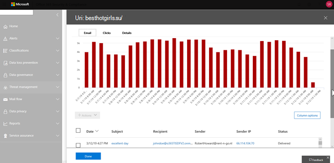
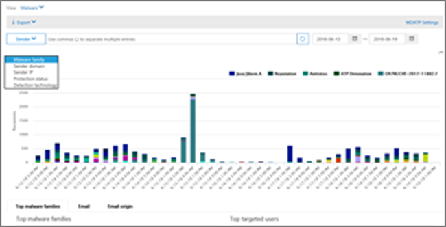

# 威脅瀏覽器和即時偵測中的視圖

[!INCLUDE [Microsoft 365 Defender rebranding](../includes/microsoft-defender-for-office.md)]

**適用於**
- [適用於 Office 365 的 Microsoft Defender 方案 1 和方案 2](office-365-atp.md)
- [Microsoft 365 Defender](../mtp/microsoft-threat-protection.md)

[威脅瀏覽器](threat-explorer.md) (和即時偵測報告) 是強大的近即時工具，可協助安全性運作小組調查和回應安全性 & 合規性中心內的威脅。 Explorer (和即時偵測報告) 會顯示可疑惡意程式碼和網路釣魚詐騙在 Office 365 中的電子郵件和檔案中的相關資訊，以及組織的其他安全性威脅和風險。

- 如果您有 [Microsoft Defender For Office 365](office-365-atp.md) 方案2，則會有 Explorer。
- 如果您有 Microsoft Defender for Office 365 方案1，則會進行即時偵測。

當您第一次開啟 Explorer (或即時偵測報告) 時，預設視圖會顯示過去7天的電子郵件惡意程式碼偵測。 此報告也可顯示 Microsoft Defender for Office 365 偵測，例如由 [安全連結](atp-safe-links.md)偵測到的惡意 URLs，以及 [安全附件](atp-safe-attachments.md)偵測到的惡意檔案。 您可以修改此報告以顯示過去30天的資料 (與 Microsoft Defender for Office 365 P2 付費訂閱) 。 試用訂閱只會包含過去7天的資料。

****

|訂閱|實用|資料天數|
|---|---|---|
|Microsoft Defender for Office 365 P1 試用版|即時偵測|7 |
|Microsoft Defender for Office 365 P1 已付費|即時偵測|大約|
|適用于 office 的 Microsoft Defender 365 P1 已付費測試 Defender for Office 365 P2 試用版|威脅總管|7 |
|Microsoft Defender for Office 365 P2 試用版|威脅總管|7 |
|Microsoft Defender for Office 365 P2 已支付|威脅總管|大約|
|

> [!NOTE]
> 我們即將開始展開瀏覽器的 (和即時偵測) 從7天到30天的試用承租人的資料保留和搜尋限制。 這項變更是在藍圖專案的一部分中追蹤的，而不是70544，而且目前在滾出階段。

使用 [ **View** ] （查看）功能表來變更顯示的資訊。 工具提示可協助您決定要使用的視圖。

選取視圖後，您就可以套用篩選器，並設定查詢進行進一步的分析。 下列各節提供 Explorer (或即時偵測) 中所提供的各種視圖的簡短概述。

## 電子郵件 > 惡意程式碼

若要查看此報告，請在 Explorer (或即時偵測) 中，選擇 [ **view** \> **Email** \> **Malware**]。 此視圖顯示識別為包含惡意程式碼之電子郵件的相關資訊。

按一下 [ **寄件者** ] 開啟您的查看選項清單。 使用此清單，透過寄件者、收件者、寄件者網域、主旨、偵測技術、保護狀態等方式來查看資料。

例如，若要查看對偵測到的電子郵件所採取的動作，請挑選清單中的 [ **保護狀態** ]。 選取一個選項，然後按一下 [重新整理] 按鈕，將該篩選套用至您的報表。

在圖表下方，查看特定郵件的詳細資料。 當您選取清單中的專案時，會開啟一個彈出窗格，您可以在其中深入瞭解您所選取的專案。

## 電子郵件 > 網路釣魚

若要查看此報告，請在 Explorer (或即時偵測) 中，選擇 [ **view** \> **Email** \> **釣魚網絡**]。 此視圖顯示視為網路釣魚企圖的電子郵件。

按一下 [ **寄件者** ] 開啟您的查看選項清單。 使用此清單，依寄件者、收件者、寄件者網域、寄件者 IP、URL 網域、判定結果等方式來查看資料。

例如，若要查看在已識別為網路釣魚企圖的 URLs 上按一下人員時採取的動作，請挑選清單中 **的 [依** 序顯示]，然後選取一或多個選項，然後按一下 [重新整理] 按鈕。

![按一下網路釣魚報告的 [已判定選項]](../../media/ThreatExplorerEmailPhishClickVerdictOptions.png)

在圖表下方，查看特定訊息、URL 按一下、URLs 及電子郵件原始的詳細資料。

當您選取清單中的專案（例如已偵測到的 URL）時，就會開啟彈出窗格，您可以在其中深入瞭解您所選取的專案。

## 電子郵件 > 提交

若要查看此報告，請在 Explorer (或即時偵測) 中，選擇 [ **view** \> **Email** \> **報送**]。 此視圖顯示使用者已舉報為垃圾郵件、非垃圾郵件或網路釣魚電子郵件的電子郵件。

按一下 [ **寄件者** ] 開啟您的查看選項清單。 使用此清單，以 [寄件者]、[收件者]、[報告] 類型 (使用者判斷電子郵件為垃圾郵件、非垃圾郵件或網路釣魚) 等等的方式來查看資訊。

例如，若要查看報告為網路釣魚企圖的電子郵件資訊，請按一下 [ **寄件者** \> **報告類型**]，選取 [ **網路釣魚**]，然後按一下 [重新整理] 按鈕。

在圖表下方，查看特定電子郵件訊息的詳細資訊，例如主題行、寄件者的 IP 位址、將郵件報告為垃圾郵件的使用者，而非垃圾郵件或網路釣魚網路等等。

選取清單中的專案，以查看其他詳細資料。

## 電子郵件 > 所有電子郵件

若要在瀏覽器中查看此報告 ，請選擇 [在 \>  \> **所有郵件** 中查看電子郵件]。 這種方式會顯示電子郵件活動的完整視圖，包括因網路釣魚或惡意程式碼而識別為惡意的電子郵件，而且所有非惡意郵件 (一般電子郵件、垃圾郵件和大宗郵件) 。

> [!NOTE]
> 如果您收到的錯誤是 **要顯示太多資料**，請新增篩選器，並視需要縮小您正在查看的日期範圍。

若要套用篩選，請選擇 [ **寄件者**]，選取清單中的專案，然後按一下 [重新整理] 按鈕。 在我們的範例中，我們使用 **偵測技術** 做為篩選 (有許多選項可供使用) 。 依寄件者、寄件者的網域、收件者、主旨、附件檔案名、惡意程式碼系列、保護狀態 (動作來查看資訊。) 、偵測技術365中的威脅防護功能和原則， (偵測到惡意程式碼的方式) 等等。

在圖表下方，查看特定電子郵件的詳細資料，例如主旨行、收件者、寄件者、狀態等等。

## 內容 > 惡意程式碼

若要查看此報告，請在 Explorer (或即時偵測) 中，選擇 [ **view** \> **Content** \> **Malware**]。 此視圖會顯示 [Microsoft Defender For Office 365 在 SharePoint Online、商務 OneDrive For Business 及 Microsoft 小組中](atp-for-spo-odb-and-teams.md)識別為惡意的檔案。

透過惡意程式碼系列來查看資訊，偵測技術 (偵測到惡意軟體的方式) ，以及工作量 (OneDrive、SharePoint 或小組) 。

在圖表下方，查看特定檔案的詳細資訊，例如附件檔案名、工作量、檔案大小、最後修改檔案的使用者等等。

## 按一下以篩選功能

透過 Explorer (和即時偵測) ，您可以在按一下時套用篩選。 按一下圖例中的專案，該專案就會變成報告的篩選器。 例如，假設我們在瀏覽器中查看惡意程式碼視圖：

按一下此圖表中的 **ATP 引爆** ，會產生如下的視圖：

在此視圖中，我們現在查看以 [安全附件](atp-safe-attachments.md)引爆之檔案的資料。 在圖表下方，我們可以看到具有安全附件所偵測到之附件的特定電子郵件的詳細資料。

選取一個或多個專案時，會啟動 [ **動作** ] 功能表，提供數個選項供您選擇 (s) 的選取專案。

您可以在按一下並流覽至特定詳細資料的情況中進行篩選，以在調查威脅時節省很多時間。

## 查詢和篩選

Explorer (和即時偵測報告) 具有多種強大的篩選和查詢功能，可讓您深入瞭解詳細資料，例如主要目標使用者、主要惡意程式碼系列、偵測技術等等。 每種類型的報表都提供不同的方式來查看及流覽資料。

> [!IMPORTANT]
> 在 Explorer (或即時偵測) 的查詢列中，請勿使用萬用字元（如星號或問號）。 當您在電子郵件訊息的 [主旨] **欄位** 上進行搜尋時，Explorer (或即時偵測) 會執行部分比對，類似于萬用字元搜尋的結果。
